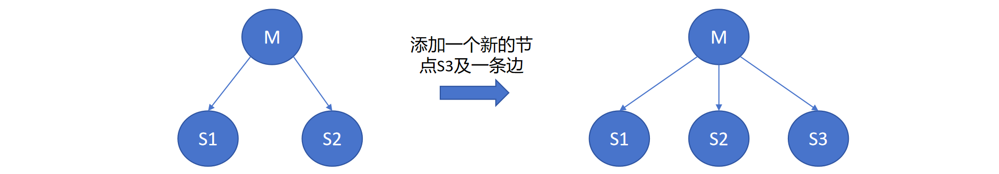
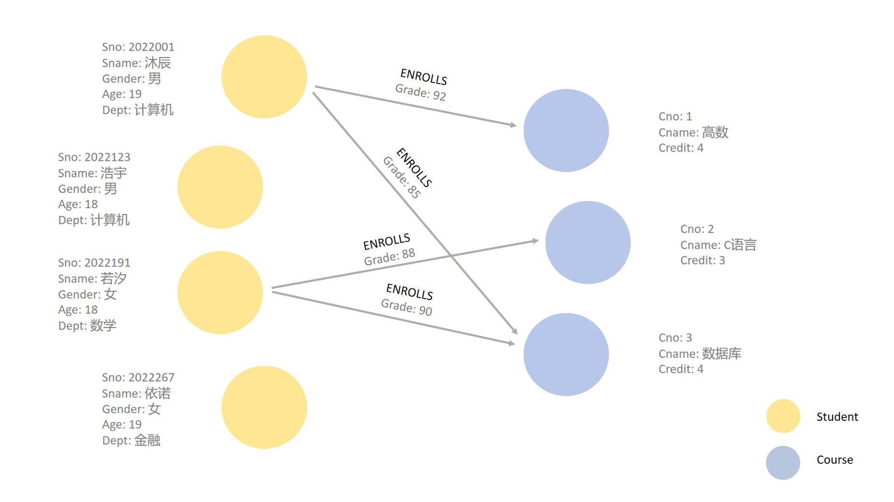

## 1.14 图数据模型

在之前的章节中，我们学习了键值模型、关系模型和文档模型**数据模型**，了解了在相应的数据模型下如何管理和处理数据。
接下来我们介绍一种新的数据模型——图模型，以及基于图模型的数据管理和操作技术（即图数据库）。对某些应用场景来说，图存储模型有着独特的优势。

### 1.14.1  图结构与图建模

图数据模型使用图（Graph）这种数据结构来表示数据和数据间的关系。
具体而言，图是一种对顶点集合及其两两之间通过边连接这一简单概念的推广，图模型通过节点（Node）和边（Edge）来直接表示实体以及实体之间的关系。
在现实中，使用图来表示各种类型的结构是非常常见的，许多实际问题都可以简化为图问题。
接下来我们来看现实中的几个示例。

**示例1：局域网中的双向连接**

在局域网（LAN）中，各设备之间的连接通常是双向的，任意两个设备之间可以相互通信，这种网络拓扑可以用无向图来表示。在无向图中，节点表示设备，边表示设备之间的连接，边没有方向性。假设我们有三个路由器：R1、R2、R3，且三个路由器两两之间均通过网络链路相互连接，任意两者之间都可以直接通信，则我们可以通过一个无向图来表示这个局域网的连接关系 ，如图R1.1所示。现在，若我们有一个新的路由器 R4 要连接到现有的网络，并且新添加的网络链路为路由器 R4 与路由器 R1 相连。则我们需要增加一个新的节点 R4，并在 R1 和 R4 之间增加一条无向边。

	
	 
	

		图 1.22 局域网中的双向连接
	

**示例2：集群中的单向数据流**

在某些计算机网络中，链路也可能是有方向的，例如在集群环境中的主从架构。此时，我们则可以使用有向图来表示网络。假设我们有一个简单的集群，其中有一个主节点（Master）和两个从节点（Slave）。在这个集群中，主节点 M 负责数据的分发和协调工作，而从节点 S1 和 S2 负责接收并处理来自主节点 M 的数据，而不向主节点发送数据，数据流是单向的。这种单向数据流可以用有向图来表示，通过带箭头的边来表示数据的流向。现在，假设我们要添加一个新的从节点 S3，并且主节点 M 也要向 S3 发送数据，则我们需要增加一个新的节点 S3，并添加一条有向边从 M 指向 S3，如图R1.23所示。

	
	 
	

		图 1.23 集群中的单向数据流
	

从计算机网络到社交网络，从金融交易网络到物流网络，各种场景都可以用图结构来建模。一切相互关联的事物都可以用图来表示。

如上述两个示例所示，用图的语言对客观事物进行描述的过程称为**图建模**。在图模型中，**节点**一般用原点或圆圈表示，**边**则用连接两个原点或圆圈的线表示，相邻的两个顶点则称为**邻居**。边分为无向边、有向边和双向边，无向边用不带箭头的线表示，有向边用带箭头的线表示，箭头方向表达指向。其中，由无向边构成的图称为**无向图**，由有向边构成的图则称为**有向图**。再比如，夫妻关系是一种无向关系，他们构成一个无向图。而关注者和被关注者则是一种有向关系，构成有向图。当A单方面关注B时，他们之间是单向关系，当A、B互相关注时，他们之间则是双向关系。

此外，一个顶点既可以指向其他顶点，也可以指向自己。当一个顶点与自身形成关系时，我们称之为**自环**。边上还可以有权重，我们称之为**加权**。例如，A与B每周通话3次，与C每周通话1次，则可以在A与 B、C的通话边上分别赋予3和1的权重，来表达A与B、C之间不同的通话频次。顶点和边还可以分别带有各自的属性（键值对），这样的图我们称之为**属性图**。

**学生-课程信息的图建模**
接下来我们继续回到学生与课程信息管理的示例，我们来看如何用使用图来表示其中的信息。

如图1.23所示，学生、课程与选课关系，可用图中的节点以及节点之间的边表示。图1.23中包括学生Student、课程Course两种类型的节点，分别表示每个学生与每门课程，通过构建标记有“ENROLLS”的边来描述“学生选修了该课程”的关系。
在图模型中，不同类型的节点通过不同**标签 (tag)**标记（在示例中，我们通过不同的颜色来区分标签），每个节点和边还可以通过属性来描述其他信息。下面介绍几个图模型的基本概念：

- 图模式：图模式（Graph Schema）是图数据库中用来定义和描述数据结构的一种模式，它定义了图中节点和边的类型（标签）及其属性结构。例如，学生图的图模式可以定义一个Student类节点，该节点包含属性“Sno”、 “Sname”、 “Gender”、 “Age”和“Dept”，标签就是“Student”。

- 节点：节点（Node）是图中的基本单位，表示数据对象或实体。每个节点可以有一组属性，用于描述该节点的特征。在图模型中，节点一般用原点或圆圈表示。例如，在学生选课数据库中，学生和课程可以表示为节点。

- 边：边（Edge）是连接两个节点的线，表示节点之间的关系。边也可以有类型和属性，用于描述该关系的类型和特征。边可以是有向的或无向的，在图模型中分别用有向箭头或无向的线来表示。例如，在学生选课数据库中，学生和课程之间的选课关系可以用一条标记有“ENROLLS”的边来表示。

- 标签：标签（Label）用于分类和标识节点或边的类型，有助于组织和查询特定类型的数据。在Cypher（用于Neo4j的图查询语言）中，一个节点可以有一个或多个标签，而边只能有一个标签（通常称为关系类型）。例如，在学生选课数据库中，学生节点可以有“Student”标签，课程节点可以有“Course”标签，选课关系边可以有“ENROLLS”标签。

- 属性：属性（Property）是附加在节点或边上的键值对，用于存储详细信息。属性可以是各种数据类型，如字符串、整数、浮点数、布尔值等。例如，在学生选课数据库中，学生节点可以有“Sno”、“Sname”、“Gender”、“Age”和“Dept”属性，课程节点可以有“Cno”、“Cname”和“Credit”属性，边节点可以有“Grade”属性。

- 唯一标识符：在图模型中，唯一标识符（Unique Identifier）是用于唯一标识每个节点或边的属性，它确保每个节点或边都可以通过一个独特的值来标识和访问。一些图数据库会自动为每个节点和边分配唯一标识符，例如在Neo4j中，节点和边都有一个自动生成的内部ID，可以通过`id()`获取。此外，用户还可以另外通过创建唯一约束（或复合唯一约束）为节点或边指定一个（或一组）属性作为唯一标识符，此后每次在图模型中插入新的数据都将进行（复合）唯一约束验证，否则将创建失败。例如，当我们为Student节点的“学号”属性设置唯一约束时，尝试插入具有相同学号的节点将会失败。

<? 请注意，无论是否创建唯一约束，Neo4j中都会给节点和边自动生成内部ID。>

	
	 
	

		图 1.24 学生选课数据库的图模型和数据实例
	

### 1.14.2  文档模型、关系模型与图模型的对比与总结

截止目前，我们已经接触到了
文档模型、关系模型和图模型这三种数据建模方法。
作为三种不同的数据模型，三者自有不同的特点。其特对比与总结如下表所示。

|     特性     |       文档模型       |  关系模型   |    图模型     |
| :--------: | :--------------: | :-----: | :--------: |
|    数据结构    |        文档        | 表格（行和列） | 节点、边、标签、属性 |
|     实体     |       文档集        |  关系（表）  |  同一标签的节点   |
|    实体实例    |        文档        |   元组    |     节点     |
| 模式（Schema） | 无模式（schema-less） |  固定模式   |    动态模式    |

本节我们初步介了解了图数据模型，在下一小节中，我们将严谨的讲述图的形式化定义以及图上的操作。有图论相关基础的同学可跳过此章节。

[**上一页<<**](chapter1.13-D.md) | [**>>下一页**](chapter1.15-G.md)

