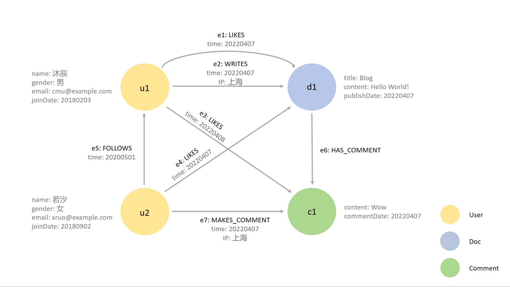
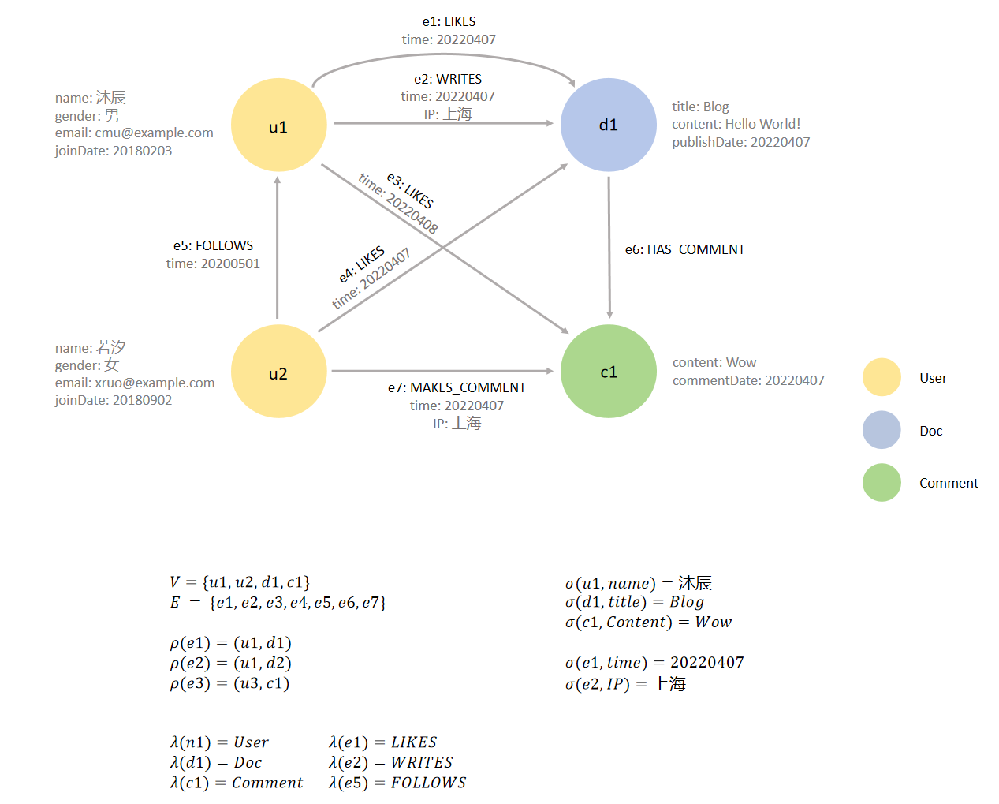

## 1.15 图结构及其表示

在上一节中我们接触了图数据模型，对用图数据结构表示数据及其联系--节点代表我们感兴趣的对象，边代表这些对象之间的关系--有了直观的感知，并且了解到图模型能直观地表示实体之间的复杂关系，在处理复杂数据结构和动态业务需求方面有显著优势。在小节中，我们将严谨的讲述图数据结构和图模型。
在本校接种，我们首先介绍图的两种基本表示方法：邻接矩阵和邻接表。然后，我们将了解不同的图模型：记属性图（LPG）和资源描述框架（RDF）。
对于有图论和知识图谱等领域基础的同学，可以跳过本小节。

### 1.15.1  图结构的基本表示方法
图的表示方法主要有两种：邻接矩阵和邻接表。
**邻接矩阵**是一种二维数组，用于表示图中顶点之间的边。对于一个有 $n$ 个顶点的图，邻接矩阵是一个 $n × n$ 的矩阵，存储了所有节点之间的边的信息。矩阵中的每个元素 $A[i][j]$ 表示顶点 $i$ 和顶点 $j$ 之间是否有边。对于无向图来说，如果顶点 $i$ 和顶点 $j$ 之间有边，则 $A[i][j]=1$（或边的权重）；否则$A[i][j]=0$。由于是无向图，因此矩阵是对称的，$A[i][j]=A[j][i]$。对于有向图来说，如果从顶点 $i$ 到顶点 $j$ 有一条边，则 $A[i][j]=1$（或边的权重）；否则 $A[i][j]=0$。如图1.25 所示，展示了一个简单的无向图和有向图的邻接矩阵。

	
	 
	

		图 1.25 邻接矩阵示例
	

通过邻接矩阵，可以快速检查两点之间是否有边连接，时间复杂度为 $O(1)$；但空间复杂度为 $O(n^2)$，不适用于稀疏图，且增删节点和边不够灵活。

**邻接表**是一种链表结构，用于表示每个顶点的邻接顶点。对于一个有 $V$ 个顶点、$E$ 条边的图，邻接表是一个包含 $V$ 个链表的数组，只存储了存在的边的信息，不存储不存在的边。同样，对于无向图来说，如果顶点 $i$ 和顶点 $j$ 之间有边，则顶点 $j$ 出现在 $A[i]$ 中，顶点 $i$ 也出现在链表 $A[j]$ 中；对于有向图来说，如果从顶点 $i$ 到顶点 $j$ 有一条边，则只有顶点 $j$ 出现在链表 $A[i]$中。如图1.26所示，展示了一个简单的无向图和有向图的邻接链表。

	
	 
	

		图 1.26 邻接表示例
	

邻接链表空间效率高，空间复杂度为 $O(V+E)$，适用于稀疏图，且动态性强，增删节点和边较为容易；但查找两点之间是否有边较慢，时间复杂度为 $O(V)$。

邻接矩阵和邻接链表都是用于维护图的结构的两种表示方法。邻接矩阵适合处理稠密图，并且需要频繁查询两点之间是否有边的场景；邻接链表则适合处理稀疏图，并且需要频繁增加或删除顶点和边的场景。

### 1.15.2  简单关系 —— 边标记图

了解了表示图的两种数据结构，接下来，我们从一个简单的图模型开始展开介绍，这是其他更复杂的图模型的基础。图 $G$ 可以形式化定义为一个元组 $(V, E)$，其中 $V$ 是顶点集，$E \subseteq V×V$ 是边集，$G=(V, E)$ 也可以表示为 $G(V, E)$。对于有向图 $G$，边 $e=(u, v) \in E$ 是两个顶点的元组，其中 $u$ 是出顶点，$v$ 是入顶点。若 $G$ 是无向图，那么边 $e=(u, v) \in E$ 是两个顶点的集合。

例如，如果我们要用一个图来编码博客网站，节点有用户和博客，从节点 a 到节点 b 的（有向）边则表示a发表了b，博客网站数据库可以用图建模如下：

	
	 
	

		图 1.27 博客网站图建模（示例1）
	

然而，用这样一种简单的图形式来表达不同类型的关系是很困难的。例如，假设我们希望表达出User不仅发表了Doc，还给该文章点了赞这一信息，我们可以考虑在这两个节点之间添加一条边，这样两个节点的连接方式就如图1.28所示：

	
	 
	

		图 1.28 博客网站图建模图（示例2）
	

但这里哪条边代表User发表了Doc，哪条边又代表User给该Doc点了赞呢？更广泛地说，如果节点之间有许多不同类型的关系，我们如何区分它们呢？

**边标记图（Edge-labelled graph）** 是一种简单且被广泛采用的解决方案，它是图数据库中最基本的图模型之一。在边标记图中，我们还为边指定了标签，以表示所描述领域中不同类型的关系。我们可以看图1.29中的一个建模示例，User1与Doc有两种关系：一种关系由标有“WRITES”的边表示，另一种关系由标有“LIKES”的边表示 。同时，在博客网站中，用户和用户之间还有“关注”的关系，因此，在示例中，由User2指向User1并标有“FOLLOWS”的边表示User2关注User1。

	
	 
	

		图 1.29 边标记图示例
	

接下来，我们将正式定义边标记图的概念。

**定义1.1（边标记图）.** 一个边标记图 $G$ 是一个二元组 $(V, E)$，其中：
（1）$V$ 是一个有限的顶点（或节点）集合。
（2）$E$ 是一个有限的边集合；在形式上，$E \subseteq V×Lab×V$，其中 $Lab$ 是一个标签集。

[例1.69] 设 $G=(V, E)$ 表示上图中的图，则顶点集和边集分别是：
$$
\begin{align*}
V = & \{ User1、User2、Doc \} \\
E = & \{ (User1，WRITES，Doc), \\
     & (User1，LIKES，Doc), \\
	 & (User2，FOLLOWS，User1), \\
     & (User2，LIKES，Doc) \}
\end{align*}
$$
其中，“WRITES”、“LIKES”和“FOLLOWS”这三个标签均取自 $Lab$。

边标记图在实践中被广泛采用，例如，它们构成了我们后续将会详细介绍的标记属性图（LPG）的基础。

### 1.15.3 复杂关系 —— 超图模型

图作为一种高效的关系表达结构，被广泛地应用于成对关系的建模中，例如论文引用、社交网络中的好友关系等网络的建模。但是除了成对关系外，在很多场景中还存在大量无法用一般的简单图结构表达的非成对关系，例如社交网络中的群组聊天。

**超图（Hypergraph）** 作为图的一种扩展模型，将边的概念扩展到了超边。与传统的图（Graph）不同，超图的每条边（称为超边）可以连接任意数量的顶点，而不仅仅是两个。因此，超图提供了一种更灵活和通用的方式来表示多元关系，如图1.30右所示（图左为普通图）。

	
	 
	

		图 1.30 普通图与超图对比示例
	

**定义1.2（超图）.** 一个超图 $H$ 是一个二元组 $(V, E)$，其中：
（1）$V$ 是一个有限的顶点（或节点）集合。
（2）$E \subseteq (\mathcal{P}(V) \setminus \emptyset)$ 是一个有限的（非空）超边集合，每条超边是顶点集合的一个子集，其中 $\mathcal{P}(V)$ 是 $V$ 的幂集，表示 $V$ 的所有可能子集。

为了更直观地描述顶点和超边之间的关系，我们可以使用**关联矩阵（Incidence Matrix）来表示超图**。关联矩阵是一种矩阵表示法，它将超图的结构转化为线性代数的形式，便于计算和分析。在关联矩阵 $I$中，行对应于超图的顶点，列对应于超图的超边，矩阵元素 $I_{ij}$ 表示顶点 $v_{i}$ 是否属于超边 $e_{j}$​。

例如，考虑一个超图 $H$，其中顶点集 $V = \{v_{1}, v_{2}, v_{3}, v_{4} \}$，超边集 $E = \{e_{1}, e_{2}\}$，超图内顶点和边的连接方式如图1.31左所示，由此我们可以得到图右的关联矩阵表示。

	
	 
	

		图 1.31 超图与关联矩阵示例
	

超图在许多应用中非常有用。例如，集合覆盖问题，在一个超图中寻找最小的超边集合覆盖所有顶点。再例如我们之前提到的社交网络，用超边表示群组，群组中的所有成员都通过同一条超边连接。通过引入超边的概念，超图比传统的图能够表达更复杂的关系。

虽然超图模型在表达多元关系上具有独特的优势，但由于其复杂性和性能问题使得其在图数据库和图处理系统中应用较少。大多数图数据库更倾向于使用普通图模型，并通过特定的建模技巧来处理多元关系。

### 1.15.4  嵌套关系 —— 超节点模型

**超节点模型（The Hypernode Model）** 也是一种图数据模型的扩展。与传统图模型相比，超节点模型引入了超节点（hypernode）的概念，使得节点本身可以是一个子图。超节点还可以嵌套，即一个超节点内部的节点可以是另一个超节点。

超节点模型是一种用于处理复杂网络结构的高级表示方法，这种模型在处理大规模图数据时具有显著优势，特别是在需要对图进行聚合或分层分析的场景中。例如，超节点模型可用于交通网络，它可以将一个城市或区域表示为一个超节点，来简化对区域交通流量的分析。

### 1.15.5 LPG 模型及其变体

经典图模型（元组 $G=(V, E)$）适用于计算顶点中心性等问题。然而，它的内容还不够丰富，不足以为各种现实问题建模。这也是图数据库经常使用**标记属性图模型（LPG，Labeled Property Graph Model）** 的原因。

在边标记图中，我们使用标签来表示边的类型，其中多条边可能具有相同的类型，同样，我们也可以考虑给节点贴标签。在标记属性图（有时简单的称为属性图）中，边和节点都可以被标记。此外，每条边和每个节点都附有一个唯一的标识符，允许节点和边具有一个或多个标签以及任意数量的属性，一个属性就是一个键值对。

例如，我们在图1.32中展示了一个更复杂的博客网站数据库图，它包含三种标签类型的节点：用户User、博客Doc、评论Comment，以及对应的属性。在这个图中，不同标签的节点用不同颜色的圆圈表示，属性用灰色字体表示，唯一标识符用小写字母＋数字表示。我们可以将节点“u1”和“u2”标记为“User”，将节点“d1”标记为“Doc”，将节点“c1”标记为“Comment”。其中，User类节点的相关属性是姓名name、性别gender、邮箱email和加入日期joinDate，Doc类节点的相关属性是标题title、内容content、发表时间publishDate，Comment类节点的相关属性是内容content和评论时间commentDate，LIKES类型的边的相关属性是时间time，WRITES和MAKES_COMMENT类型的边的相关属性是时间time和地址IP，HAS_COMMENT类型的边则没有属性。

	
	 
	

		图 1.32 LPG模型示例
	

**定义1.4（属性图）.** 一个属性图 $G$ 就是一个五元组 $(V, E, \rho, \lambda, \sigma)$，其中：
（1）$V$ 是一个有限的顶点（或节点）集合。
（2）$E$ 是一个有限的边集合。
（3）$\rho: E \rightarrow (V × V)$ 是一个全函数，直观的说，$\rho(e) = (v_{1}, v_{2})$ 表示 $e$ 是图 $G$ 中从节点 $v_{1}$ 到节点 $v_{2}$ 的一条有向边。
（4）$\lambda: (V \cup E) \rightarrow Lab$ 是一个全函数，其中 $Lab$ 是一个标签集。直观的说，如果 $v \in V$（相应的，$e \in E$），并且 $\rho(v) = l$ （相应的，$\rho(e) = l$），那么 $l$ 就是图 $G$ 中节点 $v$（相应的，边 $e$）的标签。
（5）$\sigma: (V \cup E) × Prop \rightarrow Val$ 是一个偏函数，其中 $Prop$ 是一个有限的属性集合，$Val$ 是一个值集合。直观的说，如果 $v \in V$（相应的，$e \in E$），$p \in Prop$，并且 $\sigma(v, p) = s$（相应的，$\sigma(e, p) = s$），那么 $s$ 就是属性图 $G$ 中节点 $v$ （相应的，边 $e$）中属性 $p$ 对应的值。

[例1.70] 对于如上所示的电影数据库建模的属性图 $G$，我们可以得到 $G=(V, E, \rho, \lambda, \sigma)$，其中 $V、E、\rho、\lambda、\sigma$ 如图R2.9所示。

	
	 
	

		图 1.33 LPG模型元素求解示例
	

### 1.15.6 标记属性图模型的变体

在我们对标记属性图的定义中，每个节点和边都与一个或多个标签以及任意数量的属性相关联，并且每个属性最多只有一个值。在某些应用中，允许属性具有多个值可能更为有用。因此，我们可以考虑标记属性图的一种变体——多值属性图，它允许在属性图模型中使用多个标签和多值属性。有几个数据库还支持LPG的其他变体。例如，Neo4j支持任意数量的顶点标签，但是它只允许为每条边添加一个标签（称为边类型）。ArangoDB 仅允许每个顶点一个标签（顶点类型）和每条边一个标签（边类型），这将有助于将顶点和边分离到不同的文档集合中。此外，边标记图不支持任何属性，并且将以一种严格的方式来使用标签。具体来说，边标记图中每条边有且仅有一个标签。从形式上来看，$G=(V, E, L)$，其中 $V$ 是顶点集，$E \subseteq V × L × V$是边集。请注意，这个定义使得边标记图中两个顶点可以通过多条附有不同标签的边连接起来。最后，人们还致力于研究便于存储历史图表数据的 LPG 变体。

属性图模型的好处是灵活度高、表达力强、能良好支撑大规模海量图数据的查询和计算。属性图的灵活性源自其定义的开放性，用户可以根据场景和业务需要，灵活定义顶点标签、边标签及其相关属性。这种灵活性也让属性图模型有强大的场景表达力和较好的适应新，用户只需定义好各个场景的顶点和边，就可以实现图的表示。

当前，主流的图数据库产品大多应用并实现了属性图模型，除了早期具有代表性的Neo4j，还有Galaxybase、TigerGraph等数据库产品，我们将后续的章节中详细的介绍。

[**上一页<<**](chapter1.14-G.md) | [**>>下一页**](chapter1.16-G.md)