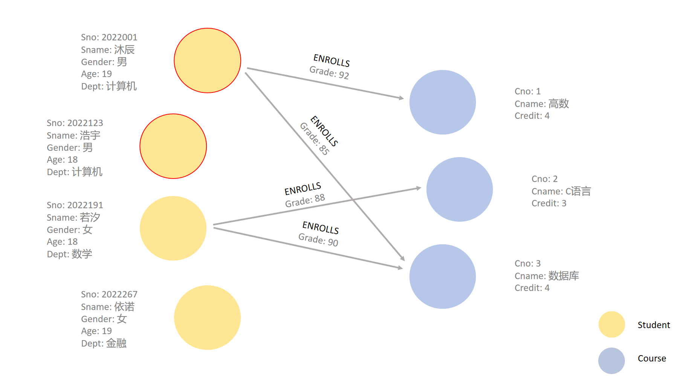
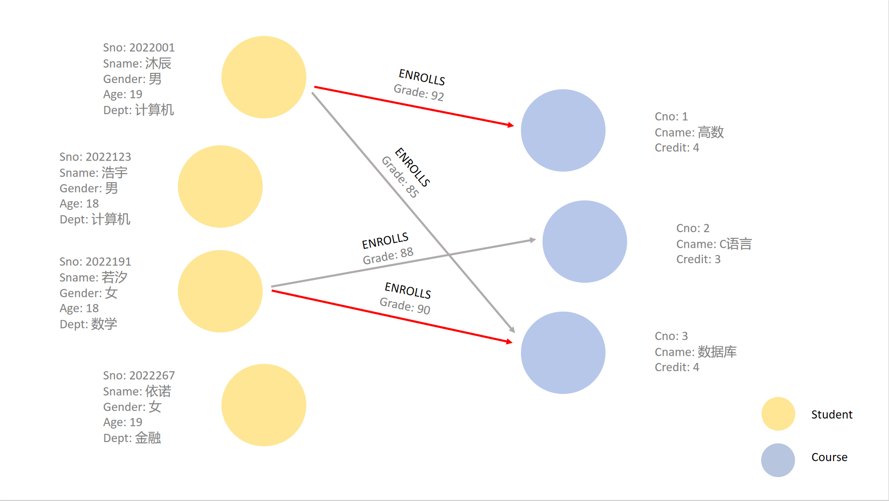
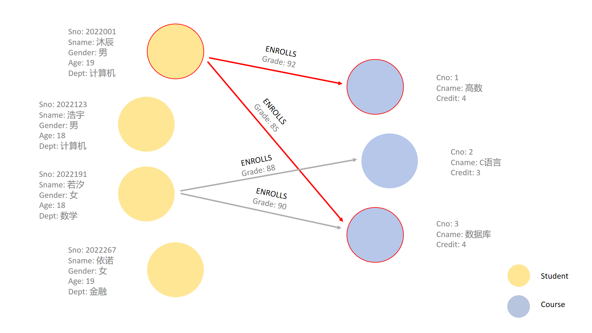

## 1.16 图上的基本操作——图模式匹配

图模型将数据组织成一个个图，使得人和计算机能够表达信息，同样，我们还需要一种统一的计算方式来描述数据的存取功能。图模型上最常用的计算方式称为**图模式匹配**，我们使用图模式来定义要搜索的数据和要返回的数据。模式（pattern）和图模式匹配（Graph pattern matching），是图查询语言的核心功能。

请注意，图模式（Graph Schema）和图模式（Graph Pattern）在图数据库和图理论中是两个相关但不同的概念：
- 图模式（Graph Schema）：图模式（有时也称为图架构）描述了图数据的结构或模式。它定义了图中的节点和边的类型，以及这些类型之间的关系。图模式类似于关系数据库中的模式，它为图数据库中的数据提供了结构化的定义。图模式通常用于设计和验证图数据库的数据模型，确保数据的一致性和完整性。
- 图模式（Graph Pattern）：图模式是一种用于查询图数据库的模式，它描述了一种特定的子图结构，通常用于图查询语言中，如Cypher（用于Neo4j）。图模式指定了图中顶点和边的关系以及可能的属性匹配。例如，在Cypher查询中，图模式用于匹配图中的特定路径和节点。在本小节后续内容中，图模式均是指Graph Pattern。

图模式使用一种类似于我们在白板上绘制属性图的节点和关系的语法来描述数据。在白板上，我们通常使用圆形来表示节点，用箭头表示关系。而在图查询语言Cypher中，则使用一对圆括号表示圆形，用破折号和大于或小于符号表示箭头：
```SYNTAX
()-->()<--()
```

图模式匹配是一种在图数据库中查找特定结构或子图的过程。直观来看，图模式匹配就是找到图中与所定义的模式完全匹配的部分。这可以理解为子图与图中的某个部分完全重合。接下来，我们将通过关于属性图的具体示例来了解图模式是如何匹配的。

图模式匹配按照不同的维度可以分为节点匹配、关系匹配和路径匹配。

### 1.16.1 节点模式匹配

节点模式匹配（Node pattern matching）是指匹配符合特定条件的一组节点，通常关注节点的属性和类型。每个图模式至少包含一个节点模式。最简单的图模式是单个空节点模式，用Cypher表示为`()`，空节点模式会匹配属性图中的每个节点。

例如，对于图1.33的学生选课数据库的图模型，如果我们要查找所有计算机系的学生节点，直观来看，节点模式匹配结果如下：

<center>
	
	<br>
	<div display: inline-block; padding : 2px>
		图 1.34 节点模式匹配示例
	</div>
</center>

### 1.16.2 关系模式匹配

关系模式匹配（Relationship pattern matching）是指匹配符合特定条件的关系，关注边的类型和属性。最简单的关系模式用Cypher表示是`--`，该模式匹配任何方向的关系，不过滤任何关系类型或属性。

例如，对于图1.35的学生选课数据库的图模型，如果我们要查找最终成绩在90及以上的所有选课关系，直观来看，关系模式匹配结果如下：

<center>
	
	<br>
	<div display: inline-block; padding : 2px>
		图 1.35 关系模式匹配示例
	</div>
</center>

### 1.16.3 路径模式匹配

路径模式匹配（Path pattern matching）是指匹配符合特定条件的路径，涉及一个或多个节点和边，关注路径的结构和长度，可能是固定长度或可变长度的路径。任何有效路径都以节点为起点和终点，每个节点都有与之相连的关系（如果有多个节点）。

对于所有有效路径模式，以下条件都是正确的：
- 至少有一个节点模式。
- 以节点模式开始和结束。
- 交替使用节点和关系。

若用Cypher表示，以下路径模式都是正确的：
- `()`
- `()--()`
- `()--()<--()-->()`
这些用于节点和关系的简单模式构成了路径模式的基础模块。

错误的路径模式则如下所示：
- `-->`
- `()-->`
- `()-->-->()`

例如，对于图1.36的学生选课数据库的图模型，如果我们要查找沐辰选择的所有课程的路径，直观来看，路径模式匹配结果如下：

<center>
	
	<br>
	<div display: inline-block; padding : 2px>
		图 1.36 路径模式匹配示例
	</div>
</center>

在本节中，我们学习了图中基本的操作——图模式识别，在下一节中，我们将学习图查询语言，了解如何使用图数据操作语言来实现图上的基本操作。

[**上一页<<**](chapter1.15-G.md) | [**>>下一页**](chapter1.17-G.md)