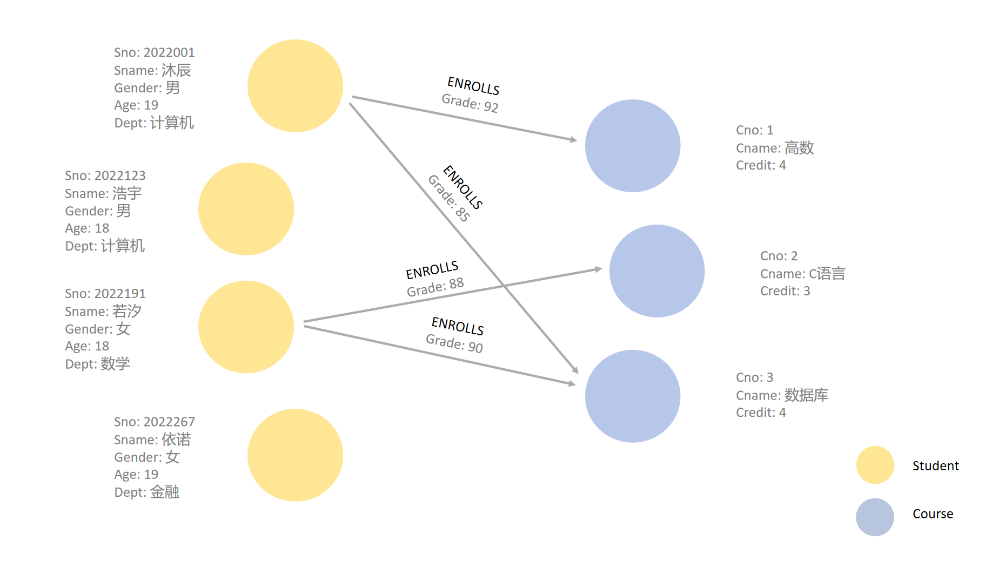

## 1.17 图数据库查询语言


和使用SQL语言来查询和操作关系数据库一样，图数据库使用图查询语言来查询、操作和分析图模型中的数据。
但和SQL语言查询关系数据库不同的是，图查询语言旨在处理由节点和边构成的数据结构，尤其擅长揭示数据之间的复杂关系和模式。


和关系型数据库相比另一个明显的不同是，SQL语言是关系数据库查询的标准。但**图查询目前尚无确定的查询语言标准**，目前流行的图查询语言包括面向属性图查询的 Cypher、Gremlin 和 GQL，以及面向 RDF 图的SPARQL 语言等。
因图数据Neo4j历史悠久、开源、用户量大，其使用的图查询语言Cypher被通常认为是**事实上的(dde facto)图查询语言标准**。
在本节中，我们首先对各种图查询语言给出简单的介绍，随后以Cypher为例，介绍图查询语言的功能和语义。


### 1.17.1 图查询语言概览

图查询语言是处理和分析图数据的强大工具，它和关系数据库的查询语言 SQL 类似，都是用来从数据库中查询数据，而无需使用如 C++ 等编程语言编写程序。图查询语言通常可以分为声明式和命令式两种：
- 声明式（Declarative）图查询语言以结果为导向。它允许用户通过描述“**是什么**”而不是“**如何做**”来进行数据查询和处理。这类语言强调表达查询意图，而非具体的操作步骤，使得查询编写更加简洁和直观。
- 命令式（Imperative）图查询语言则以过程为导向。它强调的是**如何**执行查询和操作，而不仅仅是描述**查询的目标**。与声明式查询语言不同，命令式查询语言要求用户详细指定执行步骤，逐步引导查询引擎完成任务。

接下来，我们将介绍几种常见的图查询语言。

1. Cypher

Cypher 是由 Neo4j 开发和推广的一种声明式图查询语言，专门用于操作和查询图数据库。Cypher 的语法直观，类似于 SQL，具有较强的可读性，使用户能够轻松编写和理解复杂的图查询。Cypher 支持图的创建、读取、更新和删除操作，能够处理节点、边及其属性，适用于各种图数据库的应用场景。此外，Cypher 擅长处理复杂的图模式匹配，可以高效地查找图中的特定模式和路径。

Cypher 语言是目前全球最常用的图查询语言，除 Neo4j 外，许多图数据库如 GalaxyBase 也兼容并支持 Cypher。后续，我们将详细讲解 Cypher 语言的语法及使用示例。

2. SPARQL

SPARQL 是一种专门用于查询和操作 RDF（资源描述框架）数据的声明式查询语言。SPARQL 是由 W3C（万维网联盟）推荐的标准，是 RDF 数据查询的核心工具，广泛应用于语义网和关联数据（Linked Data）领域。SPARQL 的查询结果可以是结果集，也可以是 RDF 图。SPARQL 已被多种 RDF 数据库和查询引擎广泛支持，包括 Apache Jena、Blazegraph 和 GraphDB 。

3. Gremlin

Gremlin 是 Apache TinkerPop 框架下的图查询语言。Gremlin 是一种图遍历语言，其查询由一系列的遍历步骤组成。Gremlin 遍历可以以命令式（程序式）方式、声明性（描述性）方式编写，也可以以包含命令性和声明性的混合方式编写。Gremlin 的强大之处在于其灵活的图遍历能力。它允许用户定义复杂的图遍历路径，从而实现高效的数据检索和分析。同时，Gremlin 支持多种编程语言，包括 Java、Groovy、Python、JavaScript 和 Scala 等，使得开发者可以在熟悉的编程环境中使用 Gremlin。Gremlin 可以在任何兼容 TinkerPop 的图数据库中使用，如Neo4j、JanusGraph、Amazon Neptune。

4. GSQL

GSQL 是一种专门为 TigerGraph 图数据库设计的强大而灵活的声明式图查询语言。GSQL 的语法与 SQL 类似，使得 SQL 开发者可以轻松上手。然而，它同时也支持 NoSQL 开发人员锁偏爱的 MapReduce 编程模型，并兼容大规模并行处理的可扩展性。目前，在市面上的图数据库中，TigerGraph 是唯一完全支持 GSQL 的图数据库。

5. GQL

GQL（Graph Query Language）是 ISO/IEC 联合技术委员会提案并表决通过的国际标准（声明式）图查询语言。GQL 由多个行业领袖和标准化机构共同制定，它在很大程度上借鉴了现有的主流查询语言，如 Cypher、SQL 等，目的是为图数据库提供一种通用的查询语言，支持各种图数据操作和分析。

### 1.17.2 图数据库查询（以Cypher为例）

Cypher 是 Neo4j 的声明式图查询语言。它由 Neo4j 工程师于 2011 年创建，是一种与 SQL 相当的图数据库语言。与 SQL 类似，Cypher 让用户专注于从图形中检索什么，而不是如何检索。Cypher 的设计理念是：无论是开发人员，还是数据库专业人士，甚至是业务利益相关者都可以轻松地读懂 Cypher。从直觉上来讲，我们习惯用示意图来描述图，Cypher 的易用性正源于它符合我们的直觉。

Cypher 提供了一种可视化的模式和关系匹配方法。它依赖于以下 ASCII 类型的语法：`(nodes)-[:CONNECT_TO]→(otherNodes)`，其中，圆括号表示节点，`-[:CONNECT_TO]-`表示关系。尽管它现在还是 Neo4j 特有的语言，但它和我们使用示意图来表示图的方式非常相似，就像将节点等实体及它们之间的关系以可视化的方式构建到查​​询中，因此非常适合程序化地描述图。

### 1.17.3 Cypher 查询的基本语法

Cypher 的构造基于简洁的图像，使查询既易于编写又易于阅读。例如，请看下图中的简单图数据，你将如何用语言表示这些数据？

<center>
	
	<br>
	<div display: inline-block; padding : 2px>
		图 1.37 图建模示例
	</div>
</center>

我们很容易想到：一个学号为2022001、姓名为沐辰的19岁计算机系男学生报名了课程号为1、学分为4的高数课，并取得了92分的成绩。

Cypher 语法就建立在我们刚刚表达的结构之上。

1. 在 Cypher 中表示节点

由于 Cypher 模式受 ASCII-Art 的启发，我们需要一种可视化的方式来表示上述模式中的每个组件。属性图模型的主要组件是节点和关系。节点是图中的数据实体，通过一个或多个标签标记，我们通常可以通过查找数据模型中的名词或对象来识别节点。例如，在图R3.2中，学生和课程是我们的节点，分别用”Student“和“Course”标签标记。同样，我们也可以直接通过唯一标识符来访问节点（Neo4j会自动为每个节点和边分配一个唯一的ID），后续在Cypher的基本查询中将展开介绍。

<center>
	
	<br>
	<div display: inline-block; padding : 2px>
		图 1.38 节点建模示例
	</div>
</center>

为了在 Cypher 中描述节点，我们使用圆括号将节点括起来，例如 `(node)`，这看起来就像数据模型中节点的可视化表示所使用的圆圈。

如果我们稍后想要引用该节点，我们可以创建一个**节点变量**，例如使用 `s` 指代学生，使用 `c` 指代课程。在实际查询中，我们通常会使用更长更直观的表达方式，例如使用 `student` 指代学生，使用 `course` 指代课程。和其他编程语言一样，我们可以随意命名变量，并在后面的查询中使用相同的名称引用它们。如果该节点与我们的返回结果无关，我们可以使用空括号指定一个**匿名节点**`()`。请注意，Cypher 中每个查询是独立执行的，因此在一个查询中使用的变量名不会影响其他查询中的变量名。

在属性图数据模型中，我们通过分配**节点标签**将相似的节点分组在一起。在上面的例子中，`Student` 和 `Course` 就是标签，它们就相当于关系数据库中的表，而标签中的一个节点就相当于表中的一行。

查看上面的示例，看看我们如何指定节点。
```Cypher
()                  //anonymous node (no label or variable) can refer to any node in the database
(s:Student)          //using variable s and label Student
(:Student)       //no variable, label Student
(c:Course)      //using variable c and label Movie
```

2. 在 Cypher 中表示关系

图是顶点和边的集合，顶点描述实体，边则描述顶点之间的关系。在 Cypher 中，两个节点之间的关系使用箭头`-->`或`<--` 来表示，直观上看起来就像连接节点的箭头和线。而其他信息（例如节点如何连接（关系类型）以及与关系相关的任何属性）可以放在箭头内的方括号中，如 `-[relation]->`。

在我们的示例中，节点之间标有 `ENROLLS` 的线就是我们的关系。请注意，对于有向关系，我们使用箭头和两个破折号来表示，例如`-->`，而对于无向关系，我们仅使用 `--` 来表示，它表示关系可以沿任一方向遍历。

<center>
	
	<br>
	<div display: inline-block; padding : 2px>
		图 1.39 边建模示例
	</div>
</center>

请注意，如果数据以一种特定的关系方向存储，而查询指定了错误的方向，Cypher 将不会返回任何结果。因此，在不确定方向的情况下，我们最好使用无向关系来检索一些结果。

```Cypher
//data stored with this direction
CREATE (s:Student)-[:ENROLLS]->(c:Course)

//query relationship backwards will not return results
MATCH (s:Student)<-[:ENROLLS]-(c:Course)

//better to query with undirected relationship unless sure of direction
MATCH (s:Student)-[:ENROLLS]-(c:Course)
```

关系必须有一个起始节点、一个终止节点和一个类型。**关系类型**对关系进行分类并赋予其意义，类似于节点标签对节点进行分组。在我们的属性图数据模型中，关系显示了节点之间的连接和关联方式，我们通常可以通过查找动作或动词来识别数据模型中的关系（请注意，我们可以使用任何命名来指定节点之间的关系，但建议使用动词和动作,这有利于我们正确理解）。请注意，虽然节点可以有多个标签，但关系只能有一种类型。

例如，让我们从示例图中看一下关系类型：
- `[:ENROLLS]` ：当我们将节点放在关系的两侧时，这暗示了哪个节点是学生，哪个节点是课程。

同样，如果我们稍后想要引用该关系，我们可以创建一个**关系变量**，如 `rel`，我们也可以使用更长更直观的变量名，如 `enrolls`。如果我们后续不需要引用关系，则可以仅使用 `--`、`-->` 或 `<--` 而不带方括号来指定一个**匿名关系**。

具体来说，例如，我们可以使用 `-[rel]->` 或 `-[rel:ENROLLS]->` ，然后在查询中调用`rel`变量来引用关系及其详细信息。

请注意，如果我们忘记了关系类型前面的冒号（如 `-[ENROLLS]->`），则它仅代表一个变量（而不是关系类型）。由于没有声明关系类型，Cypher 会搜索所有类型的关系。

3. 节点或关系属性

我们已经讨论了如何使用 Cypher 表示节点、关系和标签，现在我们要了解如何表示属性图中的**属性**。属性就是为节点和关系提供额外信息的键值对。为了在 Cypher 中表示属性，我们可以在节点的圆括号或关系的方括号内使用花括号。然后，将属性的名称和值放在花括号内。对于多属性，则在花括号内以逗号分隔。如图1.40所示，其中：
- 节点属性：`(s:Student {Sno: 2022001, Sname: '沐辰', Gender: '男', Age: 19, Dept: '计算机'})`，`(c:Course {Cno: 1, Cname: '高数', Credit: 4})`
- 关系属性：`-[rel:ENROLLS {Grade: 92}]->`

<center>
	
	<br>
	<div display: inline-block; padding : 2px>
		图 1.40 属性建模示例
	</div>
</center>

4. Cypher 中的模式

节点和关系构成了图模式的基本构建块,这些构建块可以组合在一起来表达简单或复杂的**模式**。模式是图形最强大的功能。在 Cypher 中，它们可以写成连续的路径，也可以分成较小的模式并用逗号连接在一起。

例如，当我们要表示上面示例中的 “沐辰选了高数课”，在 Cypher 中，模式将写作如下：
```Cypher
(s:Student {Sname: "沐辰"})-[rel:ENROLLS]->(c:Course {Cname: '高数'})
```

这部分 Cypher 告诉了我们想要的模式，但它并没有说明我们是要对现有的模式进行查询操作还是将其插入一个新的模式。为了告诉 Cypher 我们希望它如何处理模式，我们需要添加一些关键字（在下面的内容中我们将会对关键字展开详细介绍）。

### 1.17.4  Cypher 中的基础查询

Cypher 语法使用了一系列**关键字**和符号来定义和操作图数据，包括 `MATCH`、`RETURN`、`WHERE`、`CREATE`、`SET`、`ORDER BY`、`FOREACH`、`MERGE` 和 `UNION` 等，这些关键字共同构成了 Cypher 查询的基本结构，使用户能够灵活地查询和操作图数据。

让我们以图1.41的图模型为例，来了解不同的关键字和基础的查询语句。

<center>
	
	<br>
	<div display: inline-block; padding : 2px>
		图 1.41 数据模型
	</div>
</center>


它包括两种类型的节点标签：
- `Student`节点具有以下属性：`Sno`、`Sname`、`Gender`、`Age`和`Dept`。
- `Course`节点具有以下属性：`Cno`、`Cname`和`Credit`

模型中还包含`Student`和`Course`节点之间的一种关系类型：`ENROLLS`，该关系类型具有属性：`Grade`。

#### 节点和边的创建

（1）创建节点和边

在Cypher中，要创建图模型，需要使用`CREATE`关键字。例如，按照图R3.5的图模型，创建一个姓名为“沐辰”的 `Student` 类节点和两个课程名分别为“高数”和“数据库”的 `Course` 类节点，然后在上述学生-课程节点之间分别创建边：
```SQL
CREATE (mc:Student {Sno: 2022001, Sname: '沐辰', Gender: '男', Age: 19, Dept: '计算机'})
CREATE (math:Course {Cno: 1, Cname: '高数', Credit: 4})
CREATE (db:Course {Cno: 3, Cname: '数据库', Credit: 4})
CREATE
(mc)-[:ENROLLS {Grade: 92}]->(math),
(mc)-[:ENROLLS {Grade: 85}]->(db)
```

（2）创建唯一约束

我们可以通过创建唯一约束来确保指定属性的值在所有相关节点中是唯一的，无论这些节点是在约束创建之前还是之后创建的，否则将会抛出错误。

例如，我们可以分别对学生节点的学号和课程节点的课程号创建唯一约束：

```SQL
CREATE CONSTRAINT IF NOT EXISTS FOR (s:Student) REQUIRE (s.Sno) IS UNIQUE;
CREATE CONSTRAINT IF NOT EXISTS FOR (c:Course) REQUIRE (c.Cno) IS UNIQUE;
```

在上述语句中，`CREATE CONSTRAINT`是创建约束的命令；`IF NOT EXISTS`表示只有在该约束不存在的情况下才会创建新的约束；`FOR (s:Student)`指定了约束的作用对象，即所有具有`Student`标签的节点，并创建节点变量`s`方便后续引用；`REQUIRE (s.Sno) IS UNIQUE`则定义了约束的具体内容，它通过引用之前定义的变量`s`来约束每个`Student`节点`s`的`Sno`属性必须是唯一的。

创建唯一约束可以在创建节点之前或之后进行。如果我们在创建任何节点之前就创建了唯一约束，则当我们尝试创建新的节点时，Neo4j会自动检查并确保新节点的属性值是唯一的，否则将会抛出一个错误。而如果我们在已经有一些节点存在的情况下创建唯一约束，Neo4j将会对现有的节点进行检查。若现有节点中有违反约束的情况，Neo4j将会抛出一个错误，并且不会创建该约束。

当然，我们也可以不创建任何唯一约束，通过Neo4j自动生成的内部标识符（ID）来唯一标识节点和边，该ID可以通过函数`id()`获得。

例如，返回学号为2022001的节点的内部ID：
```SQL
MATCH (s:Student {Sno: 2022001})
RETURN id(s);
```

#### 查找节点

现在让我们考虑学生选课数据库图模型的一个简单查询：返回所有的学生。 `MATCH` 会在图中查找所有匹配的节点或关系，`RETURN` 子句用于指定查询结果中需要返回的内容。学生可以在 `Student` 标签下的分组中找到，因此，我们将需要匹配的节点放到 `MATCH` 子句中，然后在 `RETURN` 子句中返回找到的节点：
```SQL
MATCH (s:Student)
RETURN s
```

在 Cypher 查询语言中，`RETURN` 子句用于指定查询结果中需要返回的内容。它类似于 SQL 中的 `SELECT` 子句，通过 `RETURN` 子句，我们可以控制查询返回的节点、关系、属性或计算结果（包括聚合函数的结果，例如 `COUNT`、`SUM`、`AVG` 、`COLLECT`等）。执行上述查询会通过**表的形式**返回一个结果集，而非图本身，该结果集是符合条件的节点集合，每个节点本身可以看作是图中的一个元素。具体来说，如果数据库中存在带有 `Student` 标签的节点，那么查询将返回所有这些节点（和 SQL 中的 `SELECT` 一样，该结果集不会自动去重）。同时，每个返回的节点是一个符合条件的图数据库中的实体，具有与之相关的属性和关系。

因此，上述查询结果如下：

| s                                                                        |
| :----------------------------------------------------------------------- |
| {"Sno": 2022001, "Sname": "沐辰", "Gender": "男", "Age": 19, "Dept": "计算机"} |
| {"Sno": 2022001, "Sname": "浩宇", "Gender": "男", "Age": 18, "Dept": "计算机"} |
| {"Sno": 2022001, "Sname": "若汐", "Gender": "女", "Age": 18, "Dept": "数学"}  |
| {"Sno": 2022001, "Sname": "依诺", "Gender": "女", "Age": 19, "Dept": "金融"}  |

当然，我们也可以限制结果集，例如只返回2个节点：
```SQL
MATCH (movie:Movie)
RETURN movie
LIMIT 2
```
该查询的结果将只有两行。

现在考虑另一个查询：查找学号为2022001的节点，并返回他的名字和所属系。此查询可写作：
```SQL
MATCH (s:Student {Sno: 2022001})
RETURN s.Sname AS name, s.dept AS dept
```
该查询将查找带有 `Student` 标签和学号为2022001的节点，并将其命名为 `s`，然后返回找到的节点的 `name` 和 `dept` 属性。同时使用了关键字 `AS`，用于为查询结果中的列创建别名。

因此，上述查询结果如下：

| name | dept  |
| :--- | :---- |
| "沐辰" | "计算机" |

与 SQL 类似，Cypher 查询使用各种子句构建，每个子句的输入都是图的状态和由引用的变量组成的中间结果表，每个子句的输出是一个新的图状态和一个新的中间结果表，作为下一个子句的输入，这些子句链接在一起以在彼此之间传递中间结果，最后一个子句的输出就是查询的结果。返回的表包含列和行，其中列表示返回的属性或节点/关系，行表示查询的每个结果项。因此，无论查询的复杂程度如何，结果总是以表的形式组织和返回。

需要注意的是，如果某个子句返回一个空的中间结果表，就没有内容传递给后续的子句，从而终止查询。有一些方法可以规避这种行为。例如，可以将 `MATCH` 子句替换为 `OPTIONAL MATCH`，对于找不到的匹配项，`OPTIONAL MATCH` 会用 null 代替。

与 SQL 中的 `WHERE` 子句类似，Cypher 中的 `WHERE` 子句用于在查询中增加条件，以便只返回符合特定条件的节点、关系或路径。`WHERE` 子句通常与 `MATCH` 子句一起使用，用于限定查询匹配的图元素。考虑以下查询：返回所有计算机系学生的学号和姓名。该查询也可以用`WHERE`写作如下：
```SQL
MATCH (s:Student)
WHERE s.dept = '计算机'
RETURN s.Sno AS Sno, s.Sname AS name
```

上述查询的查询结果如下：

| Sno     | name |
| :------ | :--- |
| 2022001 | "沐辰" |
| 2022123 | "浩宇" |

Cypher 允许在 `WHERE` 子句中使用逻辑连词 `AND`、`OR`、`NOT`。逻辑连词的运算对象可以是包含比较运算符 `>`、`>=`、`<`、`<=`、`=` 和 `><` 的表达式。`WHERE` 子句中还可以使用 `=~` 操作符匹配正则表达式，支持`EXISTS` 函数的存在性检查，以及使用 `IN` 操作符检查元素是否在列表中。

#### 查找连通节点

在 `MATCH` 子句中，我们不仅可以匹配节点，还可以匹配节点之间的关系。通过这种方式，我们可以指定图的结构，在一条语句中描述节点及其关系，查询包含特定关系的节点，而不需要多次查询。考虑以下查询：查找选了高数课的学生，并返回该学生学号和姓名。
```SQL
MATCH (s:Student)-[:ENROLLS]->(c:Course {Cname: '高数'})
RETURN s.Sno as Sno, s.Sname AS name
```

这个查询与选择高数课的学生的图表相匹配，`MATCH` 子句中的关系 `-[:ENROLLS]->` 用来指定要匹配的 `Student` 节点和 `Course` 节点之间的特定关系，最终返回学生的`Sno`属性和`Sname` 属性。

我们不仅可以通过关系查找连通节点，还可以通过连通节点来查找它们之间的关系。考虑以下查询：查找所有与“沐辰”有关联的课程，并返回该关系类型以及课程名。该查询可以用 Cypher 写为：
```SQL
MATCH (s:Student {name:'沐辰'})-[rel]->(c:Course)
RETURN type(rel) AS type, c.Cname AS Cname
```

以上查询将在图中搜索从节点“沐辰”到任何 `Course` 节点的传出关系，并返回与该节点相关的关系类和课程名称。因此，查询结果如下：

| type      | Cname |
| :-------- | ----- |
| "ENROLLS" | "高数"  |
| "ENROLLS" | "数据库" |

同样，我们还可以通过使用`NOT`运算符来进一步修改 Cypher 查询。例如，以下查询使用`NOT`返回选修了数据库课程但没有选修C语言课程的学生的学号和姓名。
```Cypher
MATCH (s:Student)-[:ENROLLS]->(db:Course {Cname: '数据库'})
WHERE NOT (s)-[:ENROLLS]->(:Course {Cname: 'C语言'})
RETURN s.Sno AS Sno, s.Sname AS name
```

#### 查找路径

有多种方法可以使用 Cypher 在图中搜索节点之间的路径。

对于**定长模式**的查询，使用量词（`{n}`）指定模式中节点之间的距离（跳数）。例如，考虑以下查询：查找与“沐辰”节点存在两跳关系的所有 `Student` 类节点，并按学号顺序返回其学号和姓名。`ORDER BY` 子句可以让查询结果中的元组按排列顺序显示，`DISTINCT` 运算符可确保结果不包含重复值。为了按学号顺序列出所有与“沐辰”存在两跳关系的 `Student` 类节点，该查询可以用 Cypher 写作如下：
```SQL
MATCH (mc:Student {Sname:'沐辰'})--{2}(s:Student)
RETURN DISTINCT s.Sno AS Sno, s.Sname AS Sname
ORDER BY s.Sno
```

请注意，`ORDER BY` 默认升序排列，如果要选择降序排列，需要添加关键字 `DESC`。
查询结果如下，因为他们都与名为“数据库”的课程节点存在一跳关系：

| Sno     | Sname |
| ------- | ----- |
| 2022191 | "若汐"  |


对于**变长模式**的查询，则使用范围（`{a:b}`）指定模式中节点之间的距离范围（跳数）。

Neo4j 还提供了一系列的**图算法**库，可以在 Cypher 查询中调用这些算法来查找路径、计算中心性、进行社区检测等（在后续的章节中，我们将会对这些图算法展开详细的介绍）。

例如，如果要查找两个节点之间的最短路径，可以使用`shortestPath`算法。考虑以下查询：
查找 "沐辰" 和 "若汐" 之间的最短路径，并返回这条路径。
```Cypher
MATCH p=shortestPath(
(:Student {Sname:"沐辰"})-[*]-(:Student {name:"若汐"})
)
RETURN p
```

请注意，在 Cypher 查询中，如果有多条最短路径，`shortestPath` 函数将只返回其中一条。如果需要找到所有最短路径，可以使用 `allShortestPaths` 函数。假设该结果表示的图如下：

<center>
	
	<br>
	<div display: inline-block; padding : 2px>
		图 1.42 最短路径
	</div>
</center>

#### 查找推荐

Cypher 中还可以实现推荐系统的功能。

我们给出的图模式示例数据比较简单，但不妨考虑以下查询：为“沐辰”推荐他同系同学上了但他没上过的课程，并根据课程出现次数返回推荐指数最高的前3门课程。由于 Cypher 查询使用各种子句构建，每个子句的输入和输出都是一个中间结果表，这些子句链接在一起以在彼此之间传递中间结果。而在Cypher中，`WITH`子句允许我们在复杂查询中进行中间步骤处理，然后将结果传递给后续的查询部分。因此，对于这个查询，我们可以将逻辑拆解为以下几步：
- 找到“沐辰”及其所属的系，并获取他已选的课程
- 找到同系的同学及其选的课程
- 计算课程出现次数（推荐指数）并返回结果

通过使用`WITH`子句，该查询可以用 Cypher 写作如下，其中`collect` 是一个聚合函数，用于将查询结果中的多个值收集到一个列表中，`count(*)`则用于计算匹配到的所有记录的数量：

```SQL
// Step 1: 找到“沐辰”及其所属的系，并获取他已选的课程
MATCH (mc:Student {Sname: '沐辰'})-[:ENROLLS]->(mcCourse:Course)
WITH mc, mc.dept AS mc_dept, collect(mcCourse.Cname) AS mc_courses
// Step 2: 找到同系的同学及其选的课程
MATCH (s:Student {dept: mc_dept})-[:ENROLLS]->(course:Course)
WHERE s <> mc AND NOT course.Cname IN mc_courses
// Step 3: 计算课程出现次数（推荐指数）并返回结果
WITH course.Cname AS course, count(*) AS recommendation_index
RETURN course
ORDER BY recommendation_index DESC
LIMIT 3
```

现在考虑另一个查询：既和“沐辰”上过同一门课，又和“若汐”上过同一门课的同学。该查询可以用 Cypher 写作如下：

```SQL
MATCH (:Student {Sname:'沐辰'})-[:ENROLLS]->(:Course)<-[:ENROLLS]-(coStu:Student),
  (coStu)-[:ENROLLS]->(:Course)<-[:ENROLLS]-(:Student {name:'若汐'})
WHERE coStu.Sname <> '沐辰' AND coStu.Sname <> '若汐'
RETURN DISTINCT coStu.Sno AS coSno, coStu.Sname AS coSname
```

#### 删除图表

`DELETE` 用于删除顶点和关系。在删除顶点前，需要先删除与该顶点有关联的所有关系。
考虑以下查询：删除姓名为“沐辰”的 `Student` 类顶点以及所有与该顶点相关联的关系。该查询可以用 Cypher 写作如下：
```Cypher
MATCH (mc:Student {Sname:'沐辰'})
DETACH DELETE mc
```
使用 `DETACH DELETE` 将删除顶点及其相连的所有一跳关系。 

如果仅删除关系，保留顶点，则可以用 Cypher 写作如下：

```SQL
MATCH (mc:Student {Sname:'沐辰'})-[rel]->(:Course)
DELETE rel
```

如果要删除图中的所有节点和关系，请运行以下查询：

```SQL
MATCH (n)
DETACH DELETE n
```

[**上一页<<**](chapter1.16-G.md) | [**>>下一页**](chapter2.1.md)
