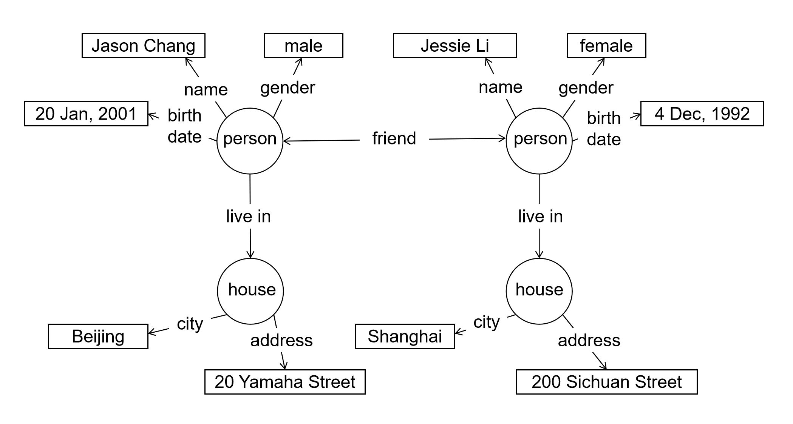
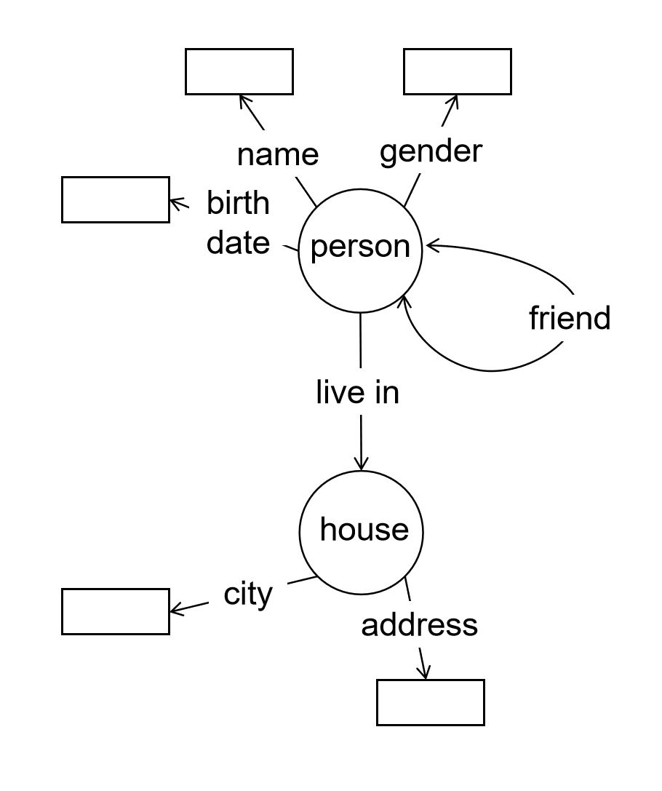

# 数据模型

从本节开始，我们切入正题，先讨论数据管理系统的功能形态。任何一个数据管理系统都是通过一套**数据模型**对数据进行组织和访问的。数据模型大体上决定了数据管理系统的功能范围，有必要首先对它进行深入阐述。

## 数据的组织结构

对应用程序而言，数据管理系统提供的最基本功能无非两个。第一，将数据保存到系统中。第二，在需要时，能方便地从系统中取出数据。当然，如前文所述，系统还应该保证数据的持久性、安全性、真实性，并提供数据更新和数据处理的能力。而这些功能都是建立在数据存取功能之上的。所以，我们首先需要了解数据存取功能及其接口。

显而易见，数据存取功能的对象是数据。在数据管理系统中，数据应该以什么样的方式来描述和组织呢？例如，我们有如下两条数据。每一条数据都刻画了一个人，包括这个人的姓名、生日、住址等。

> A man named Jason Chang, who was born on Jan 20, 2001, lives in Beijing, at 20 Yamaha Street.

> A woman named Jessie Li, who was born on Dec 4, 1992, lives in Shanghai, at 200 Sichuan Street.

### 键值对模型

一种简单的组织方式是将关于Jason Chang的数据打成一个包，一次性存入系统。需要时，我们提供“Jason Chang”这个名字，系统即可将他的数据取出来。同理，我们也可以将关于Jessie Li的数据打包存入系统。需要时，再通过“Jessie Li”这个名字将数据取出。为了实现这样的存取功能，数据可以被组织在如下的映射结构中：

>"Jason Chang" &rarr; "A man named Jason Chang, who was born on Jan 20, 2001, lives in Beijing, at 20 Yamaha Street."

>"Jessie Li" &rarr; "A woman named Jessie Li, who was born on Dec 4, 1992, lives in Shanghai, at 200 Sichuan Street."

这里的人名可以视为**键**（key），关于人的数据可以视为**值**（value）。也就是说，为了实现数据的存取，我们可以用如下的“**键值对**”结构对数据进行组织。

> *key* &rarr; *value* 

在这个结构中，“键”被作为数据项的标识（英文简写为ID）。如一下示例所示，使用“键”对数据进行存和取的操作，可以满足对数据的基本访问需求。这两个操作就成为了数据管理系统的基本功能接口。

> put(*key*, *value*);       // 将键值对 *key* &rarr; *value* 存入数据管理系统
> get(*key*);                      // 从数据管理系统中取出键为*key* 的键值对，返回该键值对的值

键值对的结构可以被视为一种简单的数据模型。它定义了数据是如何组织的，也定义了我们可以如何访问数据。

### 表格模型

应用需求可能会变得更加复杂。假设我们积累了很多人的数据，除了Jason Chang和Jessie Li，还包括其他人的数据。这个时候，我们想从系统中取出居住在地址为20 Yamaha Street的人的信息。事先我们并不知道这个人叫什么名字。在这个情况下，“键值对”结构就无法满足我们的数据获取需求了。虽然“20 Yamaha Street”的字眼藏在“键值对”的“值”中，但对计算机而言，这些值只是一个个无法理解的字符串。为了达到目的，我们只能将所有的键值对悉数取出来，然后人工判断哪些人住在20 Yamaha Street。换句话说，“键值对”这种组织结构太简单，以至于我们无法通过它向计算机表达更复杂的数据获取需求。

但是，如果我们将数据组织在下面的表格结构中，情况就有所改变。

| name        | birthdate    | gender | address            | city     | 
| ------------| ------------ | ------ | ------------------ | -------- |
| Jason Chang | Jan 20, 2001 | male   | 20 Yamaha Street   | Beijing  |
| Jessie Li   | Dec 4, 1992  | female | 200 Sichuan Street | Shanghai |

这种结构将每个人视为一个**实体**（entity），对应表格的一行。每个实体被赋予若干**属性**（attributes），对应了表格的列，比如姓名（name）、生日（birthdate）、住址（address）等。属性的**取值**（value）是对实体的刻画，对应表格中各个单元的数据。

基于这样的结构，我们可以将实体整体存入系统，也可以将它们整体取出来。不仅如此，系统还可以根据单个属性的取值对数据进行访问。比如，要查找居住在地址为20 Yamaha Street的人，我们可以要求系统找到在address属性上的取值为“20 Yamaha Street”的实体。例如，数据管理系统可以提供以下的数据存取接口：

> put( [*attribute*, *value*] );      // 将一个通过一组*attribute*:*value*刻画的实体存入表格
> get(*attribute*, *value*);              // 从表格中取出在属性*attribute* 取值为*value*的实体

利用这样的功能接口，我们可以用以下指令轻易获取居住在地址为20 Yamaha Street的人的信息。

> get("address","20 Yamaha Street");

表格结构比“键值对”结构更精细更复杂，能表达更丰富的数据获取需求。由此可见，数据管理系统的功能接口很大程度上取决于数据的组织结构。当数据的组织结构很简单时，系统只能提供简单的数据存取方式，如“键值对”。当数据的组织结构变得更加精细时，系统就可以提供更丰富的数据存取方式，如表格结构。

数据的组织结构有一个更正式的名称，叫**数据模型**。数据模型是人和计算机共同描述数据的方式，是对数据进行抽象之后的具体表现形式。它严格定义了数据的组织结构，也严格定义了其组织结构的含义。有了数据模型，系统就可以根据数据的组织结构去处理数据，用户就可以根据它去表达自己的数据存取需求。

### 其他形态的数据模型

除了以上的键值对模型和表格模型，还有很多不同的数据模型被不同的数据管理系统所选择。这里再列举一些。

例如，以下的**嵌套结构模型**可以将数据组织成多个层次，从而对实体进行更深入、更精细地刻画。

```bson
{
  name: "Jason Chang",
  birthdate: {
    day:20,
    month:"Jan",
    year:2001
  },
  gender: "male",
  address: {
    number:20,
    street:"Yamaha Street"
    city: "Beijing"
  }
}

{
  name: "Jessie LI",
  birthdate: {
    day:4,
    month:"Dec",
    year:1992
  },
  gender: "female",
  address: {
    number:200,
    street:"Sichuan Street",
    city: "Shanghai"
  }
}
```

这样的嵌套结构可以支持如下的数据访问接口。

> get("address/number : 20",  "address/street : 'Yamaha Street'");

又例如，以下图1.1的**图结构模型**将实体作为顶点，将实体之间的联系作为边，从而把数据组织成图的形态。

<center>
	
	<br>
	<div display: inline-block; padding : 2px>
        图 1.1 图结构模型
	</div>
</center>

对于图结构模型，可以通过图搜索的方式实现数据访问。这里不再进一步展开讨论。

## 数据模型选择

不同的数据模型意味着不同的数据访问和处理方式。那么，一个数据管理系统到底应该什么样的数据模型组织自己的数据？应该使用简单的还是复杂的模型？一方面，我们希望数据管理系统的接口简单，这样不仅易于使用，也更符合软件模块化的原则。另一方面，我们也希望数据管理系统的功能强大，可以承载更多的数据处理功能，满足用户更多的数据存取需求，减轻应用程序的负担。也就是说，我们希望有一个足够简单的模型，但这个模型又具备尽可能强的“表达能力”（我们用“表达能力”来衡量用户能够通过模型表述多少种类的数据存取需求）。

然而，事与愿违。正如我们的例子所展示的，一个简单模型的表达能力通常较弱 - 使用“键值对”模型，我们就只能使用键对数据进行存取。如果我们要追求更强的表达能力，就不得不去选择更加复杂的模型，以至于降低了数据管理系统的易用性。这又回到了系统设计的折衷问题。我们需要在简单模型和复杂模型之间取一个折衷，兼顾系统的易用性和功能性。

当代的数据管理系统尝试了不同的折衷点，也就是使用了不同的数据模型来满足应用开发的需要。根据数据模型的不同我们可以将数据管理系统分为不同的类型，如关系型数据库系统、文档数据库系统、键值对数据库系统、图数据库系统、时序数据库系统等等。在本书接下来的内容中，我们将展示数据模型是如何影响数据管理系统的功能的。在介绍每一种数据管理系统时，我们都将首先讲解它的数据模型。

值得指出的是，数据模型的复杂度和表达能力并不是线性关系。当两个数据模型的复杂程度相当时，并不意味着二者具备同样的表达能力。模型之上还可以定义一套数据访问语言。表达能力还取决于这套语言的能力。我们将在下一节对数据访问语言做初步介绍。

## 数据模式和数据实例

通过数据模型，我们可以对信息进行结构化表示，从而让计算机程序可以根据信息的含义对信息进行筛选和处理。用数据模型表示而成的数据通常被称为**结构化数据**。（换而言之，结构化数据就是通过某种数据结构进行表示，以至于计算机程序可以对其进行语义操作，的数据。）我们可以用下面这个不太严谨的公式概括信息（Information）、数据模型（Data Model）和结构化数据（Structured Data）的关系：

> **信息 + 数据模型 = 结构化数据**

然而，即便使用同一种数据模型，我们也可以将同一则信息表示成不同的结构。例如，以下两项数据都是通过嵌套结构模型进行表示的，并且都表达同一类的信息，却呈现出不同的结构。

```bson
{
  name: "Jason Chang",
  birthday_date:20,
  birthday_month:"Jan",
  birthday_year:2001,
  gender: "male",
  address: {
    number:20,
    street:"Yamaha Street"
  },
  city: "Beijing"
}

{
  name: "Jessie LI",
  birthdate: {
    day:4,
    month:"Dec",
    year:1992
  },
  gender: "female",
  address: {
    number:200,
    street:"Yamaha Street",
    city: "Shanghai"
  }
}
```

如果数据都通过五花八门的任意结构进行表示，我们就不能使用同一个计算机程序对其进行统一处理。这显然不是我们希望的。我们希望同一类数据都使用统一的结构进行表示，这样大大有利于计算机系统管理和处理这些数据。为了实现这个目的，我们需要在编写程序之前制定一套统一的数据表示结构，让当前和未来的数据都通过这一套结构进行表示。这一套事先制定好的统一的数据表示结构称为**数据模式**（Schema）。

例如，上述的两项嵌套结构数据使用了不同的数据模式，可以分别表示如下。

```bson
{
  name,
  birthday_date,
  birthday_month,
  birthday_year,
  gender,
  address: {
    number,
    street
  },
  city
}

{
  name,
  birthdate: {
    day,
    month,
    year
  },
  gender,
  address: {
    number,
    street,
    city
  }
}
```

用某个数据模式表示的数据称为该数据模式的**数据实例**（Instance，简称实例）。例如，前述的两项嵌套结构数据分别是以上两个数据模式的实例。

以下分别是一个基于表格模型的数据模式和一个基于图结构模型的数据模式。

| name | birthdate | gender | address | city | 
| ---- | --------- | ------ | ------- | ---- |
| ...  | ...       | ...    | ...     | ...  |

<center>
	
	<br>
	<div display: inline-block; padding : 2px>
         图 1.2 基于图结构模型的数据模式
	</div>
</center>
如上所述，对同一类信息，我们可以使用不同的数据模式进行表示。这导致数据模式的设计成为了一项工程开发的重要环节。这个环节通常被称为**数据库设计**（Database Design）。数据模式的结构决定了计算机程序应该如何处理数据。如果设计的不好，可能导致应用程序性能低下或者难以维护。这个问题将在数据库设计的章节中得到专门讨论。

[**上一页<<**](chapter1.3.md) | [**>>下一页**](chapter1.5.md)
