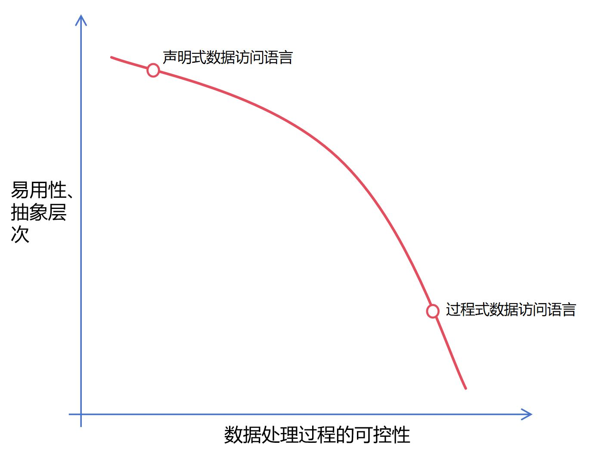
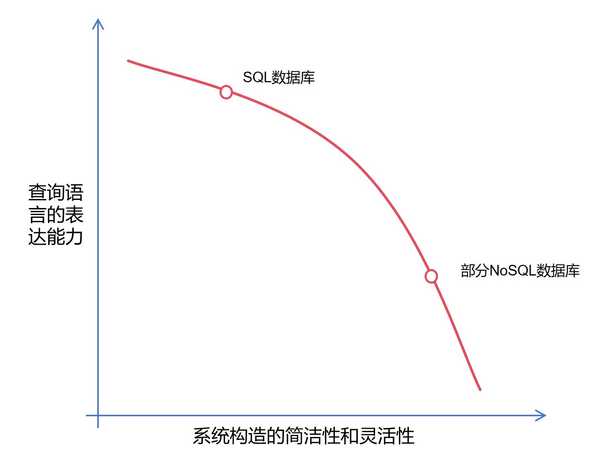

# 数据访问语言

## 什么是数据访问语言

在特定的数据模型下，一旦确定了数据的模式，我们就可以使用计算机程序对数据进行访问和处理。数据访问程序通常有两种编写方式。一种是使用通用的高级程序语言（如C、Java、Python等）直接调用数据管理系统的数据访问接口（参见1.4节列举的put和get程序调用接口）。另一种是使用为特定数据模型定制的数据访问语言（如SQL）。无论是特定的数据访问接口还是更复杂的数据访问语言，都是针对数据模型设计的。较通用的程序设计语言，它们能更简洁地表达数据访问需求。总而言之，在数据模式基础上使用数据访问语言，就可以编写出满足各种需求的数据访问程序。

> 数据模式 + 数据访问语言  &rarr;  数据访问程序

数据访问语言比通常的高级程序设计语言具有更高的抽象层次。

假设数据存放在下列由C语言编写的数据结构中。

```c
struct person{
	char * name;
	int birth_date;
	char * birth_mon;
	int birth_year;
	bool gender;
	char * address;
	char * city;
} personInstance[1000]; 
```

如果我们要从这一组关于人员的数据中查找那些在上海居住并且于2000年以后出生的人，我们可以用C语言编写如下一段程序。程序执行后，变量*results*就保存了所有满足要求的人员。

```c
struct person * results[1000];
int resultCount = 0;
for(int i = 0; i < 1000; i++)
{
	if(strcmp(personInstance[i].city,"Shanghai")!=0)
		continue;
	if(personInstance[i].birth_year < 2000)
		continue;
	results[resultCount++] = & personInstance[i];
}
```

假设我们又将数据存放在以下模式的表格里面。（表格的名字叫*Person*。）

| name | birth_date | birth_mon | birth_year | gender | address | city | 
| ---- | ---------- | --------- | ---------- | ------ | ------- | ---- |
| ...  | ...        |  ...      | ...        | ...    | ...     | ...  |

为了查找满足需要的人员，我们可以用SQL这种专用数据访问语言编写如下一段程序。

```sql
Select * from Person
Where city = ‘Shanghai’ And birth_year >= 2000;
```

对比用C和SQL书写的数据访问程序，我们可以清楚地看到专用数据访问语言的优势。首先，它允许我们直接在数据的*集合*上进行操作，免去逐个处理数据的繁琐步骤。再者，它提供了更丰富的数据比较和数据操作原语（比如使用“=”比较字符串），便于我们更简洁地表达查询的意图。

## 声明式语言的利弊

站在程序设计语言的视角，专用的数据访问语言比常用的程序设计语言具有更高的抽象层次，它们通常被归类为**声明式语言**。我们日常使用的高级程序语言（如C、Java、Python等）大都属于*过程式语言*。当使用过程式语言编写程序时，我们需要将计算机的工作过程完整地设计出来，包括其中的每一个工作步骤。而当使用声明式语言编写程序时，我们更多地只是告诉计算机我们的需求，比如我们需要的数据应该满足什么条件。负责执行程序的系统会自动调用既有流程去满足我们的要求，比如找到我们想要的数据。

声明式的数据访问语言能够让使用者更简洁地表达需求，减少程序开发的代价。另一方面，它还能替使用者选择最高效的方式实现数据访问。在上述例子中，如果数据量急剧增长，使用上面的C程序逐个处理数据将变得非常低效。而更高效的方式是在数据集上建立索引，降低数据访问量。而上面的SQL程序则无需担忧这个问题。它并没有限制数据的访问方式。当数据量增长后，它背后的数据管理系统会自动采用索引访问的模式，保证数据访问的效率。

将声明式语言作为数据管理系统的功能接口也符合前面提到的模块化原则（参见1.1），即将功能以最简洁的模式提供给应用程序，而将实现细节尽可能地隐藏在系统内部。关系数据库可以说是最早遵循这个设计原则的数据管理系统，并获得了极大成功，以至于后来的数据管理系统都尽可能采用声明式语言或接口。

但声明式语言也给数据管理系统的研制提出了挑战，它要求系统具备一定的“智能”，能够找到最高效的过程去应答数据访问请求。一旦这项“智能”不够高，以至于系统总是使用低效的过程去获取数据，应用开发者将不得不想办法绕过声明式语言，去干涉系统的工作过程。如果这样的干涉依然无法奏效，他们则可能弃用当前的系统，转而选择可控性更高的系统。10年前，不少应用开发者采用NoSQL数据库替代SQL数据库，一定程度上是出于这个原因（即为了让应用程序在分布式计算环境下的性能更加可控）。可见，声明式语言也可能成为应用开发的阻碍。这又回到了前面提到的折衷问题 - 我们需要在系统的*易用性*和*可控性*之间找到一个合理的折衷点，从而最大化系统的适用范围。这使得选择合适的访问语言成为了数据管理系统的设计要点。不少当代的数据管理系统都在这个方面反复权衡过。

<center>
	
	<br>
	<div display: inline-block; padding : 2px>
	</div>
</center>

## 数据访问语言的能力范围

通常，一个数据管理系统提供以下四种数据访问方式：添加数据（Create）、查询数据（Read）、更新数据（Update）和删除数据（Delete）。这四类数据访问操作被简称为**CRUD**。其中，最复杂的功能是查询（Read）。应用程序常常碰到相当复杂的数据获取需求（比如使用多重条件去筛选数据），这些需求都需要通过数据访问语言进行表达。一旦数据能够被精确定位，它的更新和删除就变得相对简单。数据的添加通常也是简单直接的过程。因此，一个数据访问语言的能力主要体现在它能表达什么样的查询需求。

数据查询又可以分为两个层次。一种是单纯的“定位”，即在众多数据中找到满足需求的。比如，“查找在上海居住并且于2000年以后出生的人”就是一种“定位”，只需要从已知数据中筛选出满足要求的那部分。另一种是“再计算”，即对定位后的数据进行二次处理，提取出进一步的信息。比如，“查找上海居住人员的平均年龄”就需要“再计算”。平均年龄并没有记录在原始数据中，需要先定位到所有上海居住者，再计算其年龄的平均值。有时候，“再计算”的结果又可用于更复杂的数据“定位”，比如“查找年龄大于上海居住者平均年龄的人”。由此可见，我们也不能简单区分这两个层次的查询，它们常常是混合在一起的。

既然数据查询涉及计算（或“再计算”），我们就希望数据访问语言是图灵完备的。（所谓图灵完备性，即Turing Completeness，是指该语言可用于编写在计算机上运行的任意程序。常用的高级语言，包括C、Java、Python等，都是图灵完备的编程语言。）也就是说，我们希望数据访问语言能够具备普通程序设计语言的表达能力，从而可以运用所有的计算方法去满足各类信息需求。否则，总有某些计算方法无法被采用，导致总有某些信息无法获取。但是，数据访问语言的表达能力和抽象层次在一定程度上是相互矛盾的。当代的声明式语言（例如SQL）为了达到较高的抽象层次，往往放弃了一部分表达能力。现有数据管理系统的访问语言几乎都没有达到图灵完备的程度。

退一步看，数据访问语言其实也不必要达到图灵完备性。数据管理系统只是应用软件的一个模块，其上还运行有应用程序。应用程序几乎都是使用图灵完备语言编写的，它们可以弥补数据访问语言表达能力的不足。当一个信息需求不能被数据访问语言表达时，我们可以将相关数据抽取到应用程序中，由应用程序做进一步处理。在现实的应用开发中，这是惯常的做法。近年来涌现的NoSQL数据库都对数据管理系统的功能和访问语言做了大幅简化，目的是降低数据管理系统的复杂度，从而实现更好的性能和扩展能力。将数据处理过程更多推给应用程序也让数据处理过程变得更可控。然而，这种做法也有明显的弊端。它一方面增加了程序开发人员的负担，另一方面可能导致应用程序和数据管理系统之间的大规模数据交换，给性能带来负面影响。

另一种相反的做法是将应用程序放到数据管理系统内部去执行，消除数据交换带来的性能影响。传统的SQL数据库都提供用户自定义函数（User Defined Function, UDF）功能，允许使用者将过程性语言的程序注入到数据管理系统内部去执行，同样可以弥补数据访问语言表达能力的不足。像Oracle这样的商用数据库还创造了专门的过程性编程语言，例如PL-SQL，本质是对SQL表达能力的一种扩展。但使用UDF可能导致软件开发工作职责不清，也增加了软件维护和迭代的难度，近几年已经逐渐被主流的软件工程方法弃用。

总之，数据管理系统的设计者会对数据访问语言的表达能力做折衷考虑。一方面，他们希望数据访问语言具备较强的表达能力，能够满足更多的数据访问需求。另一方面，他们不希望数据管理系统承担超出自己职责的任务，以至于拖累系统的性能和开发难度。从软件工程的角度看，业务逻辑和数据访问逻辑之间的界限始终是模糊的，导致这个折衷选择在现实世界中是仁者见仁智者见智。

<center>
	
	<br>
	<div display: inline-block; padding : 2px>
	</div>
</center>

本书将对多种数据管理系统作深入介绍。区分这些系统的核心标准就是它们使用的数据模型和数据访问语言。其中，数据访问语言是构建在数据模型之上的。因此，我们通常将二者一并考虑。它们一起决定了一个数据管理系统的功能，也决定了其架构和具体实现方式。

[**上一页<<**](chapter1.3.md) | [**>>下一页**](chapter2.1md)
