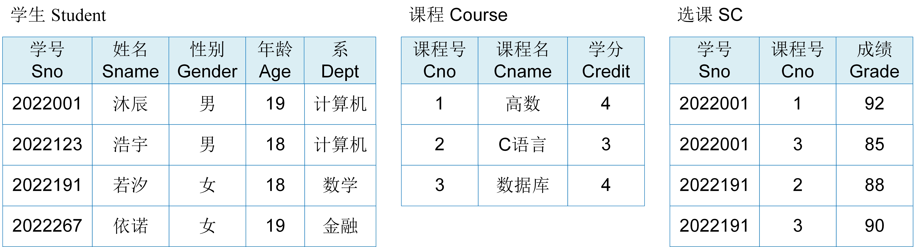
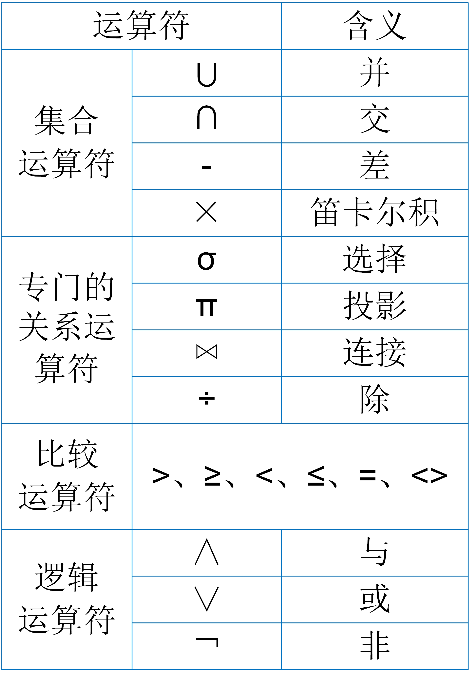
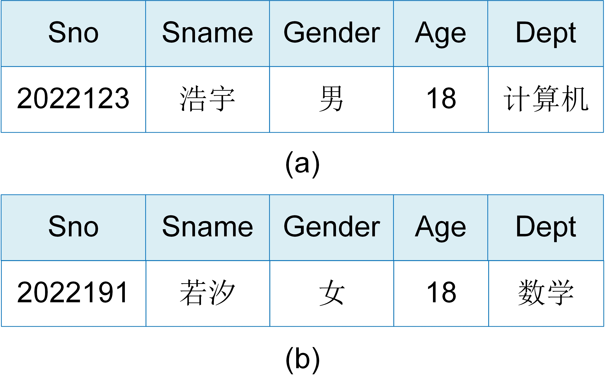
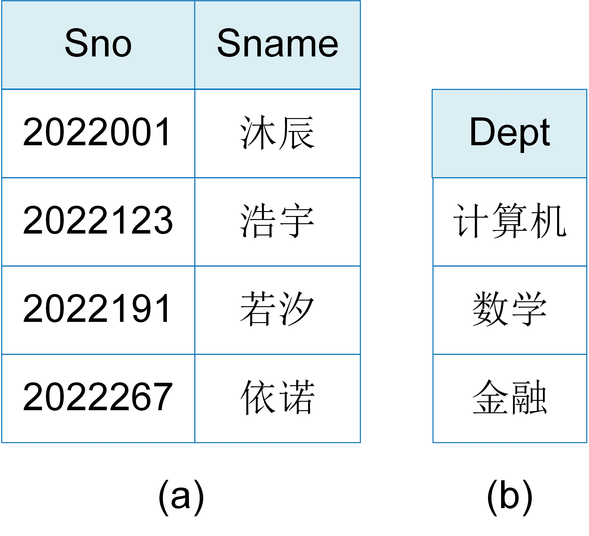
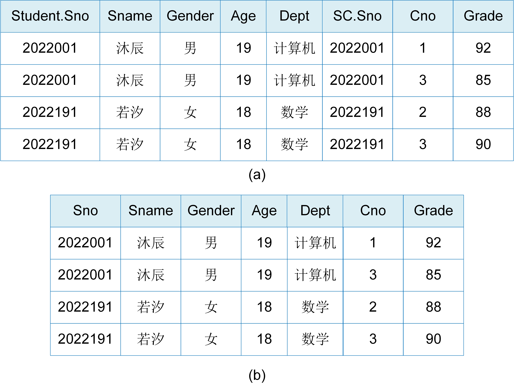
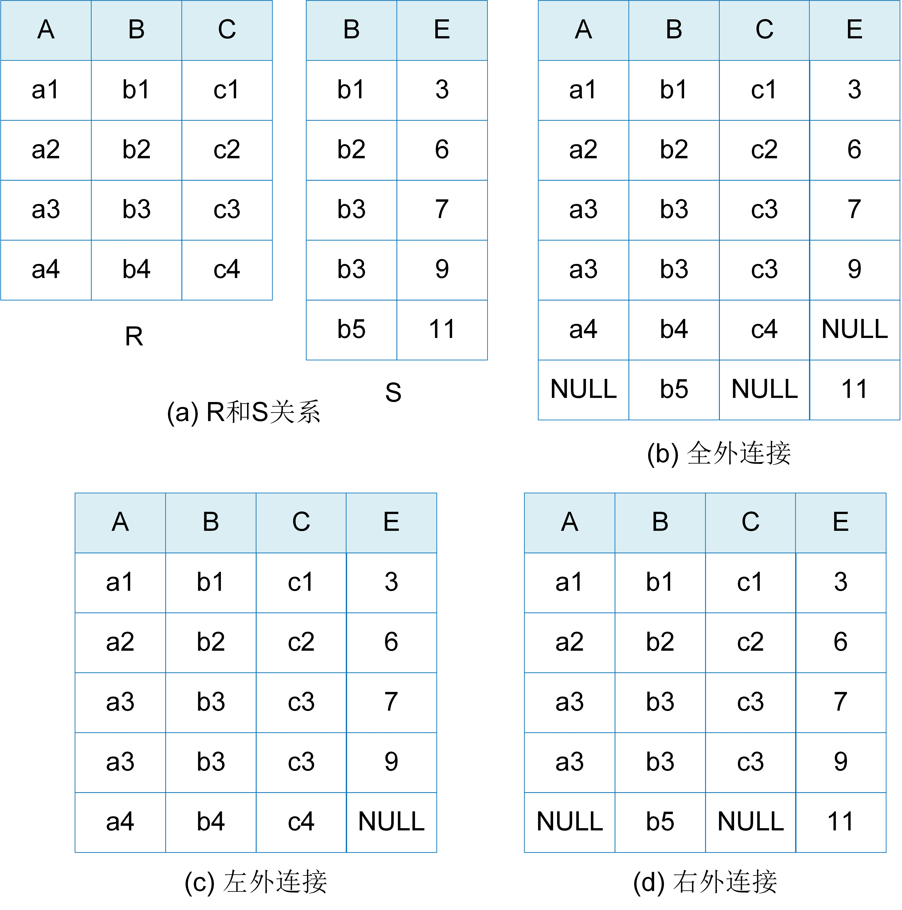
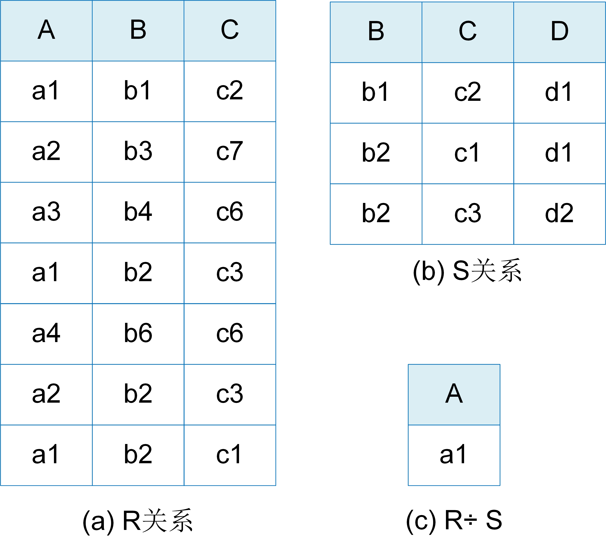
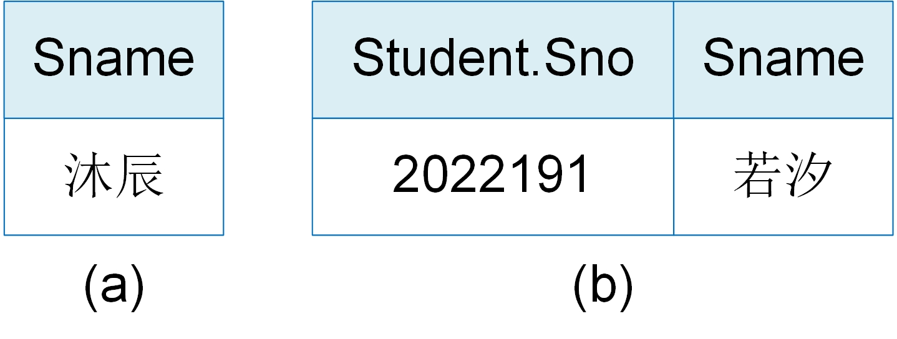

# 关系模型

从本节开始，我们将介绍关系型数据库管理系统的数据组织与访问。凡是将关系模型作为数据模型的数据管理系统，我们统称为关系型数据库系统。

## 关系结构

关系模型是将数据组织成一个个关系，关系表示现实世界中的各类实体以及实体之间的联系。通常，关系可以形象地理解为一张二维表，它建立在集合论的基础之上。图1.5中展示了学生-课程数据库的关系模型和数据实例，其中包含学生Student、课程Course和选课SC三个关系。每个关系的逻辑结构是一张二维表，它由表头和表内记录组成。

	
	 
	

		图 1.5 学生-课程数据库的关系模型和数据实例
	

关系模型的基本概念：

* 关系模式：表头在关系模型中称为关系模式（schema），它是对关系的描述。例如，学生关系的关系模式可以形式化表示为：学生（学号，姓名，性别， 年龄，系），其中“学生”是关系名，“学号”、“姓名”、“性别”、“年龄”、“系”是属性名。
* 属性：表中的每一列在关系模型中称为属性（attribute）。属性是对每类实体的特征抽象。比如，课程实体的特征可以抽象为课程号、课程名和学分。每一列属性值取自于一个域。域是一组具有相同数据类型的值的集合。例如，课程名属性值来自于长度小于25字节的字符串集合，学分来自于大于0小于5的正整数。
* 元组：表内记录中的每一行在关系模型中称为元组（tuple）。元组是对某一实体对象进行描述，由任意个属性值组成。例如，学生表中的第一行元组(2022001, ‘沐辰’, '男', 19, '计算机')描述的是学生“沐辰”对象。该元组表示学生沐辰的学号是2022001，属于计算机系。
* 关系：表中的所有记录在关系模型中称为关系，关系是元组的集合。如果元组由$n$个属性值组成，则元组对应的关系称为$n$元关系。比如课程和选课关系是三元关系，学生关系是五元关系。通常关系也称为表，如学生关系称为学生表，课程关系称为课程表，选课关系称为选课表。
* 候选码：在关系中，如果某一属性组的值能够唯一地标识一个元组，而其子集不能的，则该属性组称为候选码。候选码可以包含关系模式中的一个属性，多个属性，甚至是所有属性。候选码中的属性称为**主属性**，不包含在候选码中的属性称为**非主属性**或者**非码属性**。例如，学号是学生关系的候选码，学号和课程号是选课关系的候选码。此外，一个关系里也可以有多个候选码。例如，在仓库管理关系（仓库号，管理员号，商品号，商品数量）中，如果一个仓库只有一个管理员，一个管理员只管理一个仓库，那么仓库号和商品号是该关系的候选码，管理员号和商品号也是该关系的候选码。
* 主码：关系中的某一个候选码设置为主码（primary key）。例如，学生关系中学号是主码，课程关系中课程号是主码，选课关系中学号和课程号共同构成主码。

在图R1.1中，学生-课程数据库的三个关系表示如下，其中关系中的主码以下划线进行表示。

* 学生关系（学生表）：Student (<u>Sno</u>, Sname, Gender, Age, Dept)；
* 课程关系（课程表）：Course (<u>Cno</u>, Cname, Credit)；
* 学生选课关系（学生选课表）：SC (<u>Sno,Cno</u>,Grade)；

与文档模型相比，关系和文档集都是对各类实体的描述，元组和文档是对某一实体实例的描述。关系是元组的集合，文档集是文档的集合。在关系模型中，关系模式是提前进行严格定义的。关系中的每个元组必须包含关系模式中定义的所有属性，并且属性值需要遵循定义的数据类型和长度。而在文档模型中，组成文档的属性不用提前定义，并且同一文档集内，各文档之间的属性可以不同，相同属性的数据类型也可以不同。

## 关系代数运算

关系模型是一种数据组织结构，是一种信息表达方式。如何基于关系模型来描述数据的存取功能呢？关系模型上常用的计算方式称为关系代数。接下来，我们讲介绍如何用关系的运算来表达数据的存取。

	
	 
	

		图 1.6 关系代数运算符
	

任何一种运算都是将运算符作用于一定的运算对象上，然后得到运算结果。运算对象、运算符和运算结果是运算的三大要素。关系代数的运算对象是关系，运算结果也是关系。关系代数的运算符包括四类：集合运算符、专门的关系运算符、比较运算符和逻辑运算符，如图1.6所示。

按运算符进行划分，关系代数的运算可以分为：

* 集合运算：将关系看成元组的集合，从行的角度进行运算。集合运算是二目运算，包括并（union）、交（intersection）、差（except）和笛卡尔积（cartesian product）四种运算，分别记作 $ R \cup S$, $ R \cap S$，$ R - S$， $R \times S$，其中$R$和$S$表示关系。
* 关系运算：从关系的行和列进行运算，包括选择（selection）、投影（projection）、连接（join）和除（division）四类运算，分别记作$\sigma_F(R)$，$\Pi_A(R)$，$R \Join_{A \theta B} S$，$R \div S$，其中$R$和$S$表示关系，$F$表示比较运算表达式，$A$和$B$表示属性，$\theta$表示比较运算符。
* 比较运算：是为了辅助关系运算而进行的操作。比较运算用比较运算符比较两个值，其结果是一个逻辑值“真”或“假”。在关系运算中，通常记作 $X \theta Y$， 其中$\theta$表示比较运算符$>$，$\ge$，$<$，$\le$，$=$，$<> $等，$X$和$Y$可以是属性名，常量或者简单的函数。
* 逻辑运算：也是为辅助关系运算而进行的操作。在关系运算中，逻辑运算用逻辑运算符对若干个比较运算结果进行运算，其结果也是一个逻辑值，常用的逻辑运算符有与($\land$)、或($\lor$)和非($\neg$)。

关系代数中最常用的是关系运算。接下来将介绍选择、投影、连接和除四类关系运算。

（1）选择

选择（$\sigma$）是一个一元算子，它是从关系$R$中选择出满足给定条件的所有元组，记作$$\sigma_F(R)=\{t | t\in R \land F(t) = '真' \}$$其中，$t$表示元组；$F$是比较运算表达式，又称为选择条件，它的运算对象是关系$R$中的各个属性。选择运算表达式实际上表示的是从关系$R$中选取出使比较运算表达式$F$为真的元组。换而言之， 选择运算是用选择条件$F$对关系$R$中的元组进行过滤，过滤之后的结果是由一个或者多个元组组成的新关系，所以选择运算是从关系的行角度进行的运算。

下面的例子展示了用选择运算来描述数据的读取，并给出了选择运算的结果。选择运算的对象是图1.5的学生关系。

> [例1.1]  查询姓名为浩宇的学生。 关系运算表示为：$\sigma_{Sname='浩宇'}(Student)$，运算结果如图R1.7(a)所示 。 
> [例1.2] 查询年龄小于19岁的女学生。关系运算表示为：$\sigma_{Gender='女' \land Age < 19}(Student)$，运算结果如图1.7(b)所示。 

	
	 
	

		图1.7 选择运算举例
	

（2）投影

投影（$\Pi$）是一个一元算子，它是从关系$R$中选择出若干属性列组成的新关系，记作$$\Pi_A(R)=\{t[A] | t \in  R\}$$，其中，$A$是关系$R$的一个属性或者多个属性组成的属性组，又称为投影条件；$t[A]$则表示元组$t$在属性组$A$上各属性值的集合。投影运算其实是对关系$R$做垂直切分，只留下属性组$A$，投影结果是由属性组$A$的属性值组成的新关系。所以，投影运算是从关系的列角度进行的运算。值得特别注意的是，投影之后的结果不能包含重复的元组，因此投影运算还需要去掉新关系中完全相同的元组。

下面展示了在图1.5中学生关系上的投影运算。

> [例1.3]  查询学生的学号和姓名。 关系运算表示为：$\Pi_{Sno,Sname}(Student)$，运算结果如图R1.8(a)所示 。 
> [例1.4] 查询学生的系。关系运算表示为：$\Pi_{Dept}(Student)$，运算结果如图R1.8(b)所示。 

	
	 
	

		图 1.8 投影运算举例
	

（3）连接

连接（$\Join$）是一个二元算子，它是从两个关系$R$和$S$的笛卡尔积中选取满足给定条件的元组，记作$$R \Join_{A\theta B} S = \{^\frown_{t_r,t_s} | t_r \in R \land t_s \in S \land t_r[A] \theta t_s[B] = '真'\}$$其中，$A\theta B$是比较运算表达式，又称连接条件。$A$是关系$R$的属性组，$B$是关系$S$的属性组，$A$和$B$称为连接属性组，它们的列数相等且属性值具有可比性；$^\frown_{t_r,t_s}$表示关系$R$和$S$的笛卡尔积。这里笛卡尔积称为广义笛卡尔积，记作$R \times S$，它是用关系$R$中的元组为第一元素，关系$S$中的元组为第二元素构成有序对，然后由所有的有序对组成的集合。也就是说，如果关系$R$有$n$个属性和$k_1$个元组，关系$S$有$m$个属性和$k_2$个元组，那么它们的笛卡尔积有$n+m$个属性和$k_1 \times k_2$个元组。连接运算的执行过程是先对关系$R$和$S$求笛卡尔积，然后用连接条件对笛卡尔积中的元组进行过滤，过滤之后的结果是由$A$属性组上的值与$B$属性组上的值满足比较运算符$\theta$的元组构成。

连接运算包括内连接（inner join）、自然连接（nature join）和外连接（outer join）三种，其中最常用且最重要的连接是内连接中的等值连接和自然连接。

* 内连接：就是通常所说的连接运算，也称为连接。根据连接条件中比较运算符$\theta$的不同，可以分为等值连接和不等连接。等值连接是比较运算符$\theta$为“$=$”的连接运算，也就是从关系$R$和$S$的笛卡尔积中选取$A$、$B$属性值相等的元组。不等值连接就是比较运算符为除等号之外的连接运算。
* 自然连接：是一种特殊的等值连接。它要求$R$和$S$两个关系中进行比较的属性组必须同名，并且在连接结果中要去掉重复的属性列。
* 外连接：与内连接和自然连接不同，外连接的结果中保留了关系$R$和$S$中不满足连接条件的元组。这些不满足连接条件的元组称为悬浮元组。外连接分为左外连接（left outer join或left join）、右外连接（right outer join 或者right join）和全外连接（full outer join 或者outer join）。左外连接是保留左边关系$R$中的悬浮元组，记作$R  ⟕ S$。由于右边关系$S$没有与$R$悬浮元组相连接的元组，因此连接结果中$S$的属性上填空值(NULL)。右外连接是保留右边关系$S$中的悬浮元组，记作$ R ⟖ S$。同样地，右外连接结果中悬浮元组中的左边关系$R$的属性上填空值。全外连接简称为外连接，是同时保留关系$R$和$S$的悬浮元组，对应悬浮元组的其他属性上填空值，记作 $R ⟗S$。

下例中展示了在图1.5中学生关系和选课关系上的等值连接和自然连接。

> [例1.5] 查询学生和该学生的选课信息。 等值连接表示为：$Student \Join_{Student.Sno=SC.Sno} SC$，运算结果如图1.9(a)所示 。 
> [例1.6] 查询学生和该学生的选课信息。自然连接表示为：$Student \Join SC$，运算结果如图1.9(b)所示。

	
	 
	

		图 1.9 等值连接和自然连接举例
	

下例中展示了在图1.10中关系$R$和$S$的外连接、左外连接和右外连接运算。

> [例1.7] 关系$R$和关系$S$的外连接，表示为：$SR ⟗S$，运算结果如图1.10(b)所示 。 
> [例1.8] 关系$R$和关系$S$的左外连接，表示为：$R ⟕ S$，运算结果如图1.10(c)所示。 
> [例1.9] 关系$R$和关系$S$的右外连接，表示为：$R ⟖ S $，运算结果如图1.10(d)所示。

	
	 
	

		图 1.10 外连接运算举例
	

（4） 除

除($\div$)是一个二元算子。它的定义是：如果关系$R(X,Y)$除以关系$S(Y,Z)$得到的结果为关系$T(X)$，其中$X,Y,Z$都是属性组，$R$中的$Y$和$S$中的$Y$可以是不同的属性名，但属性值必须来自相同的域。关系$T$是关系$R$在属性$X$上的投影，投影后的元组满足以下条件：属性值$x$在关系$R$中的象集$Y_x$包含关系$S$在$Y$上投影的集合。记作$$R \div S = \{t_r[X] | t_r \in  R \land \Pi_Y(S) \subseteq Y_x\}$$其中$x=t_r[X]$，$t_r[X]$表示元组$t$是在关系$R$的属性组$X$上的投影集合，$\Pi_Y(S) $是在关系$S$上对属性组$Y$的投影集合，$Y_x$是属性值$x$在$R$中的象集。$x$在$R$中的象集指的是关系$R$中每个属性值$x$的所有元组在$Y$上属性值的集合。更通俗一点地说，就是先根据$x$属性值对关系$R$进行分组，每个组内$Y$的属性值集合就是该组$x$的象集，记作$$Y_x = \{t[Y] | t \in R, t[X] = x\}$$

除运算是同时从行和列的角度进行运算。除运算的执行按以下步骤：

* 首先，按属性组$X$的值对关系$R$进行分组，然后求得每个属性值$x$在$R$中的象集，即关系$S$中每个$x$的所有$Y$的属性值的集合；
* 然后，进行关系$S$在属性组$Y$上的投影运算，得到关系$S$中$Y$的属性值的集合；
* 最后，选取象集中包含了$S$在$Y$属性组上投影结果的所有$x$。

下例展示了图1.11中关系$R$和$S$的除运算。

> [例1.10] 关系$R$和关系$S$的除运算，表示为：$R \div S$，运算结果如图1.11(c)所示 。 

例R1.10的执行过程如下：在关系$R$中，属性$A$的取值为$\{a1,a2,a3,a4\}$。首先，分别计算它们的象集，其中$a1$的象集为$\{(b1,c2),(b2,c3),(b2,c1)\}$；$a2$的象集为$\{(b3,c7),(b2,c3)\}$；$a3$的象集为$\{(b4,c6)\}$；$a4$的象集为$\{(b6,c6)\}$。然后，计算关系$S$在$(B,C)$上的投影为$\{(b1,c2),(b2,c3),(b2,c1)\}$。最后，比较各象集和关系$S$的投影结果，只有$a1$的象集包含了$S$在$(B,C)$上的投影，所以，$R \div S = \{a1\}$。

	
	 
	

		图 1.11 除运算举例
	

关系代数运算实际上提供了一种查询方式，允许在多个关系中找到满足查询条件的数据。

## 关系代数表达式
在上文中，我们介绍了四种基本的关系代数运算，描述了如何在关系模型上进行最简单、基本的数据读取操作。但在现实世界中，用户的数据查询需求是复杂的，单一一种关系代数运算无法充分表达用户的查询需求。因此，我们使用关系代数表达式来描述复杂的查询需求。关系代数表达式是由关系代数运算经有限次复合而成的式子。

下面的例子展示了用关系代数表达式来描述复杂的查询需求，并给出了关系代数表达式的查询结果。
> [例1.11] 查询学号为‘2022001’的学生姓名。 关系代数表达式表示为：$\Pi_{Sname}(\sigma_{Sno='2022001'}) Student$，查询结果如图1.12(a)所示 。 
> [例1.12] 查询选修3号课程且成绩在90分及以上的所有学生的学号和姓名。 关系代数表达式表示为：$\Pi_{Student.Sno,Sname}(Student \Join_{Student.sno=SC.sno} (\sigma_{Cno='3' \land Grade >= '90'})SC)$，查询结果如图1.12(b)所示 。 

	
	 
	

		图 1.12 关系代数表达式举例
	

[**上一页<<**](chapter1.5.md) | [**>>下一页**](chapter1.7-R.md)

