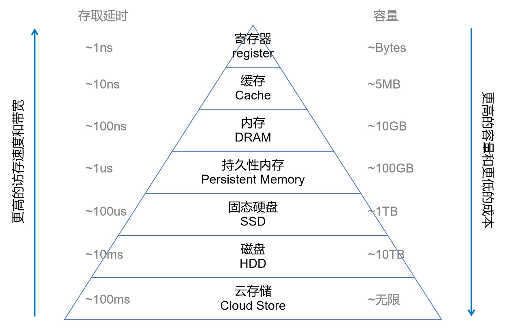
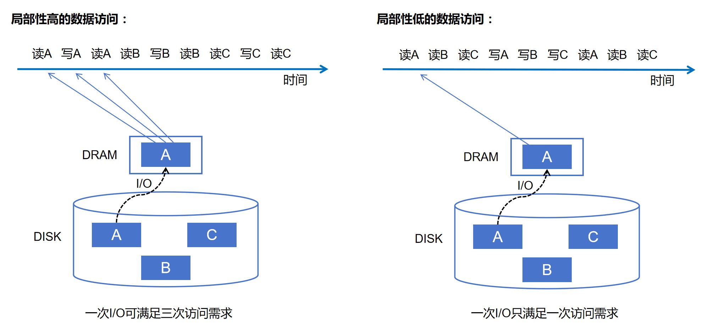
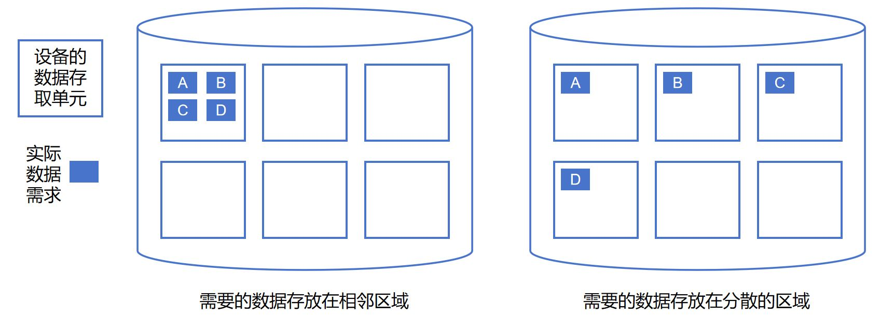

# 第2章 数据管理系统的数据存储

## 2.1 计算机的存储系统

数据管理系统的首要功能是实现数据的存储，不仅要把数据存下来，还要提供合理的数据组织结构，以便各种数据访问操作（包括增、删、改、查，即CRUD）能够高效进行。不同的数据管理系统往往采用不同的数据模型以及提供不同的数据访问方式，因此会采用不同的数据组织结构。本章先以键值对（Key-value Pairs）这种最简单的数据模型为例，介绍数据存储的基础知识，然后介绍各类数据管理系统的专用存储技术。

### 2.1.1 存储体系结构

计算机的数据存储体系是一个金字塔结构。下图展示了传统计算机的存储体系结构。最上层是CPU里的寄存器，它是CPU中的计算单元直接获取数据的地方。接下来是高缓存（Cache），用于加速CPU对内存的访问。再下面依次为内存（DRAM）、磁盘和离线存储（通常为磁带或云存储）。这个存储层次结构有一个显著的特点，即越上层的设备存取速度越快，但单位容量的价格越贵。相反地，越下面的设备存取速度越慢，但单位容量的价格越便宜。

	
	 
	

		图 2-1-1 存储体系结构
	

以内存和磁盘为例，内存的访问延时为100ns（ns为纳秒），而磁盘的访问延时为10ms（ms为毫秒），二者相差近10万倍。但内存的单位容量价格差不多是磁盘价格的200倍。从性价比方面考虑，通常，企业用户希望使用成本更低的磁盘来存储数据，同时又希望被频繁访问的数据能够存储在内存中来提高访问效率。另外，磁盘是一个具有持久性的设备，也就是说，当计算机断电时磁盘中的数据不会丢失。而内存不具有持久性，只有在计算机运行时内存中的数据才不会丢失。对于任何一个企业或者普通用户来说，数据丢失带来的影响是巨大的，是不可接受的。因此，系统架构师在设计系统时会综合考虑内存和磁盘的优缺点，最终形成一个磁盘-内存的双层存储架构。数据在廉价的磁盘中得到持久性保存。经常被访问的热点数据被从磁盘中读取出，暂存在内存中，用于提高数据访问的速度。

由此可见，图2.1呈现的金字塔型存储架构是一种能够兼顾存储成本和访问效率的合理结构。它一方面用廉价设备实现数据的持久性存储，另一方面又用高速设备去加速热点数据的访问。

随着硬件科技的发展，新的存储硬件将不断涌现出来，比如最近几年已经相当普及的固态硬盘（Solid State Drive），以及正在研制中的持久性内存（Persistent Memory）。这些硬件都会在这个金字塔结构中拥有自己的位置。但无论存储硬件如何演化，这种金字塔结构注定不会改变，因为昂贵的高速设备和廉价的低速设备是无法相互取代的，它们配合起来可以提供更高的性价比。

工程师在构建数据存储系统时，常常需要考虑到这种分层存储体系结构的特性，做到物尽其用。这里的基本原则是*让对同一块数据的多次访问尽量集中在相邻的时间发生*。这样有利于形成数据访问的热点。热点数据有利于系统将其放置在上层的高速设备中，从而提升数据访问的整体性能。这个理念被称为**提高数据访问的局部性**。它被普遍应用于数据管理系统的各个技术环节中。

	
	 
	

		图 2-1-2 数据访问局部性示例
	

如图2-1-2所示，同样对硬盘上A、B、C三块数据的多次访问，我们可以考虑两种访问顺序。在前一种访问顺序中，对任意一块数据的多次访问是在相邻时间内发生的。在后一种访问顺序中，对不同数据块的访问是交错进行的。按照上述对“数据访问局部性”的定义，前一种访问顺序显然具备更高的局部性。更高的局部性如何带来更高的数据访问性能？假设系统的内存容量很小，只能容纳一块数据。那么，对于前一种访问顺序，我们每次将数据从硬盘读取到内存中就可以满足连续三次的数据访问请求。而对于后一种访问顺序，每次数据块被读取到内存中，只能满足一次数据访问请求。（由于下一次访问请求需要不同的数据块，系统不得不将当前内存中的数据块抛弃，并再次读取硬盘。）也就是说，当数据访问局部性较高时，系统只需花费更少的硬盘访问代价，就能满足同样多的数据访问请求。在金字塔型的存储结构下，数据访问局部性带来的性能优势就体现于此。

###  2.1.2存储的访问性能

如上所述，数据访问的性能与存储体系的结构息息相关。为了获得好的性能，我们需要对数据管理系统的数据访问方式进行优化（比如提高局部性），使其符合存储体系的特点。此外，存储体系中各类存储设备，无论内存或硬盘，也都有其各自的特点。数据管理系统也必须考虑这些特点，才可能获得尽可能好的性能。

对任一种存储设备或存储系统，我们通常关注两方面的性能：访问延时（latency）和吞吐率(throughput)。访问延时是指我们向存储系统发出数据访问请求直到系统返回给我们数据所需的时间。对不同的设备和系统，访问延时可以低至数纳秒，也可以高至数百毫秒。但我们通常希望访问延时越低越好。吞吐率是指存储系统单位时间内能处理多少数据访问请求。我们通常希望吞吐率越高越好。访问延时和吞吐率都很重要。在设计存储设备和存储系统时，用于获得最低延时和最高吞吐率的方法往往不完全一致。因此，我们往往需要找到一个合适的设计折衷点，让两种性质都得到保证。     

对特定的存储设备，数据访问的性能是由该设备的物理工作过程决定的。例如，一个磁盘由若干圆形盘片叠加而成，盘片上的磁介质用于存储数据。一个可以感应磁介质的磁头位于盘片的某个半径上，并可以沿着该半径移动。当访问数据时，磁盘先将磁头移动到合适的半径位置，再等待盘片转动。当数据所在的磁介质转动到磁头正下方时，数据就可以被读取到磁盘的缓存中，并传输给计算机。这一过程涉及到磁头的移动、盘片的转动和数据的传输。它们整体决定了数据的访问延时。

再例如，固态硬盘（常称为闪存）将一种场效应晶体管作为存储介质。如果我们对这种场效应晶体管施加一定的正电压，就可以让电子聚集在其中，从而改变晶体管的状态。如果我们对其施加负电压，可以促使晶体管放电，从而恢复它的状态。晶体管中聚集的电子可以通过电效应感知，从而实现数据的读取。因此，固态硬盘的数据访问实际上是一个光电过程，不需要磁盘那样的机械过程。这基本解释了为什么固态硬盘能够实现比磁盘更低的访问延时。

以上例子说明，数据访问延时基本取决于存储设备的工作原理和物理过程。但数据访问的吞吐率还不止于此。一方面，吞吐率跟访问延时是息息相关的。如果获得了更低的访问延时，那么单位时间内就可以完成更多的数据访问，从而得到更高的吞吐率。但另一方面，吞吐率还跟每次访问的数据量有关。

在磁盘和固态硬盘的设计者看来，每一次数据访问的物理过程都会耗费一定的时间和能耗成本。一个自然的想法就尽可能让每次物理过程多访问一些数据，充分发挥每次物理过程的效用，提高设备的性价比。例如，当磁盘在读取数据时，我们可以让它在一次磁头移动和一次盘片转动之后，在同一个磁道上多读一些数据出来。这些额外的数据读取需要的边际代价是微乎其微的，但却能大幅提升数据访问的吞吐率，是一种明确的规模效应。同理，固态硬盘也可以利用类似的规模效应，让每次读取数据感应多个晶体管，实现多项数据的并行读取。

这样的规模效应在大部分硬件设备中都存在。因此，计算机的大部分存储设备都将*块*（Block）作为基本的数据存取单元。每一个块可容纳众多数据，从而获得尽可能高的吞吐率。在当今的工业标准中，磁盘通常会以512Bytes的块为单位访问数据（无论读写），而固态硬盘通常会以4096Bytes的块为单位访问数据。以块为单位的数据访问模式同样适用于内存设备。在程序开发者眼中，CPU似乎是以字节（Byte）为单位访问内存的。但实际上，大部分CPU都将Cache Line作为基本的数据存取单元。一个Cache Line的容量通常在64Bytes和128Bytes之间。只是这种访问模式被CPU做了透明化处理，对上层应用不直接可见。

既然以块为单位的数据访问模式被存储设备普遍采用，数据管理系统就需要充分利用这种模式的特点去提升数据处理性能。通常有两个原则需要被遵循。首先，尽可能**多使用顺序读写，少使用随机读写**。其次，尽可能**将相关的数据存放在相邻的存储空间内**。

	
	 
	

		图 2-1-3 数据访问的集中性
	

如图2-1-3所示，当需要的数据被集中存放在同一个块中时，我们只需要一次设备的存取操作就可以访问所有的数据。相反，当需要的数据被分散存放在多个块中时，我们就需要多次存取操作才能访问这些数据。顺序读写之所以优于随机读写，正在于此。所谓的顺序读写就是按照存储顺序访问数据。这样，每次读入一个数据块，就能完成块中所有数据的访问。如果我们不遵循存储顺序，而是跳跃地随机访问数据，就称为随机读写。随机读写势必导致每个数据块被重复多次读入，让性能大打折扣。同理，相关的数据常常会被应用同时访问。将它们存入相同的数据块中，就有利于性能的提升。

[**上一页<<**](chapter1.17-G.md) | [**>>下一页**](chapter2.2.md)
