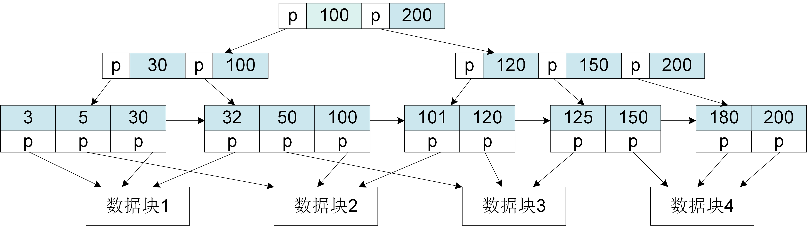
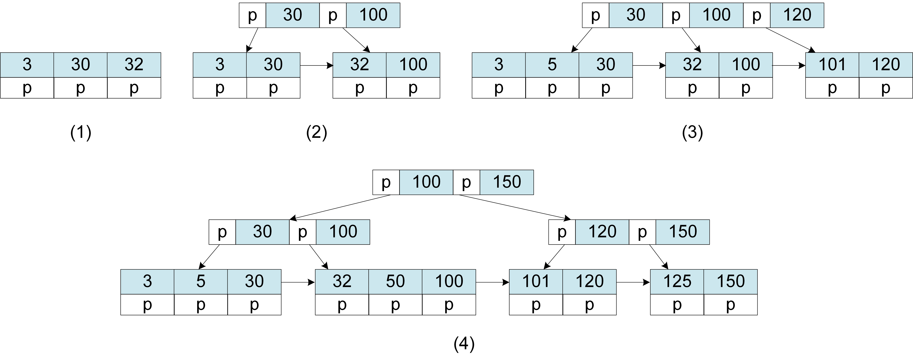
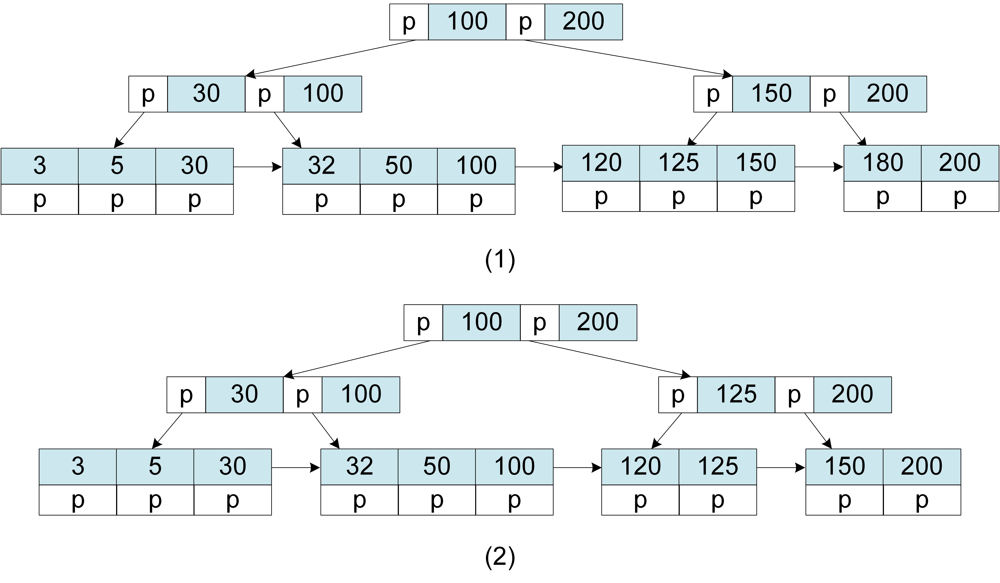

# 索引

上述的Inode结构是一种简单的数据组织方式。它实现了一个数据集的集中存储。但在其上对数据项进行查询、更新等操作则需要付出比较大的代价。要找到目标数据项，我们需要扫描整个数据集，将数据集的所有数据块从硬盘读入内存，依次浏览所有数据项，判断其是否符合要求。大量的硬盘访问会极大地增加数据访问的延时。如今是“数据爆炸”的时代，容量高达到TB、PB级别的数据集并不少见。在硬盘上扫描一个1TB大小的数据集至少会消耗数分钟的时间。而很多应用对数据访问延时的要求是毫秒级或秒级。为了实现高效的数据访问，数据管理系统需要采用索引结构来重新组织数据。

索引是一种将数据项的某个取值映射到它的存储地址的方法。简单而言，一个索引可以表示为如下的一个函数：

> *F*: *k* &rarr;*a*

其中，*k*表示数据项的某个属性，比如人的名字。在索引中，*k*被称为**键（key）**。而*a*表示数据项的存储地址，通常可以是用于存储数据项的数据页编号。当我们将编号提供给系统，系统可以立即定位相应的数据页，并将它读取到内存中，以便我们访问其中的数据项。索引*F*用极小的计算代价将一个数据项的属性取值直接映射到它存储地址（例如直接根据一个人的名字定位记载这个人信息的数据项），从而加速数据的查询以及随后的更新、删除等操作。

索引有很多的构造方式。其中最常见的是使用哈希结构和树结构。但没有一种索引是完美的，各类索引都有自身的适用范围和局限性。本节只要介绍一种最常用的树结构索引 - B+树。

## B+树索引结构 

B+树是对传统B树的一种改进，它们都属于一种平衡的多路查找树。相比于传统的平衡二叉树（例如红黑树），B树和B+树的结构更扁平、更稳定，能够让查询过程中的硬盘读取次数尽可能小，从而获得较高的数据查询性能。

<center>
	
	<br>
	<div display: inline-block; padding : 2px>
		图 2.7 B+树结构
	</div>
</center>


B+树的结构如图2.7所示。它是由根节点、中间节点和叶子节点组成的树型结构。其中最底层将所有数据项的键值（即数据项在键属性上的取值）做了全排序，并依次存储在一个一个叶子节点中。最上层的单个节点称为根节点。其余位于中部的节点称为中间节点。根节点和中间节点内部包含键值和指向下一层节点（孩子节点）的指针。叶子节点没有孩子节点，内部包含键值、键值所对应数据项的数据块地址和指向邻居叶子节点的指针。

通常，树结构索引的大小和数据本身的大小在同一个数量级，很难被内存容纳，因此同数据一样也被存储在硬盘上。系统对树结构索引的访问方式是按照某个事先不确定的次序读取其中的节点。如前所述，计算机对存储设备的访问通常是以“块”为单位的。如果每次只读取一个很小的节点，会导致对设备访问带宽的浪费。B+树选择使用大节点，即让一个节点占据一整个数据块或数据页，从而导致每个节点可以包含更多键值和孩子节点，也导致了B+树的扁平结构。这也是B+树在性能上优于二叉搜索树的原因。

一个m阶的B+树是指其每个节点最多可以拥有m个孩子节点。一个m阶的B+树具有如下的特性：

*  从根节点到叶子节点的所有路径都具有相同的高度；
*  节点中的键值同时存在于其孩子节点中，对应孩子节点的最大值或者最小值；
*  只有叶子节点包含所有键值和键值指向的数据块地址；
*  叶子节点的键值从左到右升序排列，相邻叶子节点之间通过指针连接；
*  根节点至少拥有2个孩子节点；
*  除根节点之外的节点至少拥有m/2个孩子节点和m/2个键值。

（当前并没有形成对B+树的统一定义。不同文献给出的定义会略有不同，以至于B+树在不同系统中的实现方式也有差异。即便有细微差异，所有B+树的基本工作方式仍然与本书的描述是一致的。） 

> <PersonID, PersonInfo>

假设有一个符合上述键值对模式的数据集。我们以*PersonID*为键构建了一棵高度为3的3阶B+树，如图2.7所示。那么，使用这棵B+树我们就可以根据*PersonID*的取值查找到任何一个人的个人信息（即*PersonInfo*的内容）。比如，我们想要查询*PersonID*为“101”的个人信息。系统首先将B+树的根节点从硬盘读入内存，并将“101”与根节点中的两个键值进行比较。由于“101”大于键值“100”小于键值“200”，说明查询结果位于根节点的右侧分支。之后，系统通过根节点的右侧指针将右侧的中间节点从硬盘读入内存，再将节点内部的键值与“101”进行比较，发现查询结果位于该节点的左侧分支。顺着左侧分支，系统将“101”所在的叶子节点从硬盘读入内存。最后，系统通过叶子节点找到*PersonID*为“101”的数据项所在的数据页，并最终读取了该数据项。上述查询过程涉及了4次硬盘访问操作。相比于扫描整个数据集，索引极大地提升了查询的性能。

此外，B+树也支持范围查询。如果要查询*PersonID*大于“101”的所有人的个人信息，系统按照同样的步骤从B+树的根节点向下遍历，找到“101”所在的叶子节点，然后通过叶子节点之间的指针向右遍历，即可找到大于“101”的所有键值所在的叶子节点，最后再通过叶子节点中的指针定位所有*PersonID*大于“101”的数据项。

## B+树插入与删除

B+树能够支持高效的数据查询，同时也支持高效的数据插入和删除操作。

```bson
  <PersonID=3, PersonInfo="name:Steven">
  <PersonID=30, PersonInfo="name:John">
  <PersonID=32, PersonInfo="name:Aimee">
  <PersonID=100, PersonInfo="name:Anna">
  <PersonID=5, PersonInfo="name:Rose">
  <PersonID=101, PersonInfo="name:Lily">
  <PersonID=120, PersonInfo="name:Ben">
  <PersonID=50, PersonInfo="name:Bert">
  <PersonID=125, PersonInfo="name:Bob">
  <PersonID=150, PersonInfo="name:Daniel">
  <PersonID=180, PersonInfo="name:David">
  <PersonID=200, PersonInfo="name:Jack">
```

<center>
	
	<br>
	<div display: inline-block; padding : 2px>
		图 2.8 B+树插入
	</div>
</center>

图2.8揭示了往一棵B+树不断插入新的数据项并将这棵B+树从无到有构建起来的过程。
假如我们如上所示的12个键值对，目的是以*PersonID*为键构建一棵3阶的B+树索引。3阶的B+树要求所有节点的键值个数最小为2，最大为3，而非叶子节点的孩子节点个数最小为2，最大为3。B+树采用的是自底向上的构建方法，它的构建过程如图2.8所示。

* **第一步**：首先初始化一个叶子节点并将键值“PersonID=3”和该键值对的数据页地址（此处用p来表示）插入其中，然后依次插入键值“PersonID=30”和“PersonID=32”及其地址。此时，该叶子节点也是根节点。
* **第二步**：当再插入“PersonID=100”时，叶子节点的键值个数超过最大值3。此时，首先新增一个叶子节点，其次重新调整各叶子节点中的键值使得"3"和"30"在左叶子节点，"32"和"100"在右叶子节点，之后将两个叶子节点用指针连接起来。然后，新增一个上层节点，将两个叶子节点的最大键值30和100插入该节点中，并添加指向叶子节点的指针。该节点成为新的根节点。
* **第三步**：依次插入“PersonID=5”、“PersonID=101”和"PersonID=120"时，首先通过B+树查询这些键值所属的叶子节点，然后将它们和相应的数据地址插入到正确的 叶子节点。由于"5"大于键值"3"小于键值"30"，所以"PersonID=5"属于左叶子节点并被插入"3"和"30"之间。同理，"PersonID=101"和"PersonID=120"属于右叶子节点并被插入"100"的右侧。当插入"PersonID=120"时，右叶子节点键值个数为4，此时按照第二步的方法增加一个新的叶子节点。新叶子节点和原来的叶子节点平均分配4个键值。然后，在根节点中增加键值"120"，并让其指向新的叶子节点。
* **第四步**：当插入"PersonID=50"、“PersonID=125”和"PersonID=150"时，采用类似上述的方式将"50"插入"32"和"100"之间，"125"和"150"插入"120"右侧。当插入"PersonID=150"时，又需要新增一个叶子节点，并重新均衡叶子节点之间的键值数量，然后再在根节点中增加新的键值"150"。此时，根节点中的键值个数变成了4，不再满足3阶的B+树对最大键值数的要求。因此，需要将其拆分成两个中间节点，将"30"和"100"作为左边节点的索引键值，"120"和"150"作为右边节点的索引键值。然后，在更上一层重新创建一个根节点，将两个中间节点中的最大值"100"和"150"插入根节点中作为索引键值。
* **第五步**：最后按查询方式插入"PersonID=180"和"PersonID=200"，最终生成如图2.7所示的B+树。

通过以上示例我们看到，B+树的增长过程是一个不断分裂和长高的过程。当某个叶子节点不能容纳新的键值时，会分裂成两个叶子节点，分裂导致其上层中间节点的键值个数增长。当中间节点不能容纳新的的键值时，也会分裂，导致更上层键值个数增长。以此类推，直到根节点内部的键值个数增长到其上限。此时，根节点发生分裂，树的高度因此就增长了一个单位。

以上的3阶的B+树只是示例。实际B+树的阶数远超过3。在常见的数据管理系统中，B+树的节点大小通常由一个4~8KB的数据页构成，足以容纳数百个键值。因此，B+树在使用过程中出现节点分裂的情况并不频繁。大节点（或较高的阶数）在一定程度上也确保了B+树的性能不太受节点分裂代价的影响。

当数据被删除时，B+树的结构也会发生改变。假如我们要删除"PersonID=101"、“PersonID=180”这两个数据项，B+树的变化过程如图2.9所示。

<center>
	
	<br>
	<div display: inline-block; padding : 2px>
		图 2.9 B+树删除
	</div>
</center>


* **第一步** : 删除"PersonID=101"，首先通过B+树查询"101"所在的叶子节点，然后从该叶子节点中删除"101"键值和其对应的数据项地址。由于删除"101"之后该叶子节点只包含1个键值，不满足3阶B+树每个节点的的键值数下界，因此需要将该叶子节点与旁边叶子节点进行合并。与右侧叶子节点合并之后，其上层中间节点的孩子节点减少了一个。因此，将该中间节点的键值也减少一个，调整为"150"和"200"。
* **第二步**: 删除"PersonID=180"，首先找到"180"所在的叶子节点并从中删除键值"180"和相应地址，然后将该叶子节点与左侧叶子节点进行合并。合并后的节点键值个数为4（超过最大值3），则需将该节点再均匀拆分成两个叶子节点。结果，一个叶子节点包含键值"120"和"125"，另一个包含键值"150"和"200"。最后更新上层中间节点的键值，将其调整为"125"和"200"。

由此可见，数据的删除会让B+树缩小。当叶子节点的键值数量过小时，需要跟傍边的叶子节点合并，合并会导致其上层中间节点的键值个数减少。当中间节点键值数量过小时，也会和旁边的中间节点合并，导致更上层节点键值个数减少。以此类推，最好导致根节点的键值个数减少。B+树不对根节点的键值个数设下限。但当根节点的键值个数减少到1时，它就只剩下唯一一个孩子节点。这个孩子节点就接替成为新的根节点，树的高度因此就减少了一个单位。

以上是B+树的键值插入和键值删除的操作过程。对于键值的更新，可以通过一次插入操作和一次删除操作实现。因此，B+树通常不提供额外的更新操作。

## B+树的性能

B+树是一种平衡树。如果读者了解平衡二叉树（例如红黑树），自然可以理解B+树是具备某种平衡特性的。但即便没有平衡树的概念，我们也可以根据上述对B+树的定义直接推导出B+树的性能特性。

首先，由2.1节的内容可见，CPU访问硬盘的速度是远低于CPU的计算速度的。由于B+树整体被存放在硬盘上，所以B+树的查询性能主要取决于查询过程中的硬盘访问代价。B+树的查询过程需要访问它的一条分支上的所有节点，从顶层的根节点到底层的某个叶子节点。每访问一个节点，B+树会将用于存储该节点内容的数据页从硬盘读入内存。因此，分支上的节点数目就是查询过程访问硬盘的次数。由于B+树的所有叶子节点都位于同一层次，所以每一条分支上的节点数目是相同的。一条分支上的节点数目也被称为B+树的树高。因此，一棵B+树的查询性能主要取决于它的树高。

B+树的性质决定了它的树高可以得到有效控制，从而让B+树的性能得到保证。前文提到，对于一棵$m$阶B+树，除根节点之外的所有节点都至少拥有$m/2$个孩子节点和$m/2$个键值。因此，对于一棵树高为$h$的$m$阶B+树，它的叶子节点（即第$h$层的节点）里至少拥有 $ 2\times(m/2)^{h-1} $个键值。其中$2$代表根节点包含的最少键值数目，$m/2$代表其余节点包含的最少键值数目。相反，如果我要在$n$个数据项（即$n$个键值）上构建一棵B+树，其树高至多为$log{m/2}(n/2)+1$。这确保了**B+树的树高只有被索引数据量的对数级大小**。也就是说，对于再多的数据，B+树的树高都只是一个较小的值。B+树的查询性能因而就得到了保证。

B+树的插入和删除操作通常比查询操作代价更大，主要源于其可能引起的节点分裂和节点合并步骤。然而，一方面节点分裂和合并的情况并不会频繁发生，另一方面每个操作引发的节点分裂和合并次数也不会超过树高的值。因此，插入和删除操作的代价也不会超过索引数据量的对数级。

## 聚簇索引和辅助索引

前面提到的Inode结构可以作为数据集的存储结构，但它无法提供高效的数据查询。但是，我们可以用B+树这样的索引结构作为数据集的存储结构。它不但能够将整个数据集组织在一起，还能提供高效的数据查询。大部分的数据管理系统实际都用索引结构来实现数据集的组织和存储，而并非文件系统使用的Inode结构。

当用索引被作为存储结构时，数据集里的数据项通常是按照索引的键值进行排序的。排序后的数据项再被依次存放到一个个数据页中，如图2.10所示。此时的索引称为数据集的主索引，也称为聚簇索引。

<center>
	
	<br>
	<div display: inline-block; padding : 2px>
		图 2.10 聚簇索引的形态
	</div>
</center>

图2.10展示了一个聚簇B+树索引。可以看到，它的叶子节点中的键值顺序和数据页中的数据项顺序是一致的。有的数据管理系统甚至将数据页直接作为聚簇B+树索引的叶子节点。当进行范围查询的时候，我们利用聚簇B+树索，可以只访问查询的键值范围所在的数据页，从而获得较高的查询性能。

一个数据集只能拥有一个聚簇索引，因为其数据项只能按照一种方式排序。但一个聚簇索引并不能满足所有的查询需求。例如，对上述例子中的个人信息数据集，我们需要通过*PersonID*查询个人信息，有时也需要通过*PersonInfo*中的姓名（*name*）去查询个人信息。如果我们只在*PersonID*上构造一个聚簇索引，后者就难以被满足。为此，我们可以在*PersonInfo*中的姓名属性上再构造一个索引，如图2.11所示。这样的索引称为辅助索引。

<center>
	
	<br>
	<div display: inline-block; padding : 2px>
		图 2.11 辅助索引的形态
	</div>
</center>

在图2.11展示的辅助索引中，叶子节点中的键值顺序和数据页中的数据项顺序是不一致的。当进行范围查询时，我们可以通过聚簇B+树索找到所有符合要求的键值。但这些键值后面的指针以无序地指向了大量数据页。这些数据页都需要被读取才能找到所有符合要求的数据项。因此，相比聚簇树索，辅助索引的查询性能更低下。但无论如何，它仍然可以起到加速查询的作用。

本节以B+树为例介绍了索引这种存储结构。索引是数据存储的核心技术，被广泛应用在各种数据管理系统中。B+树是最常用的索引之一。对部分其他的常见索引，本书会在其他的章节再做介绍。
