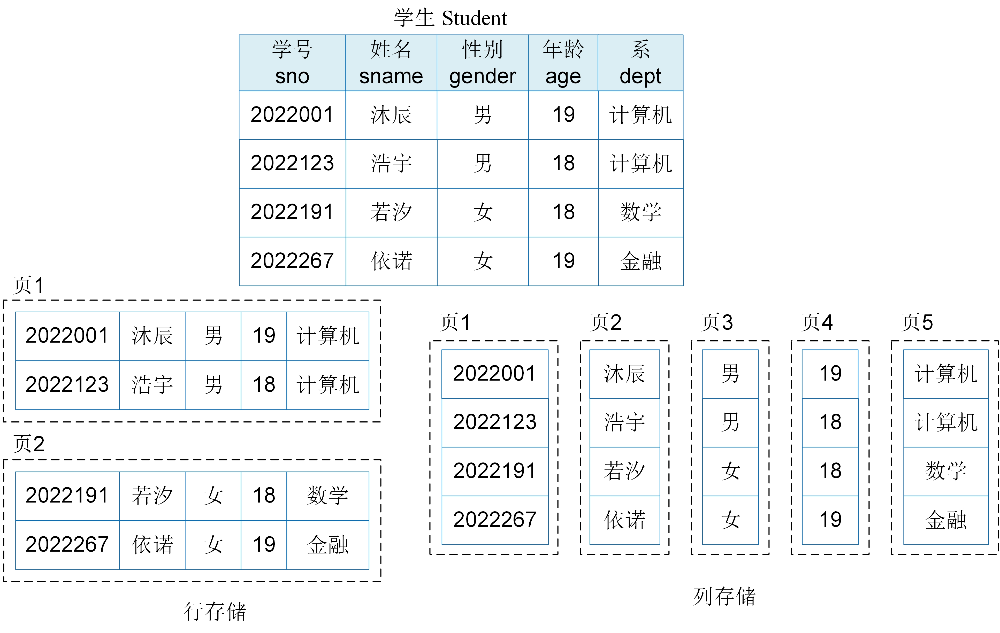

# 关系数据库存储与索引
从前面的内容，我们指导数据的存储结构和索引对数据管理系统的性能至关重要。本节将介绍关系数据系统的存储结构以及索引。

## 存储结构

关系数据库系统使用分页存储的方式组织数据，也就是说硬盘存储空间被划分成多个固定大小的页，数据以关系模型的结构存入数据页中。页是数据的最小存取单元，大小一般为8KB~64KB。

在关系数据库中，数据存储的方式包括行存储和列存储。图2.12中展示了学生表的行存储和列存储方式。

* 行存储：数据按行存储在页中，即以表中的一行数据为存储单元进行连续存储。每一行数据表示关系中的一个元组（表中的一条记录），包含该元组（记录）的所有属性；
* 列存储：数据按列存储在页中，即以表中的一列数据为存储单元进行连续存储。一列数据表示关系中某一个属性的所有值，每一列的属性值存储在一起，不同列的属性值分开存储。

<center>
	
	<br>
	<div display: inline-block; padding : 2px>
		图 2.12 关系数据库的行存储和列存储结构
	</div>
</center>


行存储和列存储有各自的优缺点。在数据插入时，行存储的写入是一次性完成的，而列存储需要将一行记录拆分成多列进行写入，列存储的写入次数明显高于行存储，写入性能比行存储差。在数据更新和删除时，列存储也比行存储的更复杂。在数据读取时，行存储通常会读取一行的所有数据，如果只需要读取某几列数据时就会产生冗余数据，而列存储就不会存在冗余问题，所以列存储的读取性能高于行存储。另外，列存储更有利于对数据进行压缩，比行存储更能节省空间。因此，行存储常用于需要频繁进行数据更新和插入的事务型应用，而列存储适用于大规模分析型应用，如对某列数据进行聚合计算。

列存储的另一个特点是每一列数据单独存放，数据就相当于索引，因此基于列存储的关系数据库系统使用Inode结构来组织数据表。而基于行存储的数据库系统使用聚簇B+树索引结构替代Inode结构来组织数据表。默认情况下，关系数据库系统会为每个关系（表）在主码属性上创建聚簇B+树索引，也称为主键索引。在基于主键索引的数据表组织方式中，表中的记录按照主码属性值进行排序，排序后的记录依次被存放在一个个数据页中，数据页中的记录顺序与B+树索引的叶子节点的键值顺序一致。


## 关系数据库索引

关系数据库的主键索引实现的是从记录的主键属性值到记录所在数据页地址的映射，它只能实现基于主键属性值的高效查询，无法支持其他属性值上的高性能查询。如例2.1，查询姓名为“依诺”的学生信息，关系数据库系统必须扫描学生表中的每个记录才能返回查询结果。

```SQL
[例2.1] 查询姓名为'依诺'的学生信息
SELECT * 
FROM Student
WHERE Sname = '依诺'; 
```

为了尽可能地满足更多需求的高效查询，关系数据库系统允许在其他属性值上构建基于B+树结构的辅助索引，实现通过其他属性值快速定位记录所在的数据页，避免全表扫描。

关系数据库系统支持的辅助索引包括单键索引、复合索引。
* 单键索引是指在单个属性上创建索引，如果索引字段上的值在文档集中是唯一的，则称为唯一索引；
* 复合索引是指在多个属性上创建索引，基于复合索引的查询遵循”最左前缀索引“原则；

##  索引的定义与删除

关系数据库管理系统提供了索引功能来加快数据的查询。用户可以根据应用需求在基本表上建立一个或者多个索引。

（1） 建立索引

SQL语言使用CREATE INDEX语句来创建索引，其基本格式如下：

```SQL
CREATE [UNIQUE] [CLUSTER] INDEX <索引名> 
ON <表名> ( <列名> [ASC | DESC] 
		  [, <列名> [ASC | DESC]] ....)；
```

索引可以建立在表的一列或者多列上，各列名之间用逗号隔开。创建索引时，还可以指定每个列索引值的排列次序，ASC表示升序排列，DESC表示降序排列，默认情况下为ASC。关键字UNIQUE表示建立的索引为唯一索引，即索引的每一个索引值只对应唯一的元组。CLUSTER表示建立的索引为聚簇索引。通常，一个基本表只能拥有一个主键聚簇索引。创建的索引定义会被写入数据字典中。

下例给出了在学生表上创建索引的定义：

```SQL
[例2.2] 在学生表上按姓名升序创建索引。
CREATE INDEX Stusname ON Student(sname); 
[例2.3] 在学生表上按姓名升序和系降序创建索引。
CREATE INDEX Stuna ON Student(sname ASC, dept DESC); 
```

（2）修改索引

对已经建立的索引，SQL语言使用ALTER INDEX语句来进行修改，其基本格式如下：

```SQL
ALTER INDEX <旧索引名>  RENAME TO <新索引名>；
```

 ```SQL
[例2.4] 在学生表的Stuname索引名改为StuN。
ALTER INDEX Stuname RENAME TO StuN;
 ```

（3）删除索引

SQL语言使用DROP INDEX来删除不必要的索引，其基本格式如下：

```SQL
DROP INDEX <索引名> ；
```

```SQL
[例2.5] 删除学生表的Stuna索引。
DROP INDEX  Stuna;
```
删除索引时，关系数据库管理系统会同时将索引的定义从数据字典中删除。

[**上一页<<**](chapter2.3.md) | [**>>下一页**](chapter2.5-D.md)


