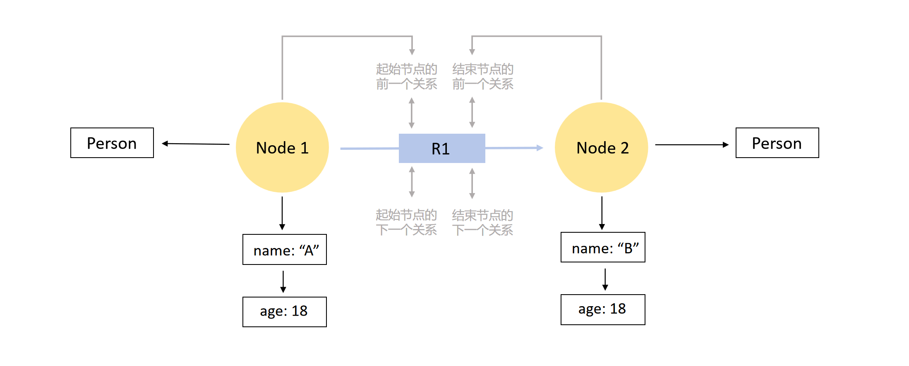

## 2.6 图数据库的存储与索引

接下来，本节以Neo4j为例，介绍图数据库系统的存储结构及其索引的构建与使用。

### 2.6.1  图存储结构

图数据库采用前文中介绍的分页存储组织数据，也就是说硬盘存储空间被划分为多个固定大小的页，节点、关系、标签和属性等分别被写入不同的数据页中。Neo4j将图数据存储在若干个不同的存储文件中，每个存储文件包含图的特定部分的数据，例如，节点、关系、标签和属性等都有各自独立的存储，每个存储文件包含一定数量的页。这种存储机制是一种专门为图数据存储和查询而设计的存储机制——原生图存储（Native Graph Storage）。

与传统数据库不同，原生图存储直接针对图数据的特性进行了底层优化，完全围绕图的概念来构建。它通过对存储职责的划分——特别是图结构与属性数据的分离——能够显著提升图查询和遍历的效率，这也意味着，用户视图中的图和磁盘上的实际数据记录是完全不同的结构。在Neo4j中，磁盘上分了众多的存储文件，包含点、关系、属性、元数据、标签、关系类型和schema等存储文件。在这里，我们仅简单地了解下节点存储文件、关系存储文件和属性存储文件。

在Neo4j中，节点、关系和属性等图的组成元素都是基于Neo4j内部维护的ID进行访问的，这三种存储文件都使用固定大小的记录进行定长存储，当我们知道了某节点/关系/属性的ID，就能根据ID计算出该记录在对应文件中的偏移位置，直接进行访问。

#### （1）节点存储文件

节点存储文件和关系存储文件只关注图的结构而非属性数据。节点存储文件用来存储节点的记录，它包含一定数量的页，节点被存储在页中，即以图中的一个节点为存储单元进行连续存储。节点结构是固定大小的记录存储，每个记录长度为15个字节，通过大小固定的记录可以快速查询存储文件中的节点。例如，如果我们需要查找一个ID为100的节点，则可以根据ID迅速计算出它记录在文件开始的第1500个字节。基于这种格式，数据库可以以$O(1)$的成本直接计算出一个记录的位置，而不是执行成本为$O(\log n)$的搜索。

节点存储文件中的每条节点记录包含关联到这个节点的第一个关系的ID、指向该节点的第一个属性的指针以及指向该节点的标签存储的指针，如果标签很少的话也可以内联到节点中。由此可知，节点记录是相当轻量级的，因为它只是几个指向关系和属性列表的指针。

当然，节点记录中还有标志位和标志保留位等其他信息，但为了简单起见，更多的关注到图结构本身的存储方式，我们这里只了解节点记录中的部分主要信息，在后续的关系记录和属性记录中也是同理。

####  （2）关系存储文件

相应地，关系被存储于关系存储文件中。像节点存储一样，关系结构记录的大小也是固定的，以便存储文件内任何记录的位置都可以根据ID迅速计算出来。

相比于点结构，边的结构要复杂很多。关系存储文件中每个关系记录主要包含关系的起始节点ID和结束节点ID、关系类型的指针（存储在关系类型存储文件中），以及起始节点的上下关系和结束节点的上下关系，即维护了一个双向链表。接下来，我们将通过一个简单的例子来理解关系存储中的双向链表。

如下2-6-1所示，图中包含两个标签为Person的点：Node 1和Node 2，他们均包含两个属性：`name`和`age`。两个节点记录都包含一个指向该节点的第一个属性的指针和关系链中第一个关系的指针，其中Node 1和Node 2关联的第一个关系分别用“起始节点的前一个关系”和“结束节点的前一个关系”来表示。要读取某节点的属性，我们从指向该节点第一个属性的指针开始遍历单向链表结构。要找到一个节点的关系，我们从指向该节点第一个关系的节点关系指针开始，顺着特定节点的关系的双向链表寻找，直到找到感兴趣的关系。

<center>
	
	<br>
	<div display: inline-block; padding : 2px>
		图 2-6-1 图在Neo4j中物理存储的方式
	</div>
</center>

我们如何通过双向链表来寻找感兴趣的关系呢？通过前面的知识我们已经了解到，在Neo4j中任意的关系都有一个起始节点和一个结束节点，而且起始节点和结束节点都会有个关联的双向链表，其实这个双向链表就记录了从该节点出去和进入的所有关系。以上图中的关系R1为例，R1的起始节点和结束节点分别是Node 1和Node 2，起始节点Node 1的上下关系通过中间左侧那条灰色双向链表连接。由图可知，Node 1的第一个关系是“起始节点的前一个关系”，所以R1中起始节点的上一关系指向了该灰色字体；Node 1的下一关系是“起始节点的下一个关系”，所以R1中起始节点的下一关系指向了另一灰色字体。通过R1中起始节点Node 1的上下关系之间的双向链表，我们可以以任一方向来遍历Node 1的所有关系。同理，R1的结束节点Node 2的上下关系则通过中间右侧那条灰色双向链表连接。

关系存储比节点存储要复杂，把关系记录想象成“属于”两个节点，即其起始节点和结束节点，有助于我们理解关系存储结构。而两个双向链表间的指针（又称为记录ID）：其中一个是从起始节点可见的列表，另一个是从结束节点可见的列表，每一个列表都是双向链表，使得我们可以通过列表在任一方向进行快速迭代，并进行高效的插入和删除关系的操作。一旦找到了我们想要的关系记录，我们就可以使用和寻找节点属性一样的单向链表结构来读取关系属性（如果有的话），也可以使用关系关联的起始节点ID和结束节点ID来检查它们的节点记录。用这些ID乘节点记录的大小，就可以立即计算出每个节点在节点存储文件中的偏移量。

通过固定大小的记录和类指针记录ID，在数据结构周围跟随着指针就可以简单地实现遍历并高速执行。要遍历一个节点到另一个节点间特定的联系，数据库只需执行几个低成本的ID计算，这些计算比搜索全局索引成本低很多。

####  （3）属性存储文件

除了包含图结构的节点和关系存储之外，我们还有属性存储文件，它用键值对的方式持久化了用户的数据。Neo4j允许将属性，即名称-值对，附加到节点和关系上，因此，属性存储也同时被节点和关系记录引用。

与节点存储和关系存储一样，属性记录也是固定大小的。属性存储文件中的每条属性记录包含4个属性块和属性链中的下一个属性的ID（请注意，属性持有的链表是单向的，而关系链中是双向的），因此一个属性记录最多可以容纳4个属性。但跟节点和边不同的是，属性的长度本身是不固定的，一个属性结构不一定能完全容纳的下，因此还有可能外链到动态存储块上，此处我们不展开介绍。

### 2.6.2  图数据库索引
Neo4j的索引可以分为两类：搜索性能索引和语义索引。
- 搜索性能索引（Search-performance indexes）：包括范围索引（range）、文本索引（text）、点索引（point）和令牌查找索引（lookup），用于加速基于确切匹配的数据检索。
- 语义索引（Semantic indexes）：包括全文索引（fulltext）和矢量索引（vector），用于近似匹配和计算查询字符串与匹配数据之间的相似度分数。

其中，范围索引、文本索引、点索引和全文索引（下文中，我们将简称为属性索引）实现了从一个属性值到一个实体ID（节点或关系）的映射。当我们根据某个索引标记的属性查找实体时，数据库会在索引中找到对应的ID，然后通过ID再去相应的存储文件中找到该实体所在数据页的地址。这种间接映射让数据存储位置的变化不会影响索引结构。例如，如果数据页调整或数据被重新分配到新的位置，索引仍然有效，因为实体ID保持不变。但是，相比关系数据库和文档数据库，这种索引查找过程会多一步，需要先通过ID找到具体存储位置。

令牌查找索引则不同，它建立的映射关系不是基于属性值，而是基于标签到节点的映射或关系类型到关系的映射。令牌查找索引是默认存在的（一个节点标签查找索引和一个关系类型查找索引），无需手动创建，是Neo4j中最重要的索引，因为它们显著加快了其他索引的填充速度和Cypher查询的性能。

相比于关系数据库和文档数据库，Neo4j提供了多种类型的索引，但大多为非聚簇索引，即索引项与数据项分离，索引只记录属性/标签/关系类型到节点/关系 ID 的映射，而不会改变数据的物理存储顺序。节点和关系是通过图的连接性直接存储，数据的物理存储不依赖于特定属性的排序，数据的访问效率主要依赖于其图结构和索引类型的优化。

### 2.6.3 索引的定义与删除

图数据库系统对外提供了命令允许用户创建索引。图数据库系统Neo4j的索引创建命令为`CREATE ... INDEX ...`，第一个参数指定了索引创建类型，缺省情况下是范围索引，第二个参数是用户指定的索引名称。用户可以根据应用需求创建不同的索引。

#### （1）建立索引


我们可以使用`CREATE INDEX`来创建范围索引，例如，为标记为`ENROLLS`的关系的`Grade`属性创建一个范围索引：
```cypher
CREATE INDEX rel_range_index_Grade FOR ()-[r:ENROLLS]-() ON (r.Grade)
```

同样，也可以在多个属性上创建复合索引。例如，为标记为`Student`的节点的`Sno`和`Dept`属性创建复合范围索引：
```cypher
CREATE INDEX composite_range_node_index FOR (n:Student) ON (n.Sno, n.Dept)
```

#### （2）显示索引

如果要列出所有索引，可以执行以下命令：

```SQL
SHOW INDEXES
```

如果要返回可用索引的特定列，可以使用`YIELD`子句。例如，以下语句将返回索引的名称、索引的类型和索引适用于哪些标签和类型：

```SQL
SHOW INDEXES YIELD name, type, labelsOrTypes;

```

同样，也可以通过多种方式对显示的索引进行过滤，例如，`SHOW RANGE INDEXES`将只显示范围索引。另一种更灵活的过滤方式则是使用`WHERE`子句，例如，以下命令将只过滤出与`Student`标签相关的范围索引

```SQL
SHOW RANGE INDEXES WHERE labelsOrTypes CONTAINS 'Student';
```

#### （3）删除索引

在Neo4j的Cypher中，索引一旦创建后就不能修改，只能先删除现有索引，然后再创建一个新的索引。Cypher使用`DROP INDEX`命令删除索引，其基本格式如下：

```SQL
DROP INDEX index_name [IF EXISTS]
```

例如，删除上面创建的复合索引`composite_range_node_index`：
```cypher
DROP INDEX composite_range_node_index
```

### 练习题

**1.** 假设你正在设计一个社交网络图数据库，它包含`User`类节点和`FOLLOWS`类关系，其中`User`节点包含`name`属性和 `city`属性。现在有以下场景：

- 场景A：需要频繁查询某个城市的所有用户。
- 场景B：需要频繁查询某个用户关注的所有用户。
- 场景C：需要频繁查询两个用户之间是否存在关注关系。

请结合Neo4j的存储结构（节点存储文件、关系存储文件、属性存储文件），分析以下问题：

 <ol type="A">
 <li>针对场景A，如果没有任何索引，查询效率如何？如果为 User 节点的 city 属性创建范围索引，查询效率会有什么提升？为什么？其查询过程是什么样的？</li>
 <li>针对场景B，Neo4j如何利用关系存储文件中的双向链表来加速查询？请详细描述查询过程。</li>
 <li>针对场景C，如果没有索引，Neo4j需要如何判断两个用户之间是否存在关注关系？如果为 FOLLOWS 关系创建索引，能否提升查询效率？为什么？</li>
 <li>如果需要同时满足场景A和场景B的查询需求，你认为应该如何设计索引？请给出具体方案，并说明理由。</li>
 </ol>

**2.** 现在有一个电影知识图谱，节点包括`Movie` (属性: `title`, `year`) 和 `Person` (属性: `name`)，关系包括 `ACTED_IN` 和 `DIRECTED`。现有以下Cypher查询语句：

```cypher
MATCH (p:Person)-[:ACTED_IN]->(m:Movie)
WHERE m.year > 2000 AND p.name STARTS WITH "Tom"
RETURN p.name, m.title
```

请分析以下问题：

 <ol type="A">
 <li>如果没有索引，该查询语句的执行计划大致是什么样的？查询效率如何？</li>
 <li>为了优化该查询语句，你认为应该创建哪些索引？请给出具体的 CREATE INDEX 语句。</li>
 <li>创建索引后，该查询语句的执行计划会有什么变化？查询效率会有什么提升？</li>
 <li>如果将查询语句修改为以下形式，你认为之前的索引是否仍然有效？如果无效，应该如何调整索引？</li>
 </ol>

```cypher
MATCH (p:Person)-[:ACTED_IN]->(m:Movie)
WHERE p.name STARTS WITH "Tom" AND m.year > 2000
RETURN p.name, m.title
```

[**上一页<<**](chapter2.5-D.md) | [**>>下一页**](chapter3.1.md)


