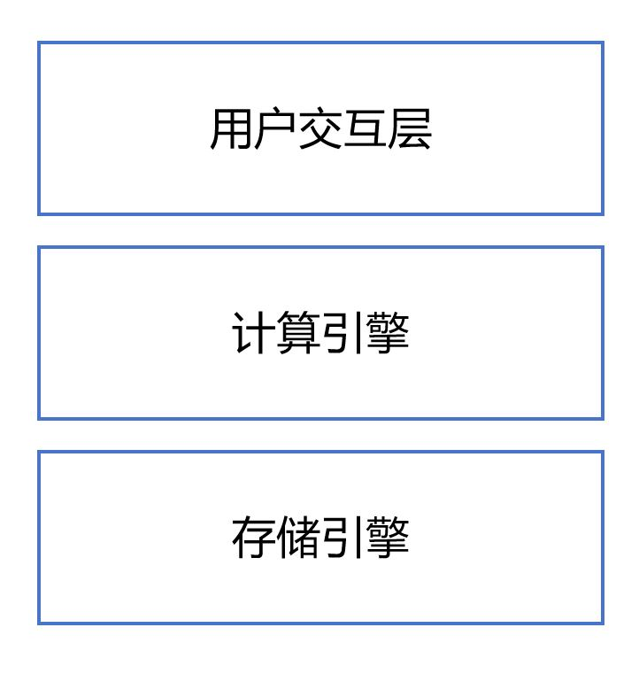
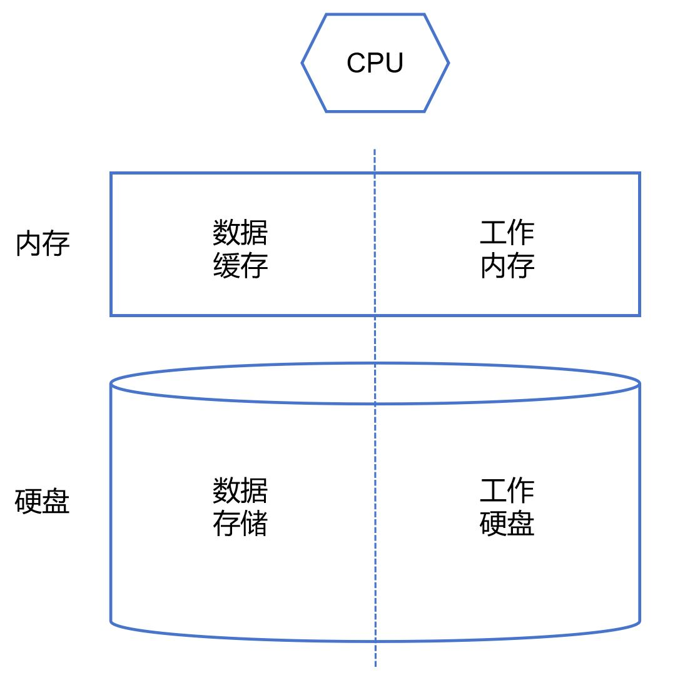
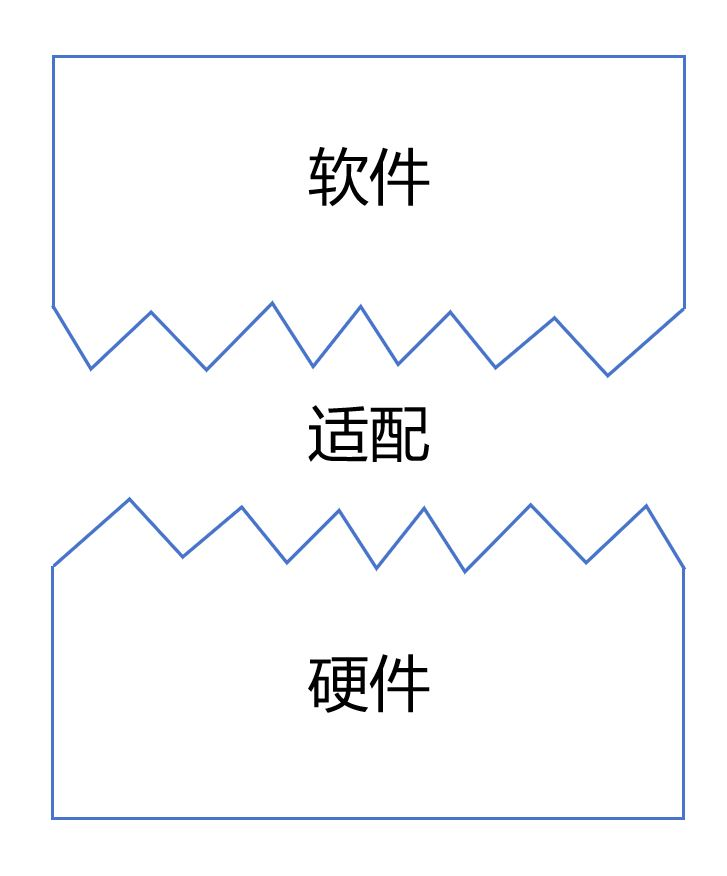
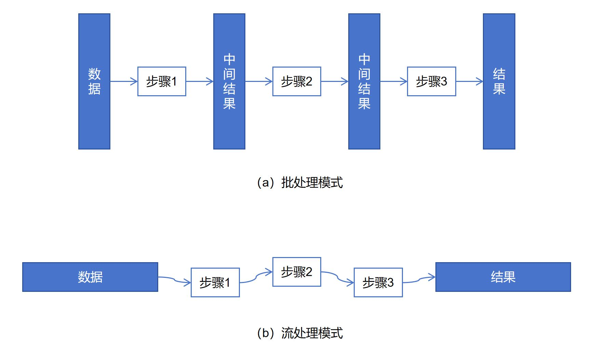
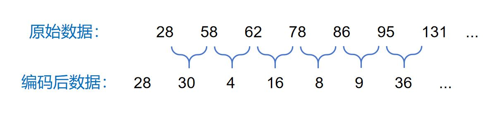
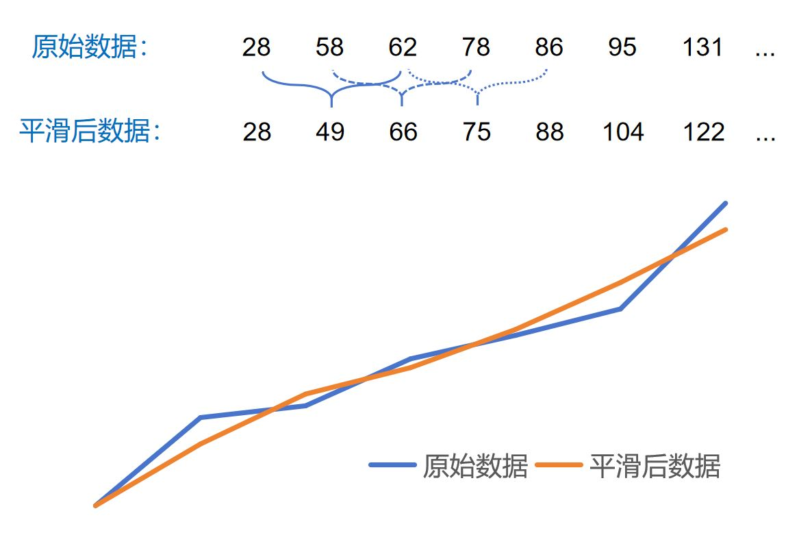

# 数据的计算

在1.5节中，我们提到，数据管理系统通常会提供一套数据访问语言，供用户表达数据访问需求。不同数据访问语言的表达能力各不相同，能满足的数据访问需求也不同，因此适用于不同的应用场景。但总的来说，数据访问并非简单的数据存取，还需要在数据上进行一定的计算，以获得比原始数据更进一步的信息。

第2章介绍了数据管理系统是如何组织和存储数据的。但即便使用索引的存储结构，系统也只能提供简单的数据存取功能。要应对更广泛的数据访问需求，数据管理系统还需要提供一定的计算能力。

<center>
	
	<br>
	<div display: inline-block; padding : 2px>
		图 3.1 数据管理系统的基本软件架构
	</div>
</center>
图3.1给出了一套数据管理系统的基本软件架构。大部分当代的数据管理系统都遵循这个架构。一个数据管理系统通常可以分为三个层次。最下层是存储引擎，提供数据的基本存取功能。其上是计算引擎，负责数据的处理和计算。最上层负责与应用和用户的交互。基于该架构，数据访问的过程大致如下：用户首先将由数据访问语言表达的数据访问请求发送给交互层；交互层解析用户的请求，构建出一套数据访问和计算的流程，将其发送给计算引擎；计算引擎负责执行该流程，一方面访问底层的存储引擎，完成数据的存取，另一方面在数据上实施计算，最终完成用户下达的任务；最后结果再通过交互层返回给用户。

上一章介绍了数据存储的基础知识。本章介绍数据计算的基本架构和模式。

## 数据管理系统的计算体系结构

图3.2简要地展示了数据管理系统的计算体系结构。数据存放在硬盘中的存储结构中。内存中通常会部署一个数据缓存，用于暂存热点数据，以提高数据访问的性能。硬盘的存储结构和缓存都由存储引擎管理，用于提供基本的数据存取功能。当接收到数据访问请求后，系统通过存储引擎将需要的数据取出，然后在计算引擎中开展计算。在计算过程中，这些数据需要被暂存在某个地方。计算还会产生中间结果。在最后结果被计算出之前，这些中间结果也需要被暂时存放。通常情况下，我们将计算过程中的数据放置在内存中，便于快速访问它们。这样的内存被称为工作内存。但内存往往是有限的。当中间数据的体量过大时，我们不得不将其暂存到硬盘中。因此，我们还需要一定的硬盘空间，可称为工作硬盘，以协助完成计算工作。

<center>
	
	<br>
	<div display: inline-block; padding : 2px>
		图 3.2 计算体系结构
	</div>
</center>
某些数据管理系统并不是针对数据分析应用设计的，比如键值数据库、文档数据库等，其数据访问过程涉及的计算通常比较简单，因此不需要提供太强的计算功能。这一类数据管理系统，往往不会配备强大的计算引擎，其性能主要由数据存取的效率决定。还有的数据管理系统，比如关系数据库，需要承载较复杂的数据分析和数据处理功能，会用到复杂的数据计算。此类数据管理系统的性能受计算效率的影响很大，其计算引擎就需要精巧的设计与实现。

## 数据计算性能

软件的运行效率不仅仅取决于软件本身的代码实现是否高效（例如算法的计算复杂度是否达到了最优），还取决于这些代码实现是否能够高效利用现代硬件的特点。应用程序对数据管理系统这样的基础软件提出了很高要求，希望它们能够高度适配底层硬件，从而充分发挥硬件的性能。应用软件与硬件的适配通常是交给代码编译器去自动实现的，不要求软件开发者深入了解硬件的特点。但对数据管理系统而言，编译器提供的适配能力是不够的。数据管理系统的开发人员需要充分理解底层硬件的运行机制，并针对性地设计系统内部的数据计算方法，才能构建出高性能的系统。这些针对性的计算方法设计是当代数据管理系统的核心技术之一。

<center>
	
	<br>
	<div display: inline-block; padding : 2px>
		图 3.3 软硬件的适配程度是获得高性能的关键
	</div>
</center>

在图3.2概括的计算体系结构中，数据计算的性能主要受两方面影响。一方面是访存性能。另一方面是CPU的计算性能。参与计算的数据可能在内存中，也可能在硬盘上。如果数据在硬盘上，硬盘访问将成为数据计算的主要性能瓶颈。如果数据仅在内存中，由于内存访问的速度远低于CPU的指令执行速度，访存过程仍然可能成为数据计算的性能瓶颈。为了获得良好的计算性能，需要让计算过程具备较高的数据访问局部性（参见2.1节）。这对数据管理系统计算引擎的设计提出了极高要求。

如果数据访问的局部性得到了保障，CPU的计算性能就成为了整体性能的主要因素。为了实现高效计算，CPU内部有很多特殊机制，例如流水线机制、向量计算加速机制（SIMD）、超线程机制等。能否有效利用这些机制是获取更高计算性能的关键。这对计算引擎设计的精巧性提出了更高要求。

对于不同的数据管理系统而言，由于其使用的数据模型和数据访问语言有较大差异，它们需要的计算功能和使用的计算方式都是不一样的。因此，本章不具体讲述数据管理系统的具体算法设计，而只讨论一些计算引擎的笼统设计原则。

## 批处理和流处理

在数据上实施计算的过程往往由若干步骤组成。这些步骤的执行方式大致可以分为两类：批处理模式和流处理模式。它们之间的区别在图3.4中得到了展示。批处理模式按照计算的步骤分阶段对数据进行处理。每个阶段实施一个计算步骤，在全量数据上完成该步骤的计算任务后，再将结果整体发送给下一个阶段。执行完最后一个阶段，才能得到最终的数据处理结果。流处理模式则是将各个计算步骤串联成一条流水线。数据项逐个流入流水线。每个步骤完成一个数据项的处理即将其传递给下一个步骤。流水线一边处理数据一边返回结果。

<center>
	
	<br>
	<div display: inline-block; padding : 2px>
		图 3.4 批处理模式和流处理模式的差异
	</div>
</center>

下面的例子进一步展示了批处理模式和流处理模式的计算过程的差异。如图3.5所示，间隙编码（Gap Encoding）是一种常用的编码方式。对于一个由数字组成的有序序列，间隙编码不直接记录原始的数字，而是记录相邻数字之间的差距。例如，图中的第2和第3个数字（58和62）对应的间隙编码是30和4，分别是原始数字与自己上一位数字的差。这种编码方式不会丢失信息，可以通过对间隙编码进行累加获得完整的原始数据。这种编码方式的好处是可以大幅缩小数字的取值范围，从而起到很好的压缩效果。

<center>
	
	<br>
	<div display: inline-block; padding : 2px>
		图 3.5 间隙编码示例
	</div>
</center>

图3.6展示了一种数据的平滑处理方法。对于一个由数字组成的序列，我们将每个数字替换为它与前后两个数字的平均值。例如，将58替换为28、58、62的平均值，即49，将62替换为58、62、78的平均值，即66，等。如图3.6中的曲线所示，经过平滑处理后的数据波动更小，但保持了原始数据的变化趋势。在现实应用中，类似的平滑数据处理方法常常被用到。

<center>
	
	<br>
	<div display: inline-block; padding : 2px>
		图 3.6 平滑数据处理示例
	</div>
</center>

假设我们有一串采用了间隙编码的数字序列，希望将其恢复成原始数据后再对其进行上述的平滑处理。这个简单的数据处理程序既可以采用上面提到的批处理模式也可以采用流处理模式。采用批处理模式的程序可以编写成如下形式。

```c
void transform(int data[], int length)
{
    // 首先对所有数据进行解码
    for(int i=0, int pre=0; i<length; i++)
    {
        data[i] = data[i]+pre;
        pre = data[i];
    }
    
    // 再对数据进行平滑处理
    for(int i=1, int pre=data[0]; i<length-1; i++) //第一个和最后一个数字保持原值
    {
        int x = data[i];
        data[i] = (pre+data[i]+data[i+1])/3;
        pre = x;
    } 
}
```

而采用流处理模式的程序可以编写成如下形式。

```c
void transform(int data[], int length)
{
    // 通过一次数据遍历完成解码和平滑处理
    for(int i=0, int pre=0; i<length; i++)
    {
        // 完成当前数字的解码
        data[i] = data[i]+pre;
        
        // 完成当前数字的平滑处理
        if(i==0 || i==length-1) //第一个和最后一个数字保持原值
        	pre = data[i];
        else
        {
        	int x = data[i];
        	data[i] = (pre+data[i]+data[i+1])/3;
        	pre = x;
        }
    }
}
```

站在程序编写的角度，批处理的程序显得更直观易懂，编写起来也更容易。然而，从性能上考虑，流处理程序的运行效率则更高。从上述程序我们可以看到，批处理需要对数据进行两次遍历，每次完成一个数据处理步骤。如果数据存放在内存中，这意味着CPU需要两次将数据调入到缓存中进行处理。而流处理只需要对数据进行一次遍历。数据被调入到缓存中后，CPU会连续完成两个数据处理步骤。也就是说，对于上述数据处理任务，批处理的访存代价是流处理的两倍。如果数据存放在硬盘上，流处理的性能优势则更加明显。对上述任务，批处理需要先将硬盘上的数据依次读入内存，解码后再依次写回的硬盘，紧接着再次将数据读入内存，完成平滑处理后再写回到硬盘。这意味着每个数据块需要4次硬盘读写操作。如果采用流处理，只需要读写硬盘各1次就能每块数据的处理任务。

总而言之，流处理模式具备更好的数据访问局部性，通常会带来更高的性能。同时，流处理模式耗费更少的空间来存放数据处理的中间结果，对资源的利用率也更高。因此，当代的数据管理系统更多采用流处理模式进行数据计算，虽然这意味着更复杂的系统实现方式。

[**上一页<<**](chapter2.5-D.md) | [**>>下一页**](chapter3.2-R.md)
