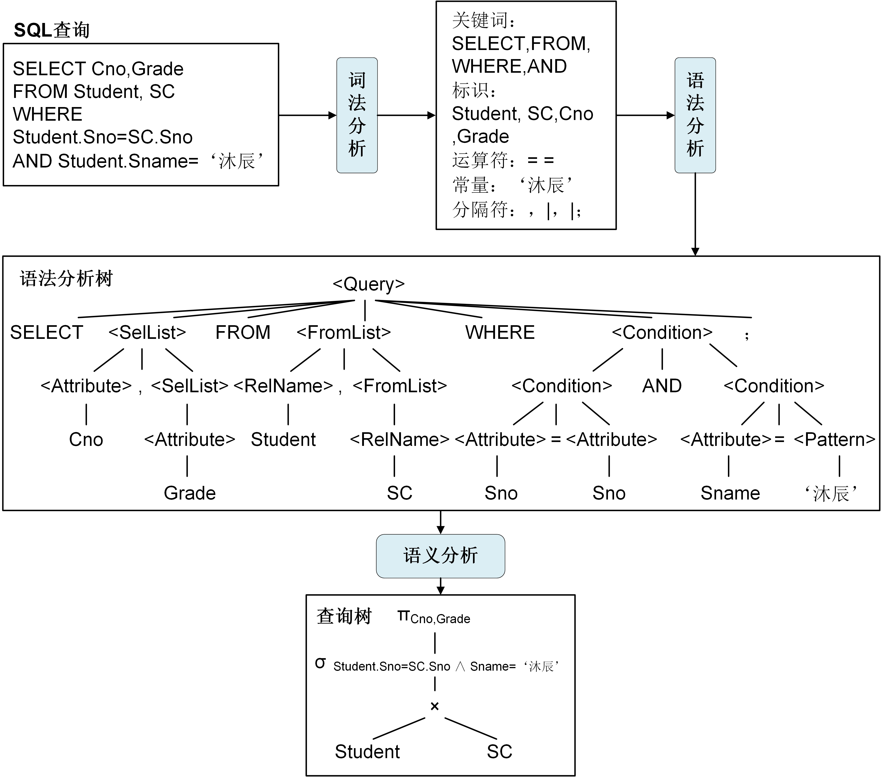
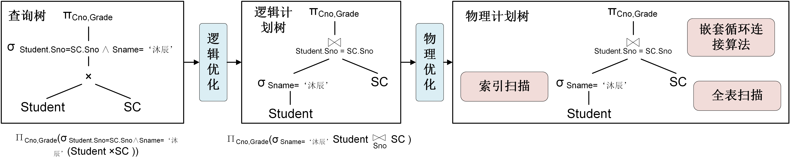

# 关系数据库查询处理

上一节，我们介绍了数据管理系统的计算架构和模式。从本节开始，我们将深入介绍关系数据库中数据计算的实现方式。关系数据库的数据计算指的是处理SQL查询语言的过程，也称为查询处理。查询处理由关系数据库的计算引擎负责，其任务是将用户提交的SQL查询语句转换为查询执行计划，然后使用计算模型处理执行计划得到查询结果。


## 查询处理步骤
关系数据库管理系统的查询处理分为3个步骤：查询解析（Query Interpretation）、查询优化（Query Optimization）和查询执行（Query Execution），如图3.5所示。

<center>
	
	<br>
	<div display: inline-block; padding : 2px>
		图 3.5 关系数据库查询处理步骤
	</div>
</enter>

* 查询解析：将SQL查询语句转换成容易被数据库执行的表达，即通过词法分析、语法分析、语义分析将查询SQL转换为基于关系代数表达式的查询树。查询树是数据库系统的一种常用数据结构，用于表示查询的逻辑结构，它的节点由关系运算算子组成，其叶子节点是数据表扫描算子，非叶子节点是选择、投影、连接等算子。
* 查询优化：为查询树生成一个高效的查询执行计划，即通过逻辑优化、物理优化规则将查询树转换为有更高执行效率、资源消耗最小的执行计划。
* 查询执行：查询的实际执行，即基于查询执行模型将执行计划编译为可执行代码，然后执行得到查询结果。

接下来，我们以一个简单的例子来介绍关系数据库系统的查询处理过程。
```SQL
[例3.1] 查询沐辰同学所选课程号以及课程成绩。
SELECT Cno, Grade
FROM Student, SC
WHERE Student.Sno = SC.Sno AND Student.Sname = '沐辰'; 
```
当处理例3.1的SQL语句时，关系数据库系统首先将SQL语句解析为查询树。在查询解析步骤（如图3.6所示）中，关系数据库系统首先通过词法分析提取出SQL语句中的关键词、标识、运算符、常量、分隔符等成分，然后通过语法分析将词法分析提取的成分构建为一颗语法分析树，最后根据数据字典的关系定义检查语法分析树的语义正确性，并将其转化为基于关系代数表达式的查询树。

基于查询树的查询执行通常是自底向上的，首先处理查询树的叶节点，这些叶节点通常是读取关系表中的数据，然后根据叶节点的结果，逐步向上，根据关系运算计算中间结果，直到根节点，根节点的计算结果为查询的最终输出。查询树中的关系运算、关系运算顺序、关系算子的算法决定了查询处理的性能。前一小节中讲到，数据计算的性能主要受磁盘访问性能和CPU计算性能影响。因此，一个高性能的查询执行计划，其每步关系运算的中间结果集要尽可能的小且关系算子执行过程中要尽量减少磁盘访问的次数。

<center>
	
	<br>
	<div display: inline-block; padding : 2px>
		图 3.6 查询解析过程
	</div>
</enter>


通常，基于查询解析生成的查询树的查询性能都不高。因此需要对查询树进行优化。在查询优化步骤（如图3.7所示）中，关系数据库系统首先按照关系代数表达式的逻辑等价变换规则对查询树进行逻辑优化，通过调整查询树中关系运算的顺序，来最小化每步运算要处理的行数，从而提高查询的执行效率。常用的逻辑等价变换规则有结合律、交换律、选择下推、投影下推、笛卡尔积和连接运算的等价规则等。通过逻辑优化后的查询树称为逻辑计划树，也称为逻辑执行计划。图3.7中，逻辑优化过程将笛卡尔积运算等价转换为连接运算并将选择算子下推，从而减少了每次运算的中间结果。

生成逻辑执行计划之后，关系数据库系统还需要确定逻辑计划中每个算子在物理执行时采用的算法以及算。每个关系算子通常有多种执行算法，如连接算子的算法有嵌套循环连接、排序合并连接、散列连接等，扫描算子的算法有全表扫描和索引扫描。一个逻辑执行计划有多种候选物理执行计划。关系数据库系统基于代价模型估计执行的代价，从众多候选物理执行计划中选择代价最小的计划。这里的代价最小是指磁盘访问次数最少，CPU执行开销最小。通过物理优化后的查询树称为物理计划树，也称为物理执行计划。在图3.7中，物理优化过程确定读取SC表使用全表扫描，读取Student表使用索引扫描，连接运算使用嵌套循环连接算法。

生成物理执行计划之后，关系数据库系统使用查询执行模型将物理执行计划编译为可执行代码，再实际执行代码得到查询结果。

<center>
	
	<br>
	<div display: inline-block; padding : 2px>
		图 3.7 查询优化过程
	</div>
</enter>


## 查询执行模型

关系数据库系统最经典的查询执行模型是火山模型。火山模型又称为迭代模型或流水线模型，它将物理执行计划中的每个关系算子看成一个操作（operator），然后将各操作串联成流水线进行处理。

在火山模型中，每个操作被抽象成一个迭代器，对外提供了以下三个接口：

* open()：关系算子初始化，分配资源；
* next()：算子的具体实现。首先获取下一条记录，然后验证获取记录是否满足条件，若满足则返回；
* close()：回收和关闭分配的资源。

在例3.1中，查询的物理计划树的每一个节点对应一个独立的关系算子，其包含投影算子Project，连接算子Join，选择算子Select，扫描算子Scan。图3.8给出了例3.1基于火山模型的执行过程。火山模型采用自上而下的拉取方式执行查询计划。查询从执行计划的根节点出发，自上而下地递归调用每个关系算子的next()函数读取数据，数据则自底向上进行传递。

<center>
	
	<br>
	<div display: inline-block; padding : 2px>
		图 3.8 火山模型执行过程
	</div>
</center>
其中，每个算子next()函数的伪代码如下所示：

```c
// 投影算子Project的next()函数
Row* ProjectNext(OperatorProject *project)
{
    Row *row = JoinNext(project->child); //从子节点Join中获取下一条记录
    //创建projectRow保存Cno和Grade
    return projectRow;
}
//连接算子Join的next()函数
Row* JoinNext(OperatorJoin *join)
{
 	Row *leftRow = SelectNext(join->leftChild); //从左节点select获取下一条记录   
    Row *rightRow = SCScanNext(join->rightChild); //从右节点Scan_SC获取一条记录
    while (leftRow != NULL){
       while(rightRow != NULL){
       		if (strcmp(leftRow->Sno,rightRow->Sno) == 0){
            	//创建joinRow保存连接结果
           		 return joinRow;
        	}
           rightRow = SCScanNext(join->rightChild); //继续从右节点Scan_SC获取下一条记录   
       }
       leftRow = SelectNext(join>leftChild); //继续从左节点select获取下一条记录     
    }
    return NULL;
}
// 选择算子Select的next()函数
Row* SelectNext(OperatorSelect *select)
{
    Row *row = StuScanNext(select->child); //从子节点Scan_Stu中获取一条记录
    while (row != NULL){
        if (strcmp(row->Sname,'沐辰') == 0){
       		 return row;//如果学生姓名是'沐辰'则返回
    	} 
        row = StuScanNext(select->child); //否则，继续从子节点Scan_Stu中获取一条记录
    }   
    return NULL; 
}
// 扫描算子Scan_Stu的next()函数
Row* StuScanNext(OperatorScan *scan)
{
    return Student.readRow();//从Student表中获取一条记录
}
// 扫描算子Scan_SC的next()函数
Row* SCScanNext(OperatorScan *scan)
{
    return SC.readRow();//从SC表中获取一条记录
}
```

SQL查询语句的执行过程如下：
（1） 首先调用根节点投影算子的next函数（ProjectNext），Project算子的next()函数先调用其孩子节点连接算子的next函数（JoinNext）获得一条连接结果，然后输出该结果的Cno和Grade属性值。
（2）连接算子的next函数（JoinNext）先分别调用左孩子节点选择算子的next函数（SelectNext）和右孩子节点选课表扫描算子Scan_SC的next函数（SCScanNext）获得两条记录，然后判断两条记录是否满足连接条件，如果满足则返回给父节点Project算子。

（3）选择算子的next函数（SelectNext）先调用其孩子节点学生表扫描算子Scan_Stu的next函数（StuScanNext）获得一条学生信息记录，然后判断该记录是否满足筛选条件，如果满足组返回该记录为父节点Join算子。

（4）学生表扫描算子的next函数（StuScanNext）从学生表Student中读取一条记录并返回给父节点Select算子。

（5）选课表扫描算子的next函数（SCScanNext）从选课表SC中读取一条记录并返回给负节点Join算子。

整个执行过程从根节点出发，迭代调用下层算子的next函数直到叶子节点，数据则从叶子结点通过逐层的计算，最后从根节点返回给用户。

[**上一页<<**](chapter3.1.md) | [**>>下一页**](chapter3.3.md)


