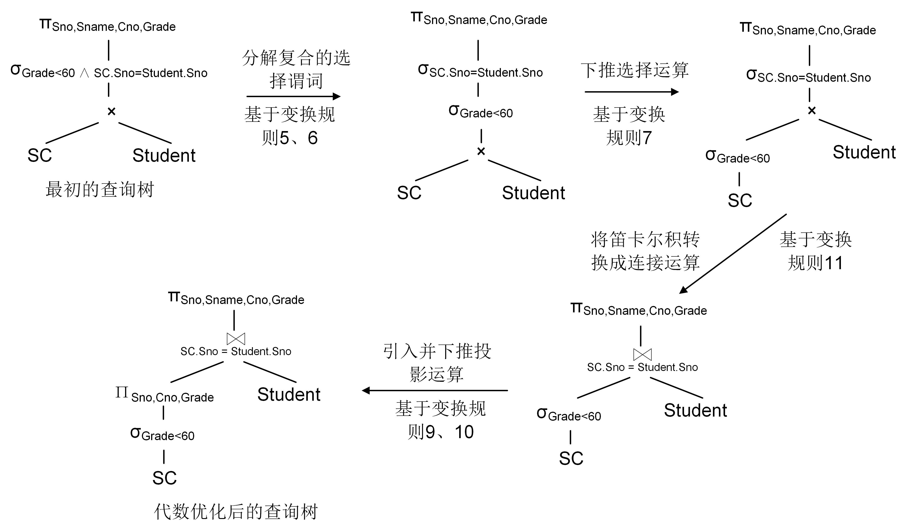

## 3.4 查询优化

查询优化在关系数据库系统中非常重要，它决定了关系数据库系统的查询性能。我们知道同一条SQL查询语句可以拥有多个逻辑等价的关系代数表达式，也就是说每条查询可以转换为多个逻辑执行计划，这些不同的逻辑执行计划在执行效率上存在差异，并且逻辑执行计划中的每个关系算子有多种不同的物理实现方式，不同的实现方式在查询代价上各不相同，适用于不同的场景。为了保证查询能够以较低的资源消耗执行（较少的磁盘I/O和CPU时间），关系数据库系统首先需要将查询转换成更高效的逻辑执行计划，然后为逻辑执行计划中的运算算子选择最为合适的实现方式，前者称为逻辑优化，后者称为物理优化。本节将重点介绍逻辑优化和物理优化的具体规则。


### 3.4.1 逻辑优化

逻辑优化主要是基于关系代数表达式的逻辑等价变换规则改变查询树中关系算子的次序和组合，最小化查询执行中每步运算处理的数据量，从而提高查询效率。经过逻辑等价变换规则调整的关系代数表达式（查询树）与原关系代数表达式（原查询树）是等价的，得到的查询结果是完全相同的。

逻辑等价变换规则主要包括结合律、交换律、选择下推、投影下推、笛卡尔积和连接运算的等价规则等。常用的关系代数表达式的逻辑等价交换规则如图3.9所示。
<center>
	
	<br>
	<div display: inline-block; padding : 2px>
		图 3.9 常用的逻辑等价交换规则
	</div>
</center>
基于逻辑等价变换规则，关系数据库管理系统常使用启发式规则（Heuristic Rules ）进行逻辑优化。典型的启发式规则有：

* 选择运算尽可能先做。这是最重要也是最基本的一条规则。选择运算可以大大减少查询的中间结果。如果内存大小能够容纳中间结果，那么后续的计算就不需要再从磁盘读取数据。
* 将投影运算和选择运算同时进行。如果对同一个关系有若干投影和选择运算，那么可以在选择运算之后进行投影运算，这样可以进一步减少中间结果列的数量，降低中间结果的数据规模。
* 尽可能地将笛卡尔积转变成连接运算。连接运算（尤其是等值连接）比同等关系上的笛卡尔积更高效。

接下来，我们以一个简单的例子来介绍如何利用上述三个启发式规则进行代数优化。

```SQL
[例3.5] 查询课程成绩不及格的学生学号、姓名、课程号和成绩。
SELECT Sno, Sname, Cno, Grade
FROM SC, Student
WHERE SC.Sno = Student.Sno AND SC.Grade < 60;
```

图3.10展示了上例SQL经查询解析生成的初始查询树，再经过逻辑优化的过程。整个代数优化过程基于启发式规则，主要包括分解复合的选择谓词、下推选择运算、将笛卡尔积转换为连接运算以及引入并下推投影运算。

<center>
	
	<br>
	<div display: inline-block; padding : 2px>
		图 3.10 逻辑优化过程
	</div>
</center>

### 3.4.2 物理优化

逻辑执行计划中的各运算算子拥有多种实现算法，比如，选择运算拥有全表扫描（Table Scan）和索引扫描（Index Scan）两种算法；连接运算拥有嵌套循环算法（Nested Loop Join）、排序合并算法（Merge Join）、散列连接算法（Hash Join）和索引连接算法（Index Join）。物理优化就是为各关系算子选择高效合理的实现算法或存取路径，从而生成查询代价最小的物理执行计划。查询代价主要指磁盘I/O。常用的物理优化方法包括基于启发式规则的优化、基于代价估算的优化和两者结合的优化方法。

启发式规则是指在大多数情况下都适用，但不是在每种情况下都是最好的规则。

选择运算的启发式规则有：

* 小关系的选择运算，通常使用全表扫描，即使选择列上有索引；
* 大关系的选择运算，如果选择列上有索引，且查询结果占整个关系的比例较小（<10%），则使用索引扫描，否则使用全表扫描；如果选择列上没有索引或者由OR连接构成的析取选择条件时，使用全表扫描。

连接运算的启发式规则有:

* 如果连接的两个表都已经按照连接属性排序，则使用排序合并算法；
* 如果一个表在连接属性上有索引，则选用索引连接算法；
* 如果上述两个规则都不适应，且其中一个表较小，则选用散列连接算法；
* 最后选用嵌套循环算法，并将其中较小的表（物理页较少的表）作为左表进行连接运算。

启发式规则的优化是做定性选择，实现简单且优化本身的代价较小。基于代价估算的优化方法是基于数据字典中的统计信息来计算各种操作算法的执行代价，从而选出代价最小的操作算法，这是做定量选择。数据字典中的统计信息主要包括以下几个方面：

* 基本表的信息：该表的元组总数（N）、元组长度（l）、占用的物理页数（B）、占用的溢出物理页数（BO）；
* 基本表属性列的信息：该列不同值的个数（m）、该列最大值、最小值，该列是否建立索引以及索引的类型。基于这些统计信息可以计算出该列值的分布情况以及选择运算的查询结果比例（选择率f）。如果不同值的分布是均匀地，则f=1/m；如果不同值的分布不均匀，则f=该值的元组数/N；
* 索引的信息：以B+树索引为例，该索引的层数（L）、索引的叶结点数（Y），不同索引值的个数、索引的选择基数S（有S个元组具有某个索引值）。

如何基于数据字典的统计信息进行代价估算，读者可以阅读其他相关教材。

[**上一页<<**](chapter3.3-R.md) | [**>>下一页**](chapter3.5-D.md)
