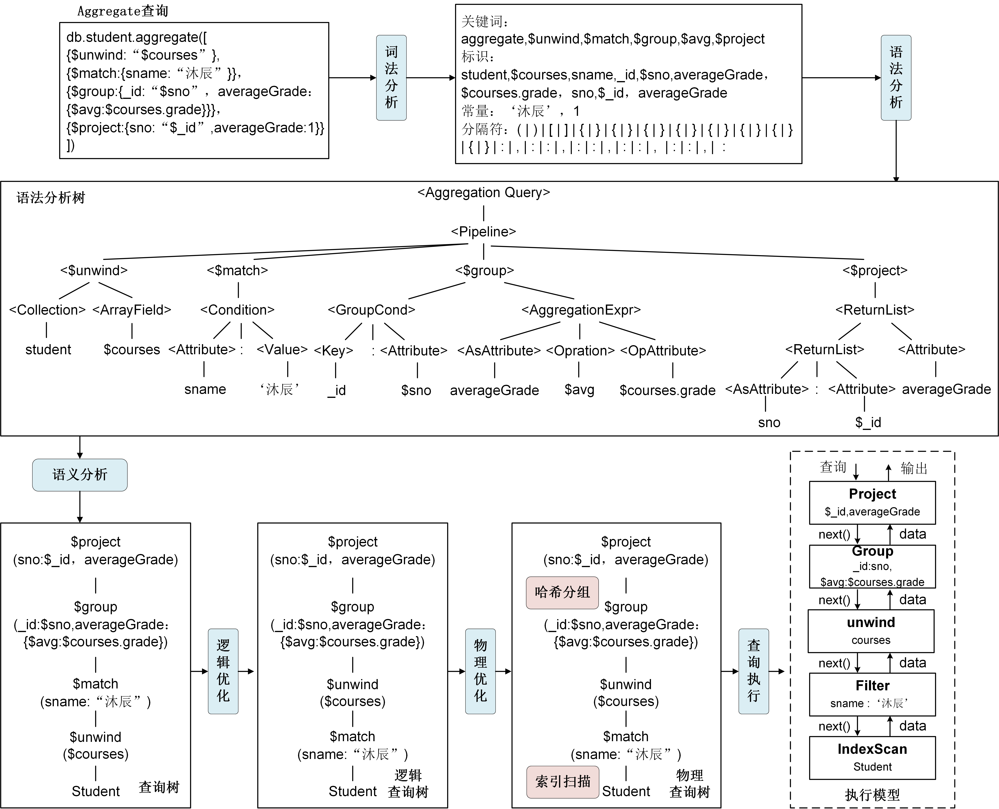

# 文档数据库查询处理
本小节我们主要介绍文档数据库的查询处理。文档数据库的查询处理是处理文档查询操作和文档聚合操作的过程，由文档数据库的查询引擎负责，其任务是将用户提交的find指令和aggregate指令转换为查询执行计划，然后使用计算模型处理执行计划得到查询结果。与关系数据库的查询处理类似，文档数据库的查询处理也分为查询解析、查询优化和查询执行三个步骤。接下来，我们将以文档数据库MongoDB为例，分别介绍find查询和aggregate聚合查询的处理过程。

## 一阶段查询处理（singe-stage）
```SQL
[例3.6] 查询计算机系所有学生的学号和姓名
db.student.find({
	"department":"计算机"
},
{
	"sno":1,
	"sname":1
})
```

文档数据库MongoDB通常将find查询看作一阶段查询处理，主要进行文档数据读取、条件过滤和结果返回这一主要过程。当处理例3.6的find查询时，文档数据库系统的查询处理过程如图3.11所示。

* 在查询解析步骤中，首先通过词法分析提取出find查询指令中的关键词、标识、常量、分隔符等，然后通过语法分析构建抽象语法树。在语法树中，find作为根节点，表示整个查询是find操作，find根节点包含文档集（collection）、查询条件（condition）和结果返回列表（returnList）三个孩子节点。最后检查语法树的语义正确性并生成查询树。
* 在查询优化步骤中，由于find查询只涉及简单的数据读取、条件过滤和结果投影，通常不需要对生成的查询计划树进行逻辑优化，但需要进行物理优化生成物理执行计划。在物理优化过程中，通过代价估计确定每个算子在物理执行时的算法，使得物理执行计划的执行代价最小。在图3.11中，物理优化过程确定读取student文档集使用在department上的索引进行扫描。
* 在查询执行步骤中，文档数据库系统将物理执行计划看作是由一系列的操作符组成的流水线，采用类似火山模型的流式处理模式处理查询执行计划，如图3.11中的执行模型所示。

<center>
	
	<br>
	<div display: inline-block; padding : 2px>
		图 3.11 文档数据库find查询的查询处理
	</div>
</enter>

## 多阶段查询处理（multi-stage）


```SQL
[例3.7] 查询沐辰同学所选课程号以及课程成绩
db.student.aggregate( [ 
						{
						    $lookup:{
    							"from":"sc",
    							"localFiled":"sno", 
    							"foreignField":"sno", 
    							"as"："selectedCourses"  
   							 }
						},  
						{
							$unwind:"$selectedCourses"
						},
						{
							$match:{
								"sname":"沐辰"
							}
						},
						{
						    $project:{
    							"cno":"$selectedCourses.cno",
						        "grade":"$selectedCourses.grade"
						     }
						}
					] )
```

文档数据库MongoDB通常将aggregate聚合查询看作多阶段查询处理，聚合查询中的每一个聚合操作看作一个数据处理阶段，所有的数据处理阶段按顺序构成聚合管道（Aggregation Pipeline）。聚合管道是一种流处理模式的计算框架，文档集中的文档逐个依次进入每个数据处理阶段并计算查询结果。例3.7的聚合查询中包含\$lookup（关联）、\$unwind（展开文档数组）、\$match（过滤）和\$project（投影）四个数据处理阶段，它的查询处理过程如图3.12所示。

* 在查询解析步骤中，首先通过词法分析提取出aggregate查询指令中的关键词、标识、常量、分隔符等，然后通过语法分析构建抽象语法树。在语法树中，aggregate关键词作为根节点，表示整个查询为聚合操作，aggregate节点包含一个pipeline孩子节点，表示构建聚合管道，pipeline节点则包含多个孩子节点，每个节点代表一个数据处理阶段，前一阶段的结果要传递给下一个阶段，最后检查语法树的语义正确性生成查询计划树。
* 在查询优化步骤中，查询优化包含逻辑优化和物理优化，逻辑优化是通过调整查询树中数据处理阶段的顺序来最小化每个阶段要处理的文档数，从而提高查询的执行效率。常用的逻辑优化规则有优先执行过滤操作等。图3.12中，逻辑优化过程将\$match操作下推，优先执行过滤操作。物理优化则是为每个操作确定执行算法，从而使得物理执行计划代价最小。图3.12中，物理优化过程确定读取sc文档集使用全文档扫描，读取student文档集使用姓名sname上的索引扫描。
* 在查询执行步骤中，文档数据库系统将物理执行计划中的各个数据处理阶段看作一个个操作符，数据从一个阶段流向下一个阶段，执行过程类似于火山模型的流式处理模式，如图3.12的执行模型所示。

<center>
	
	<br>
	<div display: inline-block; padding : 2px>
		图 3.12 文档数据库aggregate聚合查询的查询处理
	</div>
</enter>

[**上一页<<**](chapter3.4.md) | [**>>下一页**](chapter4.1.md)


