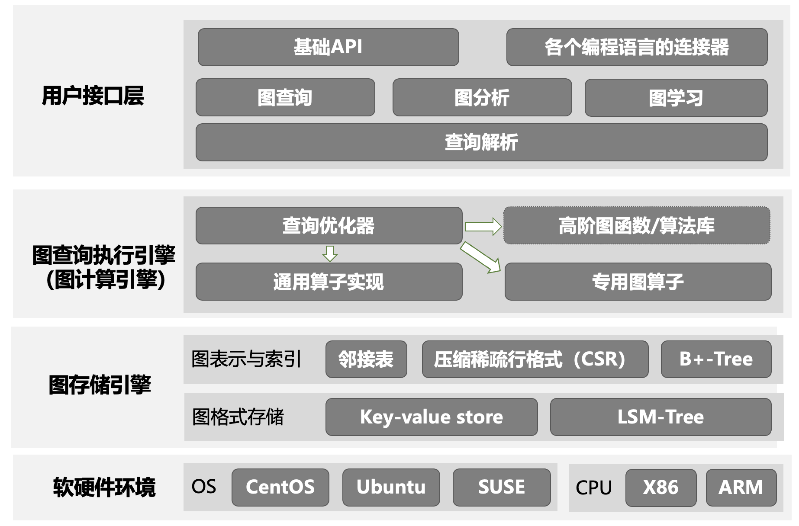

# 3.6 图数据库的查询处理


在[**3.1小节**](chapter3.1.md) 中我们讲授了数据管理系统的一般架构和模式，在本小节中我们将介绍图数据库中数据计算的实现方式。对于图数数据库来说，其数据计算通常为处理和执行图查询语句（如输入一条Cypher语句，图数据库执行该语句并得到相应的查询结果）。特殊的图数据库也支持复杂基于图的计算（如Tugraph支持复杂的图分析和图学习等等）。执行图查询语句的过程也称之为图查询处理，该过程由图查询引擎负责，其过程为将⽤户提交的图查询语句转换为具体的查询执⾏计划，经过一定的优化后，由存储引擎调用相应的数据来执行该查询计划，并最终得到查询结果。在本小节中，我们以 Neo4j 以及其声明式查询语⾔ Cypher 为例，介绍图数据库查询处理的具体流程。图分析和图学习的计算过程和图查询相似，只是计算过程更为复杂，本书不进行深入讲解。


## 3.6.1 图数据库的软件架构

在[**3.1小节**](chapter3.1.md) 中，我们讲授了数据管理系统的基本架构（图3.1）。图数据库遵从此框架，其架构如图3.13所示。**用户接口层**包括了基础API供开发者调用，同时提供多种编程语言（如 Java、Python、C++）的客户端库，使开发者可以通过代码直接与数据库交互。**计算引擎**包括了查询解析和查询执行引擎，对于一个图查询任务首先由查询解析模块生成初步执行计划，随后经过图查询执行引擎的查询优化模块进行优化，并调用相应的算子进行执行。

图算子通常为通用或者专用的基础图算法。此处“通用算法”指图上的基础操作，其他图算法可由该类算法组合得到。“专用算法”是指某些算法虽然可由更底层的算子进行实现，但该类算法使用频率高，因此图数据库通常将其作为一个单独的图算法进行专门的设计和优化。例如，“社区发现”是一类用于识别网络中节点分组的方法，目标是将网络划分为多个社区，使得社区内节点之间的连接更紧密，而社区间的连接较为稀疏。该算法在在社交网络分析、生物网络建模、推荐系统等领域有重要应用；虽然此算法并非图上的基础运算，但因其复杂性和常用性，大多数图数据库将其单独实现。此外，在图查询（以及图分析和图学习）中，很多高层计算过程是某些固定的底层算法的组合，因此部分图数据库会将此类计算过程以“算法库”的方式进行实现，以避免每次用到该高层算法的时候都调用查询优化过程而浪费计算资源。

经过上述过程得到的物理执行计划，将由图存储引擎配合下下进行执行——图存储引擎通过调用内存和外存中的数据，完成上述计算过程。


<center>
	
	<br>
	<div display: inline-block; padding : 2px>
		图 3.13-图数据库软件架构
	</div>
</center>


## 3.6.2 图数据库的查询处理的执行过程

图数据库的查询即为输入一个查询语句，图数据库给出查询结果的过程。一个查询语句（以Cypher语言的查询为例）的查询处理分为三个步骤：查询解析、查询优化和查询执行，如图 3.14 所示。
<center>
	
	<br>
	<div display: inline-block; padding : 2px>
		图 3.14 Cypher语言查询处理步骤
	</div>
</center>

- 查询解析：将 Cypher 语句通过词法分析、语法分析和语义分析转化为一个抽象语法树（Abstract Syntax Tree）。⼀条 Cypher 语句最初表现为⼀个声明式查询字符串，它描述即将在数据库中匹配的图模式。

- 查询优化：语法树经过查询优化器（也称为计划器）⽣成逻辑计划，再转化为物理计划。查询优化的过程通常包含代数优化和物理优化。逻辑计划是一个高层次的查询表示，描述查询的基本操作步骤，由⼀系列表示查询语义的抽象操作符和逻辑操作符组成。物理计划描述查询具体的执⾏步骤和算法，包括选择的数据访问⽅法、连接算法等。

- 查询执行：执行生成的物理执行计划，存储引擎调取相应的数据，完成查询的执行。

接下来我们沿用“选课与成绩查询”的例子来介绍Neo4j的查询处理过程。


```SQL
[例3.8] 查询沐辰同学所选课程号以及课程成绩。
MATCH (mc:Student {Sname: '沐辰'})-[r:ENROLLS]->(c:Course)  
WITH mc, c, r  
RETURN c.Cno AS Cno, r.Grade AS Grade
```


当处理例3.8的Cypher语句时，图数据库（以Neo4j为例）首先通过查询解析将该语句转化为一个抽象语法树，如图3.15所示。在查询解析的步骤中，Neo4j首先通过词法分析将该查询字符串分解成一系列标记（tokens），如关键字、标识符、常量、操作符、分隔符等。然后通过语法分析构建语法树，在该过程中Neo4j会先依据上下文无关文法（Context-free Grammar）来生成具体语法树，再将其转化为抽象语法树。二者的区别在于，具体语法树会详细地还原查询语句中的所有细节，而抽象语法树则通过树结构本身隐式地表达一些内容，如括号、连接等等。最后，语义分析进⼀步验证顶点和边的依赖关系是否成⽴、是否正确使⽤属性等，增强语法树的语义表达和中间表示。语法分析和语义分析的区别在于语义分析在语法分析的基础上考虑了语句的逻辑性。

<center>
	
	<br>
	<div display: inline-block; padding : 2px>
		图 3.15查询解析过程
	</div>
</center>


在完成查询解析后，查询优化器会将语法树转化为**逻辑执行计划**，并根据逻辑执行计划的结构和索引来生成多个物理执行计划。
查询优化器会选择生成的最优计划来执行，并尝试所有可能的索引，选择执行时间最短的索引（在当前例子中，我们并没有在数据中创建和指定索引）。
该示例中Neo4j最终选择的查询计划如图3.16所示，其中estimated rows表示当前运算符预计（产生）处理的行数，查询优化器会基于estimated rows来选择合适的执行计划；db hits表示当前运算符向Neo4j存储引擎请求的单位数量，一次数据库命中是存储引擎工作（检索或更新数据等操作）的一个抽象单位；rows表示当前运算符实际产生的数据行数量。首先系统需要通过Scan扫描找到查询的开始点，每个算子通常都包括多种执行方式，扫描操作包括AllNodesScan、NodeIndexSeek等，此处使用NodeByLabelScan来通过节点标签扫描开始点；Filter过滤将前一运算符得到的所有row进行断言，返回结果为true的行；Expand(All)对于给定的开始节点，根据关系中的模式沿开始节点展开；最后Projection投影将输入的每一行都按照要求输出需要的结果。


<center>
	
	<br>
	<div display: inline-block; padding : 2px>
		图 3.17 查询计划
	</div>
</center>


### 3.6.3 图查询模型与图算子实现


图数据库的查询执行通常采用流处理模型。
在具体实现时，绝大多数图数据库（包括Neo4j和TuGraph）都采用了拉取士（pull-based）的数据流处理模型，该模型将图结构数据的每个执行操作抽象为一种算子，图数据库首先将查询语句（如Cypher查询）解析为算子执行树后，算子以迭代器的方式实现，统一实现了以下接口：
- `open()`：图操作算子的初始化，分配资源。
- `next()`：图算子的具体实现，每次调用`next()`返回一条执行的结果。其执行的过程可能包含调用子迭代器的`next()`方法。
- `close()`：关闭和回收分配的资源。

通过上述迭代器接口，图数据库通过不断调用算子执行树根节点的`next()`方法，逐层向下直到叶子节点，从而以迭代、流水线的方式获取全部查询结果。该模型被形象化的称之为“火山模型”——数据从底层的叶节点（如节点遍历）开始“喷涌”而出，通过每层运算符向上传递，最终到达根节点（类似于火山内部熔岩从底部喷涌到顶部）。


接下来，我们将以简单的例子来介绍图数据库系统的查询执行的过程。我们要查询沐辰同学所选课程以及课程的成绩，可以采用以下Cypher查询来执行该过程：

```sql
[例3.9] 查询沐辰同学所选课程号以及课程成绩。
MATCH (s: Student)-[:Attend]->(c:Course)
WHERE s.name="沐辰"
RETURN c.name, c.grade
```

图数据库系统对该查询进行词法解析、语法解析和语义分析，并对生成并优化对应的查询计划，最后生成以下的算子执行树。


<center>
	
	<br>
	<div display: inline-block; padding : 2px>
		图 3.18 火山模型执行过程
	</div>
</center>


其中，每个算子`next()`函数的具体实现过程和伪代码如下所示：

**节点遍历算子（Scan）与过滤选择（Filter）。** 节点、边遍历是图数据库中用于查询匹配的核心算子。该算子遍历图存储中的节点或边，在每次调用`next`方法时，返回当前遍历到的一个节点或边。遍历操作通常伴随着条件选择操作（即过滤算子，filter），例如根据用户查询名为"沐辰"的学生，从而选择具有指定属性的节点或边。遍历算子与过滤选择算子的具体实现如下：

```C++
Row* Scan::next() {
	// studentNodes为图存储中存储的Student节点数组
	// 若游标大于学生节点数量则返回空值NULL
	if (++cursor >= studentNodes.len()) {
		return NULL
	}
	// 返回游标指示的学生节点
	return studentNodes[cursor];
}

Row* Filter::next() {
	// 获取孩子节点算子（即Scan算子）的一条数据
	Row* row = self.child.next();
	while (row != NULL) {
		// 判断获取的数据是否满足选择条件
		if (strcmp(row->name, "沐辰") == 0) {
			return row;
		}
		// 若不满足，则获取下一条数据
		row = self.child.next();
	}
	// 若没有数据满足选择条件，则返回空值NULL
	return NULL;
}
```

**边扩展匹配算子（Expand）。** 该算子在路径匹配、多跳查询和条件过滤等场景中具有广泛的应用，是图数据库查询执行的核心算子之一。该算子通过从任意节点$a$出发，沿着具有指定标签$l$的出边，遍历并获取所有可达的目标节点$b$。其条件能够表示为`(a)-[:l]->(b)`，在查询中可以将多个匹配条件组成成更复杂的匹配模式。边扩展匹配算子的执行过程可以分为四个关键步骤。首先，从子子算获取到的节点$a$开始，遍历其所有出边，获取与起始节点直接相连的边集合。其次，根据指定的边标签 $l$，筛选出符合条件的边，确保生成的关系满足查询需求。最终，对于每条符合条件的边，获取其目标节点$b$。从而在每次调用`next`方法时，返回一个匹配的结果。其具体实现的伪代码如下：

```C++
Row* Expand::next() {
	// 检查是否已遍历完当前节点的所有边
	if (currentEdge == NULL) {
		// 若当前节点的边都已遍历过，则从孩子算子（即Filter算子）获取下一个节点。。
		currentNode = self.child.next().node
		// 若孩子算子返回空值，说明已遍历完所有节点。
		if (currentNode == NULL) return NULL;
		currentEdge = currentNode->edge;
	}
	// 遍历当前节点的所有出边
	while (currentEdge != NULL) {
		// 检查边标签是否匹配
		if (currentEdge->label == "Attend") {
			// 获取目标节点
			Node* targetNode = currentEdge->target;
			// 创建返回的行数据
			Row* resultRow = targetNode.as_row();
			// 移动到下一条边
			currentEdge = currentEdge->next;
			return resultRow; // 返回匹配的结果
		}
		// 移动到下一条边
		currentEdge = currentEdge->next;
	}
	// 如果没有匹配的边，继续采取递归方式处理下一个起始节点
	return next();
}
```

该Cypher查询的执行过程如下：
1. 首先调用根节点Expand算子的`next()`函数，Expand算子的`next()`函数会先调用其孩子节点（即过滤算子）的`next()`，获取一个有效的节点数据。随后，每个`next()`调用将遍历并返回一个该节点的标签为"Attend"的出边，并返回出边的目标节点。如果该节点的所有出边都已被遍历，则从孩子节点获取下一个有效节点，并重复上述操作。
2. Filter算子的`next()`函数会先调用孩子节点（即Scan算子）的`next()`函数，获取下一条节点数据。如果该节点的属性符合Cypher查询中的选择条件（即`s.name="沐辰"`），则返回该节点。如果不符合，则继续调用孩子节点`next()`函数，直到满足选择条件或子节点返回空值（表示所有节点已遍历完毕）。
3. Scan算子的`next()`函数会逐个读取图存储中的Student节点数据，直到读取完所有学生节点数据后返回空值NULL。

通过火山模型，整个查询执行过程从根节点出发，逐层迭代调用孩子节点的`next()`函数，直至到达叶子结点。数据则从叶子结点通过逐层的计算，最后从根节点返回给用户。

除了上面例子中提到的常用算子外，图数据库算子也包括一些传统的关系代数算子：如连接（join）、外连接（outer join）和聚合（aggregate）（关系代数算子的实现见3.3节）。例如，在图数据库中，连接操作通常用于将不同路径或子查询的结果进行合并。例如，在多跳查询中，连接算子可以将两个扩展操作的结果进行匹配，从而生成更复杂的路径模式。

<!-- 

以上图为例，展示了一个Cypher查询及其对应的算子执行树。图(a)是一个用于匹配两跳查询的cypher语句，其匹配属性$p$为$T$的起始节点$a$，经由边标签为$l$的出边，并通过一个中间节点$b$，最终到达属性$p$为$F$的目标节点$c$。图(b)展示了该Cypher查询对应的算子执行树。查询执行首先遍历图中所有节点，选择属性$p$为$T$的节点$a$。对于每个选中的节点$a$，执行边扩展匹配算子，沿着标签为$l$的出边，遍历所有可达的中间节点$b$。基于第一次边扩展匹配的节点$b$，再次执行边扩展匹配操作，遍历出边标签为$l$所连接的目标节点$c$。再从两次扩展匹配的结果中，选择出属性$p$为$F$的目标节点$c$。通过该过程，执行引擎每次调用算子执行树的`next`方法即可获取一个查询的结果，最终迭代获取出所有查询结果。 -->


[**上一页<<**](chapter3.5-D.md) | [**>>下一页**](chapter3.7-G.md)