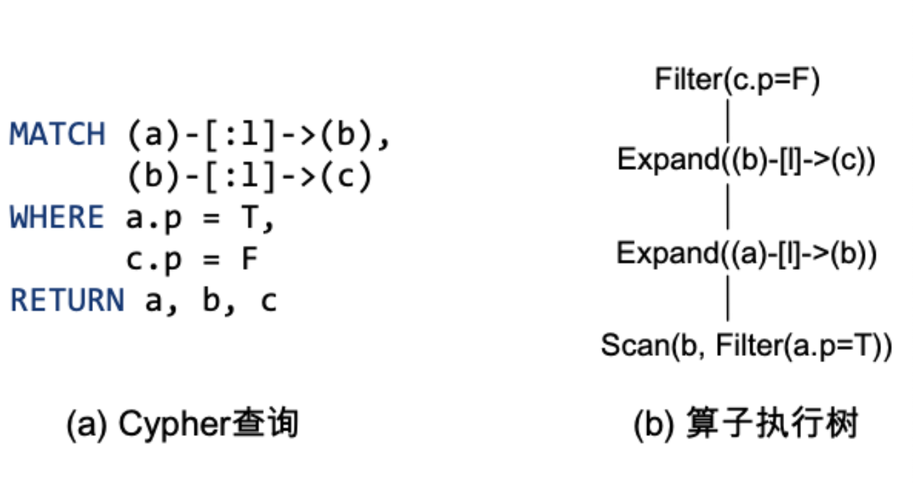

## 图数据库算子及其实现

与关系型数据库类似，图数据库的查询执行器也通常采用火山模型（Volcano Model）作为查询处理框架。火山模型将图结构数据的每个执行操作抽象为一个迭代器，每个迭代器都包含一个`next`方法。每次调用`next`方法时，迭代器将返回该算子生成的一条数据（或称为元组，tuple）。图数据库通过将查询语句（如Cypher查询）解析为算子执行树，树的根节点不断调用`next`方法，从而获取整个查询的全部结果。

本节将以节点与边遍历算子和边扩展算子为例，详细讲解图数据库算子的具体实现。

**节点、边遍历算子（Scan）。** 节点、边遍历是图数据库中用于查询匹配的核心算子。该算子遍历图存储中的节点或边，在每次调用`next`方法时，返回当前遍历到的一个节点或边。遍历操作通常伴随着条件选择操作（即过滤算子，filter），例如根据谓词表达式选择具有指定属性的节点或边。在具体实现中，遍历算子根据不同的条件选择操作被实现为多种算子。例如：根据节点`ID`进行选择，通常以`NodeIdSeek`算子实现；根据节点标签进行选择，通常实现为`NodeLabelScan`算子；而根据索引属性进行选择，则实现为`NodeIndexSeek`算子。

**边扩展匹配算子（Expand）。** 该算子在路径匹配、多跳查询和条件过滤等场景中具有广泛的应用，是图数据库查询执行的核心算子之一。该算子通过从任意节点$a$出发，沿着具有指定标签$l$的出边，遍历并获取所有可达的目标节点$b$。其条件能够表示为`(a)-[:l]->(b)`，在查询中可以将多个匹配条件组成成更复杂的匹配模式。边扩展匹配算子的执行过程可以分为四个关键步骤。首先，从起始节点$a$开始，遍历其所有出边，获取与起始节点直接相连的边集合。其次，根据指定的边标签 $l$，筛选出符合条件的边，确保生成的关系满足查询需求。最终，对于每条符合条件的边，获取其目标节点$b$。从而在每次调用`next`方法时，返回一个匹配的结果。

除了图特定的算子外，图数据库算子也包括一些传统的关系代数算子：如连接（join）、外连接（outer join）和聚合（aggregate）。例如，在图数据库中，连接操作通常用于将不同路径或子查询的结果进行合并。例如，在多跳查询中，连接算子可以将两个扩展操作的结果进行匹配，从而生成更复杂的路径模式。

	
	 
	

		图 3.8 图查询语言及其对应的图算子
	

以上图为例，展示了一个Cypher查询及其对应的算子执行树。图(a)是一个用于匹配两跳查询的cypher语句，其匹配属性$p$为$T$的起始节点$a$，经由边标签为$l$的出边，并通过一个中间节点$b$，最终到达属性$p$为$F$的目标节点$c$。图(b)展示了该Cypher查询对应的算子执行树。查询执行首先遍历图中所有节点，选择属性$p$为$T$的节点$a$。对于每个选中的节点$a$，执行边扩展匹配算子，沿着标签为$l$的出边，遍历所有可达的中间节点$b$。基于第一次边扩展匹配的节点$b$，再次执行边扩展匹配操作，遍历出边标签为$l$所连接的目标节点$c$。再从两次扩展匹配的结果中，选择出属性$p$为$F$的目标节点$c$。通过该过程，执行引擎每次调用算子执行树的`next`方法即可获取一个查询的结果，最终迭代获取出所有查询结果。

