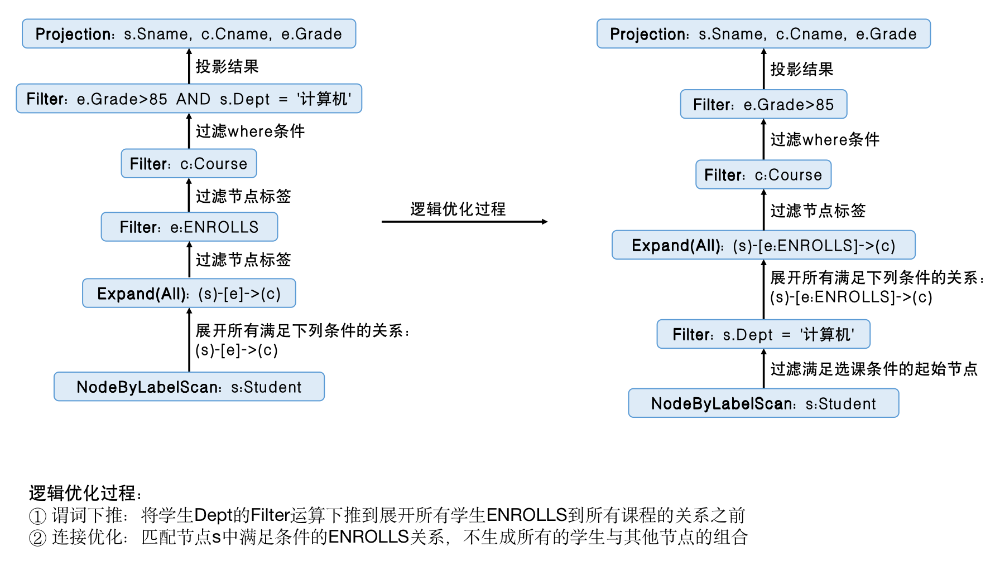

本小节将重点介绍图数据库的逻辑优化和物理优化的具体规则。

### 逻辑优化

图数据库的逻辑优化基于图查询的逻辑等价变换规则，通过改变查询的算子顺序和组合方式以及选择合适的图算法来改写和简化查询语法树。图数据库与关系数据库的逻辑优化规则有许多相似之处，但针对图结构的特殊性，图数据库的逻辑优化更侧重于对节点、关系和路径的操作。同时，逻辑优化的目标是减少查询执行过程中的中间结果集大小，减少数据的扫描量。

图数据库的逻辑优化并没有统一固定的优化规则，常见的逻辑优化规则描述如下：

- 条件合并：若存在多个过滤条件（如AND连接的多个表达式），将其合并统一为where条件。
- 谓词下推：过滤条件尽可能下推提前应用到图扫描阶段，如：将WHERE条件中的等式转换为图节点的属性匹配。
- 路径约束简化：尽量合并或简化多余的路径约束，如：若两个相连路径之间没有额外条件，则直接合并。
- 模式匹配分解：对于一些复杂的模式匹配，分解为多个字查询，并在局部计算后合并结果。
- 模式匹配合并：将多个相关的模式匹配语句合并为一整个查询，避免重复扫描。
- 连接优化：协调不同查询子模式的连接顺序，优先执行匹配结果较少的连接。

接下来，我们沿用学生选课成绩的数据来展示一个简单的图查询逻辑优化。图3.8-1G展示了该Cypher语句的初步查询计划经过逻辑优化后生成最终查询计划的过程。

```sql
[例3.8-1] 查询选修“计算机“课程且成绩高于85分的学生姓名、课程和成绩。
MATCH (s:Student)-[e:ENROLLS]->(c:Course)
WHERE e.Grade > 85 AND s.Dept = '计算机'
RETURN s.Sname, c.Cname, e.Grade
```

<center>
	
	<br>
	<div display: inline-block; padding : 2px>
		图 3.8-1G 逻辑优化过程
	</div>
</center>


### 物理优化

图数据库的物理优化主要涉及底层资源，如内存、CPU、I/O等约束和性能来进行优化，Neo4j的物理优化主要集中于执行计划运算符部分。
Neo4j中的执行计划运算符分为叶子运算符（Leaf Operator）、更新运算符（Update Operator）和急切运算符（Eager Operator）。叶子运算符用于查找执行查询所需的起始节点和关系；更新运算符用于更新图数据，具体使用请参照图查询语言章节；急切运算符负责集合所有行结果并传递给下一个运算符。

叶子运算符

叶子运算符主要分为索引查找（Index Seek）、节点扫描（Node Scan）和关系扫描（Relationship Scan），操作符描述如下：

- 索引查找能够利用索引直接查找满足条件的节点或关系，无需进行全图扫描，通常用于在已建立索引的大量节点和关系的图数据库上。
- 节点扫描能够根据条件定位目标节点，在不存在指定节点条件的情况下，Neo4j会通过AllNodesScan扫描图中所有的节点。
- 关系扫描能够根据条件定位目标关系，在不存在指定关系条件的情况下，Neo4j会通过DirectedAllRelationshipsScan扫描图中所有的关系。

急切运算符

急切运算符用于在查询执行的过程中将某些操作提前以优化查询性能，可以分为急切聚合（Eager Aggregation）、急切连接（Eager Join）和急切投影（Eager Projection）等，操作符描述如下：

- 急切聚合可以评估分组表达式并通过结果将数据行放到不同的分组中，对于每个分组，急切聚合会计算其所有的聚合结果，对内存的消耗较高。在进行聚合查询时，Neo4j会选择EagerAggregation或是OrderedAggregation运算符来执行，后者会根据输入行的有序性来优化计算。同时，Neo4j针对节点count和关系count运算设计了不同的运算符来加速计算。
- 急切连接主要基于哈希连接（Hash Join）展开。连接存在构建输入和探测输入，通常情况下较小的输入成为构建输入，并构建探测表，查询优化器会基于探测表来检测并连接探测输入的每一行数据。急切连接主要分为四种，基于ID和基于值的连接，以及节点左外连接和右外连接。当左侧操作符返回的结果少于右侧操作符返回的结果，则使用左外连接，反之亦然。
- 急切投影可以在查询执行的早期阶段选择特定的属性或模式将查询结果投影，减少在执行中不必要的数据传输和处理。

在Neo4j中，存在对每个图算法进行内存估计的功能，读者可以自行查阅并使用。