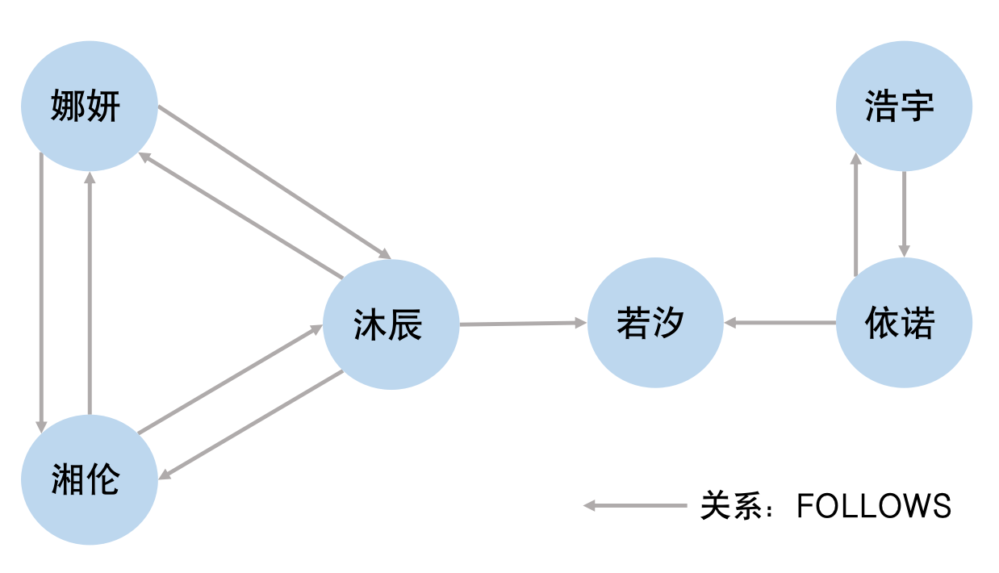
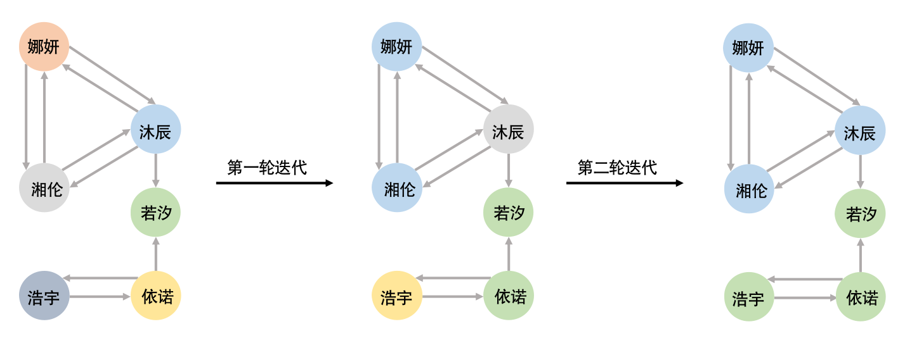

## 3.8 图数据库中的基础与专用图算法

如3.6.1小节中所述，在图数据库中，图算子通常为图结构上最基础的操作（如节点遍历等）。
除基础算子之外，有高阶图算法虽可由更基础的算子组合来实现，但从应用的角度来看他们是服务于多种应用场景的通用算法（如子图匹配算法用于从图数据库中找到满足特定模式或结构的子图。它是许多图数据分析任务的基础操作，广泛应用于社交网络分析、生物网络建模、知识图谱查询等领域），因此，很多图数据库将其实现为独立的算法模块。这样的设计具有一定的优势——研究人员可以专注于图算法的优化，同时数据库系统模块化的设计方便将该算法替换为当前最高效的设计。此外，某些图数据库为了支持复杂图查询（以及图分析、图学习等），提供了强大的算法库继承了部分高层算法的模块化实现。此类算法虽可用基础图查询算子来实现，但是通过模块化予以固定，避免了每次使用时查询优化器带来的负载。


本小节针对Neo4j的Graph Data Science库的图形算法进行介绍，这些算法主要是用于计算图形、节点或关系连接的指标，针对图中相关实体或社区等固有结构的中心性、相似度、图形聚类等方面，主要分为中心性算法、社区检测算法、相似度算法、路径查找算法、DAG（Directed Acyclic Graphs）算法、节点嵌入算法、拓扑连接预测算法。其中，大部分图形算法都是迭代方法，遍历图形通常采用广度优先、深度优先或模式匹配等进行计算。

### 3.8.1 路径查找算法

```SQL
[例3.11] 建立一个简单的交通网络图，节点表示站点，关系表示通向的道路
CREATE (A:Location {name: 'A'}),
       (B:Location {name: 'B'}),
       (C:Location {name: 'C'}),
       (D:Location {name: 'D'}),
       (E:Location {name: 'E'}),
       (F:Location {name: 'F'}),
       (A)-[:ROAD {cost: 50}]->(B),
       (A)-[:ROAD {cost: 50}]->(C),
       (A)-[:ROAD {cost: 100}]->(D),
       (B)-[:ROAD {cost: 40}]->(D),
       (C)-[:ROAD {cost: 40}]->(D),
       (C)-[:ROAD {cost: 80}]->(E),
       (D)-[:ROAD {cost: 30}]->(E),
       (D)-[:ROAD {cost: 80}]->(F),
       (E)-[:ROAD {cost: 40}]->(F);
```

<center>
	
	<br>
	<div display: inline-block; padding : 2px>
		图 3-8-1 交通网络图
	</div>
</center>

路径查找（Path Finding）算法用来查找或评估两个或多个节点之间的路径，通常包含无权重、正权重和负权重的路径查询。图3-8-2是一个小型交通网络图，节点表示站点，关系表示道路。下述查询语句中包含无权重的最短路径查询，其搜索过程是从起点开始，按照算法自身的遍历方式搜索节点，直到搜索完所有可能的路径停止。
```SQL
[例3.12] 查询从站点A到站点F的无权重最短路径。
MATCH (A:Location {name: 'A'}), (F:Location {name: 'F'}), p = shortestPath((A)-[*]->(F)) 
RETURN p
```
无权重路径查找算法主要有两种实现方法：深度优先搜索（Depth First Search）和广度优先搜索（Breadth First Search）。下面将分别进行介绍：

（1）深度优先搜索DFS

深度优先搜索算法的思想是：从选定的起始节点开始，在回溯之前尽可能地深入探索节点的每个分支。首先从图中指定的一节点出发，访问其任意一个未被访问过的邻居节点，再访问该节点任意一个未被访问过的邻居节点，以此类推；当搜索到目标节点或没有可深入的节点时，该算法会回溯到当前节点的前驱节点并继续访问其他未访问过的邻居节点，直到回溯到起始节点搜索停止。实际的深度优先搜索算法步骤如下：
- 第一步，通过节点名称（name）定位起点A的位置，随机选取节点A有向边连接到的节点B，再随机选取节点B连接的节点D，直到选取到节点F，第一条路径遍历完成：A->B->D->F；
- 第二步，遍历完成后进行回溯，从节点F回溯到节点D，找到节点D连接的节点E，再连接到节点F，第二条路径遍历完成：A->B->D->E->F；
- 最后，重复第二步的操作直到回溯到起点A搜索停止，并选取最短的路径：A->D->F。

（2）广度优先搜索BFS

广度优先搜索算法的思想是：从选定的起始节点开始，按照距离增加的顺序依次访问节点。首先从图中指定的一节点出发，先访问其所有一阶邻居节点，再按访问这些节点的所有一阶邻居节点，以此类推，直到搜索到目标节点或所有节点已访问搜索停止。实际的广度优先搜索算法步骤如下：

- 第一步，通过节点名称（name）定位起点A的位置，探索节点A的所有一阶邻居B、C、D；
- 第二步，探索下一深度的所有节点E、F，搜索到目标节点停止，并选取最短路径A->D->F。

假设图数据中包含|V|个节点和|E|条关系，DFS和BFS遍历整个图形的时间复杂度都为O(|V|+|E|)，空间复杂度都为O(|V|)。当用户的需求是查询可行路径而非强制最短时，基于上述描述可以得出：在目标节点距离起点很远，并且探索随机路径的成功率很高的情况下，一般使用深度优先搜索，同时更适用于检查最短路径是否存在的情况；在搜索到目标节点的可能性随探索距离而增加的情况下，一般使用广度优先搜索，同时更适用于需要记录并返回最短路径的情况。

```SQL
[例3.13] 查询从站点A到站点F的正权重最短路径。
MATCH (source:Location {name: 'A'}), (target:Location {name: 'F'})
CALL gds.shortestPath.dijkstra.stream('myGraph', {
    sourceNode: source,
    targetNodes: target,
    relationshipWeightProperty: 'cost'
})
YIELD index, sourceNode, targetNode, totalCost, nodeIds, costs, path
RETURN
    index,
    gds.util.asNode(sourceNode).name AS sourceNodeName,
    gds.util.asNode(targetNode).name AS targetNodeName,
    totalCost,
    [nodeId IN nodeIds | gds.util.asNode(nodeId).name] AS nodeNames,
    costs,
    nodes(path) as path
ORDER BY index
```

上述查询语句中包含对于\[例3.13\]的正权重最短路径查询，可以使用Neo4j的Graph Data Science（GDS）库，其中较常见的Dijkstra最短路径算法能够查找从给定源节点到其他每个节点的最短路径以及长度。Dijkstra是⼀种贪⼼算法，该算法在每⼀步都做出⼀个局部最优的选择，最终达到全局最优的结果。算法步骤描述如下：

- 第一步，从起始节点A开始，设置到其他所有节点的距离为无穷大，到当前节点的距离为0；
- 第二步，选取未访问且具有最小有限距离的节点（即起点A），获取节点A的所有邻居通过该节点得到的距离，若新距离小于先前距离则更新；
- 第三步，选取下一轮中（节点A的邻居节点中）未访问且具有最小有限距离的节点，比较并更新该节点邻居节点到起始节点的距离；
- 第四步，重复步骤三直到所有节点已被访问且距离不再更新，算法停止，
- 最终，获取节点A到节点F的最短路径为：A->B->D->E->F，长度为160。

### 3.8.2 子图匹配算法

<center>
	
	<br>
	<div display: inline-block; padding : 2px>
		图 3-8-2 社交网络图
	</div>
</center>

子图匹配（Subgraph Matching）算法主要用于解决子图同构问题，即在图中查找与给定模式图同构的⼦图，由于图同构问题是一个NP完全问题，因此子图匹配算法的时间复杂度较高，不同的算法也适用于不同的场景。经典的子图匹配算法主要分为回溯搜索（Backtracking Search）和多路连接搜索（Multi-way Search），回溯算法基于DFS递归搜索目标子图，查询过程中产生的中间结果很少，优化通过剪枝来减少不必要的计算，主要适用于限制返回数量的子图匹配查询；多路连接算法基于BFS逐层展开，其中二元连接（Binary Join）适用于无环和较为稀疏的图，WCO连接（Worst Case Optimal Join）适用于紧密有环图。图3-8-2是一个学生社交网络图，节点表示学生，学生之间存在KNOWS和FOLLOWS的关系。

<center>
	
	<br>
	<div display: inline-block; padding : 2px>
		图 3-8-3 子图匹配目标图
	</div>
</center>

```SQL
[例3.14] 查询与目标图同构的子图。
MATCH   (a:Student)-[:KNOWS]->(b:Student),  
	    (a)-[:KNOWS]->(c:Student),  
	    (a)-[:KNOWS]->(d:Student),  
	    (a)-[:FOLLOWS]->(e:Student),   
	    (f:Student)-[:FOLLOWS]->(a),  
	    (f)-[:FOLLOWS]->(c),  
	    (f)-[:FOLLOWS]->(g),  
	    (g:Student)-[:KNOWS]->(h:Student),  
	    (g)-[:FOLLOWS]->(b)  
RETURN a, b, c, d, e, f, g, h
```

例3.14中的查询语句中包含对于固定关系和节点标签的查询匹配，这是一个典型的子图同构查询，即在图3-8-2中查询满足图3-8-3图模式的子图。朴素的子图查询方法是通过暴力搜索，枚举并对比所有可能的匹配来得到目标子图，但是在查询优化的情况下Neo4j会选择代价更小的子图匹配算法，其中最经典的回溯搜索Ullmann算法描述如下：

#### Ullmann算法

Ullmann子图匹配算法的思想是：基于深度优先搜索，通过回溯来枚举所有可能的匹配，并通过矩阵操作和剪枝策略减少搜索空间。算法判定子图同构的方式描述如下：

- 第一步，获取目标图 $G_1=(V_1,E_1)$ 的邻接矩阵为 $A=[a_{ij}]$，社交网络图 $G_2=(V_2,E_2)$的邻接矩阵为 $B=[b_{ij}]$ ，$G_1$ 有 $p_1$个节点和 $q_1$ 条边，$G_2$ 有 $p_2$个节点和 $q_2$ 条边。
- 第二步，定义大小为 $p_1\times p_2$ 的0-1矩阵 $M=[m_{ij}]$ 表示为 $G_1$ 和 $G_2$ 间节点的映射，其中 $m_{ij}=1$ 表示 $G_2$ 中的节点 $j$ 与 $G_1$ 中的节点 $i$ 构成一对节点对。
- 第三步，定义 $C=[c_{ij}]=MBM^T$ ，若满足 $(\forall i\forall j)_{1 \leq i \leq q_1,1 \leq j \leq q_1} \, (a_{ij}=1)\Rightarrow(c_{ij}=1)$ ，则矩阵 $M$ 可以确定一个 $G_1$ 到 $G_2$ 的子图同构。
- 最后，重复第二三步，确定所有子图同构的矩阵$M$ 。

Ullmann算法是基于暴力搜索完成的，通过合理的剪枝可以有效减少匹配的矩阵$M$ 数量，如确定 $G_1$ 的第 $i$ 个节点不可能对应到 $G_2$ 的第 $j$ 个顶点，即可设置矩阵 $M$ 的 $m_{ij}=0$；或是当 $G_1$ 某节点的度大于 $G_2$ 中某节点的度，也可以排除情况。结果返回如图3-8-4所示。

<center>
	
	<br>
	<div display: inline-block; padding : 2px>
		图 3-8-4 子图匹配结果图
	</div>
</center>

### 3.8.3 社区检测算法

<center>
	
	<br>
	<div display: inline-block; padding : 2px>
		图 3-8-5 社交网络简图
	</div>
</center>


整个网络是由多个社区组成的，社区是指网络中的一些密集群体，同一社区的节点具有紧密的连通性，社区之间的连通性较为稀疏。社区检测（Community Detection）算法主要用于发现网络中的社区结构，将节点划分为不同的社区能够在查询时缩小搜索范围，减少不必要的节点遍历。图3-8-5是一个社交网络简图，节点表示学生，学生之间存在FOLLOWS的关系。

```SQL
[例3.15] 查询FOLLOWS沐辰的人。
MATCH (follower)-[:FOLLOWS]->(mc:Student {name: '沐辰'}) 
RETURN follower.name
```

上述查询语句是一个对特定节点的关系查找，朴素的查找方式是遍历所有节点查找满足关系条件的节点。通过社区划分，在已知节点A所属社区的情况下，能够优先在该社区内搜索，以此加快查找速度。社区检测算法按照不同维度分为：聚类（Clustering）算法、模块度（Modularity Metric）算法、标签传播（Label Propagation）算法、连接组件（Connected Components）等。模块度优化算法和标签传播算法代表描述如下：

**（1）Louvain算法**

Louvain算法是一种分层聚类算法，主要通过模块度（Modularity）来检测和优化大型网络中的社区。模块度Q是一种衡量网络社区结构强度的指标，计算公式如下：
$$
Q=\frac{1}{2m}\sum_{i,j}{(A_{i,j}-\frac{k_ik_j}{2m})}\sigma(C_j,C_j)
$$
其中 $i$ 、 $j$ 表示节点；$m$ 表示图中边的总数；$A_{i,j}$ 表示节点 $i$ 与节点 $j$ 间边的权重；$k_i(k_j)$ 表示所有与节点 $i(j)$ 相连的边的权重之和；$C_i(C_j)$ 表示节点 $i(j)$ 的社区号；$\sigma(C_i,C_j)$ 代表节点 $i$ 、$j$ 是否在同一社区。
Louvain算法的思想是：通过局部移动和社区聚合两阶段的迭代过程来逐步优化各社区的模块度。在局部移动阶段，首先，每个节点在初始化时都为⼀个单独社区，遍历每个节点并将其移动到相邻社区中，使得模块度增益最⾼，直到没有节点移动能够进⼀步提⾼模块度；在社区聚合阶段，将每个社区视为⼀个单独节点，构建新的简化图并重复局部移动的操作。重复第一和第二阶段直到整个图的模块度不再变化或达到最⼤迭代次数，算法停止。Louvain算法第⼀轮迭代计算的过程如图3-8-6所示。

<center>
	
	<br>
	<div display: inline-block; padding : 2px>
		图 3-8-6 Louvain算法迭代
	</div>
</center>

**（2）标签传播算法 LPA**

标签传播算法是一种基于图的半监督学习方法，能够在图形中快速查找到社区，因为它仅使用图的网络结构来检测社区，且不需要预定义的目标函数或有关社区的先验信息。该算法的思想是：通过图的网络结构传播标签，并通过多轮迭代的标签传播过程形成社区。首先，每个节点在初始化时都有唯一的社区标签，在每一次迭代传播中，每个节点都会将标签更新为最多邻居（标签数量相同则随机选择）所属的标签，当每个节点都拥有其邻居的多数标签时，该算法达到收敛，该算法在达到收敛或用户定义的最大迭代次数时停止，具有相同标签的节点属于同一社区。实际的标签传播算法步骤如图3-8-7所示。标签传播算法的时间复杂度近乎线性，对于具有明显社区结构的网络效果较好，但是存在高随机性和不稳定性等问题。

<center>
	
	<br>
	<div display: inline-block; padding : 2px>
		图 3-8-7 标签传播示例
	</div>
</center>


其他GDS库图形算法细节以及其实现逻辑，读者可以查阅其他相关文档。


### 练习题


请联系图数据库中查询执行的内容，回答下列问题

**1**. 比较"深度优先"和"广度优先"遍历策略在图查询执行中的适用场景。

**2**. 为什么MATCH (a)-[*]->(b)这样的查询在大图上执行会很慢？从执行过程和算法的角度解释。

**3**. 思考图算法中算法，如何检查一个图是否具有环（即"环检测"(cycle detection)问题）？，并分析其对查询执行的影响。

[**上一页<<**](chapter3.7-G.md) | [**>>下一页**](chapter4.1.md)


