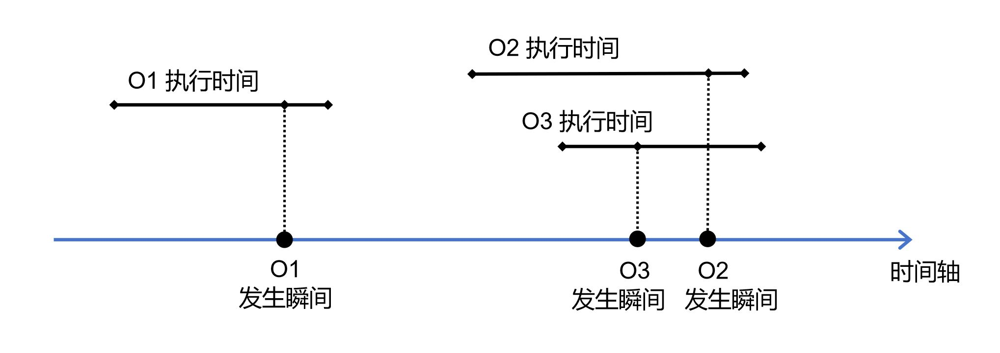

# 数据正确性

数据存储在数据管理系统里面。应用软件不断通过系统提供的增、删、改、查接口对数据进行访问。数据管理系统需要确保数据是完整的，不会轻易丢失或损坏，同时也要确保应用软件对数据的每一次访问都是正确的。事实证明，要实现这些目标并不容易，需要在数据管理系统中构建专门的正确性保障机制，确保数据的完整性和正确性。

## 数据完整性

存放在计算机中的数据在很多情况下会发生丢失或损坏。例如，当数据管理系统在运行过程中遇到停电，一个数据更新操作只将硬盘上的数据修改了一半，没有完成，就会导致数据错误的发生（比如一个人的出生日期改动了，但相应的年龄没来得及改动，从而出现数据不一致）。又例如，数据管理系统的程序可能存在错误（bug），在某次数据读写的过程中该程序错误被触发，结果把数据写错了。再例如，计算机的硬件可能发生损坏，比如硬盘中的存储介质出现老化，导致其中存放的数据丢失。同理，如果遇到火灾、地震等灾害，导致计算机系统损毁，内部的数据也会随之丢失。此外，还可能发生一些人为事故，比如系统管理员恶意删除数据、黑客入侵系统后篡改数据等。

对所有这些情况，我们都可以采取某些措施去避免或者减少损失。比如我们可以定期备份数据，确保硬件的损坏不会轻易导致数据的全部丢失。我们也可以缩小数据管理权限的范围，减少人为损坏数据的概率。我们还可以构建更严密的防火墙，抵御更多的黑客攻击。可以看到，保证数据的完整性并不全是数据管理系统的责任。但我们需要理清数据管理系统的职责，并让数据管理系统提供相应的功能支持。

首先，计算机的稳定性是有限的，意料之外的故障和停机随时可能发生。虽然各个领域的软硬件厂商都在竭尽所能提升产品的稳定性，但各类软硬件产品始终处在不断升级换代的演进过程中，稳定性难以达到绝对让人满意的程度。鉴于此，数据管理系统必须能够应对常见的故障和停机问题。换言之，即便出现故障或停机，数据管理系统也要确保数据不会发生损坏，并且能够在最短的时间内恢复正常运行。

其次，即便数据的损坏或丢失不能避免，我们还可以通过数据备份的方式来挽救或弥补。换言之，如果我们定期将数据复制一份，存储到另一个安全的地方；如果数据发生损坏，我们可以将另一份数据拷贝回来使用。如果数据备份做得及时，就可以最大程度上减小损失。既然备份是常用的数据保护措施，那么数据管理系统就应该提供支持数据备份的功能，方便数据备份的实施。

## 数据访问的正确性

在数据完好无损的前提下，数据管理系统还需要保证每一次数据访问的结果都是正确的。单次数据访问的正确性是容易保证的，只要确保数据访问的程序不出错就行。但大部分数据管理系统是支持并发操作的，即可以同时处理多个用户的数据访问请求，并竭尽所能获得最高的系统吞吐率。在多个数据访问同时进行的情况下，保证每次数据访问的正确性就不再是一个简单的问题了。

**场景1**：例如，假设用户A想要从一个数据集中先删除一个数据项X，然后再插入一个新的数据项Y。与此同时，用户B正在试图读取X。用户B先通过索引找到了X所在的存储位置。当它正准备读取数据的时候，操作系统的CPU资源调度被触发，导致该读取动作被暂停了。此时，用户A的数据访问开始进行，它先删除了X，又将Y存放在了X原来的位置。用户A的数据访问结束后，用户B又重新获得了CPU的使用权，开始继续读取数据。然而，此时的用户B并不知道X已经被删除并被替换成了Y。最终，用户B错将Y作为X读了出去，并引发了一系列的错误结果。

并发的数据访问除了可能导致单个数据操作发生错误，还可能整个影响应用程序的逻辑正确性。

**场景2**：例如，我们可能遇到以下情况：用户A和用户B协商好，准备同时访问一个数据项，并根据访问结果完成一笔交易。但恰好在这个时候，用户C提交了修改这个数据项的请求。最后，A和B的数据访问得到了不同的结果，A得到的是C修改之前的结果，而B得到的是C修改之后的结果。用户A和用户B可能一开始没有考虑过来自第三个用户的干扰，以为同时访问到的数据一定是一致的，结果导致了意想不到的错误。

**场景3**：又例如，某位用户和自己的家人在未事先协商的情况下使用同一个账户在电商平台上购物，需要同时从账户余额中扣款（假设账户余额存储在一个单独的数据项中）。扣款的过程涉及两个操作：首先读取余额，判断余额是否充足；如果余额充足，则修改余额，扣除相应款项。但由于两个扣款过程同时进行，可能会出现如下情形：两个过程同时读取余额，并都认为余额是充足的，之后又各自扣除了一大笔款，导致账户透支了。

以上这些情形都是因为并发数据访问导致的意想不到的结果。作为数据管理系统，一方面可以采取针对性措施避免意外情况的发生，另一方面也需要明确界定自己的行为模式，让用户事先意识到可能的意外结果，引导用户在编写应用程序的时候对所有情况进行全面考虑。

## 数据访问操作的原子性

数据访问操作的原子性是一个简单而实用的概念。当一个数据管理系统的访问接口满足原子性时，上述的很多意外情况将被避免。原子性也让数据管理系统的使用者对数据访问的正确性有一个明确的预期，从而帮助他们制定合理正确的数据访问逻辑。

原子性为数据访问提供了两方面的正确性保证。一方面，它确保故障的发生不会轻易导致数据的损坏。另一方面，它一定程度上避免了并发数据访问操作之间的相互干扰。以下分别阐述这两方面的性质。

**面向故障的原子性**：对于任意一个增、删、改、查的数据访问操作，一旦系统收到了操作请求，即便遇到计算机故障，也只可能有两种结果：要么系统完整地执行了该数据访问操作，要么系统完全忽略了该操作，什么也没有做。

在物理世界里，原子被作为最小的粒子，是不可分的。在数据管理的场景中，原子性意味着数据访问操作也是不可分的，要么全部完成了，要么就像没有做过一样。有了原子性保证，我们可以不必担心一个操作做到一半就被终止，从而导致数据的损坏。即便断电、宕机等故障发生，也如此。此外，原子性也提供了处理故障问题的灵活方案：如果操作因为故障而实在无法完成，还可以选择将它撤销，恢复到没有做过的状态。

**并发数据访问操作的原子性**：所有增、删、改、查的数据访问操作之间不会发生任何相互干扰，以至于在效果上每两个操作间都有明确的先后次序。

在物理世界里，原子作为最小的粒子，在空间里是不会相互重叠的。数据访问的原子性实质上也是要求所有数据访问操作在时间上不发生重叠，从而避免它们的相互影响。但是，如果我们允许数据访问操作同时进行（即并发），它们在执行时间上的重叠就变得难以避免。这会导致原子性无法实现吗？其实不然。虽然任意一个数据访问操作都需要一定的执行时间，但我们可以采取一定的手段，让每一个数据操作从效果上可以被视为瞬间发生的。如果所有数据访问操作从效果上都是瞬间发生的，他们之间就不可能发生重叠。

	
	 
	

		图 4.1 并发数据访问操作的原子性
	

如上图所示，在一段时间里发生了三次数据访问操作，分别被标识为O1、O2和O3。其中，O1最先发生，其执行过程耗费了一定的时间。当O1结束时，O2和O3并没有开始。因此，O1的执行并不会受到O2和O3的干扰。相比而言，O2和O3的执行时间则高度重合，可能发生相互干扰。如果我们能够保证数据访问操作的原子性，那么每个操作从效果上就相当于是在瞬间发生的。如图4.1所示，O1、O2和O3发生的瞬间都在时间轴上被标注了出来。这样一来，虽然O2和O3的执行时间重合，它们从效果上看实际上是先后发生的，并不会相互影响。

为了实现数据访问操作的原子性，数据管理系统需要提供两套数据保护机制，分别为恢复机制和并发控制机制。恢复机制用于确保数据访问操作面向故障的原子性。而并发控制机制用于确保并发数据访问操作之间的原子性。后续将详细介绍这两种机制的工作原理。

对于上一节描述的三个场景，一旦数据管理系统能够保证数据访问操作的原子性，场景1的错误就可以被完全避免。然而，场景2和场景3的意外情况仍然会发生。场景2和场景3的情况需要更复杂的事务处理机制来应对。本章先介绍实现数据访问原子性的机制，再介绍事务处理机制。

[**上一页<<**](chapter3.5-D.md) | [**>>下一页**](chapter4.2.md)
