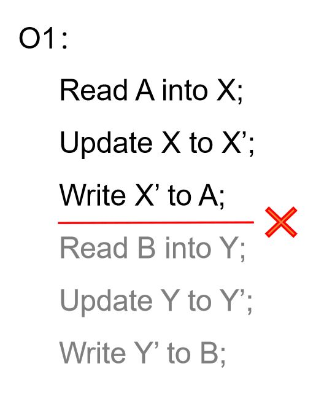
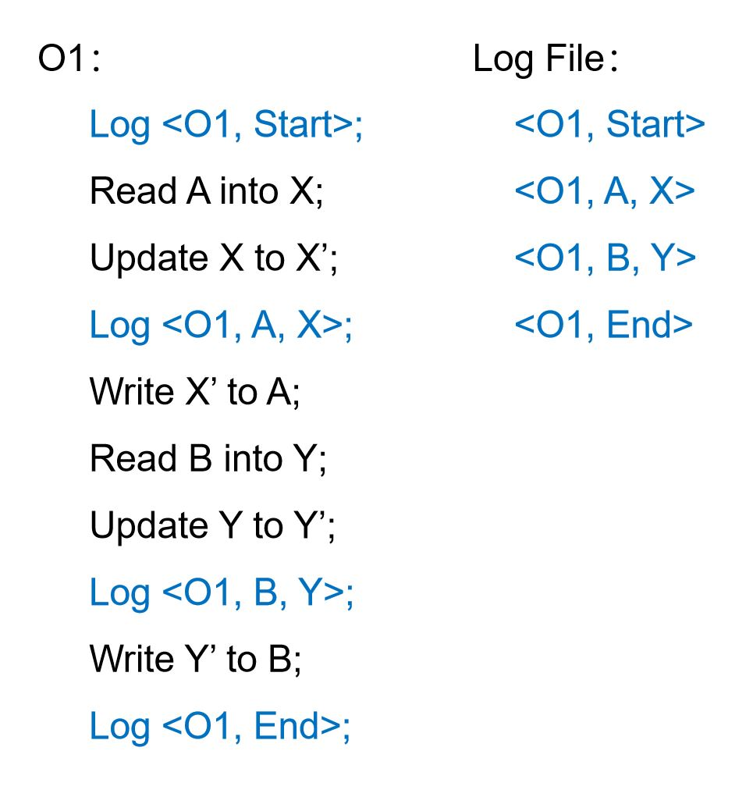
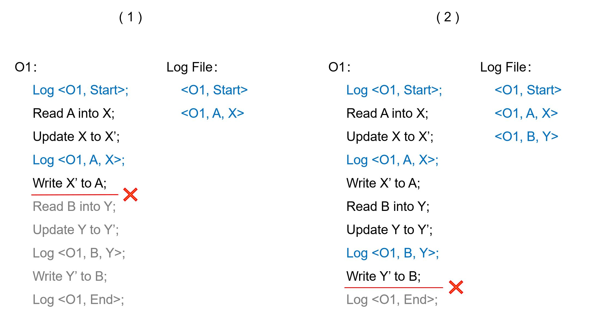
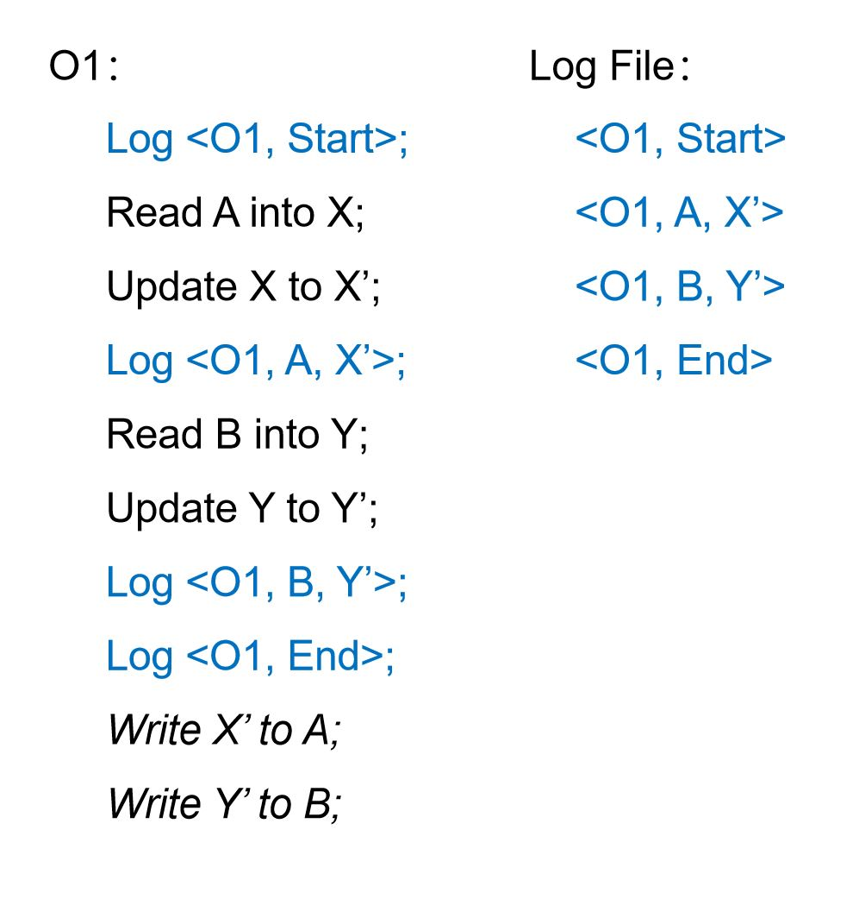
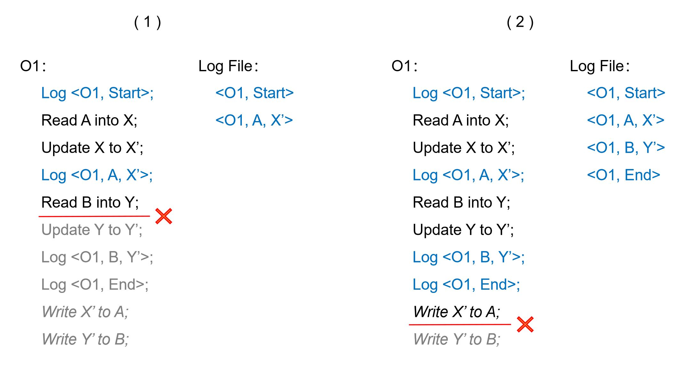
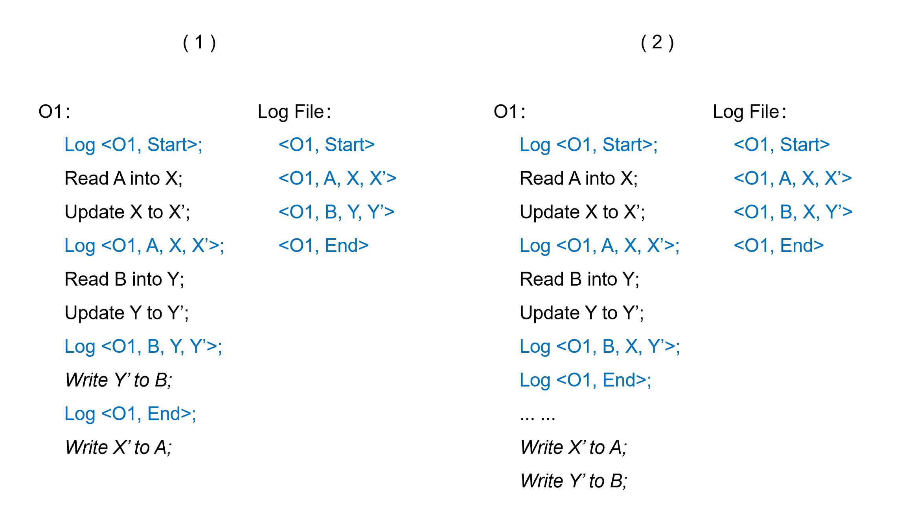
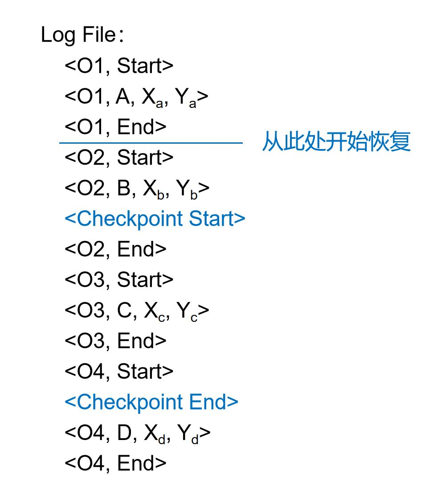

## 4.2 恢复机制

为了保护数据完整性，任何一个数据管理系统都需要提供一套恢复机制，以确保系统在遇到故障而中断后不会导致数据被不完整的数据访问操作（包括增、删、改等）破坏。如上一节提到的，系统需要保证数据访问操作的原子性，即任意一个数据访问操作都是原子的，即便遇到故障，它要么被完整的执行，要么就像从来没有开始过一样。本节介绍恢复机制是如何实现这一原子性的。

为了方便读者理解，我们将一个简化的数据更新操作作为例子，用于解释恢复机制的工作原理。假设要完成一个数据更新操作O1，我们需要更新A、B两个数据页（例如B存放了被更新的数据项，而A存放了该数据项的索引信息）。根据存储硬件的构造原理，计算机系统每次只能完整地读写一个数据页，而无法一次性完成两个数据页的读写。那么，我们可能会遇到如图4-2-1中的情况：

	
	 
	

		图 4-2-1 故障导致操作O1无法完成
	

也就是说，当O1完成了对数据页A的更新，还没有来得及访问B时，系统发生了故障，比如停电。故障使得系统终止了。由于O1未完成，A和B处于不一致的错误状态。当恢复运行后，如果系统无法感知O1遇到的情况，这个错误将永久存在。恢复机制所起的作用就是感知到O1没有被完整执行的情况，并将A和B更新到一致的状态（要么将A恢复到O1发生之前的状态，要么继续完成O1对B的更新）。

大部分的恢复机制都是通过记录日志来实现数据操作的原子性的。当系统对数据进行增、删、改时，还会将数据访问的历史过程记录下来，称为日志。一旦故障发生，系统将停止并一段时间后重新启动。在重新启动时，系统会首先读取日志，通过分析日志发现那些没有被完整执行的操作，并通过修正这些操作实现原子性。记录日志的方式有多种。以下介绍常见的几种模式。

### 4.2.1 Undo日志

Undo日志是一种比较容易想到的日志记录模式。它的工作方式如图4-2-2所示：

	
	 
	

		图 4-2-2 Undo日志记录过程示例
	

系统专门使用一个文件来记录日志（图中称为Log File）。系统在工作过程中，使用Log命令将一个个由“< ... >”标识的日志记录追加写到日志文件中。当一个操作开始的时候，系统首先记录该操作的*开始日志*，该日志记录由操作的代号和关键字“start”构成。当一个操作完成的时候，系统会记录该操作的*结束日志*，该日志记录由操作的代号和关键字“end”构成。在操作的执行过程中，如果要对某项数据进行更新，系统会在更新发生前首先记录一个*更新日志*，该日志记录由操作的代号、被更新数据的ID以及数据在操作开始前的取值组成。

一旦有了这样的日志记录，系统将在故障恢复时识别出没有完成的操作，并准确地将数据恢复到操作开始前的状态。

	
	 
	

		图 4-2-3 Undo日志遭遇故障的两种情况
	

图4-2-3提供了两种故障发生的情况。在第一种情况中，系统完成了对数据页A的更新，但在访问B之前遇到故障而被终止。系统重新启动后，首先利用Undo日志对数据进行恢复。读取日志文件后，系统发现O1这个操作有开始日志而缺少结束日志，因此断定O1在系统终止前并没有完成。通过日志记录，系统进一步发现O1可能已经对数据页A进行了更改，因此系统使用更新日志将A改回到更新之前的值X。恢复完成后，数据就回到了O1开始之前的状态。O1就像没有发生过一样，原子性得到了保证。

在第二种情况中，系统实际上已经完成了对所有数据的更新，但在记录结束日志之前遇到了故障。在恢复过程中，系统仍然只读到了O1的开始日志，而无法读到它的结束日志。因此，系统仍然会断定O1没有结束，并使用更新日志将A和B都恢复到O1开始之前的状态。

我们可以将基于Undo日志的恢复机制的实施规则总结如下：
1. 在操作开始时记录开始日志；
2. 在更新硬盘上的任何一项数据之前，先记录该数据的更新日志；
3. 在硬盘上完成了所有数据的更新之后，才能记录结束日志；
4. 在恢复时，如果一个操作的结束日志未被记录，则撤销整个操作，即将其所有改动过的数据恢复到操作开始前的取值；否则，不采取任何行动。

### 4.2.2 Redo日志

在实施Undo日志时，我们需要记录每个数据被更新之前的取值。另一种日志记录方式称为Redo日志，它只记录每个数据被更新之后的取值。其工作方式如图4-2-4所示：

	
	 
	

		图 4-2-4 Redo日志记录过程示例
	

与Undo日志一样，当一个操作开始的时候，系统首先将该操作的*开始日志*记录到Redo日志中。当一个操作完成的时候，系统会记录该操作的*结束日志*。与Undo日志不同，系统在记录结束日志之前，不会对硬盘上的数据做任何更新，而是只记录*更新日志*。更新日志里记录的是数据被更新之后的取值。只有到结束日志被记录下来之后，系统才允许操作对硬盘上的数据进行更新。

利用Redo日志，系统同样可以保证数据访问操作的原子性。

	
	 
	

		图 4-2-5 Redo日志遭遇故障的两种情况
	

图4-2-5展示了Redo日志可能遇到的两种故障情况。在第一种情况中，系统完成了对数据页A的更新，但在更新B之前遇到故障而被终止。系统重新启动后，首先利用Redo日志对数据进行恢复。读取日志文件后，系统发现O1操作有开始日志而缺少结束日志，因此断定O1在系统终止前没有完成执行。按照Redo日志的记录方式，系统不会在记录结束日志之前对硬盘上的数据进行修改。因此，数据在系统重新启动后仍然处于O1开始之前的状态，系统可以直接认定O1从来没有发生过，而不需要采取任何。

在第二种情况中，系统在记录结束日志之后才遇到了故障。在恢复过程中，系统仍然只读到了O1的结束日志，因此断定O1已经结束了。然而，此时的系统无法确定硬盘上的数据是否已经完成了更新。为了确保数据被更新到O1完成之后的状态，系统会使用O1的更新日志对硬盘上的A和B进行再次更新，将其变成O1完成之后的取值，即X'和Y’。这一重新更新的过程称为*日志重放*。

我们可以将基于Redo日志的恢复机制的实施规则总结如下：

（1） 在操作开始时记录开始日志；
（2） 在更新数据时，暂不改动硬盘上的数据，而是先记录该数据的更新日志；
（3） 在记录结束日志之后，才能对硬盘上的数据进行更新；
（4） 在恢复时，如果一个操作的结束日志有被记录，则重做整个操作，即将其所有改动过的数据更新为操作结束后的取值；否则，不采取任何行动。

相比Undo日志，Redo日志带来的一大便利是它可以推迟对硬盘上数据的更新动作。根据第3章对存储体系结构的阐述，数据管理系统会在内存中开辟一个空间作为缓存。硬盘上常用的数据页会被暂存在缓存中，以提升数据访问的效率。利用Redo日志，我们可以允许增、删、改操作只对缓存中的数据进行更新，而不急于将更新写到硬盘上。当积累了多个更新之后，再一次性将这些更新写到硬盘。这样有助于大幅减少硬盘I/O操作，从而提高系统的整体性能。对Undo日志而言，由于它要求在记录结束日志之前将所有数据更新写到硬盘，就无法获得这个好处。

### 4.2.3 比较两种日志模式

我们看到，Undo日志和Redo日志都可用于实现数据访问操作的原子性。两种日志模式都要求每个操作在结束时将一个结束日志记录到硬盘上。在进行故障恢复时，系统会通过结束日志判断这个操作事实上是否已经完成。对于Undo日志，如果一个操作事实上未完成，恢复机制需要对已经进行过的更新操作进行复原（undo）。对于Redo日志，如果一个操作事实已经完成，恢复机制需要对已经进行过的更新操作进行重放（redo）。Undo日志和Redo日志都要求在对硬盘上数据进行更新之前先将相应的更新日志写到硬盘上。因此，这两种日志模式都称为*写前日志*（Write Ahead Log，简称WAL）。两者的主要区别在于，Undo日志要求系统在记录结束日志之前就完成对硬盘上数据的更新，而Redo日志要求系统在记录结束日志之后才能实施对硬盘上数据的更新。

前文提到了Redo日志相对于Undo日志的优势，即系统可以无限推迟对硬盘上数据的更新时间，从而可以减少I/O并获得更优的性能。如果系统的内存容量大，Redo日志甚至可以在一段时间内都不对硬盘上的数据进行任何更新，而单纯在硬盘上记录日志。日志是被顺序追加到日志文件末尾的，对硬盘而言是100%的顺序访问操作，因此还可以获得极高的硬盘访问性能。

然而，Redo日志也有明显的局限性。由于它要求系统在记录结束日志之后才能实施对硬盘上数据的更新，对于大范围的数据更新，可能会出现过度占用内存缓存的情况。最极端的情况是，如果一个操作待更新的数据多到超过了内存的容量，这个操作将无法通过Redo日志的方式完成，因为在记录它的结束日志之前内存就已经被耗尽了。Undo日志则不会遇到这个问题。

因此，我们更希望能够结合Undo日志和Redo日志的优势，构造出一种更灵活的日志模式。Undo/Redo日志就是这样一种模式。其工作方式如图4-2-6所示：

	
	 
	

		图 4-2-6 Undo/Redo日志记录过程示例
	

对每一个被更新的数据，Undo/Redo日志既会记录其更新之前的取值也会记录其更新之后的取值。有了这两个取值，系统既可以将更新复原，也可以对更新进行重放。Undo/Redo日志也是一种写前日志，即它要求在对硬盘上数据进行更新之前先将相应的更新日志写到硬盘上。除此之外，它不再对硬盘上数据的更新时间做更多限制。上图中展示的两种情况选择了不同时机实施数据更新，都是正确的。在恢复过程中，Undo/Redo日志依然通过结束日志判断一个操作是否事实上已经结束了。如果一个操作事实上尚未结束，系统将对已经进行过的更新操作进行复原；否则，系统将对已经进行过的更新操作进行重放。

总之，基于Undo/Redo日志的恢复机制的实施规则可总结如下：

（1） 在操作开始时记录开始日志；
（2） 在更新硬盘上的任何一项数据之前，先记录该数据的更新日志；
（3） 在操作结束时记录结束日志；
（4） 在恢复时，如果一个操作的结束日志未被记录，则撤销整个操作，即将其所有改动过的数据恢复到操作开始前的取值；如果一个操作的结束日志有被记录，则重做整个操作，即将其所有改动过的数据更新为操作结束后的取值。

### 4.2.4 检查点

Redo日志以及Undo/Redo日志均要求系统在恢复时重做所有已经事实上完成的操作。虽然这样做可以确保数据访问操作的原子性，在实施过程中却会面临明显的问题。如果一个系统已经正常运行了很长时间，并在其间完成了无数数据更新操作，它将会积累大量日志。如果此时系统因发生故障而终止，恢复时就需要重做日志中所有已完成的操作。这将产生巨大的恢复开销。实际上，绝大部分较早前结束的操作已经完成了对硬盘上数据的更新，无需重新执行。但系统并不知道这一点，不得不重做所有的操作，这也是一种巨大的浪费。

为了规避这个问题，大部分数据管理系统的恢复机制都提供*检查点*（Checkpointing）功能。系统会定期启动检查点操作（Checkpoint），将缓存中的所有数据全部写回到硬盘。检查点操作完成后，那些在它之前已经结束的操作就不再需要重做了，因为他们的数据更新已经被完整的落实到硬盘上了。这些操作所对应的日志甚至可以被删除掉，以节省日志文件对硬盘空间的消耗。

检查点操作通常也会被记录在日志里面，如图4-2-7所示。

	
	 
	

		图 4-2-7 日志中的检查点记录
	

当系统开始启动检查点操作时，会首先在日志中写入一个“检查点开始”记录。待系统将缓存中的所有数据都写回到硬盘后，会再在日志中写入一个“检查点结束”记录。做进行检查点的同时，其他数据访问操作可以同时进行，不受影响。因此，会有其他日志记录出现在“检查点开始”与“检查点结束”之间。当系统进行恢复时，会先找到距离当前最近的那一个已完成的检查点，并从该检查点的开始记录处开始重放日志。

假如系统在故障恢复时看到的日志记录如图4-2-7所示。可以推断，距离当前最近的检查点操作已经完成，而且O2之前的操作在该检查点开始之前已经结束了。于是，系统只需要从O2开始重放日志就能确保数据的完整与正确。

假如一个数据管理系统使用了Undo/Redo日志，并定期执行检查点操作，那么它在故障后的恢复流程大致如下：
（1） 从尾部向前扫描日志文件，找到最后一个已经完成的检查点P；
（2） 继续向前扫描日志，找到最早的在P开始时尚未结束的操作O;
（3） 从O的“开始日志”处向后扫描日志文件，依次重做扫描到所有数据更新，直至日志文件的末尾。
（4） 再次从尾部向前扫描日志文件，对所有事实上未完成的操作，依次对其更新操作进行还原，直至O的“开始日志”处。

### 练习题

**1**. 系统使用了undo日志，在故障发生后，发现日志记录如下：<o1,start>, <o2,start>, <o2,A=5>, <o2,B=4>, <o2,end>, <o1,A=3>，<o1,C=3>。请问：系统恢复后A的取值是多少？
 <ol type="A">
  <li>5</li>
  <li>4</li>
  <li>3</li>
  <li>不知道</li>
 </ol>

 **2**. 我们用log表示将日志写到硬盘，用write表示把数据写到硬盘。如果系统使用undo日志，那么以下哪个操作执行序列是不能保证原子性的？
 <ol type="A">
  <li>log(o1,start), log(o1,A=5), write(A=6), log(o1,B=3), write(B=4), log(o1,end)</li>
  <li>log(o1,start), log(o1,A=5), write(A=6), write(B=4), log(o1,B=3), log(o1,end)</li>
  <li>log(o1,start), log(o1,A=5), log(o1,B=3), write(A=6), write(B=4), log(o1,end)</li>
  <li>log(o1,start), log(o1,A=5), log(o1,B=3), write(B=4), write(A=6), log(o1,end)</li>
 </ol>

 **3**. 我们用log表示将日志写到硬盘，用write表示把数据写到硬盘。如果系统使用redo日志，那么以下哪个操作执行序列是不正确或不可能发生的？
 <ol type="A">
  <li>log(o1,start), log(o1,A=5), log(o1,end), write(A=5), log(o2,start), log(o2,A=6), log(o2,end), write(A=6)</li>
  <li>log(o1,start), log(o1,A=5), log(o1,end), log(o2,start), log(o2,A=6), write(A=5), log(o2,end), write(A=6)</li>
  <li>log(o1,start), log(o1,A=5), log(o1,end), log(o2,start), log(o2,A=6), log(o2,end), write(A=6)</li>
  <li>log(o1,start), log(o2,start), log(o2,A=6), log(o2,end), log(o1,A=5), log(o1,end), write(A=5), write(A=6)</li>
 </ol>

[**上一页<<**](chapter4.1.md) | [**>>下一页**](chapter4.3.md)
