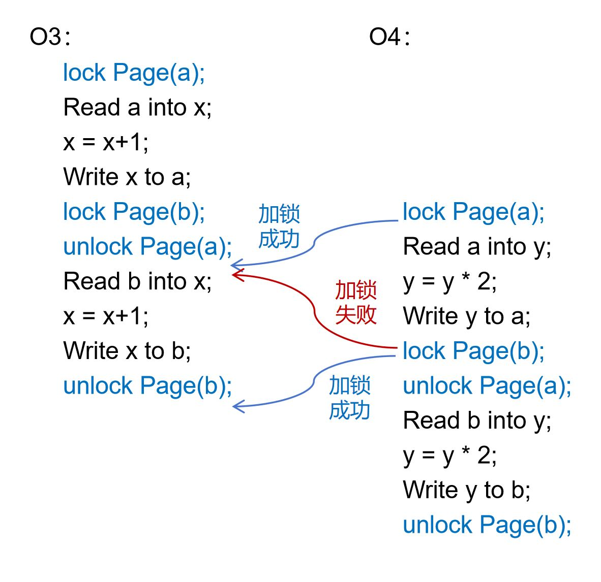

# 并发控制机制

如前文所述，大部分数据管理系统支持并发的数据访问操作，即可以同时执行多个数据访问请求，以获得尽可能高的系统吞吐率。为了确保并发的数据访问操作之间不发生相互干扰，数据管理系统会诉诸并发控制机制，以实现并发操作的原子性。

为了方便读者理解，我们先使用一个简单例子来用说明并发操作可能造成的困扰。假设有两个数据更新操作O1和O2，都希望对数据项a的取值进行更新。O1想将a的取值累加1，而O2希望将a的取值累加2。O1和O2被同时提交给数据管理系统。于是系统将它们交给两个线程并行执行。由于底层操作系统对CPU的调度，实际的执行顺序如下图所示。

	
	 
	

		图 4.9 并发导致操作O1的更新丢失
	

在并发执行的过程中，O1率先读取数据项a。但当O1还没有来得及对a进行更新时，O2也完成了对a的读取，并且读到了同一个取值。此后，O1先完成了对a的更新，紧接着O2才完成了对a的更新。O2的更新实际上将O1的更新覆盖了。从效果上看，O1就像从来没有发生过一样。但O1并不知道O2的存在，也不知道自己的更新被覆盖了，它会告知应用程序自己完成了更新，最后导致应用程序出错。

如果O1和O2具备原子性，就应该遵循严格的先后次序，O1要么在O2开始之前完成执行，要么在O2完成之后开始执行。这样才能确保两个操作的更新都不会丢失。而并发控制机制的目的就是要确保这样的原子性。

## 基于锁的并发控制

加锁是一种常见的并发控制手段。简单而言，就是让每个操作在访问数据之前先对数据加锁，而在完成数据访问之后再释放掉锁。由于操作系统只允许同一把锁在任意时间内被一个线程独占，因此可以确保每个操作在持锁期间独享对数据的访问权，从而避免并发操作之间相互影响。

对上述例子中的O1和O2，我们可以采取如下图所示的加锁和解锁操作。O1在读取数据项a之前会率先对a所在的数据页加锁，待完成对a的更新之后再释放锁。此时，由于O2无法在O1持有锁的同时获得a所在数据页的锁，它也就无法在O1执行数据更新之前获得对a的访问权。O1和O2的原子性由此得到了保证。

	
	 
	

		图 4.10 加锁可确保O1和O2的原子性
	

对于访问不同数据的操作，它们试图获得的锁是不同的。因此，它们之间不存在对同一把锁的争夺，其并发性可以得到保证。可见，基于锁的并发控制机制既可以保证数据访问操作的原子性，也能在一定程度上确保数据管理系统的并发能力。

## 两阶段锁

为了完整地实现数据访问操作的原子性，加锁和解锁的时机是需要考究的。下图中的O3和O4是两个更复杂的数据更新操作。如果我们仅在访问数据之前加锁，而在数据访问结束后立即解锁，原子性并不能得到有效保证。

	
	 
	

		图 4.11 简单加锁未必能实现原子性
	

O3和O4都希望对数据项a和b进行一致的修改。O3希望将a和b累加1。O4希望将a和b翻倍。两者都在完成对a的更新后立即释放掉a的锁，而在访问b之前才对b加锁。这样的加锁方式可能会遇到图4.11展示的例外情况。也就是，O3释放掉a的锁之后，由于CPU调度原因被暂停了。此时，O4得到了a的锁，并一鼓作气完成了对a和b的更新。之后，O3才重新获得了CPU的使用权，并完成了对b的更新。结果导致了O3和O4更新a和b的顺序不一致：a先被O3更新再被O4更新，被更新为(a+1)\*2；b却是先被O4更新再被O3更新，被更新为a\*2+1。如果O3和O4具备原子性，就一定不会出现这样的结果，而会以同样的顺序更新a和b。

由此可见，加锁和解锁需要遵循一定的原则才能确保原子性。如下图所示，如果O3和O4等到整个操作完全结束后才释放a和b的锁，就不会遇到上述情况。

	
	 
	

		图 4.12 最后释放锁可确保O3和O4的原子性
	

此时，无论O3和O4的谁先拿到a的锁，谁就能率先独享对a和b的访问权。而另一个操作只能等到前一个操作完成并释放锁之后才能获得对a和b的访问权。

如果我们不推迟对a的解锁时间，转而提前对b的加锁时间，同样可以确保O3和O4的原子性。如下图所示，我们稍微提前了对b的加锁时间，让O3和O4在释放a的锁之前先对b加锁，就能达到想要的效果。

	
	 
	

		图 4.13 提前加锁也可确保O3和O4的原子性
	

假如O3先拿到a的锁，并率先完成了对a的更新。当O3释放掉a的锁之后，O4立即获得了这把锁，紧接着也完成了对a的更新。为了破坏原子性，O4希望先于O3完成对b的更新。但它做不到这一点。即便O3停止不前，O4也无法获得b的锁，因为O3在释放a的锁之前就抢先对b加了锁。换言之，基于图4.13的加锁和解锁顺序，谁先获得了a的锁，它就一定能先获得b的锁，从而保证了它能率先实现对a和b的更新。

图4.12和图4.13似乎都选择了正确的加锁和解锁时机，从而让原子性得到了保证。那么，什么样的加锁原则可以确保原子性呢？我们可以从理论上证明，如果一个数据管理系统的所有操作都遵循*两阶段锁*（Two Phase Locking）的加锁原则，就一定能保证原子性。所谓两阶段锁就是确保一个操作的所有加锁动作和所有解锁动作先后在不重叠的两个时间段进行，也就是说，所有的加锁动作都必须发生在所有解锁动作之前。下图是对两阶段锁的一种形象的刻画。前一个阶段是锁的扩展阶段，其间只能加锁不能解锁。后一个阶段为锁的收缩阶段，其间只能解锁不能加锁。图4.12和图4.13显然都满足两阶段锁的原则。

	
	 
	

		图 4.14 两阶段锁的示意图
	

两阶段锁之所以能实现原子性，主要在于它能保证所有操作在时间上有一个一致的先后关系。如果操作O1发生在O2之前，那么O1对任意数据的访问一定先于O2对这些数据的访问。由此，我们可以得到一个对两阶段锁原则的简单证明。

**简要证明**：

我们将每个操作视为图中的一个顶点。对于任意两个操作Oi和Oj，如果它们访问了同一个数据项a，并且Oi先于Oj访问a，那么我们就在图中添加一条由Oi指向Oj的边Oi &rarr; Oj，表示Oi和Oj在a上的先后顺序。由此就得到了一张有向图。要证明所有操作都满足原子性，相当于要证明它们在所有数据上的先后顺序都是一致的，即图中不会出现有向环。

对于两阶段锁原则，我们可以使用反证法。假设原子性被违反了，那么图中一定会出现一个有向环。环中的一条边表示数据访问的先后顺序。比如，Oi &rarr; Oj表示Oi先于Oj访问某项数据。由数据访问的先后顺序，我们可以得出一系列加锁和解锁的先后顺序。比如，Oi &rarr; Oj说明在Oi对这个数据解锁之后，Oj才对这个数据加锁。然而，如下图所示，这些先后次序一定会和两阶段锁规定的先后次序矛盾。由这个矛盾，我们就可以反推：一旦两阶段锁原则被遵循，原子性就一定不会被违反。

	
	 
	

		图 4.15 两阶段锁和对原子性的违反不会同时成立
	

**证毕**。

当使用两阶段锁时，并发操作对不同数据的加锁顺序可能是不同的，结果可能导致死锁。因此，数据管理系统常常需要使用死锁规避或死锁检测技术处理死锁问题。相关技术属于操作系统领域，这里不再赘述。

## 共享锁与排他锁

虽然加锁是实施并发控制并实现原子性的有效方式，但频繁加锁会导致数据访问操作之间的频繁阻塞，对系统性能造成负面影响。数据管理系统的研发人员会不遗余力地采取措施，消除锁带来的性能损失。对锁进行类型划分就是一种行之有效的措施。

	
	 
	

		图 4.16 区分共享锁和排他锁有利于提升并发度
	

如图4.16（1）所示，O5和O6都将先后访问数据项a和b。根据两阶段锁的原则，在访问a之前需要先对a所在的页上锁，直到操作结束后才能解锁。因此，O5和O6都将在操作执行的全过程持有a的锁，以至于它们完全互斥，在任何阶段都无法并行运行。但事实上，如果系统中仅有O5和O6在运行，它们不必在访问a时加锁。因为这两个操作都只会读取a的值，而不会对a做任何修改，即便不对a加锁最后结果都不会改变。如果放弃对a加锁，O5和O6都并行度就提高了：至少在访问a的阶段，它们是不互斥的，可以并行执行。

为了减少锁带来的不必要的互斥，我们可以将锁分为*排他锁*（表示为xlock，即exclusive lock）和*共享锁*（表示为xlock，即shared lock）。这两类锁的互斥性可由下面的矩阵表示。

|      | slock | xlock |
| ---: | :---: | :---: |
| **slock** | 相容 | 互斥 |
| **xlock** | 互斥 | 互斥 |

排他锁又称为写锁。如果一个操作对一个数据项加上了排他锁，在锁释放掉之前，其他操作都不能再对该数据加任何类型的锁。共享锁又称为读锁。如果一个操作对一个数据项加上了共享锁，其他操作还能对该数据再加共享锁，但在共享锁释放掉之前，却不能对该数据加排他锁。也就是说，多个操作可以同时获得一个数据的共享锁，而排他锁却只允许一个操作单独获得。

有了共享锁与排他锁的分类，我们可以对两阶段锁做如下改进：在读取一项数据之前，先对该数据项加共享锁；在修改一项数据之前，先对该数据加排他锁；操作完成时再释放掉所有的共享锁和排他锁。如图4.16（2）所示，这种方式同样可以保证操作的原子性。相对于单一类型的锁，区分共享锁与排他锁让O5和O6可以同时获得a的共享锁，这样它们可以并行对a进行读取。

## 定制化的并发控制机制

虽然分类型加锁可以在一定程度上减少两阶段锁的阻塞，但我们仍然会遇到严重的阻塞情况，以至于系统的性能被大幅削弱。例如，在B+树是使用两阶段锁就可能遇到类似的情况。

	
	 
	

		图 4.17 B+树的分裂为并发控制带来困难
	

假设我们希望在一棵B+树上并发执行查询和插入操作。如图 4.17所示，一棵B+树的局部有A、B、C三个节点。其中，A是B和C的父亲节点。当插入一个新的键值12后，节点C被分裂成了D和C两个节点（其中D为新增节点），随后节点A也被做了相应更新。但在这个插入操作的执行过程中，另一个查询操作也在进行。这个查询操作想要访问键值9。

如果我们不实施并发控制，那么下面的情况可能发生。查询操作在插入操作开始之前首先访问了节点A，并得知键值9应该存放在节点C里面。但在查询操作访问C之前，插入操作被率先执行了，它将这棵B+树分裂成了图 4.17右侧的形态。此后，查询操作才得以访问C。但它对C的分裂并不知情，最终得出错误结论：键值9并不存在。

如果我们要保证查询和插入操作的原子性，可以使用两阶段锁实施并发控制。对查询操作而言，它会依次对节点A和C加共享锁，并在找到键值9之后再释放锁。对插入操作而言，它会先对节点A加共享锁，随后在分裂的过程中依次对C和A加排他锁（对A实际上是将共享锁升级为排他锁），在插入结束后再释放锁。有了两阶段锁，查询操作和插入操作之间会发生明显的互斥，从而避免上述错误情况的发生。例如，当查询操作访问完A之后，不会立即释放A上的共享锁。此时，插入操作就无法获得A的排他锁，以至于无法完成整个插入操作。即便C已经被分裂和修改了，由于插入操作未完成，C上的排他锁仍然被插入操作持有。这样，查询操作也就不能完成对C的读取。因此，错误的读取不会发生。

然而，虽然两阶段锁可以保证B+树操作的正确性，却会带来难以接受的性能代价。以上述情况为例，查询操作会自顶向下对其经过的所有节点加上共享锁。而插入操作可能引发连锁分裂，会自底向上对多个节点加排他锁。相反的加锁顺序很容易导致死锁发生。死锁一方面会带来死锁检测的性能开销，另一方面，为了让系统继续运行，还会迫使其中的部分操作被撤销。如果死锁频繁发生，甚至会导致饥饿（即某些操作始终无法完成），让B+树的性能变得难以接受。

B+树是数据管理系统普遍使用的索引结构，它的性能往往会决定整个系统的性能。因此，大部分系统不会简单使用两阶段锁实现B+树的并发控制，而会对B+树进行一定的改进，以便采用冲突更小的并发控制方法。图4.18和图4.19展示了一棵改进后的B+树的分裂和合并过程。经过改进，B+树的查询、插入和删除操作都不再需要使用两阶段锁，而只需在访问每个节点的期间对这个节点上锁（即访问前加锁，访问完立即解锁）。 但为了确保并发过程不出错，B+树的各种操作都需遵循特定的流程。

	
	 
	

		图 4.18 改进后的B+树分裂过程
	

图 4.18展示了键值12被插入后B+树的分裂过程。首先（（1）到（2）），B+树会构建一个新增节点D，将其作为C分裂出的新节点。此时，B+树原先的结构并不受影响，查询操作仍然可以在其上进行。随后（（2）到（3）），B+树会更新节点A，让新增节点D被正式插入到查询路径中。一旦A被更新，键值12就算插入成功了，随后的查询操作就能顺利查到12。此时，节点C没有变化，其中的键值9成为了冗余，但不会影响查询的正确性。如果在A被更新之前，有查询操作先读取了A，并计划接下去读取C。即便此时A被更新了，由于C并没有改变，这些查询操作仍然可以读到正确的数据。最后（（3）到（4）），等到所有访问过老版本A节点的操作结束后，B+树才会更新节点C，将多余的键值删除掉。

	
	 
	

		图 4.19 改进后的B+树合并过程
	

图 4.19展示了删除键值13导致节点B和C合并的过程。首先（（1）到（2）），B+树会更新节点C，将C中的键值13删除，并将B中的键值合并到C中。一旦C被更新，键值13就算被成功删除了。此时，虽然节点C中的键值4和8是冗余的，但不会影响查询的正确性。随后（（2）到（3）），B+树更新节点A，将节点B从查询路径中删除，成功将B和C合并为C。

根据图4.18和图4.19中的示例，读者可以继续推导B+树的插入和删除可能遇到的其他情况。总之，经过改进的B+树可以做到每访问完一个节点就安全地释放掉这个节点上的锁。这使得持锁时间大大缩短了，还完全避免了死锁，从而让性能获得了保障。这并不是一种比两阶段锁更高效的通用并发控制方法，而是通过改进B+树的数据访问过程而得到的特殊方案，本质上以一种为B+树量身定制的并发控制方法。大部分的工业级数据管理系统都使用的是经过改良的B+树，比如B-link Tree和Bw-Tree等，本质上都是使用定制化并发控制机制获得更好的性能。有兴趣的读者可以自行查阅相关资料。

我们可以看到，对数据管理系统而言，并发控制是一套复杂的机制。它既要能够保证数据访问的正确性，又要兼顾数据访问的并行度和性能。虽然像两阶段锁这样的通用并发控制机制可以确保正确性，但却难以保证并行度和性能。为了性能，我们往往需要针对具体的数据访问流程构建定制化的并发控制机制。在现实的数据管理系统中，我们常常是将通用并发控制机制和定制化并发控制机制混合起来使用的。这事实上增加了系统构建的复杂度，却是不得已而为之的策略。
