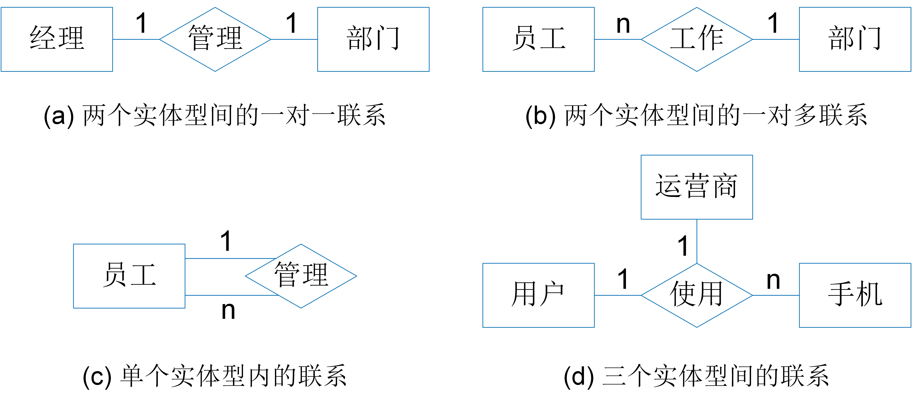
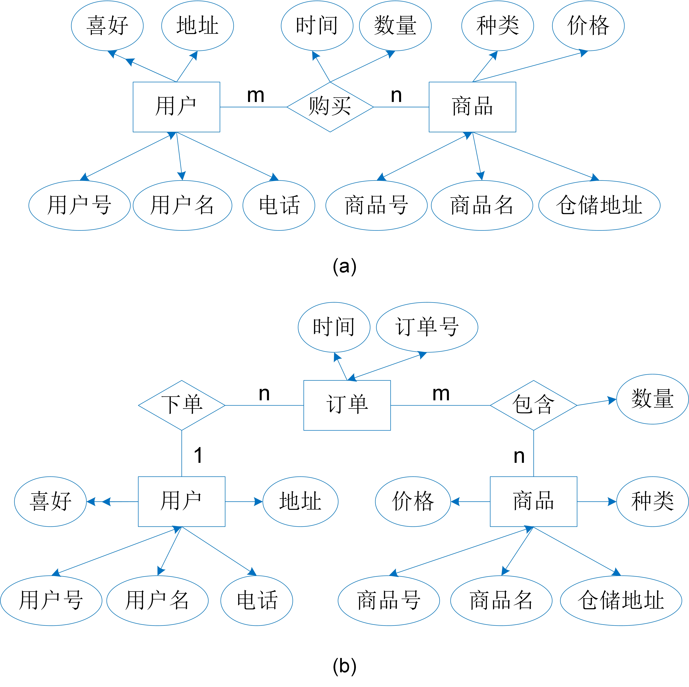

# 数据库设计

本书在开篇就提到，数据管理系统实质上是一个独立运行的功能模块，为应用软件提供数据管理能力。任何一款应用软件都是根据特定场景的应用需求由软件开发人员设计并开发出来的。设计一个应用软件是一个复杂的过程，包含了很多环节。其中的一个重要环节就是确定应用软件应该如何使用数据管理系统实现高效的数据管理。这包括：应该在数据管理系统中存什么数据，数据应该以什么样的结构和方式被存储，以及应用软件应该如何访问这些数据。这个环节通常称为数据库设计。

对不同的数据管理系统，由于其使用的数据模型不同，在其上进行数据库设计的方式也不尽相同。本章不针对任何具体的数据模型或数据管理系统，而是主要介绍数据库设计的基本步骤，以及适用于各种数据管理系统的概念模型设计方法。

## 数据库设计的基本概念和步骤

本书在讲述数据存储技术时提到了数据项（Data Item）和数据集（Data Set）的概念。一个数据项通常用于描述现实世界里的个体，比如一个人、一辆车等。一个数据集是一类数据项的集合，通常用于表示现实世界中的一类个体，比如一个企业的所有职员、一块场地里停放的所有汽车等。**数据库（Database）**的概念比数据集的概念更高一级，它通常是指一个完整的应用所使用的全部数据集。比如一个停车场应用需要用到职员的数据、汽车的数据、停车位的数据等。那么这个停车场的数据库里就至少应该包含一个职员数据集、一个汽车数据集和一个停车位数据集。

数据库设计目的就是确定一个特定应用的数据库的内容、结构和数据访问方式。通常，我们重点考虑以下三个方面：

* 存什么：应用程序的数据库中需要存储哪些数据，它们用于描述现实世界中的什么信息？
* 怎么存：这些数据在数据库管理系统中应该如何被表示、组织和存储？
* 如何访问：为了实现应用程序的功能，应用程序应该如何访问这些数据？

与应用软件的设计过程一样，数据库设计是一个需要反复迭代的过程，它不仅仅涉及设计工作本身，还涉及从实施到运行与维护的全过程。在当前常用的软件开发流程中，数据库设计包含以下5个步骤：

* 需求分析：充分、准确地理解应用软件的用户需求，确定应用软件的基本功能和业务流程。需求分析是整个设计过程的“基石”。基于它，我们才能确定应用软件的功能；根据功能，我们才能确定数据库里应该存放什么数据。
* 概念设计：根据应用软件的基本功能和业务流程，确定数据库内部应该存储什么内容。这些内容通常可以通过一个概念模型来表示，描述了现实世界中哪些对象以及哪些对象之间的关系需要存储在数据库中。
* 结构设计：根据数据库的内容（即由概念设计得到的概念模型），在某个具体的数据库管理系统上设计数据的表示结构（即数据模式（Schema））。一旦数据模式确定了，数据在系统中的存储结构就基本确定了。但为了更高的数据访问性能，结构设计还需要确定一些具体存储参数以及创建什么样的索引等。
* 数据库实施：部署数据库管理系统，根据结构设计创建数据库，编写与调试应用软件程序，组织数据入库并进行试运行。
* 数据库运行与维护：在数据库系统正式运行过程中，对数据库设计进行评估，以便进一步的调整和修改。

在现实的软件开发过程中，数据库设计往往不是一蹴而就的，需要对上述5个步骤进行循环迭代。另一方面，应用需求也在不断扩展与变化，也要求我们不断调整、优化数据库设计。

在上述数据库设计过程中，需求分析和概念设计是独立于任何数据库管理系统的，有通用的分析和设计方法。本章主要讲解这两方面的内容。而结构设计和后面的实施、运维都与具体的数据库管理系统密切相关。我们会在具体数据管理系统的相应章节再做介绍。

## 基于ERD的概念模型

概念设计的目的是确定数据库内应该存放什么数据。数据是用于描述现实世界中的人、事、物的。因此，概念设计的要点就是要搞清楚现实世界的哪些人、事、物以及这些人、事、物的哪些信息需要在数据库中描述。为了准确的刻画这些信息，我们通常会构建概念模型。概念模型用一组抽象的概念描述现实世界的人、事、物，避免了自然语言的模糊性和歧义性，有助于我们获得清晰的数据库设计。市面上常见的概念设计工具有很多，包括实体-联系图（Entity-Relationship Diagram，简称ERD）、统一建模语言（Unified Modeling Language，简称UML）等。ERD被更多用于数据库设计。因此，本章主要介绍基于ERD的概念模型。

	
	 
	

		图 5.1 员工与项目E-R图
	

ERD是由P. S. Chen于1976年提出的概念建模语言。它由实体（Entity）、属性（Attribute）、实体间的联系（Relationship）三个要素组成。其概念如下：

- 实体是指现实世界中客观存在并可以相互区别的事物，例如，一名学生、一门课、一名教师、一名职工等。同一种实体可以被归为一类，称为*实体类*。在ERD中，一个实体类由一个矩形表示。例如，在图5.1的ERD中有员工和项目两类实体。
- 属性是指实体所具有的某一特性。一个实体通常由若干个属性来描述，比如一个学生的学号、名字、出生日期都可以作为学生的属性。在ERD中，一项属性由一个椭圆表示。例如，在图5.1的ERD中，员工的属性有工号、名字和技能，项目的属性包括项目号和经费。通常，实体的属性又可以分为唯一属性、单值属性和多值属性。在ERD中，它们由实体类和属性之间的箭头区分。
  - *唯一属性*是指能够唯一识别一个实体的属性，在ERD中由双向箭头表示，如员工的工号，项目的项目号：通过工号可以唯一确定一名员工，通过项目号可以唯一确定一个项目。
  - *单值属性*是指只有一个值的属性，在ERD中由单向箭头表示，如员工的名字，项目的经费和参与联系的工时：一个员工只能有一个名字，一个项目只能有一个经费值，员工参与某个项目的工时也只会有一个。
  - *多值属性*是指可能出现多个值的属性，在ERD中由单向双箭头表示，如员工的技能：一个员工可以有多项技能。
- 联系指实体之间的关系。比如，班级与学生之间有隶属关系、课程与任课老师之间有授课的关系，学生和学生之间有合作的关系。这些关系在ERD中都称为联系，由菱形表示。如图5.1所示，员工会参与项目，因此实体类员工和实体类项目之间出现了“参与”联系。联系也可以通过属性进行描述，包括单值属性和多值属性。例如，图5.1中的参与联系上有一项描述员工参与项目时间的属性。但联系不具有唯一属性，因为联系是由参与联系的所有实体共同识别的，不由自己的属性来识别。
- 两个实体之间的联系又分为一对一联系（1:1）、一对多联系（1:n）和多对多联系（m:n）三种。
  - 一对一联系（1:1）是指参与联系的双方都只与对方的唯一一个实体发生联系。例如，图5.2(a)中经理和部门之间具有一对一的联系，即一名经理只负责管理一个部门，而一个部门只能被一名经理管理。
  - 一对多联系（1:n）是指参与联系的一方只与对方的唯一一个实体发生联系，而另一方可以与对方的多个实体发生联系。例如，图6.2(b)中的部门与员工之间具有一对多的联系，即某一部门中包含若干名员工，而一名员工只能属于一个部门。图5.2(c)中员工之间具有管理和被管理的一对多联系，即某一员工（干部员工）管理若干名员工，而一名员工只能被一名干部员工直接管理。
  - 多对多联系（m:n）参与联系的双方都可以与对方的多个实体发生联系。例如，图5.1中员工与项目之间的联系是多对多的联系，即一个员工可以参与多个项目，一个项目可以由多个员工参与。
- ERD也可以表示多元联系。图5.2(d)展示了用户、手机和运营商之间的联系，即一个用户可以使用若干个手机，一个运营商可以服务若干个手机，但是一个手机只属于某一用户，只能选择某一个运营商。一般地，把参与联系的实体类的数目称为联系的度。单类实体之间的联系度为1，也成一元联系；两类实体之间的联系度为2，称为二元联系；三类实体之间的联系度为3，称为三元联系；N类实体之间的联系度为N，称为N元联系。

	
	 
	

		图 5.2 ERD中各种联系的示例
	

除了简单的实体、属性和联系，ERD还可以描述一些更加复杂的情况，比如实体与实体之间的父类与子类联系，实体之间的依附联系，等等。在网上购物系统中，商品可以分为电子产品、日用品、化妆品等。商品是父类实体，电子产品、日用品和化妆品是商品的子类实体，这种父类-子类联系称为ISA联系。在现实世界中，城市的存在依附于国家，每座楼的房间依附于楼房。所以，城市与国家，房间与楼房之间具有依附联系。对ERD更广泛功能感兴趣的读者可以参考其他教材资料。

## 使用ERD进行概念建模

使用ERD提供的实体、属性和联系，我们几乎可以描绘现实世界中的任意信息。一旦我们确定了一个应用程序的功能，就可以用ERD对它的数据库进行概念建模，确定数据库里需要存放关于哪些实体和联系的哪些信息。以下通过一个简单的购物网站为例，展示概念建模的过程。

假设一个购物网站陈列了各种各样的商品，提供了商品的详细信息，包括商品名称、种类、价格、仓储地址等。用户登录网站之后可以浏览商品并选择想购买的商品，然后提交购物请求，购物请求中包括商品的种类、数量、购物客户的姓名、地址和电话等。系统审核用户的购物请求，完成购买行为并记录用户的购买历史。购买过程中的付款和送货通过调用外部系统进行实现。

通过分析发现，购物网站面对的主要是用户和商品两类实体。为了实现网站购物，需要记录用户的用户号Uid、用户名Uname、地址Uadd、电话Tel和购物喜好Pref等特征属性。其中用户号Uid用于识别用户，因此是一个唯一属性。同理，网站也应该记录商品的商品号Pid、商品名Pname、商品种类Category、商品价格Price、仓储地址Padd等特征属性刻画。其中商品号Pid是商品的唯一属性。这样我们就可以构建出如图5.3所示的ERD概念模型。

	
	 
	

		图 5.3 购物网站的ERD概念模型 
	

关键是如何用ERD刻画购物行为的信息。用户可以进行多次购物，每次购物可以购买多件商品。一种方法是直接用用户和商品之间一种多对多联系来刻画购物行为。那么，这个购物网站的概念模型就可以构建成图5.3(a)的样子。另一种方法是新增一个称为订单的实体类。订单由订单号Did和订单时间Date等特征属性刻画，其中订单号Did是主码。然后，用用户和订单之间一对多的联系刻画订单是由哪位用户下的订单，再用订单和商品之间多对多联系刻画订单里面的商品和商品数量。那么，购物网站的概念模型就如图5.3(b)所示。

这两种ERD概念模型看似都有道理，也基本都囊括了购物网站需要记录的所有信息。但是，如果严格遵循ERD的定义，只有图5.3(b)才是一个精确的ERD概念模型。ERD对联系这个概念有一个严格的规定，就是一个联系是由参与联系的所有实体唯一识别的。也就是说，联系描述的是两个（或多个）具体的实体之间是否存在某种关系，而并不能描述两个（或多个）具体的实体之间发生过几次关系。比如，夫妻关系作为一种联系，描述的是两个人之间是否有这种关系。又比如，员工参与项目的联系描述的是某个员工是否参与了某个项目。但是，上述的购物网站需要记录某个用户每次购买某个商品的行为，而不仅仅是记录某个用户是否购买过某个商品。使用联系是无法精确描述购物行为的，我们甚至无法识别每一次的购物行为。因此，图5.2(a) 只描述了用户和商品之间是否存在购买行为，是不够的。图5.3(b)将购物行为作为实体类，就可以使用订单号唯一识别每一次购物行为，因此是一个更准确的概念模型。

在现实的应用开发过程中，概念设计并不是绝对必要的。很多有经验的开发人员可以不经过概念设计就直接完成数据库模式的设计。但通过上述例子我们看到，概念设计确实可以帮助我们梳理逻辑，从而更清晰地刻画数据库里的信息。

[**上一页<<**](chapter4.6-D.md) | [**>>下一页**](chapter5.2.md)
