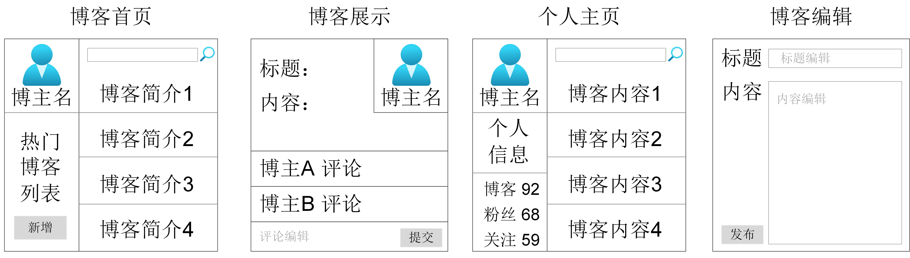
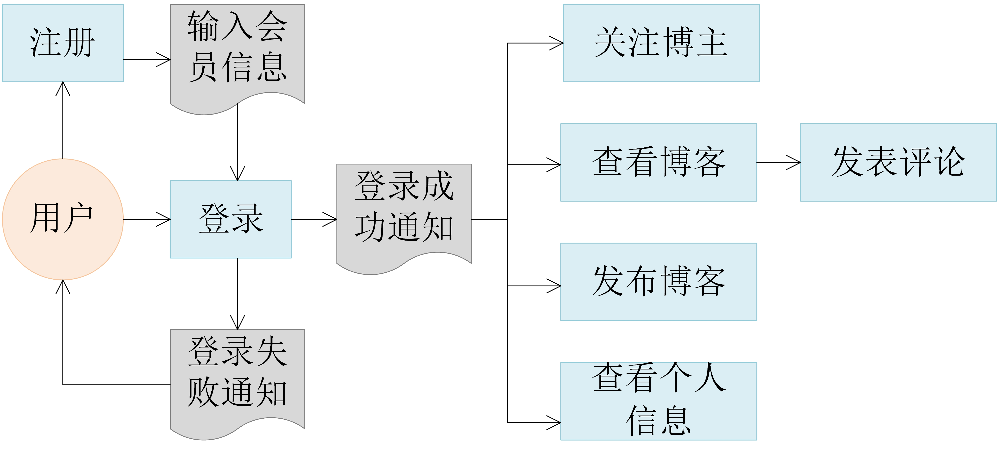
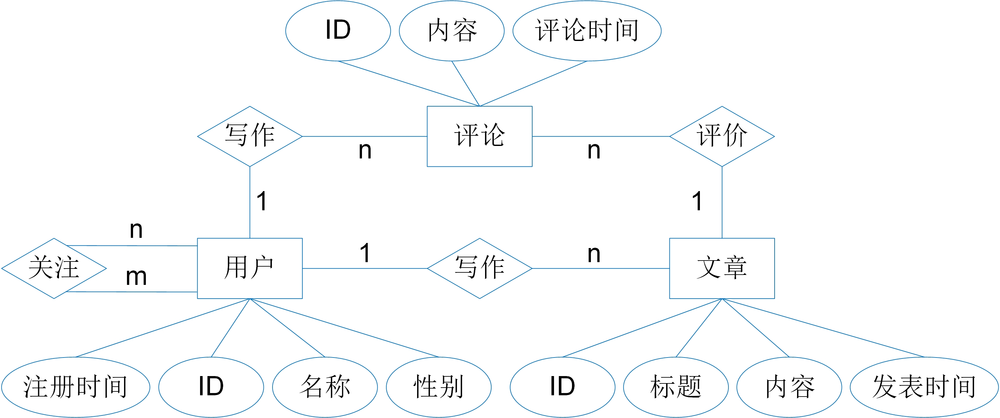

## 5.2 从需求分析到概念设计

本节通过一个博客网站来展示从需求分析到数据库概念设计的过程。

### 5.2.1  需求分析

需求分析的目的是梳理出一个应用程序以什么样的方式满足用户的需求。用户并不关心应用程序内部是如何工作的，他们只关心如何跟应用进行交互以及交互的结果是什么。因此，需求分析的核心实际上是确定用户界面。一个博客网站的主要功能是让用户在上面撰写、发表、阅读和分享文章，满足用户的创作、交流和知识获取需求。经过用户调研和头脑风暴，我们可以得出如下的用户界面。

	
	 
	

		图 5-2-1 博客网站前端功能界面
	

如图5-2-1所示，这个博客网站包含四套界面：首页，个人主页，博客展示界面和博客编辑界面。

* 博客首页：用户登录博客网站后，首先进入博客首页。首页主要展示了用户关注的博主最新发表的博客文章简介，同时还提供了通往其他界面的链接。例如，用户可以点击任意一篇文章简介跳转到博客展示界面阅读这篇文章的详细内容，也可以点击新增按钮跳转到博客编辑界面，然后创作并发表新的博客文章，还可以点击自己的头像，进入到自己的主页。
* 个人主页：每一位用户都有自己的个人主页。主页上展示了这个用户的个人信息，包括已发表博客数量、粉丝数量、关注者数量等。主页上还按从新到旧的顺序展示了用户发表的博客文章的简介。点击文章简介，就可以去往博客展示界面阅读文章。
* 博客展示界面：这个界面主要展示某篇博客文章的详细内容，包括标题、作者名字、发表日期、文章内容和评论。评论按照时间顺序排列。在界面的底部还提供评论的编辑界面，供用户添加新的评论。用户点击作者名字，可以进入到作者的个人主页。
* 博客编辑界面：这个界面提供博客文章的编辑功能。编写好之后即可进行发布。

	
	 
	

		图 5-2-2 博客网站业务流程
	

基于博客网站的界面，我们得到如图5-2-2所示的功能模块和业务流程。这些功能包括注册成为用户、发布博客文章、搜索文章、查看博客文章、发表评论、查看个人信息、关注博主等。每一项功能都需要对相应的数据进行存取。有了对用户界面和基本功能的梳理，我们就可以基本确定博客网站的数据库里应该存放什么数据。

### 5.2.2  概念设计

根据需求分析得到的信息，我们可以推导数据库里至少应该存储用户和博客文章的信息。每篇文章还有相应的评论。因此，数据库里至少应该有用户、博客文章和评论三类实体。再根据上述用户界面的细节，我们进一步推导每一类实体应该具有的属性。这些属性如下：

* 用户的属性：用户ID号、用户名、性别、注册时间；
* 博客文章的属性：文章ID号、文章标题、文章内容、发表时间；
* 评论的属性：评论ID号、评论内容、评论时间。

这些实体类之间有以下联系：

* 用户之间的关注联系：这是一种多对多的联系，因为一位用户可以被多位用户关注，同时也可以关注多为用户；
* 用户与文章之间的作者联系：这是一种一对多的联系，一名博主可以发表多篇文章，而一篇文章的作者只有一位；
* 用户与评论之间的作者联系：这也是一种一对多的联系，一为用户可以发表多则评论，而一则评论的作者只有一位；
* 文章与评论之间的评价联系：这也是一种一对多的联系，一篇文章可以有多则评论，一则评论则只针对一篇文章。

	
	 
	

		图 5-2-3 博客网站的ERD
	

集成上述的实体类和联系就有了图5-2-3所示的博客网站ERD概念模型。得到概念模型后，我们可以再次回顾需求分析制定的用户界面和业务流程，核对由这个概念模型刻画的数据是否足够实现所有的功能和用户界面。如果发现有数据的缺失，就需要进一步完善这个概念模型，直到这个概念模型能够完整、准确地满足应用的需求。

在设计ERD的过程中，区分实体和属性常常困扰设计人员，因为并没有统一的标准可以明确实体和属性之间的界限。区分它们需要结合具体的应用逻辑和流程。通常可以参考以下两个基本原则：

1. 属性是不可再分的，它不能包含其他属性。例如，地址信息中如果同时包含国家、城市、区、街道详细地址，那么它就不能作为一个单独的属性了，应该被视为一类实体，这类实体具有国家、城市、区、街道详细地址这四个不可再分的属性。
2. 属性不能和其他实体发生联系，因为联系只能存在于实体之间。

开发大型应用软件时，数据库设计人员通常采用自底向上的方式来设计概念模型，即先设计各个子系统的ERD，然后再进行集成，生成一个全局的E-R图。但由于各个子系统的业务逻辑和设计人员不同，各子系统的ERD会出现不一致。因此，在集成全局ERD时，需要先解决各子ERD之间的冲突，消除不必要的冗余。冗余数据会增加数据库的维护代价，但也有助于提高数据的查询效率。在设计概念模型时，设计人员需要根据用户需求对是否允许冗余进行取舍。

有了完整的概念设计，结构设计（即数据库的模式设计）就变得相对容易了。对不同的数据模型，都有将概念模型直接转换为数据库模式的固定方法。我们将在接下来的小节中介绍各类具体数据管理系统的数据结构设计方法。相比而言，概念设计注重如何完整、准确地刻画应用需要的数据，不太关心数据的访问效率。而结构设计会更关注数据的组织和存储方式。获得最佳的数据访问效率是它的目标之一。因此，结构设计还会涉及很多经验性原则。

### 练习题

**1**. 请对上一节第3题（电影网站）的ER图设计做改进，融入“角色”这一新的概念：\
每一位演员在其参演的电影中都扮演一定的角色。用户在浏览电影时，除了能看到演员信息，还能看到每位演员扮演了什么角色。用户在浏览演员时，除了能看到他（或她）参演的电影，还能看到他（或她）在每一部电影中扮演的角色。假设一位演员可以在一部电影中扮演多个角色；同一个角色也可能由多名演员扮演，比如，年少时由一位演员扮演，年老时由另一位演员扮演。

**2**. 假如我们要开发一个床位分享平台。拥有床位的用户可以将自己的床位在平台上短期分享；分享时提供床位所在地址、床位大小、分享时间段（某月某日到某月某日）、以及单价（每晚多少钱）。需要床位的用户可以在平台上搜索床位（搜索时提供租用时间段），平台会将符合要求的床位展示给用户。待找到合适的床位后，用户提出申请。床位拥有者会在两天内批复或拒绝申请。一旦申请获得批复，申请人即可与床位拥有者取得联系，并在另一个平台完成付款交易。每个申请人最多同时提出五项申请。一个申请在两天内得不到批复则被自动拒绝。当一个交易成功达成后，需要将交易达成的租用时间段从床位的分享时间段中扣除。\
请用ER图为该应用的数据库进行概念设计。

[**上一页<<**](chapter5.1.md) | [**>>下一页**](chapter5.3-R.md)
