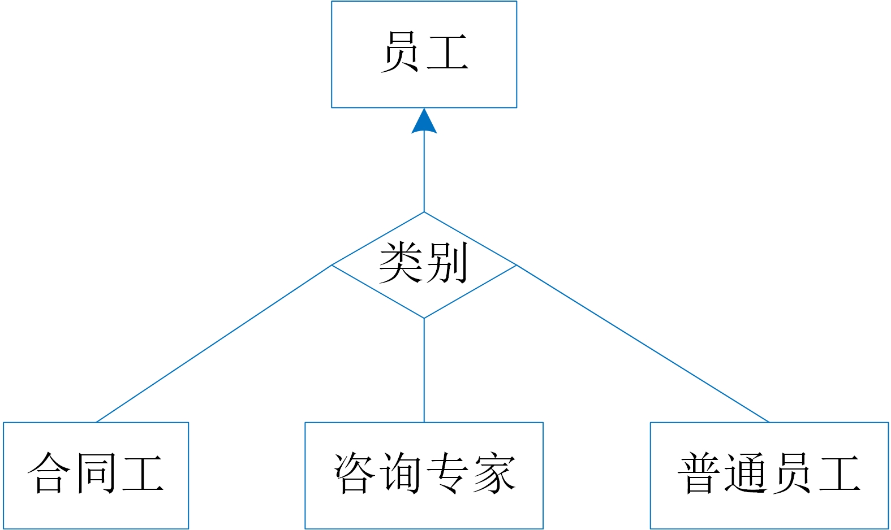

## 5.3  关系数据库的结构设计

前面介绍了数据库设计的基本步骤，从需求分析到概念模型设计的过程。从本节起主要介绍关系数据库的结构设计。


### 5.3.1 关系结构设计规则

关系数据库的结构设计是将ERD概念模型中的实体、实体间的联系转换为关系模式，并确定这些关系模式的属性和主码。

关系模式的设计规则有：

* 实体转换规则：一个实体转换为一个关系模式（二维表）。如5.1中的员工实体转换为一个员工表（employee），项目实体转换为一个项目表（project）。
* 属性转换规则一：一个实体的唯一属性和单值属性构成该关系模式的属性，其中唯一属性是关系模式的主码。图5-1-1中员工的唯一属性工号和单值属性名字转换为员工表的属性，员工表的结构为：employee(<u>sno</u>,sname),其中带有下划线的属性为主码，图5-1-1中项目的项目号和经费转换为项目表的属性，项目表的结构为：project(<u>pno</u>,funds)。
* 属性转换规则二：一个实体的多值属性转换成一个关系模式，实体的唯一属性和多值属性是该关系模式的属性，也是关系模式的主码。图5-1-1中员工的多值属性技能转换为技能表，技能表中包含工号和技能两个属性，技能表的结构为：employeeskill(<u>sno,skill</u>)，其中工号和技能为技能表的主码。
* 联系转换规则：（1）实体之间的1:1联系与任意一端的关系模式合并，合并端的关系模式中需要加入联系自身的属性和另一端关系模式的主码属性；（2）实体之间的1:n联系与n端的关系模式合并，n端的关系模式中加入联系自身属性和另一端模式的主码属性；（3）实体之间的m:n联系转换为一个关系模式，联系自身属性以及联系两端实体的唯一属性组成该关系模式的属性。图5-1-1中的员工与项目之间m:n的参与联系转换为一个工作表work，表中包含员工号、项目号以及工时三个属性，工作表的结构为：work(<u>sno,pno</u>,working-hours)，其中员工号和项目号为主码。

### 5.3.2 关系结构设计


基于以上的规则，我们对图5-1-3(b)的购物网站ERD概念模型进行关系结构设计，可以得到5个关系模式：

```SQL
购物网站的关系模式设计：
用户表：User(Uid, Uname, Uadd, Tel), Uid是主码;
商品表：Product(Pid, Pname, Category, Price, Padd)，Pid是主码;
订单表：Order(Oid, Uid, Date)，OId是主码；
用户喜好表：Preference(Uid, Pref), Uid和Pref是主码；
订单详情表：OrderLine(Oid, Pid, Quantity), Oid和Pid是主码；
```

* 首先，图5-1-3(b)中每类实体对象转换为一个关系模式，实体对象的唯一性属性和单值属性构成关系模式的属性，并将唯一性属性设置为关系模式的主码，则生成用户表User(<u>Uid</u>, Uname, Uadd, Tel)、商品表Product(<u>Pid</u>, Pname, Category, Price, Padd)和订单表Order(<u>Oid</u>, Date)，其中带下划线的属性为主码；
* 然后，用户实体对象的多值属性喜好转换为一个关系模式，用户的唯一性属性和多值属性构成关系模式的属性，则有用户喜好表Preference(<u>Uid, Pref</u>)，其中用户号Uid是用户喜好表的主码；
* 其次，用户和订单之间的一对多联系合并到订单表中，将用户的唯一性属性添加到订单表中，则生成订单表Order(<u>Oid</u>, Uid, Date)，其中订单号Oid为主码；
* 最后，订单和商品之间的多对多联系转换为一个关系模式，订单的唯一属性、商品的唯一属性和联系的自身属性构成该关系模式的属性，则有订单详情表OrderLine(<u>Oid, Pid</u>, Quantity)，其中订单号Oid、商品号Pid共同构成主码。

### 练习题

**1**. 在ER图中有一个叫Person的实体类，它的属性分别为：ID（唯一属性）、Name（单值属性）、Hobby（多值属性）、Skills（多值属性）。对该实体类进行关系模式设计，得到的结果应该是：

 <ol type="A">
  <li>Person ( ID, Name, Hobby, Skills )</li>
  <li>Person ( ID, Name ) 、PersonHS ( ID, Hobby, Skills )</li>
  <li>Person ( ID, Name ) 、PersonH ( ID, Hobby ) 、PersonS ( ID, Skill )</li>
  <li>Person ( ID ) 、Person ( ID, Name ) 、PersonH ( ID, Hobby ) 、PersonS ( ID, Skill )</li>
 </ol>

**2**. 假设有一个员工表 Employee(ID, Name, Address, Phone#)（其中ID为主键）。最初电话号码Phone#是一个单值属性，即每个人只有一个电话。后来发现，有少量员工有两个电话号码，且都需要记录。你会如何对数据库的结构设计进行调整？

 <ol type="A">
  <li>将Phone#的数据类型变成字符串，将两个电话号码用分号隔开，一起存在同一个字段中。</li>
  <li>将主键变为 (ID, Phone#)，将有两个电话号码的人在表中存两份。</li>
  <li>将模式修改为 Employee(ID, Name, Address)，Phone(ID, Phone#)。</li>
  <li>将模式修改为 Employee(ID, Name, Address, Phone#, Phone#Alt)，其中Phone#Alt用于记录另一个电话号码。</li>
 </ol>

**3**. 下图所示的ER图刻画了四类实体，对“员工”而言，另三类实体（合同工、咨询专家和普通员工）都是它的子类。也就是说，员工拥有的属性，另三类实体都拥有；而子类拥有的属性父类未必拥有。请尝试设计这四类实体对应的关系表。

<center>
	
	<br>
	<div display: inline-block; padding : 2px>
		图 四类实体ER图
	</div>
</center>


[**上一页<<**](chapter5.2.md) | [**>>下一页**](chapter5.4-R.md)
