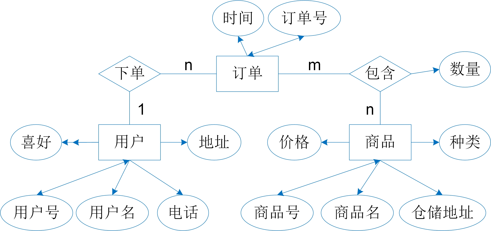

# 文档数据库设计

前面的章节介绍了数据库设计的基本步骤以及如何根据需求分析进行概念模型设计。概念设计解决了一个特定应用的数据库应该存什么数据的问题，而数据如何存的问题由结构设计解决。结构设计与具体数据库管理系统的数据模型紧密相关。本章将主要介绍文档数据库的结构设计。

## 设计规则

文档数据库的逻辑结构设计其实是将概念设计阶段设计好的基于ERD的概念模型转换成文档模型，它的要点是如何将ERD的实体、实体的属性和实体之间的联系转换成文档模式。所谓的文档模式是对文档集的描述。

<center>
	
	<br>
	<div display: inline-block; padding : 2px>
		图 D5.1 员工与项目ERD概念模型
	</div>
</center>

文档数据库支持嵌套文档、数组以及文档数组等多种结构，因此基于ERD概念模型生成的文档模型也是多种多样的。目前，没有一套文档数据库结构设计的统一范式。我们这里只介绍ERD转换成文档模型的常用规则。

* 实体转换规则：
  * 若文档模型中不存在嵌套文档，则一个实体转换为一个文档集。例如，图D5.1中的员工实体转换为员工文档集（employee），项目实体转换为项目文档集（project）；
  * 若文档模型中存在嵌套文档，则多个实体转换为一个文档集。例如，图D5.1中的员工实体和项目实体可以转换为一个文档集（emplyee-project）。

* 属性转换规则：
  * 实体的唯一属性、单值属性、多值属性转换成文档模式的属性，其中多值属性以数组的形式表示。假设文档模型中不存在嵌套文档，图D5.1中员工实体和项目实体的文档结构如下：

    ```bson
    员工employee的文档结构
    {
      "sno": " ",   //工号
      "name": " ", 	//名字
      "skill": [" "," ", ""]  //技能
    }
    
    项目project的文档结构
    {
      "pno": " ",   //项目号
      "funds": " " 	//经费
    }
    ```
  
* 联系转换规则：
  * 若文档模型中不存在嵌套文档，则实体之间的1:1联系可以与任意一端的文档模式合并，合并端的文档模式中加入另一端实体的唯一性属性和联系本身的属性；实体之间的1:n联系与n端的文档模式合并，在n端的文档模式中加入1端实体的唯一性属性和联系本身的属性；实体之间的m:n联系转换为一个独立的文档模式，联系两端实体型的唯一性属性和联系本身的属性构成该文档模式的属性。例如，图D5.1中的“参与”联系是m:n联系，该联系转换成一个单独的文档集（work），work文档集中的文档结构如下：
      ```bson
    work的文档结构
    {
      "sno": " ",   //员工工号
      "pno": " ", 	//项目号
      "working-hours": " " //工时
    }
    ```
  * 若文档模型中存在嵌套文档，嵌套文档的形式能自然地存储实体之间的一对一、一对多、多对多联系。如果实体之间是1:1联系，那么任意一端的实体嵌入另一端文档模式；如果实体之间是1:n联系，那么n端的实体嵌入1端的文档模式，以文档数组的形式表示；如果实体之间是m:n联系，那么任意一端的实体嵌入另一端文档模式，以文档数组的形式表示。例如，图D5.1中的员工和项目之间“参与”联系，将项目嵌入员工的文档结构如下：
      ```bson
    employee-project的文档结构
    {
      "sno": " ",   //工号
      "name": " ", 	//名字
      "skill": [" "," ", ""]  //技能
      "project":[
        {
          "pno": " ",   //项目号
      	  "funds": " " ,	//经费
      	  "working-hours": " " //工时
        },
        ...
      ]
    }
    ```

## 文档结构设计

基于以上的规则，我们能够进行文档数据库的逻辑结构设计，确定某一特定应用数据库中的数据应该如何表示和组织。以下以本书前面章节提到的购物网站为例，展示文档数据库的逻辑结构设计过程。图D5.2展示了购物网站的ERD概念模型。

<center>
	
	<br>
	<div display: inline-block; padding : 2px>
		图 D5.2 购物网站ERD概念模型
	</div>
</center>


如果按“文档模型中不存在嵌套文档”的规则，可以得到以下的文档模式设计：

```bson
购物网站的文档模式设计一：
用户文档集：User{Uid, Uname, Uadd, Tel, Pref[]};
商品文档集：Product{Pid, Pname, Category, Price, Padd};
订单文档集：Order{Oid, Uid, Date}；
订单详情文档集：OrderLine{Oid, Pid, Quantity}；
```
在文档模式设计一中，用户、商品、订单三个实体分别转换成User、Product、Order三个文档集。User文档集中的每个文档包含用户号（Uid），用户名（Uname），地址（Uadd）、电话（Tel）、爱好（Pref）五个属性，其中多值属性用数组形式表示。Product文档集中的每个文档包含商品号（Pid），商品名（Pname），种类（Category）、价格（Price）、仓储地址（Padd）五个属性。Order文档集中的每个文档包含订单号（Oid），时间（Date）两个属性。用户和订单之间的1:n联系通过将用户的用户号加入订单文档集中实现转换，实现联系转换的Order文档集中包含订单号（Oid），用户号（Uid），时间（Date）三个属性。商品和订单之间的n:m联系转换成订单详细文档集OrderLine，OrderLine文档集中的每个文档包含订单号（Oid）、商品号（Pid）、数量（Quantity）三个属性。值得注意的是，文档模式设计中不会指定文档的唯一表示属性，因为文档数据库会为每一个文档自动分配一个唯一标识的“\_id”属性。

如果按“文档模型中存在嵌套文档”的规则，可以得到以下三种文档模式设计：

```bson
购物网站的文档模式设计二：
用户文档集：User{Uid, Uname, Uadd, Tel, Pref[]};
商品文档集：Product{Pid, Pname, Category, Price, Padd};
订单文档集：Order{Oid, Uid, Date,OrderLine[{Pid, Quantity}]}；

购物网站的文档模式设计三：
用户文档集：User{Uid, Uname, Uadd, Tel, Pref[], 
				Order[{
				  Oid, Date,OrderLine[{Pid,Quantity}]
				}]
			};
商品文档集：Product{Pid, Pname, Category, Price, Padd};

购物网站的文档模式设计四：
用户文档集：User{Uid, Uname, Uadd, Tel, Pref[], 
				Order[{
				  Oid, Date,
				  OrderLine[{
					  Product{Pid, Pname, Category, Price, Padd},
					  Quantity}]
				}]
			};
```

其中，文档模式设计二在设计一的基础上，以嵌套文档的结构表示订单和商品之间的m:n联系。首先，将订单和商品之间的m:m联系转换成订单详细文档集OrderLine{Pid,Quantity}，然后以文档数组的方式将OrderLine嵌入订单文档集中。文档模式设计三在设计二的基础上，将订单文档集Order以文档数组的形式嵌入用户文档集。文档模式设计四在设计三的基础上，将商品文档集Product以文档数组的形式嵌入用户文档集中的OrderLine。

那么，哪一种文档模式更合理呢？这需要根据需求分析得出的业务流程和应用功能进行判断。如果某种文档组织方式使得实现应用功能更加简单，性能更高，那么该文档组织方式则更优。

文档模式确定之后，还需要根据应用需求确定数据的组织方式，索引构建以及数据的存放位置。例如，在用户文档集中创建基于用户名的索引，索引采用基于B+树的索引结构进行构建。那么使用用户名Uname作为匹配条件的查询可以使用索引来提高查询性能。

通过上述例子，我们发现文档数据库的结构设计师相当灵活的，没有一套固定的标准，需要根据应用的实际需求选择最适合的文档模式。


除此之外，为了进一步提高应用的性能，文档结构设计需要加入必要的冗余信息。例如，在上述文档模式设计二的OrderLine文档数组中冗余记录商品名，商品价格信息。在购物网站应用中，查询订单信息时，通常是商品号、商品名称、商品单价以及数量一起显示，冗余存储信息可以避免读取商品文档集，从而减少磁盘IO读取操作。


[**上一页<<**](chapterD2.1.md) | [**>>下一页**](chapterD3.2.md)


