# 1 图模型与图查询语言

图模型是一种用于表示和分析数据及其关系的数据模型。与传统的关系模型不同，图模型通过节点和边来直接表示实体以及实体之间的关系，直观自然，适合处理复杂关系和动态变化的数据。图模型在处理社交网络、推荐系统、知识图谱等应用场景中表现出色。在这一节，我们将详细探讨图模型的基本概念和表示方法，并以Cypher为例，深入了解图查询语言的功能和使用。通过实际操作，我们将学习如何利用Cypher编写和执行图查询，从而更好地理解和应用图模型来解决复杂的数据问题。

## 1.1 图是什么

图是一种对顶点集合及其两两之间通过边连接这一简单概念的推广。使用图来表示各种类型的结构是非常常见的，因为许多实际问题都可以简化为图问题。在本节中，我们将探讨图模型的基本概念，并通过与关系模型的对比，来了解图模型的特点和优势。

### 1.1.1 图模型的基本概念

**图**（Graph）是一种表达对象与对象之间关系的拓扑结构。在形式上，图是顶点和边的集合，其中顶点用于描述对象，顶点之间的边则用于描述对象之间的关系。

在现实世界中，许多场景可以用图模型进行很好的描述。例如，局域网中的双向连接或集群中的单向数据流。

**示例：局域网中的双向连接**

在局域网（LAN）中，各设备之间的连接通常是双向的，任意两个设备之间可以相互通信，这种网络拓扑可以用无向图来表示。在无向图中，节点表示设备，边表示设备之间的连接，边没有方向性。假设我们有三个路由器：R1、R2、R3，且三个路由器两两之间均通过网络链路相互连接，任意两者之间都可以直接通信，则我们可以通过一个无向图来表示这个局域网的连接关系 ，如图1.1所示。现在，若我们有一个新的路由器 R4 要连接到现有的网络，并且新添加的网络链路为路由器 R4 与路由器 R1 相连。则我们需要增加一个新的节点 R4，并在 R1 和 R4 之间增加一条无向边。

<center>
	
	<br>
	<div display: inline-block; padding : 2px>
		图 1.1 局域网中的双向连接
	</div>
</center>

**示例：集群中的单向数据流**

在某些计算机网络中，链路也可能是有方向的，例如在集群环境中的主从架构。此时，我们则可以使用有向图来表示网络。假设我们有一个简单的集群，其中有一个主节点（Master）和两个从节点（Slave）。在这个集群中，主节点 M 负责数据的分发和协调工作，而从节点 S1 和 S2 负责接收并处理来自主节点 M 的数据，而不向主节点发送数据，数据流是单向的。这种单向数据流可以用有向图来表示，通过带箭头的边来表示数据的流向。现在，假设我们要添加一个新的从节点 S3，并且主节点 M 也要向 S3 发送数据，则我们需要增加一个新的节点 S3，并添加一条有向边从 M 指向 S3，如图1.2所示。

<center>
	
	<br>
	<div display: inline-block; padding : 2px>
		图 1.2 集群中的单向数据流
	</div>
</center>


从计算机网络到社交网络，从金融交易网络到物流网络，各种场景都可以用图结构来建模。一切相互关联的事物都可以用图来表示。

如上述两个示例所示，用图的语言对客观事物进行描述的过程称为**图建模**。在图模型中，**顶点**一般用原点或圆圈表示，**边**则用连接两个原点或圆圈的线表示，相邻的两个顶点则称为**邻居**。如图1.3所示，边分为无向边、有向边和双向边，无向边用不带箭头的线表示，有向边用带箭头的线表示，箭头方向表达指向。其中，由无向边构成的图称为**无向图**，由有向边构成的图则称为**有向图**。再比如，夫妻关系是一种无向关系，他们构成一个无向图。而关注者和被关注者则是一种有向关系，构成有向图。当A单方面关注B时，他们之间是单向关系，当A、B互相关注时，他们之间则是双向关系。

<center>
	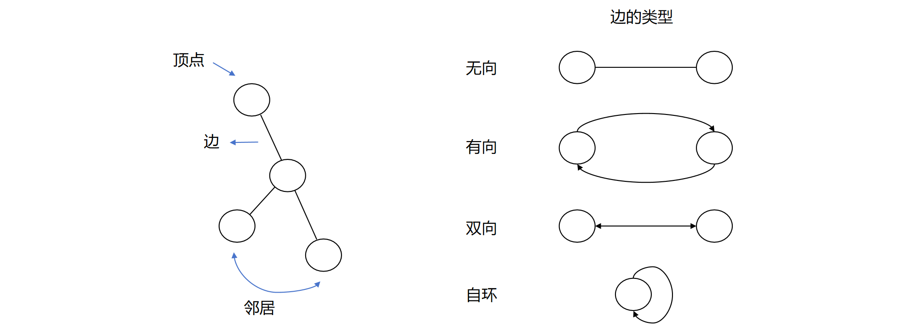
	<br>
	<div display: inline-block; padding : 2px>
		图 1.3 顶点与边的基本概念
	</div>
</center>

此外，一个顶点既可以指向其他顶点，也可以指向自己。当一个顶点与自身形成关系时，我们称之为**自环**。边上还可以有权重，我们称之为**加权**。例如，A与B每周通话3次，与C每周通话1次，则可以在A与B、C的通话边上分别赋予3和1的权重，来表达A与B、C之间不同的通话频次。顶点和边还可以分别带有各自的属性（键值对），这样的图我们称之为**属性图**。

### 1.1.2 关系模型与图模型

数十年来，开发者试图用关系数据库处理关联的、半结构化的数据集，它们擅长处理表格化结构，但在处理联系和连通性时表现不佳。联系仅存在于关系数据库的建模阶段，作为连接表的手段，却缺乏语义区分和权重定义的能力。随着数据规模和结构复杂性增加，关系模型将造成大量表连接、稀疏行和非空逻辑检查，影响性能，使得现有数据库难以应对动态业务需求。

在这种背景下，图数据库技术迅速发展并逐渐成熟。它们能直观地表示实体之间的复杂关系，高效处理大规模、结构可变的密集关联数据。通过节点和边的模型，图数据库自然支持语义区分和权重定义，能快速进行深度关系查询和实时分析。这使得图模型在处理复杂数据结构和动态业务需求方面有显著优势。因此，考虑到关系数据库的局限性，图数据库是处理复杂、结构可变、密集关联数据的最佳选择。

接下来，我们将通过具体例子来比较关系模型和图模型的差异，并探讨图模型在处理“联系”时的优势。

**关系模型**

关系模型是基于谓语逻辑和集合论的一种数据模型，建立在表的集合的基础上。在关系模型中，每张表（也称作关系）被赋予一个唯一的名称，代表一个实体类型或实体集，表中的每一行表示实体的一个具体实例，表中的每一列表示实体的一个属性。

图1.4展示了一个用户订单历史的关系建模。请考虑图中的 Users 表，它存储了用户的信息。该表有4个列标题：user_id、name、phone、address，其中主键由 user_id 构成。该表中的每一行记录了一位用户的相关信息，包括该用户的账号、姓名、手机号、地址。类似地，下图中的 Products 表中存放了关于产品的信息，主键由 product_id 构成。请注意，主键属性还要加下划线，每张表都通过主键中的属性（组合）唯一标识。

<center>
	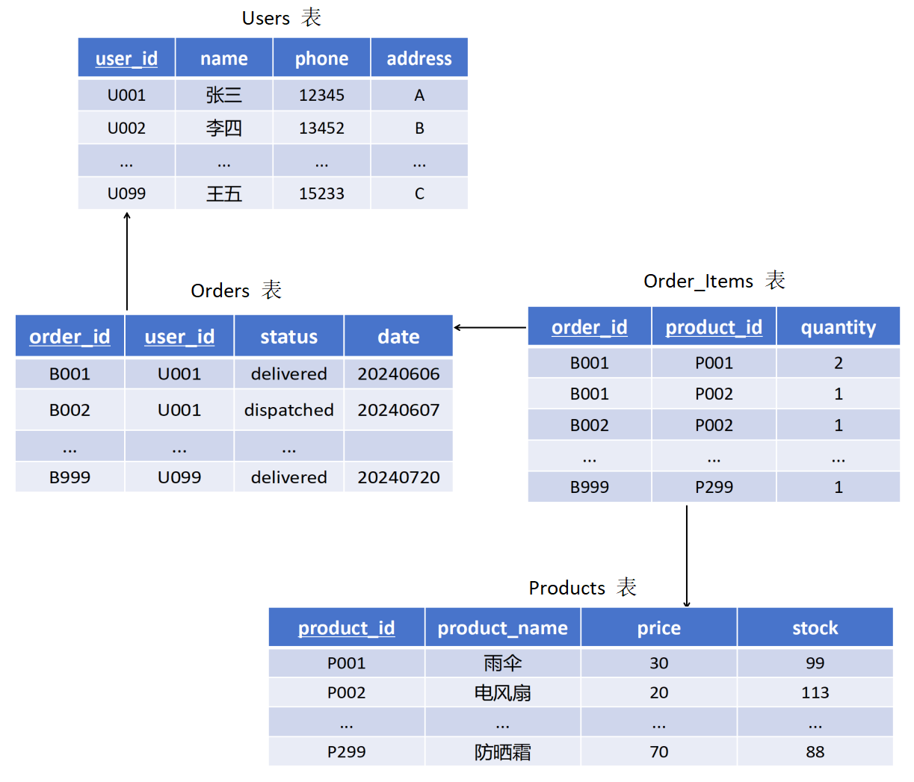
	<br>
	<div display: inline-block; padding : 2px>
		图 1.4 关系模型示例
	</div>
</center>

由于用户与商品之间是多对多的关系，为了描述清楚它们之间的联系，我们需要创建一个订单表 Orders 和一个订单详情表 Order_Items。其中，表 Orders 用于将订单和用户构建联系，表 Order_Items 用于将订单与商品构建联系。

表 Orders 具有 order_id、user_id、status 和 date 四列，它存储了订单的信息。该表的主键由两个属性组成：order_id 和 user_id，二者都加了下划线以表示它们是主键的一部分。请注意，在关系数据库中，外键用于建立表与表之间的关联关系。当一个表的字段被作为外键引用到另一个表的主键时，这两个表之间就建立了关联关系。在该表中，Orders 中的 user_id 属性就是从 Orders 引用 Users 的外键，用于和 Users 表建立关联联系。主键和外键是把多个表组织为一个有效的关系数据库的粘合剂。由此，Orders 表中的一行表示订单和用户在这种意义上是相关的：该用户创建了一个订单。

类似地，表 Order_Items 具有 order_id、product_id 和 quantity，它存储了订单的详情信息。该表的主键由两个属性组成：order_id 和 product_id。在该表中，Order_Items 的 order_id 属性就是从 Order_Items 引用 Orders 的外键，用于和 Orders 表建立关联联系；Order_Items 的 product_id 属性就是从 Order_Items 引用 Products 的外键，用于和 Products 表建立关联联系。由此，Order_Items 表中的一行表示订单和商品在这种意义上是相关的：该订单包含这个商品。

通过外键，我们构建了表与表之间的联系。但是这种模式的设计对该应用程序产生了很大的影响，它使得有些查询非常简单，而有些异常困难：
- 表连接增加了查询的复杂性，因为需要同时管理业务数据和表之间的外键关系。
- 外键约束增加了额外的开发与维护成本，而目的仅仅是为了让数据库工作。
- 带有空值列的稀疏表在代码中需要额外检查，尽管模式本身提供了相关支持。
- 仅仅因为想要查看用户买了什么就需要好几个昂贵的连接。
- 反向查询（reciprocal query）是指从子表出发，通过外键查找父表中的主键记录。这种查询通常成本较高。例如，查询“某个用户购买了哪些商品”相比于查询“有哪些用户购买了某个商品”的成本相对较低，而这是推荐系统的基础。对于这样的需求，可以引入索引。然而，即使引入索引，随着递归程度的增加，诸如“有哪些购买了这个商品的用户也购买了那个商品”这样的递归问题的查询代价会显著增加。

**图模型**

接下来，让我们来看一看用户订单历史在图上的建模。当我们通过图模型来描述这些数据时，就要用顶点来表示表中的每个对象，用边来描述对象与对象之间的关系，并通过给顶点和边添加属性来描述具体的信息。如下图所示。我们先将用户和他的订单链接起来，然后再将这些订单链接为购买历史。

<center>
	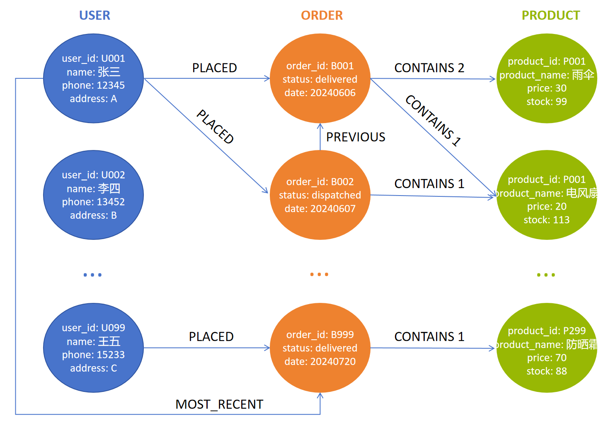
	<br>
	<div display: inline-block; padding : 2px>
		图 1.5 图模型示例
	</div>
</center>

通过图1.5，我们可以看到用户（USER）已经订购（PLACED）的所有订单（ORDER），以及每个订单包含（CONTAINS）的商品（PRODUCT）及其数量。对于这个核心领域的数据结构，我们已经添加了几种熟知的访问模式的支持。例如，用户往往希望看到自己的订单历史，因此我们在图中增加了一个链表结构，通过最近（MOST_RECENT）的联系找到用户最近的订单。随后，我们可以通过迭代该链表，沿着每个上一个（PREVIOUS）联系回溯到更早的订单。如果我们希望找到更近的订单，则可以反向寻找PREVIOUS联系，或者添加一个与当前反向的下一个（NEXT）联系。

现在，我们还可以根据该图考虑用户推荐。例如，如果我们发现很多购买A商品的用户还购买了B商品，我们就可以给那些通常喜欢购买A商品的用户推荐B商品。由于图是天然的多维结构，我们的上述举例只是一个一维的推荐，为了提高图的能力，我们还可以将它与其他领域的图连接起来，以解决更复杂的问题，来获得市场需要微调的部分。

在数据管理和分析中，关系模型和图模型是两种常见的数据表示和处理方法。虽然关系模型有其独特的优势，但图模型在某些方面表现出更强的能力和灵活性。通过节点和边的结构，图模型可以直观地表示复杂的关系和连接，高效处理和分析大量节点和边之间的复杂连接。同时，图数据库的模式灵活性允许它在不改变数据模式的情况下轻松添加新节点和边。

## 1.2 图模型的表示方法

图可以用来编码数据，其中节点代表我们感兴趣的对象，边代表这些对象之间的关系。在前面的内容中，我们了解到图模型能直观地表示实体之间的复杂关系，在处理复杂数据结构和动态业务需求方面有显著优势。接下来，我们将学习图的两种基本表示方法：邻接矩阵和邻接表。然后，我们将了解不同的图模型。其中，最常见的两种图模型分别是标记属性图（LPG）和资源描述框架（RDF），同时，我们还会了解这两个图模型之间的转化。

### 1.2.1 图结构的基本表示方法

在图数据库中，图的表示方法主要有两种：邻接矩阵和邻接表。

**邻接矩阵**是一种二维数组，用于表示图中顶点之间的边。对于一个有 $n$ 个顶点的图，邻接矩阵是一个 $n × n$ 的矩阵，存储了所有节点之间的边的信息。矩阵中的每个元素 $A[i][j]$ 表示顶点 $i$ 和顶点 $j$ 之间是否有边。对于无向图来说，如果顶点 $i$ 和顶点 $j$ 之间有边，则 $A[i][j]=1$（或边的权重）；否则$A[i][j]=0$。由于是无向图，因此矩阵是对称的，$A[i][j]=A[j][i]$。对于有向图来说，如果从顶点 $i$ 到顶点 $j$ 有一条边，则 $A[i][j]=1$（或边的权重）；否则 $A[i][j]=0$。如图1.6所示，展示了一个简单的无向图和有向图的邻接矩阵。

<center>
	
	<br>
	<div display: inline-block; padding : 2px>
		图 1.6 邻接矩阵示例
	</div>
</center>

通过邻接矩阵，可以快速检查两点之间是否有边连接，时间复杂度为 $O(1)$；但空间复杂度为 $O(n^2)$，不适用于稀疏图，且增删节点和边不够灵活。

**邻接表**是一种链表结构，用于表示每个顶点的邻接顶点。对于一个有 $V$ 个顶点、$E$ 条边的图，邻接表是一个包含 $V$ 个链表的数组，只存储了存在的边的信息，不存储不存在的边。同样，对于无向图来说，如果顶点 $i$ 和顶点 $j$ 之间有边，则顶点 $j$ 出现在 $A[i]$ 中，顶点 $i$ 也出现在链表 $A[j]$ 中；对于有向图来说，如果从顶点 $i$ 到顶点 $j$ 有一条边，则只有顶点 $j$ 出现在链表 $A[i]$中。如图1.7所示，展示了一个简单的无向图和有向图的邻接链表。

<center>
	
	<br>
	<div display: inline-block; padding : 2px>
		图 1.7 邻接表示例
	</div>
</center>

邻接链表空间效率高，空间复杂度为 $O(V+E)$，适用于稀疏图，且动态性强，增删节点和边较为容易；但查找两点之间是否有边较慢，时间复杂度为 $O(V)$。

邻接矩阵和邻接链表都是用于维护图的结构的两种表示方法。邻接矩阵适合处理稠密图，并且需要频繁查询两点之间是否有边的场景；邻接链表则适合处理稀疏图，并且需要频繁增加或删除顶点和边的场景。

### 1.2.2 简单关系 —— 边标记图

了解了表示图的两种数据结构，接下来，我们从一个简单的图模型开始展开介绍，这是其他更复杂的图模型的基础。图 $G$ 可以形式化定义为一个元组 $(V, E)$，其中 $V$ 是顶点集，$E \subseteq V×V$ 是边集，$G=(V, E)$ 也可以表示为 $G(V, E)$。对于有向图 $G$，边 $e=(u, v) \in E$ 是两个顶点的元组，其中 $u$ 是出顶点，$v$ 是入顶点。若 $G$ 是无向图，那么边 $e=(u, v) \in E$ 是两个顶点的集合。

例如，如果我们要用一个图来编码电影数据，节点可以是演员和电影，从节点 a 到节点 b 的（有向）边则表示 a 是 b 中的演员，电影数据库可以用图建模如下：

<center>
	
	<br>
	<div display: inline-block; padding : 2px>
		图 1.8 图建模示例1
	</div>
</center>

然而，用这样一种简单的图形式来表达不同类型的关系是很困难的。例如，假设我们希望表达出克林特·伊斯特伍德也是《不可饶恕》的导演这一信息，我们可以考虑在这两个节点之间添加一条边，这样两个节点的连接方式就如图1.9所示：

<center>
	
	<br>
	<div display: inline-block; padding : 2px>
		图 1.9 图建模示例2
	</div>
</center>

但这里哪条边代表克林特·伊斯特伍德是《不可饶恕》的导演，哪条边又代表他是该电影的演员呢？更广泛地说，如果节点之间有许多不同类型的关系，我们如何区分它们呢？

**边标记图（Edge-labelled graph）** 是一种简单且被广泛采用的解决方案，它是图数据库中最基本的图模型之一。在边标记图中，我们还为边指定了标签，以表示所描述领域中不同类型的关系。我们可以考虑图1.10中的一个建模示例，克林特·伊斯特伍德与《不可饶恕》有两种关系：一种关系由标有“出演”的边表示，另一种关系由标有“导演”的边表 示 ，安娜·莱文与这部电影也有一条标有“出演”的边。

<center>
	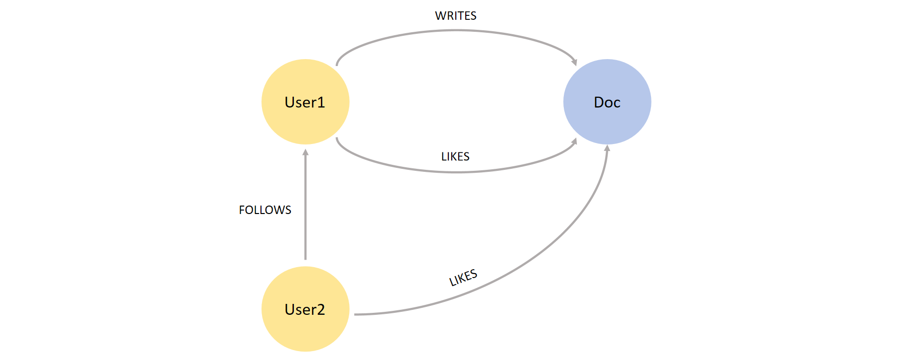
	<br>
	<div display: inline-block; padding : 2px>
		图 1.10 边标记图示例
	</div>
</center>

接下来，我们将正式定义边标记图的概念。

**定义1.1（边标记图）.** 一个边标记图 $G$ 是一个二元组 $(V, E)$，其中：
（1）$V$ 是一个有限的顶点（或节点）集合。
（2）$E$ 是一个有限的边集合；在形式上，$E \subseteq V×Lab×V$，其中 $Lab$ 是一个标签集。

**例1.1.** 设 $G=(V, E)$ 表示上图中的图，则顶点集和边集分别是：
$$
\begin{align*}
V = & \{ 克林特·伊斯特伍德、不可饶恕、安娜·莱文 \} \\
E = & \{ (克林特·伊斯特伍德，出演，不可饶恕), \\
     & (克林特·伊斯特伍德，导演，不可饶恕), \\
     & (安娜·莱文，出演，不可饶恕) \}
\end{align*}
$$
其中，“出演”和“导演”这两个标签取自 $Lab$。

边标记图在实践中被广泛采用，例如，它们构成了我们后续将会详细介绍的资源描述框架（RDF）标准的基础。

### 1.2.3 复杂关系 —— 超图模型

图作为一种高效的关系表达结构，被广泛地应用于成对关系的建模中，例如论文引用、社交网络中的好友关系等网络的建模。但是除了成对关系外，在很多场景中还存在大量无法用一般的简单图结构表达的非成对关系，例如社交网络中的群组聊天。

**超图（Hypergraph）** 作为图的一种扩展模型，将边的概念扩展到了超边。与传统的图（Graph）不同，超图的每条边（称为超边）可以连接任意数量的顶点，而不仅仅是两个。因此，超图提供了一种更灵活和通用的方式来表示多元关系，如图1.11右所示（图左为普通图）。

<center>
	
	<br>
	<div display: inline-block; padding : 2px>
		图 1.11 普通图与超图对比示例
	</div>
</center>

**定义1.2（超图）.** 一个超图 $H$ 是一个二元组 $(V, E)$，其中：
（1）$V$ 是一个有限的顶点（或节点）集合。
（2）$E \subseteq (\mathcal{P}(V) \setminus \emptyset)$ 是一个有限的（非空）超边集合，每条超边是顶点集合的一个子集，其中 $\mathcal{P}(V)$ 是 $V$ 的幂集，表示 $V$ 的所有可能子集。

为了更直观地描述顶点和超边之间的关系，我们可以使用**关联矩阵（Incidence Matrix）来表示超图**。关联矩阵是一种矩阵表示法，它将超图的结构转化为线性代数的形式，便于计算和分析。在关联矩阵 $I$中，行对应于超图的顶点，列对应于超图的超边，矩阵元素 $I_{ij}$ 表示顶点 $v_{i}$ 是否属于超边 $e_{j}$​。

例如，考虑一个超图 $H$，其中顶点集 $V = \{v_{1}, v_{2}, v_{3}, v_{4} \}$，超边集 $E = \{e_{1}, e_{2}\}$，超图内顶点和边的连接方式如图1.12左所示，由此我们可以得到图右的关联矩阵表示。

<center>
	
	<br>
	<div display: inline-block; padding : 2px>
		图 1.12 超图及其关联矩阵示例
	</div>
</center>

超图在许多应用中非常有用。例如，集合覆盖问题，在一个超图中寻找最小的超边集合覆盖所有顶点。再例如我们之前提到的社交网络，用超边表示群组，群组中的所有成员都通过同一条超边连接。通过引入超边的概念，超图比传统的图能够表达更复杂的关系。

虽然超图模型在表达多元关系上具有独特的优势，但由于其复杂性和性能问题使得其在图数据库和图处理系统中应用较少。大多数图数据库更倾向于使用普通图模型，并通过特定的建模技巧来处理多元关系。

### 1.2.4 嵌套关系 —— 超节点模型

**超节点模型（The Hypernode Model）** 也是一种图数据模型的扩展。与传统图模型相比，超节点模型引入了超节点（hypernode）的概念，使得节点本身可以是一个子图。超节点还可以嵌套，即一个超节点内部的节点可以是另一个超节点。

超节点模型是一种用于处理复杂网络结构的高级表示方法，这种模型在处理大规模图数据时具有显著优势，特别是在需要对图进行聚合或分层分析的场景中。例如，超节点模型可用于交通网络，它可以将一个城市或区域表示为一个超节点，来简化对区域交通流量的分析。

### 1.2.5 LPG 模型及其变体

经典图模型（元组 $G=(V, E)$）适用于计算顶点中心性等问题。然而，它的内容还不够丰富，不足以为各种现实问题建模。这也是图数据库经常使用**标记属性图模型（LPG，Labeled Property Graph Model）** 的原因。

在边标记图中，我们使用标签来表示边的类型，其中多条边可能具有相同的类型，同样，我们也可以考虑给节点贴标签。在标记属性图（有时简单的称为属性图）中，边和节点都可以被标记。此外，每条边和每个节点都附有一个唯一的标识符，允许边和节点具有一个或多个标签以及任意数量的属性，一个属性就是一个键值对。

例如，我们在图1.13中展示了一个电影数据库图，其中包含了节点和边上的标签和属性。在这个图中，节点的标签显示在节点上方的直角矩形中，节点的属性显示在节点下方的圆角矩形中。我们可以将节点“克林特·伊斯特伍德”和“安娜·莱文”标记为“人”，将节点“不可饶恕”标记为“电影”。其中，标识符为 $n1$ 的节点的相关属性是姓名和性别，其值分别是克林特·伊斯特伍德和男性。而标识符为 $e2$ 的边没有任何属性。

<center>
	
	<br>
	<div display: inline-block; padding : 2px>
		图 1.13 LPG模型示例
	</div>
</center>

**定义1.4（属性图）.** 一个属性图 $G$ 就是一个五元组 $(V, E, \rho, \lambda, \sigma)$，其中：
（1）$V$ 是一个有限的顶点（或节点）集合。
（2）$E$ 是一个有限的边集合。
（3）$\rho: E \rightarrow (V × V)$ 是一个全函数，直观的说，$\rho(e) = (v_{1}, v_{2})$ 表示 $e$ 是图 $G$ 中从节点 $v_{1}$ 到节点 $v_{2}$ 的一条有向边。
（4）$\lambda: (V \cup E) \rightarrow Lab$ 是一个全函数，其中 $Lab$ 是一个标签集。直观的说，如果 $v \in V$（相应的，$e \in E$），并且 $\rho(v) = l$ （相应的，$\rho(e) = l$），那么 $l$ 就是图 $G$ 中节点 $v$（相应的，边 $e$）的标签。
（5）$\sigma: (V \cup E) × Prop \rightarrow Val$ 是一个偏函数，其中 $Prop$ 是一个有限的属性集合，$Val$ 是一个值集合。直观的说，如果 $v \in V$（相应的，$e \in E$），$p \in Prop$，并且 $\sigma(v, p) = s$（相应的，$\sigma(e, p) = s$），那么 $s$ 就是属性图 $G$ 中节点 $v$ （相应的，边 $e$）中属性 $p$ 对应的值。

**例1.2.** 对于如上所示的电影数据库建模的属性图 $G$，我们可以得到 $G=(V, E, \rho, \lambda, \sigma)$，其中 $V、E、\rho、\lambda、\sigma$ 如图1.14所示。

<center>
	
	<br>
	<div display: inline-block; padding : 2px>
		图 1.14 LPG模型元素求解示例
	</div>
</center>

**标记属性图模型的变体**

在我们对标记属性图的定义中，每个节点和边都与一个或多个标签以及任意数量的属性相关联，并且每个属性最多只有一个值。在某些应用中，允许属性具有多个值可能更为有用。因此，我们可以考虑标记属性图的一种变体——多值属性图，它允许在属性图模型中使用多个标签和多值属性。有几个数据库还支持LPG的其他变体。例如，Neo4j（在后面的章节中我们将展开详细介绍）支持任意数量的顶点标签，但是它只允许为每条边添加一个标签（称为边类型）。ArangoDB 仅允许每个顶点一个标签（顶点类型）和每条边一个标签（边类型），这将有助于将顶点和边分离到不同的文档集合中。此外，边标记图不支持任何属性，并且将以一种严格的方式来使用标签。具体来说，边标记图中每条边有且仅有一个标签。从形式上来看，$G=(V, E, L)$，其中 $V$ 是顶点集，$E \subseteq V × L × V$是边集。请注意，这个定义使得边标记图中两个顶点可以通过多条附有不同标签的边连接起来。最后，人们还致力于研究便于存储历史图表数据的 LPG 变体。

属性图模型的好处是灵活度高、表达力强、能良好支撑大规模海量图数据的查询和计算。属性图的灵活性源自其定义的开放性，用户可以根据场景和业务需要，灵活定义顶点标签、边标签及其相关属性。这种灵活性也让属性图模型有强大的场景表达力和较好的适应新，用户只需定义好各个场景的顶点和边，就可以实现图的表示。

当前，主流的图数据库产品大多应用并实现了属性图模型，除了早期具有代表性的Neo4j，还有Galaxybase、TigerGraph等数据库产品。

### 1.2.6 RDF 模型（Web 数据）

**资源描述框架（RDF，Resource Description Framework）** 是由万维网联盟（W3C）提出的一种数据表示标准，其本质上是一个数据模型，最初用于表示元数据。它是一种用于表示信息资源及其关系的框架，广泛用于语义网和关联数据（Linked Data）应用中。RDF 的主要目标是提供一种简单的格式，使得不同数据格式之间的数据交换变得容易。

我们该如何理解 RDF 呢？
- "万物皆 URI"。信息资源（Resource）通常由统一资源标识符（URI）来唯一标识。通过概括 "资源 "的概念，凡是能用 URI 标识的都可以用 RDF 描述。通过这种方式，URI 就可以分配给任何东西，包括实物（如一辆车）、文档、抽象概念（如一个主题）、数字和字符串等。URI 一种常见的缩写方法是使用 XML 规范名称（或QName）语法，其形式为 $前缀:后缀$。例如，URI http://www.w3.org/TR/rdf-primer/ 可以写成 w3:rdf-primer/，前提是已经约定 w3 代表 http://www.w3.org/TR/ 。
- 资源描述（Description）对于理解和推理资源至关重要。在最一般的情况下，描述是有关资源的属性、特征和关系的集合。
- 框架（Frame）意味着它为这些描述提供了模型、语言和语法。

**RDF语句（Statement）**. RDF 规范的原子结构是语句（Statement），即(主 谓 宾)-三元组。其中，被描述的信息资源是语句的主语，用一个 URI 表示。语句的谓语是代表属性的 URI 引用，其属性值显示为语句对象。属性值既可以是资源，也可以是字面值（Literal）。字面值是具有特定数据类型的字符串（如个人姓名），只能作为语句的宾语出现。

**命名空间（Namespace）**. 如前所述，URI 被用来标识不同的资源。存在一种特殊情况，一个 URI 被用来标识一组术语、一个词汇或一个模式。在这种情况下，URI 被称为命名空间。命名空间特别用于标识声明资源类型和关系类型的模式，而这些资源和关系通常用于标记 RDF 图。在 XML 文档中，命名空间与前缀相关联，以缩短文档中的资源标识符，通常在本地使用前缀以代替完整的 URI。例如，RDF 提供了一个基本的类型原语 $RDF:type$，$type$ 谓语属于由 URI (http://www.w3.org/1999/02/22-rdf-syntax-ns#) 标识的核心词汇，该 URI 通常与前缀 $rdf$ 相关联。因此，可以将类型谓语标识为 $rdf:type$，而不是 http://www.w3.org/1999/02/22-rdf-syntax-ns#type 。

在 RDF 生态系统中，有一些常用的命名空间前缀，它们被广泛接受并用来描述不同类型的数据，例如

<center>
	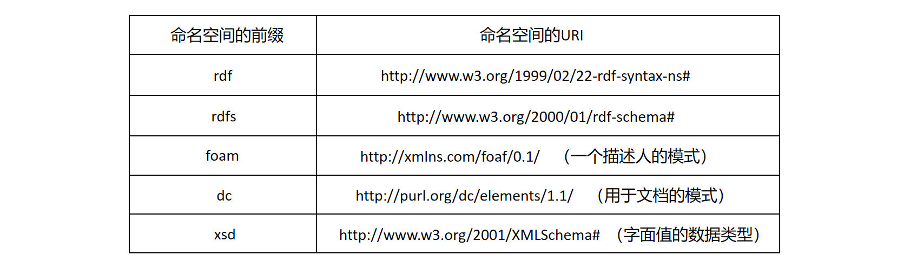
	<br>
	<div display: inline-block; padding : 2px>
		图 1.15 常用的命名空间前缀示例
	</div>
</center>

**RDF图**. RDF 三元组可以被可视化为有向标记图。其中，主语和宾语表示为节点，谓语表示为弧，如图1.16所示。

<center>
	
	<br>
	<div display: inline-block; padding : 2px>
		图 1.16 RDF 三元组可视化
	</div>
</center>

一组 RDF 语句就是一个 RDF 图。请看下面这个简单的例子

<center>
	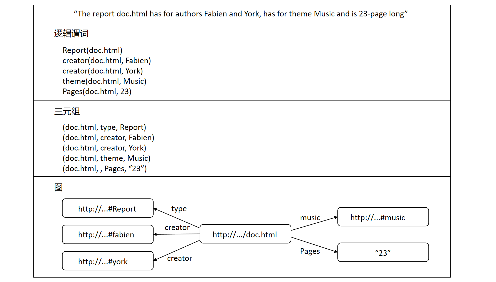
	<br>
	<div display: inline-block; padding : 2px>
		图 1.17 RDF 三元组示例1
	</div>
</center>

当然，我们也可以用命名空间和 URI 将其改写如下：

<center>
	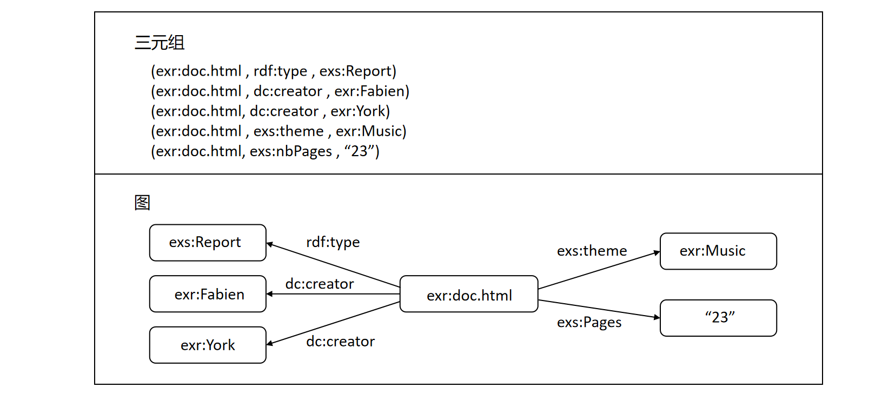
	<br>
	<div display: inline-block; padding : 2px>
		图 1.18 RDF 三元组示例2
	</div>
</center>

再例如
$$
\begin{align*}
&(wos:texbook, \ dc:Creator, \ wos:knuth) \\
&(wos:texbook, \ dc:Title, \  "The \ TEXbook") \\
&(wos:knuth, \ foaf:name, \ "Donald Knuth")
\end{align*}
$$
形成由3个语句组成的RDF图。其中，“Knuth 的 Texbook”这个断言可以分解成两个 RDF 语句，并且由 URI $wos:texbook$（wos是命名空间前缀）来表示这本书。第一个语句的宾语 $wos:knuth$ 是一个 URI，代表 Knuth 这个人。这个 RDF 图可视化如图1.19所示：

<center>
	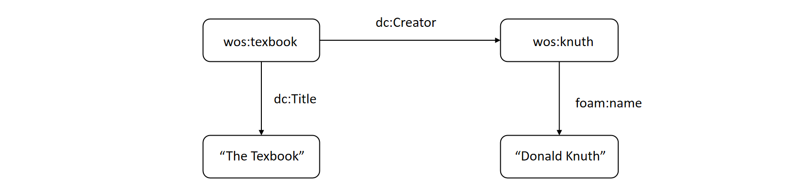
	<br>
	<div display: inline-block; padding : 2px>
		图 1.19 RDF 三元组示例3
	</div>
</center>

该RDF图的含义是：一个由 $wos:texbook$ 标识、标题为 $The TEXbook$ 、且其创建者由 $The \  TEXbook$ 标识并姓名为 $Donald \ Knuth$ 的信息资源。

**空白节点（Blank Node）**. 迄今为止，在所有的示例中，资源都能和 URI 相关联。但在某些时候可能会出现这样的情况，即已知存在某个对象，但不知道是哪个特定实例。针对这种情况，RDF 引入了空白节点的概念。RDF 图中的空白节点意味着代表资源的顶点是未知的或匿名的，它可以是一个语句的宾语，也可以是其他语句的主语。这种资源由空白节点标识符表示，用下划线代替命名空间前缀，它通常写作 $\_:n$，其中 $n$ 为整数。RDF 空白节点本身不包含任何数据，但充当一组数据的父节点。

例如，上述关于 Knuth 是 TEXbook 的作者的例子的更复杂版本是
$$
\begin{align*}
&(wos:texbook, dc:Creator, \_:1) \\
&(wos:texbook, dc:Title, "The \ TEXbook") \\
&(\_:1, foaf:name, "Donald Knuth") \\
&(\_:1, rdf:type, xy:Person) \\
&(\_:1, wos:described, wos:knuth) \\
\end{align*}
$$
它更清楚地说明了 TEXbook 的作者是一个人，他有个人姓名，并在另一个资源（$wos:knuth$）中作了进一步描述，如图1.20所示：

<center>
	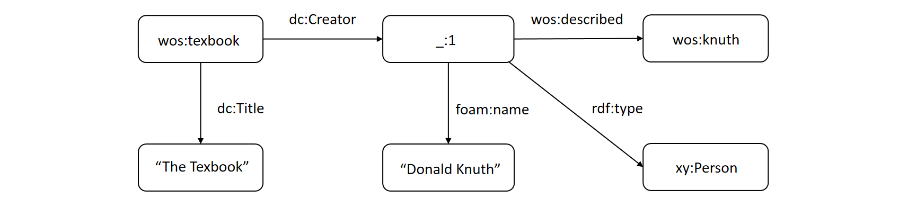
	<br>
	<div display: inline-block; padding : 2px>
		图 1.20 RDF 三元组示例4
	</div>
</center>

**RDF概念**. 现在我们可以更正式地来描述三元组：让“uris”指代 URI 的集合，“blanks”指代空白节点标识符的集合，“lits“则为任何数据类型的可能字面值的集合（我们考虑所有的集合都是无限的）。那么，
$$
\begin{align*}
(s, p, o) \in (uris \cup blanks) × (uris) × (uris \cup blanks \cup lits)
\end{align*}
$$
就是一个RDF语句（Statement）。请注意，这里没有对哪些 URI 可以作为语句的属性出现做出任何限制。

如果 $x \in uris \cup blanks$，我们就说 $x$ 是一个资源，并且 RDF 语句中出现的任何内容都是一个值（$x \in uris \cup blanks \cup lits$）。在本书中，它大多情况下都是指值，因为具体的类型（URI、blank、literal）并不重要。

总的来说，一个 RDF 图 $T$ 就是一组 RDF 语句（三元组）。一个 $T$ 的子图就是 $T$ 的一个子集，一个基础的 RDF 图就是一个没有空白节点的 RDF 图。

我们用 $univ(T)$ 表示 $T$ 的所有三元组中出现的所有值的集合，称其为 $T$ 的域。而 $vocab(T)$，$T$ 的词汇，就是 $T$ 的域中所有非空节点的值的集合。$T$ 的大小就是它所包含的语句的数量，用 $丨T丨$ 表示。我们用 $sub(T)$ （相应的，$pred(T), obj(T)$）表示所有作为主语（谓语，宾语）出现的值。

令 $V$ 表示 URI 和 字面值的集合，我们定义
$$
\begin{align*}
RDFG(V) := \{T : T \ is \ RDF \ Graph \ and \ vocab(T) \subseteq V \}
\end{align*}
$$
即，所有 RDF 图的集合，并且词汇也包含在 $V$ 中。

**重化（reification）**. 同样，也可以将一个语句本身作为对象来进行描述，这叫做重化（reification）。例如，我们可以用一个空白节点象征着要描述的语句，同时使用另外四个语句来提供该空白节点与要描述的语句之间的关联。

图1.21展示了一个 (a, b, c)语句的重化，重化是一个很好的例子可以看出任何属性都是一个信息资源，它可以是描述的主语，也可以是描述的宾语。在本例中，重化语句的谓语 $b$ 成为了另一个语句的宾语。

<center>
	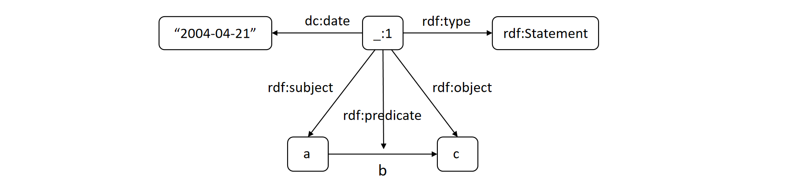
	<br>
	<div display: inline-block; padding : 2px>
		图 1.21 RDF 三元组示例5
	</div>
</center>

但是，这种图表示法有一定的局限性。如上图所示，由于 RDF 允许像描述其他资源一样描述属性，因此有一条边同时连接着一个边标签和一个节点。然而，图的定义就意味着节点和边是不同的集合。虽然 RDF 数据的简单集合可以用这种方式可视化，但却失去了图模型的其他优势，例如理论结果的有效性和编程库的支持。

我们可以只使用标准边来构造 RDF 图，如图1.22所示。在这种方法中，边只连接节点，但边和节点的标签是相交的。这样做的缺点是，所得到的图并不能真正反映 RDF 数据的连通性。

<center>
	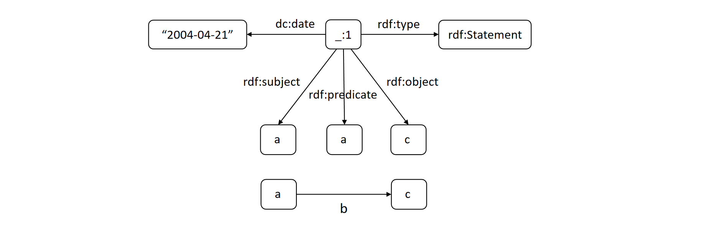
	<br>
	<div display: inline-block; padding : 2px>
		图 1.22 RDF 三元组示例6
	</div>
</center>

**词汇（Vocabularies）**. 如上所述，一个 RDF 图的词汇就是图中出现的所有 URI 资源和字面量的集合。从广义上讲，我们将词汇称为在某个特定领域中用于进行断言的一组具有明确定义意义的概念。某些 RDF 词汇仅以人类可理解的方式定义，而其他词汇则使用 RDFS（见下文）或本体规范语言来添加机器可理解的 RDF 词汇表。

**资源描述框架模式（RDFS，RDFS Schema）**. RDFS 是 RDF 的语义扩展，它提供了描述相关资源组和这些资源之间关系的机制。它是一种轻量级语言，用于声明和描述资源类型（称为**类**）以及资源关系和属性类型（称为**属性**）。RDFS 允许命名和定义 RDF 图中使用的词汇：命名现有资源的类；命名这些类的实例之间存在的关系类型，即它们连接的资源类型。

RDFS 定义将 RDF 数据中的某些信息因式分解，因此不再需要重复这部分信息。这些信息无需在数据中明示，而是可以通过推论得出。比如说，通过说明 $Man$ 类是 $Person$ 类的子类，就无需在说明 $Fabien$ 是一个 $Man$ 的同时也是一个 $Person$，因为我们可以从 $Fabien \ is \ a \ Man$ 和 $Man$ 是 $Person$ 的子类这两个信息中推断出 $Fabien \ is \ a \ Person$ 也成立，如图1.23所示。

<center>
	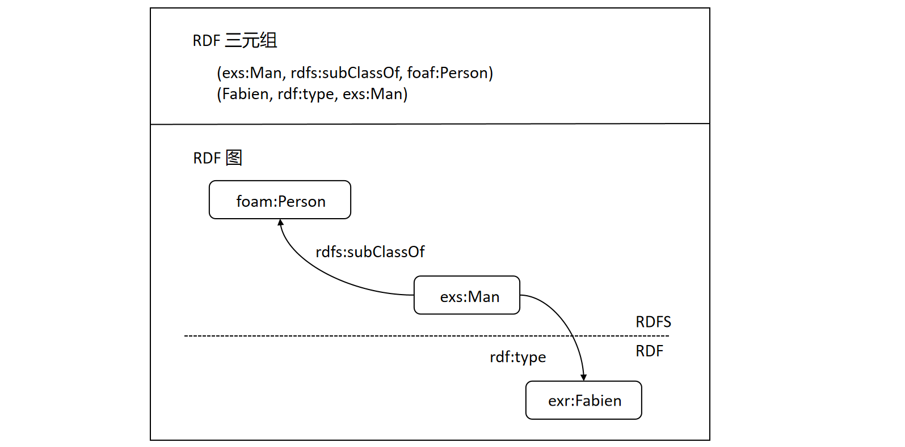
	<br>
	<div display: inline-block; padding : 2px>
		图 1.23 RDF RDFS示例1
	</div>
</center>

RDF 中描述的所有事物都属于 $rdfs:Resourse$ 类，资源 $rdfs:Resourse$ 的类型是 $rdfs:Class$ 类，RDF 中所有其他的类都是 $rdfs:Resourse$ 类的子类。类 $rdfs:Class$ 是 RDF 中所有类的类型，其本身也是 $rdfs:Class$ 类型的资源。类 $rdfs:Literal$ 是字符串和整数等字面值的类，是 $rdfs:Resource$ 的子类，也是 $rdfs:Class$ 的一个实例。属性值例如文本字符串则是RDF字面值的一个实例。字面值可以是普通的，也可以是具有数据类型的。$rdfs:Datatype$ 就是数据类型的类，并且它的每个实例都是 $rdfs:Class$ 的一个子类。例如，类 $rdf:XMLLiteral$ 就是 XML 字面值的类，它是 $rdfs:Datatype$ 的一个实例，也是 $rdfs: Literal$ 的子类。

属性，用于标记 RDF 图的弧，和类一样重要。类 $rdf:Property$ 是所有 RDF 属性的类。类和属性分为两个层次，允许多重继承。类的层次由类之间的 $rdfs:subClassOf$ 类型的链接给出，属性的层次由属性之间的 $rdfs:subPropertyOf$ 类型的链接给出。

在图1.24所示的例子中，$InternshipReport$ 就是 $Report$ 的一个子类，而 $Report$ 本身又是 $Document$ 的一个子类。

<center>
	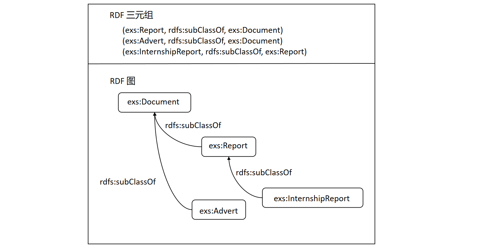
	<br>
	<div display: inline-block; padding : 2px>
		图 1.24 RDFS示例2
	</div>
</center>

如前所述，$rdf:type$ 是用于声明资源是类的一个实例的属性。类的所有实例都是其超类的实例，即类的实例是其子类的实例。此外，$rdfs:subClassOf$ 属性是**可传递**的，即一个类的所有超类也是其子类的超类，资源的类型通过 $rdfs:subClassOf$ 定义的层次结构传播。在前面的例子中，$InternshipReport$ 也是 $Document$ 的子类，并且 $InternshipReport$ 的每个实例也是 $Report$ 和 $Document$ 的实例，属性 $rdfs:subClassOf$ 允许多重继承。换句话说，一个类不仅可以有多个子类，还可以有多个父类。

同样，属性 $author$ 也是 $creator$ 的子类型并且继承了它的签名，如图1.25所示。

<center>
	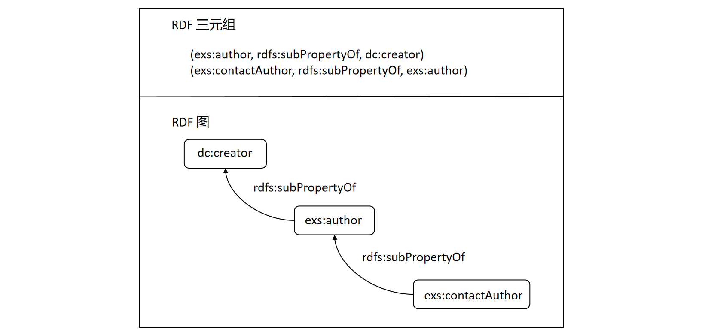
	<br>
	<div display: inline-block; padding : 2px>
		图 1.25 RDFS示例3
	</div>
</center>

与一个属性相关的所有资源也与它的超属性相关。此外，$rdfs:subPropertyOf$ 也是**可传递**的，即一个属性的所有超属性也是它的子属性的超属性，关系通过 $rdfs:subPropertyOf$ 定义的层次结构传播。在上图的例子中，$contactAuthor$ 是 $creator$ 的子属性，当两个资源之间的关系 $contactAuthor$ 成立时，$author$ 和 $creator$ 关系也成立。

属性 $rdfs:subPropertyOf$ 允许多重继承。就像类的情况一样，一个属性不仅可以有几个子属性，还可以有几个父属性。如图1.26所示，通过多重继承，可以说明属性 $contactAuthor$ 意味着某人同时是文档的 $author$ 和 $owner$。

<center>
	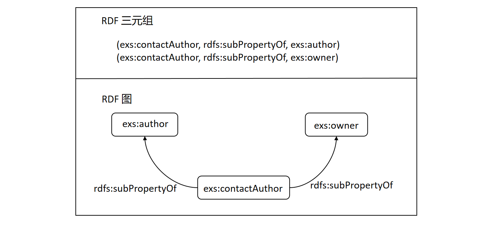
	<br>
	<div display: inline-block; padding : 2px>
		图 1.26 RDFS示例4
	</div>
</center>

### 1.2.7 LPG 与 RDF 模型的转化

现代图数据库系统大致可分为两类：其中一类包括支持资源描述框架（RDF） 及其查询语言 SPARQL 的系统，即所谓的三元组存储。RDF 的基础是一种抽象数据模型，它将图数据表示为三元组形式（主语、谓语、宾语）。这种 RDF 三元组的集合称为 RDF 图，可以用有向、有边标签的多重图来表示。另一类系统支持某些形式的所谓的 "属性图"，这是一种有向多重图，其节点和边可以与一组键值对（称为属性）相关联。这类图中最普遍的形式是标签属性图（LPG）——其节点和边可能还带有标签。因此，这些不同类别的系统管理的数据形式各不相同。本节，我们将正式介绍 LPG 和 RDF 图之间的互相转化，使得这些不同形式的图数据具有互操作性。

**LPG 到 RDF 的转化**

要在 RDF 模型中表示 LPG，需要将 LPG 的顶点映射为 URI （①），然后分别使用 RDF 谓语和 RDF 宾语表示顶点的属性键和属性值，并使用 RDF 三元组将这些顶点和他们的 LPG 属性连接起来（②）。例如，对于一个 $ID$ 为 $vertex-id$ 的顶点和它对应的一个属性（在该属性中，key 为 $property-key$，value 为 $property-value$），我们可以创建一个 RDF 三元组 $(vertex-id, property-key, property-value)$。同样，我们可以在 RDF 模型中表示 LPG 图模型中的边，具体方法是给每条边赋予 URI 状态（③），并通过类似于连接顶点 $(edge-id, property-key, property-value)$  的方式将边的属性与特定边连接起来（④）。然后，我们必须使用两个三元组将每条边与其任何相邻的顶点连接起来（⑤）。最后，LPG 标签也可以通过为顶点（⑥）和边（⑦）创建 RDF 三元组的方式转化为 RDF 三元组，转化方式与属性类似，这样谓语就变成了 "标签 " URI，并包含该标签的字符串名称。

图1.27展示了一个从 LPG 到 RDF 的转化过程。其中 $V-ID$、$E-ID$、$age$、$name$、$type$、$from$、$to$、$since$ 和 $label$ 是 RDF URI，黑色圆圈的数字对应着上面的步骤。

<center>
	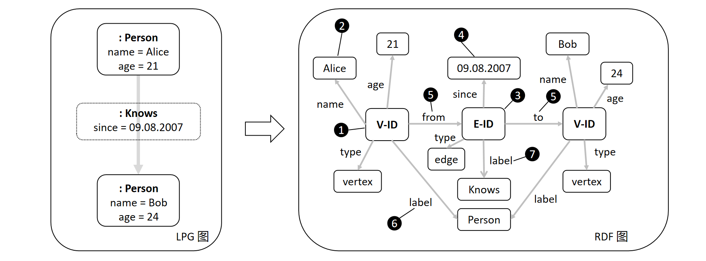
	<br>
	<div display: inline-block; padding : 2px>
		图 1.27 LPG到RDF的转化
	</div>
</center>

如果所有顶点和边都只有一个标签，则可以省略标签三元组，并且将标签（如 $Person$）与顶点或边的名称（$V-ID$ 和 $E-ID$）一起存储在标识符中，如图1.28所示。

<center>
	
	<br>
	<div display: inline-block; padding : 2px>
		图 1.28 LPG到RDF的转化（单标签）
	</div>
</center>

**RDF 到 LPG（变体） 的转化**

将 RDF 数据转换为 LPG 模型（的变体）更加复杂，因为 RDF 谓语通常会被转换为 LPG 中的边，而这些谓语是 URI。因此，在从 RDF 图派生 LPG 图时，必须将这些谓语映射到顶点，并将这些顶点连接起来，否则，生成的 LPG 图可能会断开连接。

目前默认使用的标记图存在定义模糊的问题，此外，由于标记图本质上是用二元（尽管是标记的）边来表示 RDF 三元组语句，因此存在固有的局限性。作为替代方案，自然会考虑具有三元边的超图；由此，我们还可以从 RDF 中推导出一个二分的 LPG 图。

**1. RDF 到超图**

**定义（具有三元边的超图）**. RDF 图 $T$ 的超图表示 $\gamma(T) = (V, E)$ 定义如下：
$$
\begin{align*}
V &= \{v_{x}: x \in univ(T)\}\\
E &= \{(v_{x}, v_{y}, v_{z}): (x, y, z) \in T\}
\end{align*}
$$
由定义可知，超图的边是有序的，它是3-一致的（所有超边的大小都为 3），因为每条边代表一个 RDF 三元组。此外，还可以看出所得到的超图是简单的（没有多条边），因为 $T$ 是一个集合，其中每个三元组只出现一次。

**例**. 图1.29展示了一个简单的三条 RDF 语句的超图表示，其中椭圆区域覆盖的顶点表示一条超边所连接的顶点。为表示方便，其中对标签进行了简写（通过 RDF 三元组中的黑体注明）。

<center>
	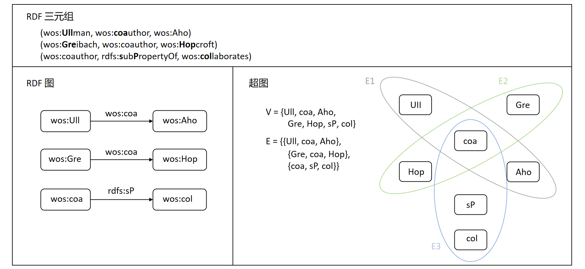
	<br>
	<div display: inline-block; padding : 2px>
		图 1.29 RDF到超图的转化
	</div>
</center>


**命题**. 任何 RDF 图 $T$ 都可以用简单有序的3-一致（3-uniform）超图 $\gamma(T)$ 表示(根据定义可知）。

请注意：超图在集合运算下是封闭的。事实上，RDF 图也是一个三元组集合，因此我们可以像对 RDF 图本身一样，对代表 RDF 的超图进行集合运算。

**2. RDF 到二分图**

**2.1 从超图中推导关联矩阵**
上一部分介绍的基于超图的表示法有一个缺点，即超图不如传统图那么常见。我们现在介绍一种映射，它能将上面研究的表示 RDF 的超图转换为一类普通图。

在前面的内容中我们了解到，超图可以用关联矩阵来表示，这种矩阵可以理解为二分图（Bipartite Graph）的节点邻接矩阵。因此，我们将使用二分图来表示 RDF。

超图的关联矩阵中相应项的 "1 "表示节点存在于该边中（如图1.30所示）。对于表示 RDF 图的超图，超边的节点是有顺序的。这个顺序必须在关联矩阵中保留：我们选择用 S、P 或 O 来标记节点在边中的角色（即信息资源在该语句边中作为主语、谓语或宾语），而不是根据节点在边中的出现顺序使用整数。因此，当从该关联矩阵推导二分关联图时，我们会给矩阵中的每个S、P、O 项添加一条边，并用对应的字符标记这条边。因此，从任何超图的关联矩阵派生的图与RDF图超图之间的唯一区别是派生图每条边有三个标签之一。

<center>
	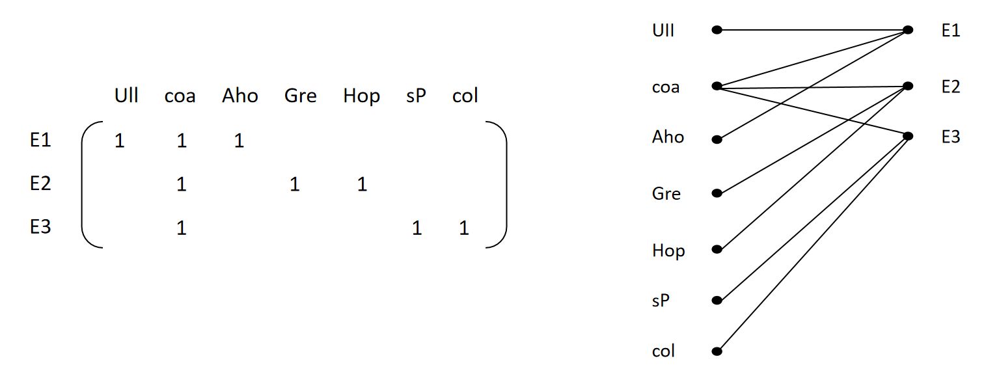
	<br>
	<div display: inline-block; padding : 2px>
		图 1.30 关联矩阵示例
	</div>
</center>

在这部分内容中我们介绍了用二分图来表示 RDF 的基本思想，下面我们将正式介绍该映射。

**2.2 RDF 到二分图**

**定义（Bipartite Labeled Graphs，二分标记图）**. 设 $\mathcal{B}$ 是二分标记图 $G = (V \cup St, E, nl, el)$ 的集合，$V \cap St = \emptyset$，其中 $E$ 中的每条边都连接 $V$ 中的一个顶点和 $St$ 中的一个顶点，$el: E \rightarrow EL$ 和 $nl: V \rightarrow NL$ 是标签函数。$V$ 中的元素称为值节点（value nodes），$St$ 中的元素称为语句节点（statement nodes）。为了允许节点之间存在多条边，我们将 $E$ 理解为一组边元素，并引入函数 $stat: E \rightarrow St$ 和 $val: E \rightarrow V$，这些函数分别给出边 $e$ 所连接的语句节点 $stat(e)$ 和值节点 $val(e)$。

上面定义的图集合 $\mathcal{B}$ 代表了可以从超图派生的二分关联图——尽管节点类的命名已经反映了预期用途。为了具体说明从表示 RDF 图的超图中获得的图，即简单有序的3-一致超图（的某个子集）的关联图，我们需要做出以下限制：

**定义（RBG，RDF Bipartite Graphs，RDF二分图）**. 我们将对图类 $RBG \subset \mathcal{B}$ 做出如下定义：设 $B = (V \cup St, E, nl, el) \in RBG$， 边标签集为 $EL = \{S, P, O\}$，节点标签集 $NL$ 被划分为三个集合 $uris(B)$、$blanks(B)$ 和 $lits(B)$，那么将满足以下条件：
（1）对于任意 $st \in St$：
$$
degree(st) = 3
$$
（2）对于任意 $e \in E$ 且 $val(e) = v$：
$$
\begin{align*}
nl(v) \in \begin{Bmatrix}
&uris(B) \cup blanks(B)  & if \ el(e)=S \\
&uris(B) & if \ el(e)=P\\
&uris(B) \cup blanks(B) \cup lits(B)  & if \ el(e)=O \\
\end{Bmatrix}
\end{align*}
$$
并且，
$$
\begin{align*}
\forall e' \in E, stat(e')=stat(e): el(e') \neq el(e).
\end{align*}
$$

现在，我们来定义 RDFG（RDF 图）到 RBG（RDF二分图） 的映射。

**定义（RDFG 到 RBG 的映射）**. 设 $T$ 是词汇 $V$ 上的 RDF 图，我们将定义一个映射 $\beta: RDFG(V) \rightarrow RBG$ 如下：
$\beta(T) = (V \cup St, E, nl, el) \in RBG$ 是表示 $T$ 的 RDF 二分图，并且，
$$
\begin{align*}
V &= \{v_{x}: x \in univ(T)\} \\
St &= \{ st_{t}: t \in T \}
\end{align*}
$$
节点的标签由以下公式给出：
$$
\begin{align*}
nl(v_{x}): = \begin{Bmatrix}
(x, dx) & if \ x \ is \ literal(d_{x} \ is \ the \ datatype \ of \ x) \\
x & else
\end{Bmatrix}
\end{align*}
$$
边集 $E$ 将定义如下：对于每个三元组 $t = (x, y, z) \in T$，都有边
$$
\begin{align*}
e_{1} : val(e_{1}) = v_{x}, \ stat(e_{1}) = st_{t}, \ el(e_{1}) = S, \\
e_{2} : val(e_{2}) = v_{y}, \ stat(e_{2}) = st_{t}, \ el(e_{2}) = P, \\
e_{3} : val(e_{3}) = v_{z}, \ stat(e_{3}) = st_{t}, \ el(e_{3}) = O.
\end{align*}
$$

请注意，$\beta(T)$ 是一个3元二分图，因为 $St$ 中每个节点的度数都是 3。为方便起见，对于表示一个 RDF 语句 $t$ 的语句节点 $st$，我们记为 $\beta(t)$。同样地，表示值 $x$ 的值节点 $v_{x}$ 记为 $\beta(x)$（请记住，值是 URI、空白节点和字面值的抽象术语）。

图1.31展示了如何将单个语句表示为 RDF 二分图。其中，圆圈节点是代表<主 谓 宾>语句的语句节点，上方的节点是代表一个语句中三个组成部分的值节点，边标签 S、P 、O 表示值节点在语句中担任的角色。

<center>
	
	<br>
	<div display: inline-block; padding : 2px>
		图 1.31 单个语句的RDF二分图示例
	</div>
</center>

**例**. 我们来看一个简单的“科学家网络”的示例，其中前缀 $wos$ 代表相应的命名空间的前缀。绘制方法如下：圆圈代表语句节点，圆角矩形代表值节点，边标签 S、P、O分别表示一个语句的主语、谓语、宾语。为表示方便，在图1.32中，我们对标签进行了缩写（通过黑体注明），并统一把边标签写在边的左侧。

<center>
	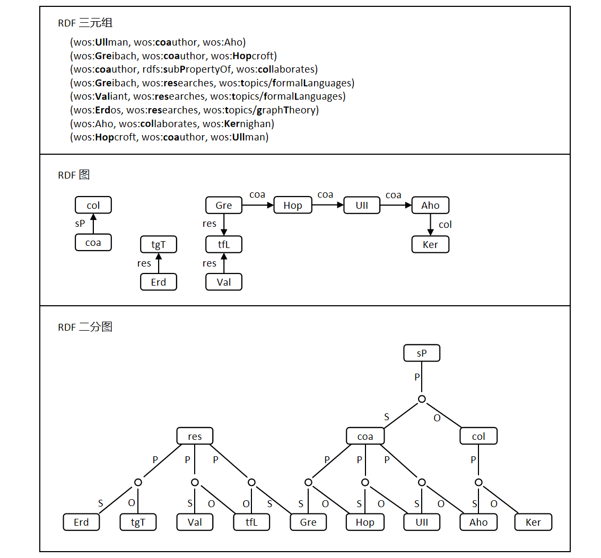
	<br>
	<div display: inline-block; padding : 2px>
		图 1.32 RDF二分图示例
	</div>
</center>

从 RDF 图到 RDF 二分图的映射是定义明确的，我们可以在 $T$ 和 $\beta(T)$ 之间来回切换，如下命题所述：

**命题**. 
（1）对于每个 RDF 图 $T$，都一个唯一定义的 RDF 二分图 $\beta(T)$ 来表示它；
（2）此外，存在一个函数：
$$
\beta^{-1}: RBG \rightarrow RDFG(V)
$$
满足：
$$
\beta^{-1}(\beta(T)) = T
$$
这一小节我们介绍了从 RDF 语句集到二分图的映射。所谓语句节点，就是将语句作为节点明确地纳入图中。作为值节点，它没有对被描述的资源和属性进行区分。值的作用（作为主语、谓语或宾语出现）完全由与其相连的边的标签所决定。

## 1.3 图数据库查询语言

图数据库查询语言（以下简称“图查询语言”）是一类专门用于在图数据中进行查询、操作和分析的编程语言。与传统的关系型数据库查询语言（如SQL）不同，图查询语言旨在处理由节点和边构成的数据结构，尤其擅长揭示数据之间的复杂关系和模式。流行的图查询语言包括面向属性图查询的 Cypher、Gremlin 和 GQL，以及面向 RDF 图的SPARQL 语言。在本节，我们将学习如何使用 Cypher 进行基础的图数据库查询。

### 1.3.1 图查询语言概览

图查询语言是处理和分析图数据的强大工具，它和关系数据库的查询语言 SQL 类似，都是用来从数据库中查询数据，而无需使用如 C++ 等编程语言编写程序。图查询语言通常可以分为声明式和命令式两种：
- 声明式（Declarative）图查询语言以结果为导向。它允许用户通过描述“**是什么**”而不是“**如何做**”来进行数据查询和处理。这类语言强调表达查询意图，而非具体的操作步骤，使得查询编写更加简洁和直观。
- 命令式（Imperative）图查询语言则以过程为导向。它强调的是**如何**执行查询和操作，而不仅仅是描述**查询的目标**。与声明式查询语言不同，命令式查询语言要求用户详细指定执行步骤，逐步引导查询引擎完成任务。

接下来，我们将介绍几种常见的图查询语言。

1. Cypher

Cypher 是由 Neo4j 开发和推广的一种声明式图查询语言，专门用于操作和查询图数据库。Cypher 的语法直观，类似于 SQL，具有较强的可读性，使用户能够轻松编写和理解复杂的图查询。Cypher 支持图的创建、读取、更新和删除操作，能够处理节点、边及其属性，适用于各种图数据库的应用场景。此外，Cypher 擅长处理复杂的图模式匹配，可以高效地查找图中的特定模式和路径。

Cypher 语言是目前全球最常用的图查询语言，除 Neo4j 外，许多图数据库如 GalaxyBase 也兼容并支持 Cypher。后续，我们将详细讲解 Cypher 语言的语法及使用示例。

2. SPARQL

SPARQL 是一种专门用于查询和操作 RDF（资源描述框架）数据的声明式查询语言。SPARQL 是由 W3C（万维网联盟）推荐的标准，是 RDF 数据查询的核心工具，广泛应用于语义网和关联数据（Linked Data）领域。SPARQL 的查询结果可以是结果集，也可以是 RDF 图。SPARQL 已被多种 RDF 数据库和查询引擎广泛支持，包括 Apache Jena、Blazegraph 和 GraphDB 。

3. Gremlin

Gremlin 是 Apache TinkerPop 框架下的图查询语言。Gremlin 是一种图遍历语言，其查询由一系列的遍历步骤组成。Gremlin 遍历可以以命令式（程序式）方式、声明性（描述性）方式编写，也可以以包含命令性和声明性的混合方式编写。Gremlin 的强大之处在于其灵活的图遍历能力。它允许用户定义复杂的图遍历路径，从而实现高效的数据检索和分析。同时，Gremlin 支持多种编程语言，包括 Java、Groovy、Python、JavaScript 和 Scala 等，使得开发者可以在熟悉的编程环境中使用 Gremlin。Gremlin 可以在任何兼容 TinkerPop 的图数据库中使用，如Neo4j、JanusGraph、Amazon Neptune。

4. GSQL

GSQL 是一种专门为 TigerGraph 图数据库设计的强大而灵活的声明式图查询语言。GSQL 的语法与 SQL 类似，使得 SQL 开发者可以轻松上手。然而，它同时也支持 NoSQL 开发人员锁偏爱的 MapReduce 编程模型，并兼容大规模并行处理的可扩展性。目前，在市面上的图数据库中，TigerGraph 是唯一完全支持 GSQL 的图数据库。

5. GQL

GQL（Graph Query Language）是 ISO/IEC 联合技术委员会提案并表决通过的国际标准（声明式）图查询语言。GQL 由多个行业领袖和标准化机构共同制定，它在很大程度上借鉴了现有的主流查询语言，如 Cypher、SQL 等，目的是为图数据库提供一种通用的查询语言，支持各种图数据操作和分析。

### 1.3.2 图数据库查询（以Cypher为例）

Cypher 是 Neo4j 的声明式图查询语言。它由 Neo4j 工程师于 2011 年创建，是一种与 SQL 相当的图数据库语言。与 SQL 类似，Cypher 让用户专注于从图形中检索什么，而不是如何检索。Cypher 的设计理念是：无论是开发人员，还是数据库专业人士，甚至是业务利益相关者都可以轻松地读懂 Cypher。从直觉上来讲，我们习惯用示意图来描述图，Cypher 的易用性正源于它符合我们的直觉。

Cypher 提供了一种可视化的模式和关系匹配方法。它依赖于以下 ASCII 类型的语法：`(nodes)-[:CONNECT_TO]→(otherNodes)`，其中，圆括号表示节点，`-[:CONNECT_TO]-`表示关系。尽管它现在还是 Neo4j 特有的语言，但它和我们使用示意图来表示图的方式非常相似，就像将节点等实体及它们之间的关系以可视化的方式构建到查​​询中，因此非常适合程序化地描述图。

**Cypher 和 SQL 的主要区别**

Cypher 和 SQL 在许多方面都很相似。例如，它们共享许多相同的关键字，例如`WHERE`和`ORDER BY`。但是，两者之间存在一些重要差异：

1. Cypher 具有模式灵活性

Cypher 相比 SQL，具有更高的模式灵活性。SQL 查询需要严格定义和维护数据库的模式（Schema），即必须预先定义好数据库中的表结构、字段类型等，所有数据都必须遵循这些定义进行存储和查询。而 Cypher 则不需要预先定义固定的模式，可以在没有严格模式的情况下自由添加或修改节点和关系。这意味着用户不需要使用固定的模式来表示数据，他们可以随着图表的发展添加新的属性和关系。

**例**. 在 SQL 查询中，我们需要在查询语句的开头指定想要的返回内容，而 Cypher 查询以 `return` 子句结尾。例如，考虑以下这个关于电影查询的例子（均在数据库中搜索评分大于 7 的电影标题），第一个查询使用 SQL 编写，第二个查询使用 Cypher 编写：
- SQL 查询
```SQL
SELECT movie.name
FROM movie
WHERE movie.rating > 7
```
- Cypher 查询
```Cypher
MATCH (movie:Movie)
WHERE movie.rating > 7
RETURN movie.title
```

2. Cypher 语言更简洁

由于 Cypher 和我们使用示意图来表示图的方式非常相似，Cypher 查询通常比与其等效的 SQL 查询更简洁。例如，考虑以下两个查询（均在数据库中搜索电影《不可饶恕》中演员的姓名），第一个查询用 SQL 编写，第二个查询用 Cypher 编写：
- SQL 查询
```SQL
SELECT actors.name
FROM actors
 	LEFT JOIN acted_in ON acted_in.actor_id = actors.id
	LEFT JOIN movies ON movies.id = acted_in.movie_id
WHERE movies.title = "不可饶恕"
```
- Cypher 查询
```Cypher
MATCH (actor:Actor)-[:ACTED_IN]->(movie:Movie {title: '不可饶恕'})
RETURN actor.name
```

**Cypher 查询的基本语法**

Cypher 的构造基于简洁的图像，使查询既易于编写又易于阅读。例如，请看下图中的简单图数据，你将如何用语言表示这些数据？

<center>
	
	<br>
	<div display: inline-block; padding : 2px>
		图 1.33 图建模示例
	</div>
</center>

我们很容易想到：克林特·伊斯特伍德导演了电影《不可饶恕》。克林特·伊斯特伍德出演了电影《不可饶恕》。

Cypher 语法就建立在我们刚刚表达的结构之上。

1. 在 Cypher 中表示节点

由于 Cypher 模式受 ASCII-Art 的启发，我们需要一种可视化的方式来表示上述模式中的每个组件。属性图模型的主要组件是节点和关系。节点是图中的数据实体，我们通常可以通过查找数据模型中的名词或对象来识别节点。例如，在图1.34中，“克林特·伊斯特伍德” 和 “不可饶恕” 是我们的节点。

<center>
	
	<br>
	<div display: inline-block; padding : 2px>
		图 1.34 节点建模示例
	</div>
</center>

为了在 Cypher 中描述节点，我们使用圆括号将节点括起来，例如 `(node)`，这看起来就像数据模型中节点的可视化表示所使用的圆圈。

如果我们稍后想要引用该节点，我们可以创建一个**节点变量**，例如使用 `p` 指代人，使用 `m` 指代电影。在实际查询中，我们通常会使用更长更直观的表达方式，例如使用 `person` 指代人，使用 `movie` 指代电影。和其他编程语言一样，我们可以随意命名变量，并在后面的查询中使用相同的名称引用它们。如果该节点与我们的返回结果无关，我们可以使用空括号指定一个**匿名节点**`()`。请注意，Cypher 中每个查询是独立执行的，因此在一个查询中使用的变量名不会影响其他查询中的变量名。

在属性图数据模型中，我们通过分配**节点标签**将相似的节点分组在一起。在上面的例子中，`Person` 和 `Movie` 就是标签，它们就相当于关系数据库中的表，而标签中的一个节点就相当于表中的一行。

查看上面的示例，看看我们如何指定节点。
```Cypher
()                  //anonymous node (no label or variable) can refer to any node in the database
(person:Person)          //using variable person and label Person
(:Person)       //no variable, label Person
(movie:Movie)      //using variable movie and label Movie
```

2. 在 Cypher 中表示关系

图是顶点和边的集合，顶点描述实体，边则描述顶点之间的关系。在 Cypher 中，两个节点之间的关系使用箭头`-->`或`<--` 来表示，这直观上看起来就像连接节点的箭头和线。而其他信息（例如节点如何连接（关系类型）以及与关系相关的任何属性）可以放在箭头内的方括号中，如 `-[relation]->`。

如图1.35所示，节点之间标有 `DIRECTS`、`ACTS_IN` 的线就是我们的关系。请注意，对于有向关系，我们使用箭头和两个破折号来表示，例如`-->`，而对于无向关系，我们仅使用 `--` 来表示，它表示关系可以沿任一方向遍历。

<center>
	
	<br>
	<div display: inline-block; padding : 2px>
		图 1.35 边建模示例
	</div>
</center>


请注意，如果数据以一种特定的关系方向存储，而查询指定了错误的方向，Cypher 将不会返回任何结果。因此，在不确定方向的情况下，我们最好使用无向关系来检索一些结果。

```Cypher
//data stored with this direction
CREATE (person:Person)-[:Directs]->(movie:Movie)

//query relationship backwards will not return results
MATCH (person:Person)<-[:Directs]-(movie:Movie)

//better to query with undirected relationship unless sure of direction
MATCH (person:Person)-[:Directs]-(movie:Movie)
```

**关系类型**对关系进行分类并赋予其意义，类似于节点标签对节点进行分组。在我们的属性图数据模型中，关系显示了节点之间的连接和关联方式，我们通常可以通过查找动作或动词来识别数据模型中的关系（请注意，我们可以使用任何命名来指定节点之间的关系，但建议使用动词和动作来制定良好的命名约定，因为这有利于我们正确理解）。

例如，让我们从示例图中看一下关系类型：
- `[:DIRECTS]` ：当我们将节点放在关系的两侧时，这暗示了哪个节点是导演，哪个节点是电影。
- `[:ACTS_IN]` ：当我们将节点放在关系的两侧时，这暗示了哪个节点是演员，哪个节点是电影。

同样，如果我们稍后想要引用该关系，我们可以创建一个**关系变量**，如 `rel`，我们也可以使用更长更直观的变量名，如 `directs` 或 `acts_in`。如果我们后续不需要引用关系，则可以仅使用 `--`、`-->` 或 `<--` 而不带方括号来指定一个**匿名关系**。

具体来说，例如，我们可以使用 `-[rel]->` 或 `-[rel:DIRECTS]->` ，然后在查询中调用`rel`变量来引用关系及其详细信息。

请注意，如果我们忘记了关系类型前面的冒号（如 `-[DIRECTS]->`），则它仅代表一个变量（而不是关系类型）。由于没有声明关系类型，Cypher 会搜索所有类型的关系。

3. 节点或关系属性

我们已经讨论了如何使用 Cypher 表示节点、关系和标签，现在我们要了解如何表示属性图中的**属性**。属性就是为节点和关系提供额外信息的键值对。为了在 Cypher 中表示属性，我们可以在节点的圆括号或关系的方括号内使用花括号。然后，将属性的名称和值放在花括号内。如图1.36所示，其中：
- 节点属性：`(person:Person {name: '克林特·伊斯特伍德'})`，`(movie:Movie {title: '不可饶恕'})`
- 关系属性：`-[rel:DIRECTS {since: 1992}]->`

<center>
	
	<br>
	<div display: inline-block; padding : 2px>
		图 1.36 属性建模示例
	</div>
</center>

4. Cypher 中的模式

节点和关系构成了图模式的基本构建块,这些构建块可以组合在一起来表达简单或复杂的**模式**。模式是图形最强大的功能。在 Cypher 中，它们可以写成连续的路径，也可以分成较小的模式并用逗号连接在一起。

例如，当我们要表示上面示例中的 “克林特·伊斯特伍德导演了《不可饶恕》”，在 Cypher 中，模式将写作如下：
```Cypher
(p:Person {name: "克林特·伊斯特伍德"})-[rel:DIRECTS]->(m:Movie {since: 1992})
```

这部分 Cypher 告诉了我们想要的模式，但它并没有说明我们是要对现有的模式进行查询操作还是将其插入一个新的模式。为了告诉 Cypher 我们希望它如何处理模式，我们需要添加一些关键字（在下面的内容中我们将会对关键字展开详细介绍）。

**Cypher 中的基础查询**

Cypher 语法使用了一系列**关键字**和符号来定义和操作图数据，包括 `MATCH`、`RETURN`、`WHERE`、`CREATE`、`SET`、`ORDER BY`、`FOREACH`、`MERGE` 和 `UNION` 等，这些关键字共同构成了 Cypher 查询的基本结构，使用户能够灵活地查询和操作图数据。

让我们以图1.37的数据模型为例，来了解不同的关键字和基础的查询语句。

<center>
	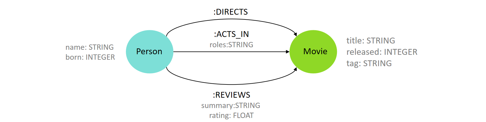
	<br>
	<div display: inline-block; padding : 2px>
		图 1.37 数据模型
	</div>
</center>

它包括两种类型的节点标签：
- `Person`节点具有以下属性：`name`和`born`。
- `Movie`节点具有以下属性：`title`、`released`和`tag`

数据模型还包含`Person`和`Movie`节点之间的三种不同关系类型：`ACTS_IN`、`DIRECTS` 和 `REVIEWS`。其中两种种关系类型具有属性：
- 关系 `ACTS_IN` 类型，具有`roles`属性。
- 关系 `REVIEWS` 类型，它有一个`summary`属性和一个`rating`属性。

1. 创建节点和边

例如，分别创建一个 `Person` 类和一个 `Movie` 的节点，然后在上面的两个节点之间创建两种类型的边：
```Cypher
CREATE (zxc:Person {name:'周星驰', born:1962})
CREATE (king:Movie {title:'喜剧之王', released:1999, tag:'喜剧'})
CREATE
(zxc)-[:DIRECTS]->(king),
(zxc)-[:ACTS_IN {roles:['尹天仇']}]->(king)
```

2. 查找节点

现在让我们考虑电影关系图模型的一个简单查询：返回所有的电影。 `MATCH` 会在图中查找所有匹配的节点或关系，`RETURN` 子句用于指定查询结果中需要返回的内容。电影可以在 `Movie` 标签下的分组中找到，因此，我们将需要匹配的节点放到 `MATCH` 子句中，然后在 `RETURN` 子句中返回找到的节点：
```Cypher
MATCH (movie:Movie)
RETURN movie
```

在 Cypher 查询语言中，`RETURN` 子句用于指定查询结果中需要返回的内容。它类似于 SQL 中的 `SELECT` 子句，通过 `RETURN` 子句，我们可以控制查询返回的节点、关系、属性或计算结果（包括聚合函数的结果，例如 `COUNT`、`SUM`、`AVG` 等）。执行上述查询会通过**表的形式**返回一个结果集，而非图本身，该结果集是符合条件的节点集合，每个节点本身可以看作是图中的一个元素。具体来说，如果数据库中存在带有 `Movie` 标签的节点，那么查询将返回所有这些节点（和 SQL 中的 `SELECT` 一样，该结果集不会自动去重）。同时，每个返回的节点是一个符合条件的图数据库中的实体，具有与之相关的属性和关系。

当然，我们也可以限制结果集，例如只返回五个节点：
```Cypher
MATCH (movie:Movie)
RETURN movie
LIMIT 5
```

现在考虑另一个查询：查找“周星驰”节点，并返回他的名字和出生年份。此查询可写作：
```Cypher
MATCH (zxc:Person {name:'周星驰'})
RETURN zxc.name AS name, zxc.born AS born
```
该查询将查找带有 `Person` 标签和 “周星驰” 名称的节点，并将其命名为 `zxc`，然后返回找到的节点的 `name` 和 `born` 属性。同时使用了关键字 `AS`，用于为查询结果中的列创建别名。

与 SQL 类似，Cypher 查询使用各种子句构建，每个子句的输入都是图的状态和由引用的变量组成的中间结果表，每个子句的输出是一个新的图状态和一个新的中间结果表，作为下一个子句的输入，这些子句链接在一起以在彼此之间传递中间结果，最后一个子句的输出就是查询的结果。返回的表包含列和行，其中列表示返回的属性或节点/关系，行表示查询的每个结果项。因此，无论查询的复杂程度如何，结果总是以表的形式组织和返回。

需要注意的是，如果某个子句返回一个空的中间结果表，就没有内容传递给后续的子句，从而终止查询。有一些方法可以规避这种行为。例如，可以将 `MATCH` 子句替换为 `OPTIONAL MATCH`，对于找不到的匹配项，`OPTIONAL MATCH` 会用 null 代替。

与 SQL 中的 `WHERE` 子句类似，Cypher 中的 `WHERE` 子句用于在查询中增加条件，以便只返回符合特定条件的节点、关系或路径。`WHERE` 子句通常与 `MATCH` 子句一起使用，用于限定查询匹配的图元素。考虑以下查询：找出2020年上映的电影的标题。该查询可以用 Cypher 写为：
```Cypher
MATCH (movie:Movie)
WHERE movie.year = 2020
RETURN movie.title
```

Cypher 允许在 `WHERE` 子句中使用逻辑连词 `AND`、`OR`、`NOT`。逻辑连词的运算对象可以是包含比较运算符 `>`、`>=`、`<`、`<=`、`=` 和 `><` 的表达式。`WHERE` 子句中还可以使用 `=~` 操作符匹配正则表达式，支持`EXISTS` 函数的存在性检查，以及使用 `IN` 操作符检查元素是否在列表中。

3. 查找连通节点

在 `MATCH` 子句中，我们不仅可以匹配节点，还可以匹配节点之间的关系。通过这种方式，我们可以指定图的结构，在一条语句中描述节点及其关系，查询包含特定关系的节点，而不需要多次查询。考虑以下查询：查找电影《喜剧之王》的导演，并返回导演的名字。
```Cypher
MATCH (movie:Movie {title: '喜剧之王'})<-[directs:DIRECTS]-(person:Person)
RETURN person.name as director
```

这个查询与电影《喜剧之王》的导演的图表相匹配，`MATCH` 子句中的关系 `<-[directs:DIRECTS]-` 用来指定要匹配的 `Person` 节点和 `Movie` 节点之间的特定关系，最终返回其导演的 `name` 属性。

我们不仅可以通过关系查找连通节点，还可以通过连通节点来查找它们之间的关系。考虑以下查询：查找所有与“周星驰”有关联的电影，并返回该关系类型以及电影的标题。该查询可以用 Cypher 写为：
```Cypher
MATCH (zxc:Person {name:'周星驰'})-[rel]->(movie:Movie)
RETURN type(rel) AS type, movie.title AS movie
```

以上查询将在图中搜索从节点“周星驰”到任何 `Movie` 节点的传出关系，并返回与该节点相关的关系（如：`DIRECTS`）和电影名称。

同样，我们还可以通过向子句添加标签表达式来进一步修改 Cypher 查询。例如，以下查询使用`NOT`标签表达式 ( `!`) 返回所有和“周星驰”相连且类型不为 `ACTS_IN` 的关系（例如：`DIRECTS`）。
```Cypher
MATCH (:Person {name:'周星驰'})-[rel:!ACTS_IN]->(movie:Movie)
Return type(rel) AS type, movie.title AS movies
```

4. 查找路径

有多种方法可以使用 Cypher 在图中搜索节点之间的路径。

对于**定长模式**的查询，使用量词（`{n}`）指定模式中节点之间的距离（跳数）。例如，考虑以下查询：查找与“周星驰”节点存在两跳关系的所有 `Person` 类节点，并返回前2行。`ORDER BY` 子句可以让查询结果中的元组按排列顺序显示，`DISTINCT` 运算符可确保结果不包含重复值。为了按出生年份列出前两位与“周星驰”存在两跳关系的 `Person` 类节点，该查询可以用 Cypher 写作如下：
```Cypher
MATCH (zxc:Person {name:'周星驰'})--{2}(person:Person)
RETURN DISTINCT person.name AS name, person.born AS bornIn
ORDER BY bornIn
LIMIT 2
```

请注意，`ORDER BY` 默认升序排列，如果要选择降序排列，需要添加关键字 `DESC`。
假设结果如下，因为他们都与名为“喜剧之王”的节点存在一跳关系：

| name | bornIn |
| ---- | ------ |
| 吴孟达  | 1952   |
| 莫文蔚  | 1970   |

对于**变长模式**的查询，使用范围（`{a:b}`）指定模式中节点之间的距离范围（跳数）。考虑以下查询：查找与“周星驰”节点存在 1~4 跳关系的所有 `Person` 类节点，并返回前5行。
```Cypher
MATCH (zxc:Person {name:'周星驰'})--{1,4}(person:Person)
RETURN DISTINCT person.name AS name, person.born AS bornIn
ORDER BY bornIn
LIMIT 5
```

Neo4j 还提供了一系列的**图算法**库，可以在 Cypher 查询中调用这些算法来查找路径、计算中心性、进行社区检测等（在后续的章节中，我们将会对这些图算法展开详细的介绍）。

例如，如果要查找两个节点之间的最短路径，可以使用`shortestPath`算法。考虑以下查询：
查找 "周星驰" 和 "莫文蔚" 之间的最短路径，并返回这条路径。
```Cypher
MATCH p=shortestPath(
(:Person {name:"周星驰"})-[*]-(:Person {name:"莫文蔚"})
)
RETURN p
```

请注意，在 Cypher 查询中，如果有多条最短路径，`shortestPath` 函数将只返回其中一条。如果需要找到所有最短路径，可以使用 `allShortestPaths` 函数。假设该结果表示的图如下：

<center>
	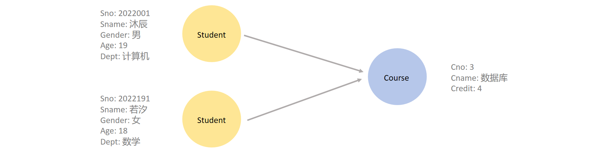
	<br>
	<div display: inline-block; padding : 2px>
		图 1.38 最短路径
	</div>
</center>

1. 查找推荐

Cypher 中还可以实现推荐系统的功能。

考虑以下查询：为“周星驰”推荐他还没有合作过的演员，但这些演员与他合作过的演员共同出演过电影，并且根据推荐演员与“周星驰”间接合作的次数（合作强度）返回合作强度最高的前 5 名推荐演员。由于 Cypher 查询使用各种子句构建，每个子句的输入和输出都是一个中间结果表，这些子句链接在一起以在彼此之间传递中间结果。因此，对于这个查询，我们可以将逻辑拆解为以下几步：
- 匹配周星驰出演的电影及其合作演员。
- 找到这些合作演员出演的其他电影及其合作演员。
- 然后进行条件过滤，确保“周星驰”没有和推荐演员合作过。
- 计算并返回前 5 名合作强度最高的推荐演员的姓名与合作强度

该查询可以用 Cypher 写作如下：
```Cypher
MATCH (zxc:Person {name:'周星驰'})-[:ACTS_IN]->(m:Movie)<-[:ACTS_IN]-(coActors:Person),
  (coActors:Person)-[:ACTS_IN]->(m2:Movie)<-[:ACTS_IN]-(cocoActors:Person)
WHERE NOT (zxc)-[:ACTS_IN]->()<-[:ACTS_IN]-(cocoActors) AND zxc <> cocoActors
RETURN cocoActors.name AS recommended, count(cocoActors) AS strength
ORDER BY strength DESC
LIMIT 5
```

现在考虑另一个查询：在电影中既与“周星驰”共同出演过，又与“吴孟达”共同出演过的其他演员。该查询可以用 Cypher 写作如下：
```Cypher
MATCH (:Person {name:'周星驰'})-[:ACTS_IN]->(:Movie)<-[:ACTS_IN]-(coActor:Person),
  (coActor)-[:ACTS_IN]->(:Movie)<-[:ACTS_IN]-(:Person {name:'吴孟达'})
RETURN DISTINCT coActor.name AS coActor
```

6. 删除图表

`DELETE` 用于删除顶点和关系。在删除顶点前，需要先删除与该顶点有关联的所有关系。
考虑以下查询：删除姓名为“周星驰”的 `Person` 类顶点以及所有与该顶点相关联的关系。该查询可以用 Cypher 写作如下：
```Cypher
MATCH (zxc:Person {name:'周星驰'})
DETACH DELETE zxc
```
使用 `DETACH DELETE` 将删除顶点及其相连的所有一跳关系。 

如果仅删除关系，保留顶点，则可以用 Cypher 写作如下：
```Cypher
MATCH (zxc:Person {name:'周星驰'})-[rel]->(:Movie)
DELETE rel
```

如果要删除图中的所有节点和关系，请运行以下查询：
```Cypher
MATCH (n)
DETACH DELETE n
```

