# 图数据库的查询处理

## 1 图查询引擎简介

​	前面我们具体介绍了 Neo4j 的声明式查询语言 Cypher 以及其简单语法，下面我们用一个具体的使用 Cypher 的查询例子来帮助读者更好地理解查询语句执行的具体流程。在给出明确的例子之前，读者需要对系统处理查询语句的流程有所了解。

**系统处理查询语句流程**

1. **语法解析（Parsing）**：系统在获取用户输入的 Cypher 查询语句后，解析器会将其转换成**抽象语法树（AST）**，并验证关键字、顶点、关系和属性等的正确性。
2. **语义分析（Semantic Analysis）**：对于生成的抽象语法树，系统进一步验证顶点和边的依赖关系是否成立以及是否正确使用属性，同时保证查询语句符合逻辑并能够成功执行，增加语法树的语义表达和中间表示。语法分析和语义分析最大的区别就在于，语义分析在语法分析的基础上考虑了语句的逻辑性。
3. **执行计划生成（Plan Generation）**：系统对于增强的语法树，生成一个初步的**执行计划**。该计划描述了一个基本满足查询要求的访问系统内数据的操作方式，包括扫描顶点和关系的操作、过滤条件的应用、连接操作等。
4. **查询优化（Query Optimization）**：系统会优化和改进初步的执行计划以提高查询效率，优化技术主要包括应用图算法来加速顶点和关系的查找、优化连接顺序、合并相邻操作等。
5. **查询执行（Query Execution）**：根据执行计划实际访问数据库并执行查询操作，获取查询结果集。该结果集包含所有结果数据，但不能保证是用户预设的格式。
6. **结果返回（Result Return）**：将结果集转换成用户预设的格式并返回给用户。

**场景描述**

​	假设我们有一个简单的社交网络图数据库，其中包含了用户和用户之间的关系。用户顶点有一个属性 `name`，边的关系类型为`FRIEND`，采用无向连接，表明用户之间朋友的对等关系。我们简单构建用户以及用户关系如图 4-1 所示，该图直观地向我们展示了各用户的邻居关系，`Alice`和`Bob`、`Charlie`存在朋友关系，`Charlie`和`Alice`、`David`存在朋友关系，`David`和`Bob`、`Charlie`存在朋友关系，`Bob`和`Alice`、`David`存在朋友关系。

<center>
	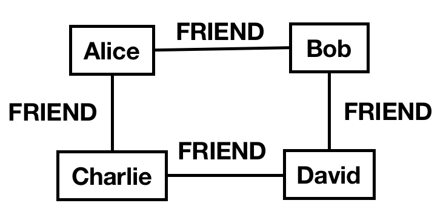
	<br>
	<div display: inline-block; padding : 2px>
		图 4-1 社交网络图示例
	</div>
</center>

**数据创建**	

​	我们使用 Cypher 查询语言创建图数据，创建代码如下：

```cypher
// 创建用户顶点
CREATE (Alice:Person {name: 'Alice'})
CREATE (Bob:Person {name: 'Bob'})
CREATE (Charlie:Person {name: 'Charlie'})
CREATE (David:Person {name: 'David'})
// 创建朋友关系
CREATE (Alice)-[:FRIEND]-(Bob)
CREATE (Alice)-[:FRIEND]-(Charlie)
CREATE (Bob)-[:FRIEND]-(David)
CREATE (Charlie)-[:FRIEND]-(David)
```

​	系统获取 Cypher 创建图语句后，首先对每条 `CREATE` 语句进行**语法解析**和**语义分析**，在创建用户顶点时，如果顶点 `Alice`、`Bob`、`Charlie`、`David `原先均不存在，则依次创建；在创建朋友关系时，如果这些关系原本均不存在且依赖顶点已创建，则依次创建。其次，系统为创建语句**生成执行计划**并进行**优化**，一般涉及基本创建和批处理等操作。同时，所有创建顶点和关系的操作通常都会作为一个**事务**来处理，确保所有操作都成功执行，如果出现错误，则回滚整个事务以保持一致性。最后，在系统执行完毕后向用户确认创建成功。

**查询邻居**

​	为了展示图查询的流程，我们以`Alice`为例查找其一阶邻居和二阶邻居。从图 4-1 中可以很直观地观察到，Alice的一阶邻居为 `Bob`和 `Charlie`，二阶邻居为 `David`，但是在系统的执行逻辑下，我们需要编写 Cypher 查询语句如下：

```cypher
MATCH (Alice:Person {name: 'Alice'})-[:FRIEND]->(friend)-[:FRIEND]->(friendOfFriend)
RETURN Alice.name AS Alice, friend.name AS Friend, friendOfFriend.name AS FriendOfFriend
```

​	首先，对于上面的查询语句进行**语法解析**，系统会对 `MATCH` 和 `RETURN` 等关键字和语句结构进行正确性验证和解析，验证通过后，**语义分析**主要涉及查询模式的验证和属性引用的正确性等，例如顶点 `Alice` 和关系 `FRIEND` 是否存在、属性 `name` 的引用是否正确等。其次，系统对查询语句**生成执行计划**并进行**优化**。实际的执行计划可能涉及使用索引来定位顶点 `Alice` 、设计顶点和关系的遍历顺序、应用图算法等操作，具体计划和优化细节取决于系统内部。对于查询一阶邻居和二阶邻居的例子，我们可以利用图遍历算法广度优先搜索来完成，先找到顶点 `Alice` ，其次找到 `Alice` 通过  `FRIEND`  关系连接的顶点，即 `Bob` 和 `Charlie`，最后对于每个朋友，找到通过 `FRIEND` 关系连接的顶点`David`，具体执行流程参考本章3.1 小节。在得到结果集后，我们根据用户设定的格式返回，返回结果如下：

```sql
Alice | Friend | FriendOfFriend
------------------------------
Alice | Bob    | David
Alice | Charlie| David
```

## 2 图查询类型

### 2.1 单点多阶邻居查询

​	**多阶邻居查询（Multi-hop Neighbor Query）**用于查找从一个顶点出发，通过多个**跳（Hop）**所能够到达的邻居顶点。通过一条边直接与某个顶点相连的顶点为该顶点的**单跳邻居**，也称为**邻居**、**一阶邻居**。例如，在社交网络中，一个人的直接朋友就是这个人的单跳邻居。从某个顶点出发，通过两个或多个顶点（通过两条或多条边）才能到达的顶点为该顶点的**多跳邻居**，单点多阶邻居查询就是查找单个顶点的多跳邻居的过程。同样以社交网络为例，某个人的二跳邻居就是这个人朋友的朋友，三跳邻居是这个人朋友的朋友的朋友，以此类推。如图 4-2 所示，以中心的黑色顶点 v 为例，图中的所有绿色顶点为 v 的单跳邻居；在绿色顶点的单跳邻居中，除了 v 自身和所有绿色顶点，剩下的顶点即 v 的二阶邻居，如图中的蓝色顶点；以此类推得到图中的紫色顶点为 v 的三阶邻居。

<center>
	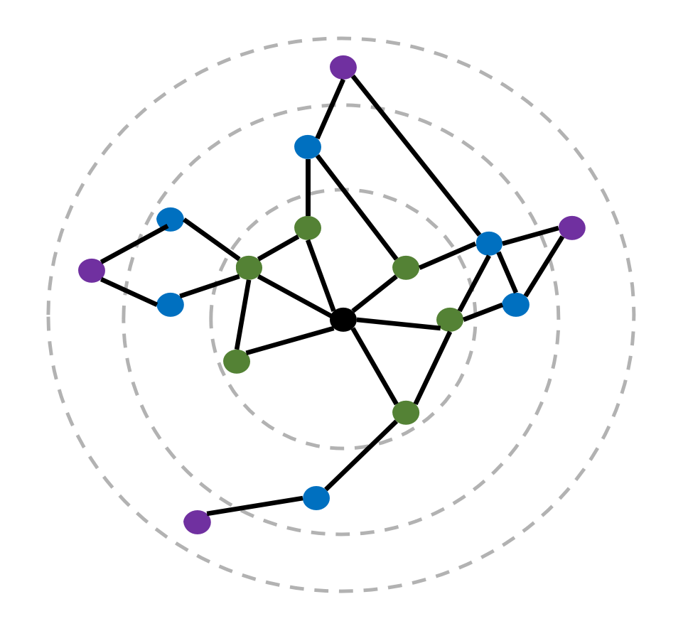
	<br>
	<div display: inline-block; padding : 2px>
		图 4-2 多阶邻居示例
	</div>
</center>

​	多阶邻居查询的应用很广泛，较为常见的有：多阶扩散、近邻分布、关联可视化展示和特定邻居搜索等等。下面我们将给出明确的定义和例子来帮助读者更好地理解多阶邻居查询的应用。

**多阶扩散**

​	由于关联边的存在，邻居顶点往往和源顶点的关系更密切或属性相近，而多阶扩散就用来获取与自身属性一致或相近的顶点。例如，在特定标签的人群识别中，同类人群往往更容易形成社区并且彼此间存在更紧密的关联，从已知的标签人群出发，通过相应场景的紧密关联（如常见的共同设备）扩散出的人群往往就能覆盖未知的标签人群。

**近邻分布**

​	近邻分布能够通过多阶邻居查询来更精准地刻画源顶点的某一特定属性。例如，在社交网络中，程序员关联的邻居中具有程序员标签的用户密度会明显偏高。对于一个未知标签的用户，通过其社交网络多阶邻居中已知的用户分布来辅助确定当前用户是否具有相应的属性往往很有效。

**关联画像**

​	对于确定的某个顶点，其多阶邻居的全貌展示有助于对该顶点更深刻的理解，即可以通过其多阶邻居的关联来对该顶点进行画像。这类应用往往需要通过图可视化工具来落实并展示，例如天眼查等关联可视化的应用。

**特定邻居搜索**

​	多阶邻居的查询也能获取特定的邻居进行强化关联。以社交网络为例，每个人的一阶邻居好友关系为其可见的人脉集合，而二阶或多阶（一般只扩展到二阶邻居）邻居好友则为其非可见的人脉集合，即人脉盲区，此时通过特定的二阶邻居好友查询就能够确定是否存在符合需求的人脉并将其精确定位。以现实中患者看病为例，假设一名患者想在赴诊前对某医院某科室医生进行提前的健康咨询，而该患者一阶邻居人脉并无覆盖该科室的任何一名医生，如果该患者能够找到与该科室某个目标医生的公共邻居好友，则可以通过该公共好友与目标医生建立直接的关联关系，提前实现健康咨询。

​	多阶邻居查询一般的最大阶数为三，因为四阶及以上的查询结果会非常庞大且难以处理。此外，更高阶的邻居顶点与源顶点的关联强度也会随着阶数的增长而不断下降。因此，从经验的角度来看，多阶邻居查询一般最多到三阶。

### 2.2 两点间关联路径查询

​	顾名思义，路径是从起点到终点的方向和路线，**两点间关联路径查询（Path Query Between Two Nodes）**用于查找从一个顶点到另一个顶点的所有可能路径或特定路径。其中**两点间关联路径**是指能够将两点联通起来的所有边的集合。如图 4-3 所示，张四建立了志愿者社团，李一是该志愿者社团的社员，张五是张四的亲属，此时从张五到张四，张四到志愿者社团，志愿者社团到李一的三条边的集合就构成了张五到李一的一条路径。

<center>
	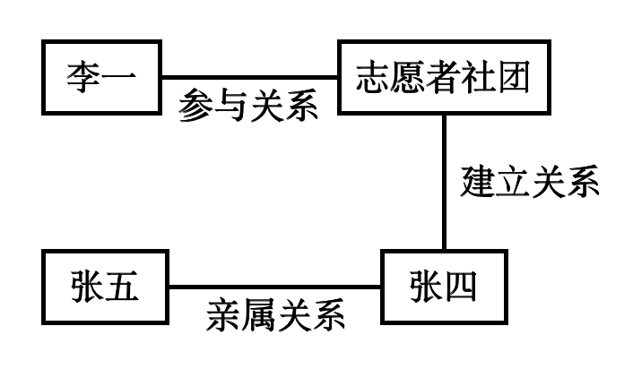
	<br>
	<div display: inline-block; padding : 2px>
		图 4-3 关联路径示例
	</div>
</center>

​	在实际应用中，以刑侦场景为例，案件的受害者与施害者的关联是警察首要关注的信息。假设能够构建足够大的一张图，其中包括多种关联关系信息，则可以通过关联路径查询来获取受害者与施害者之间的所有关联路径，二者间的各种直接与间接的关联关系就能够清晰显现出来，非常有利于提高分析案件的效率。

​	从经验的角度来看，受限于计算能力，在亿级图中路径查询的目标路径长度一般不会大于六，同时由于关联信息与程度的衰减，实际需求往往不会大于四，且关联路径的查询过程通常是从两个顶点分别向对方搜索，对各自的多阶邻居取交集，每个顶点往外搜索的深度最多为三。

### 2.3 多点间关联子图查询

​	在介绍关联子图查询之前，我们需要对**子图（Subgraph）**有一个清晰的理解，子图的概念是相对一个更大的图来定义的。如果一个图的点集和边集都是另一个图的子集，则称该图为另外一个图的子图。以华东师范大学月度转账网络为例，该月数据科学与工程学院教职工之间的转账关系则构成该转账网络的一个子图。**多点间关联子图查询（Subgraph Query Between Multiple Nodes）**用于查找包含多个指定顶点的子图，该子图通常不包含其他无关的顶点和边。如图 4-4 所示，以4.2.1中的多阶邻居查询为例，如图 4-4(a) 所示，我们需要得到该网络中包含所有蓝色顶点的关联子图，则所有蓝色顶点集和橙色边集组成的图 4-4(b) 和图 4-4(c) 都是目标子图之一。

<center>
	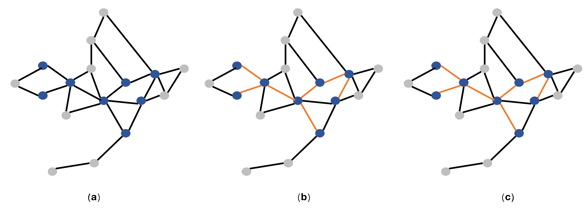
	<br>
	<div display: inline-block; padding : 2px>
		图 4-4 关联子图示例
	</div>
</center>

​	关联子图查询在应用上有两个很明显的优点，最直接的优点在于其对数据需求的表达能力很强。以查询需求“在华东师范大学数据科学与工程学院就读并且家乡在上海的硕士有哪些？”为例，一般的查询理解方式通常仅仅从查询中抽取关键字来进行，而子图的方式则更为精准，如图 4-5 所示。子图能够理解查询目标是个顶点，顶点有至少三条关联的边，分别是对“华东师范大学数据科学与工程学院”的就读关系，对“上海“的家乡定位关系以及对“硕士学位”的学历关系，以此更精准地响应查询需求。

<center>
	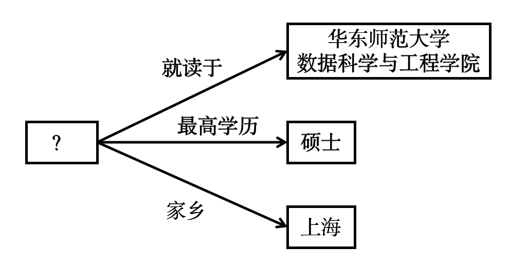
	<br>
	<div display: inline-block; padding : 2px>
		图 4-5 在华东师范大学数据科学与工程学院就读并且家乡在上海的硕士有哪些？
	</div>
</center>

​	关联子图查询的第二个很重要的优点，就在于其能够描述多点多阶的关联关系，我们利用点导出子图的概念进行解释。给定图 _G_ 及其点集 _V_ 的某个子集 _V’_ ，则 _G_ 在 _V’_ 上的**点导出子图（Node-Induced Subgraph）**为两个端点都在 _V’_ 中的最大边集组成的图。通俗地来说，点导出子图就是给定点集子集的情况下边集最大的子图。延用图 4-4 的例子，图 _G_ 即图 4-4(a) 中所有顶点和边的集合，点集 _V_ 为图 4-4(a) 中所有顶点组成的点集，点集子集 _V’_ 为图 4-4(a) 中所有蓝色顶点组成的点集，图 4-4(b) 中所有蓝色顶点和橙色边组成的集合即 _G_ 在 _V’_ 上的点导出子图。

​	从数据的角度来说，给定一个顶点集，其点导出子图能够描述顶点集在原图上所有的关联关系。例如，在线上支付反欺诈中，欺诈团伙通常是做法手法高度一致的一批用户账号，警方挖掘并打击团伙的关键就在于分析出团伙是有组织的，对批量账号之间所有的关联关系的查询就能够通过查询其点导出子图来完成。

## 3 图算法

​	图算法是一种基于图数据存储结构的计算方法，它涉及图的搜索、路径、匹配和连通性等问题。图算法为图查询和图分析提供了最核心的支持，因为它不仅可以检测图结构，如社区的识别和图的划分，还可以揭示查询和分析对象间关联模式的内在特征，因此图算法在计算机科学、网络科学、生物学等领域有广泛的应用。我们主要介绍图算法中的基于图论的迭代计算，它主要依赖图论中的一些基础概念和原理，通过迭代计算来解决图相关问题，包括寻路算法、社区检测算法、相似度算法、子图匹配算法和中心性算法等。

### 3.1 寻路算法

​	广义上来看，寻路算法是指任何能找到图中顶点间路径的算法。在计算迭代的过程中，我们通常采用以顶点为中心进行图数据读取和遍历的方式，这种方法不仅适用于寻路算法，还适用于诸如 PageRank 和 Label Propagation 等许多其他图算法。

​	寻路算法以图遍历为基础，从某一起始顶点开始遍历起邻居顶点，直到找到目标顶点从而确定最优路径。此类算法适用于路径规划、最小成本计算等多种场景。在选择合适的寻路算法时，需要考虑图的特性，例如是否有权重、是否有负权边和图的大小等，同时也需要考虑应用的实际需求，例如是否需要最短路径、计算资源的限制等。

**1. 深度优选搜索 DFS**

**算法介绍**

​	**深度优先搜索（Depth First Search）**是一种基础的图遍历算法。该算法的主要思路是从图中一个指定的顶点出发，先访问其任意一个未被访问过的邻居顶点，然后再访问该邻居顶点的任意一个未被访问过的邻居顶点，以此类推。若当前访问的顶点的邻居都被访问过后，该算法会退回到该顶点的前驱顶点，并继续访问其他未被访问过的邻居节点，直到找到目标顶点或最后退回到起始顶点且不存在未被访问过的邻居，则搜索结束。我们可以将深度优先搜索算法比作探险者，探险者从一条路出发，直到遇到了死路不能前进才会返回并继续探索。因此，深度优先搜索的特点是纵向深入到尽可能深的节点，注重深度搜索。

​	深度优先搜索算法的概念最早可以追溯到19世纪末，法国铁路工程师 Charles Pierre Trémaux 提出了一种解决迷宫的策略，被认为是深度优先搜索算法的雏形。在1930年代，Kurt Gödel 和 Jacques Herbrand 的工作中涉及到了类似深度优先的搜索策略，但并没有明确称之为深度优先搜索，直到1972年美国计算机科学家 Robert Tarjan 提出了基于深度优先搜索的强连通分量算法，才使得深度优先搜索在图论中的应用更加深入。深度优先搜索的应用十分广泛，在强连通分量、拓扑排序、分形图形生成等领域都非常有用，主要原因在于它能够系统地探索所有可能的路径。

**具体流程**

​	下面我们用一个例子来说明无向图中深度优先搜索的计算步骤，如图 4-6 所示。

<center>
	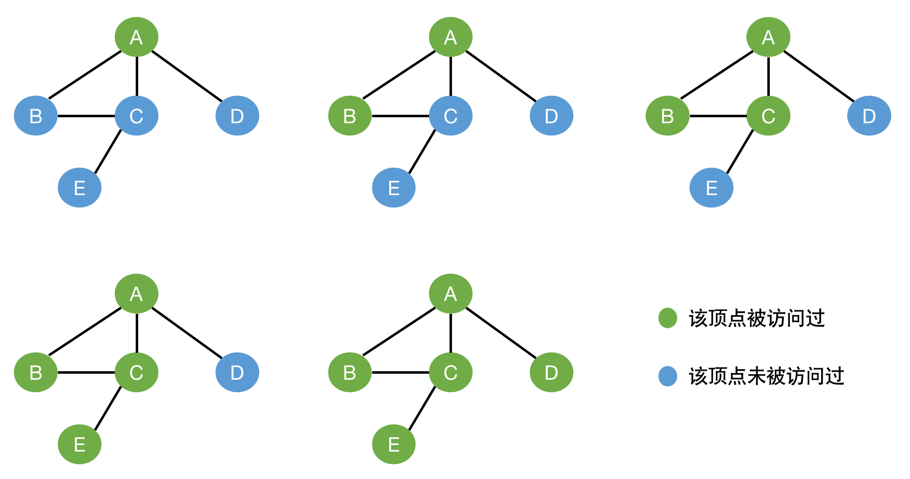
	<br>
	<div display: inline-block; padding : 2px>
		图 4-6 深度优先搜索 DFS 示例
	</div>
</center>

以下为计算步骤：

- 从顶点 $A$ 开始，把它标记为已访问（绿色）。
- 按照无向边连接的顶点（有多个），随机访问顶点 _A_ 未被访问过的邻居，把顶点 _B_ 标记为绿色。
- 按照无向边连接的顶点，访问顶点 _B_ 未被访问过的邻居，把顶点 _C_ 标记为绿色。
- 继续访问顶点 _C_ 未被访问过的邻居，把顶点 $E$ 标记为绿色。
- 顶点 _E_ 没有满足条件的邻居，退回顶点 _C_；顶点 _C_ 没有满足条件的邻居，退回顶点 _B_；顶点 _B_ 没有满足条件的邻居，继续退回顶点 _A_ 。
- 访问顶点 _A_ 未被访问过的邻居，把顶点 _D_ 标记为绿色。

**2. 广度优先搜索 BFS**

​	**广度优先搜索（Breath First Search）**也称为层序遍历，是另一种基础的图遍历算法。该算法的主要思路是从图中一个指定的顶点出发，先遍历访问其所有一阶邻居顶点，然后再遍历这些邻居顶点的邻居，以此类推，直到找到目标顶点或图中所有可到达的顶点都被访问过，则搜索结束。我们可以将广度优先搜索算法比作火山喷发，岩浆从火山口出发，在每一时刻都向相邻的地方蔓延。显然，广度优先搜索的特点是横向优先访问距离起始顶点近的顶点，注重广度搜索。

​	广度优先搜索算法最早在1959年由 Edward F. Moore 提出，主要用于寻找迷宫中到达终点的最短路径。在1973年 Donald Knuth 在其经典著作《The Art of Computer Programming》第三卷《Sorting and Searching》中详细描述了广度优先搜索算法，对广度优先搜索的定义、实现和应用进行了系统介绍，才使得广度优先搜索被广泛应用。广度优先搜索算法是许多图遍历算法的基础，如最短路径、连通分量和紧密中心性等。

**具体流程**

​	我们同样用深度优先搜索的例子来说明无向图中广度优先搜索的计算步骤，如图 4-7 所示。

<center>
	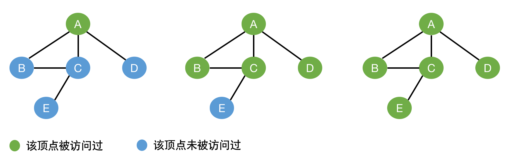
	<br>
	<div display: inline-block; padding : 2px>
		图 4-7 广度优先搜索 BFS 示例
	</div>
</center>

以下为计算步骤：

- 从顶点 $A$ 开始，把它标记为已访问（绿色）。
- 按照无向边连接的顶点（有多个），访问顶点 _A_ 的所有邻居，把顶点 _B,C,D_ 标记为绿色。
- 按照无向边连接的顶点，访问顶点 _B,C,D_ 未被访问过的邻居，把顶点 _E_ 标记为绿色。

**3. 迪杰斯特拉算法 Dijkstra**

​	单源最短路径问题是图论中的一个重要概念，其中单源表示路径计算只有一个起始顶点，与之相反，多源最短路径问题则涉及多个起始顶点的路径计算。在单源最短路径问题中，**Dijkstra算法**是典型代表，可以计算得起始顶点到其余顶点的最短路径和距离，适用于带权重的有向图和无向图，其中所有边权必须为非负。

Dijkstra算法的主要思路是：创建两个顶点集合 _S_ 和 _T_, _S_ 中存放已经确定最短路径的顶点，_T_中存放与起始顶点连通的待确定最短路径的顶点，其中的顶点有可能已经被访问过，但尚未确定最短路径。初始时，_S_ 中仅存在一个起始顶点，_T_ 中存放除了起始顶点以外的所有其余顶点。选择 _T_ 中距离起始顶点最近的顶点 $v_1$ 加入 _S_，在 _T_ 中删除 _v_1_ 并计算 _T_ 中 $v_1$ 的邻居经过 $v_1$ 到起始顶点的距离，若当前顶点计算得到的新距离小于原始距离，更新当前顶点到起始顶点的距离。继续选择 _T_ 中距离起始顶点最近的顶点 $v_2$ 加入 _S_ ，并循环先前的操作，直到 _T_中没有顶点。

​	Dijkstra算法是一种贪心算法，它在每一步都做出一个局部最优的选择，最终达到全局最优的结果。Dijkstra算法最初由荷兰计算机科学家 Edsger W. Dijkstra 于1956年提出，并于1959年发表。该算法在许多应用中具有重要的意义，包括网络路由、地理信息系统和调度系统等。

**具体流程**

​	下面我们用一个例子来说明有向权重图中Dijkstra算法的计算步骤，起始顶点为 $A$ ，如图 4-8 所示。

<center>
	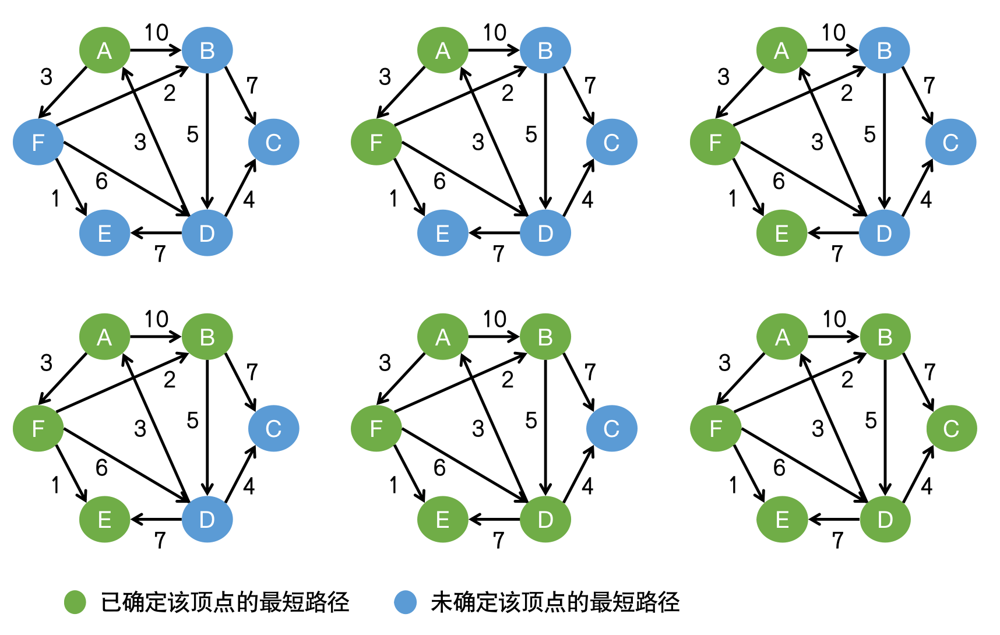
	<br>
	<div display: inline-block; padding : 2px>
		图 4-8 迪杰斯特拉算法 Dijkstra 示例
	</div>
</center>

以下为计算步骤：

- 从顶点 $A$ 开始，$S={A}$，$T=\{B, C, D, E, F\}$，顶点 $A$ 到每个顶点的最短路径距离为 $\{0, 10, +\infty, +\infty, +\infty, 3\}$ ，其中目前顶点$B$ 的最短路径为 $A\rightarrow B$，顶点F的最短路径为 $A\rightarrow F$。
- 将当前 $T$ 中距离顶点 $A$ 最近的顶点 $F$ 移入 $S$ ，$S=\{A, F\}$，$T=\{B, C, D, E\}$，获取顶点 $A$ 经过顶点 $F$ 到每个点的最短路径距离，有顶点 $B ：A\rightarrow F\rightarrow B$ 距离为 $5$（ $5<10$，更新距离）；顶点 $D：A\rightarrow F\rightarrow D$ 距离为 $9$（ $9<+\infty$，更新距离）；顶点$F：A\rightarrow F\rightarrow E$ 距离为 $4$（ $4<+\infty$，更新距离），目前得到顶点 $A$ 到每个顶点的最短路径距离为 $\{0, 5, +\infty, 9, 4, 3\}$。
- 将当前 $T$ 中距离顶点 $A$ 最近的顶点 $E$ 移入$S$，$S=\{A, F, E\}$，$T=\{B, C, D\}$，由于顶点 $E$ 不通往任何顶点，因此无法获取顶点$A$ 经过顶点 $F,E$ 到每个点的最短路径距离，顶点 $A$ 到每个顶点的最短路径距离依旧为 $\{0, 5, +\infty, 9, 4, 3\}$。
- 将当前$T$中距离顶点 $A$ 最近的顶点$B$移入 $S$，$S=\{A, F, E, B\}$，$T=\{C, D\}$，获取顶点$A$经过顶点 $F,B$ 到每个点的最短路径距离，有顶点 $C：A\rightarrow F\rightarrow B$ 距离为$12$（ $12<+\infty$，更新距离）；顶点 $D：A\rightarrow F\rightarrow D$ 距离为10（ $10>9$，不更新），目前得到顶点 $A$ 到每个顶点的最短路径距离为 $\{0, 5, 12, 9, 4, 3\}$ 。
- 将当前$T$中距离顶点$A$最近的顶点$D$移入$S$，$S=\{A, F, E, B, D\}$，$T=\{C\}$，获取顶点$A$经过顶点$F,B,D$到每个点的最短路径距离，有顶点$C：A\rightarrow F\rightarrow B\rightarrow C$距离为$13$（$13>12$，不更新），目前得到顶点$A$到每个顶点的最短路径距离为$\{0, 5, 12, 9, 4, 3\}$。
- 将当前T中距离顶点A最近的顶点$C$移入$S$，$S=\{A, F, E, B, C, D\}$，$T=\{\}$，集合$T$为空，算法结束。最后得到顶点$A$到每个顶点的最短路径距离为$\{0, 5, 12, 9, 4, 3\}$。

### 3.2 社区检测算法

​	复杂网络一直是许多领域的研究热点，其中社区结构是复杂网络的一个普遍特征，社区是指网络中的一些密集群体，整个网络是由多个社区组成的。同一社区的顶点具有较为紧密的连通性，而社区之间的连通性则比较稀疏。社区检测（Community Detection）是一个复杂而有意义的过程，它对研究复杂网络的特性具有重要的作用。近几年来，发现及分析复杂网络中的社区结构得到了许多学者的关注，同时也出现了很多社区检测算法。

​	社区检测算法也称为社区发现算法，是一种用于发现网络中社区结构的技术。由于社区的概念较为模糊，复杂网络领域的著名科学家Newman于1003年提出了一种称为模块度（Modularity）的指标，用于评估社区划分的合理性。较高的模块度表示社区划分更合理，即社区内部紧密连接，而社区之间的连接相对较弱。

**1. Tarjan算法**

​	在有向图中，如果两个顶点u、ｖ间存在一条从ｕ到ｖ的有向路径，同时还存在一条从ｖ到ｕ的有向路径，则称这两个顶点**强连通**。如果该有向图的每两个顶点都强连通，则称该图是一个**强连通图**。强连通分量是指由强连通的一组顶点构成的子图，这个子图本身也是一个强连通图。如图 4-9 所示，子图{1, 2, 4, 5}是一个强连通分量，因为顶点1、2、4、5两两可到达，{3}，{6}也是两个强连通分量。

<center>
	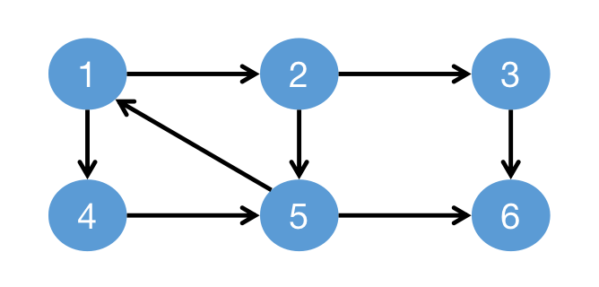
	<br>
	<div display: inline-block; padding : 2px>
		图 4-9 强连通图 示例
	</div>
</center>


​	Kosaraju算法和**Tarjan算法**是两个常见的强连通分量分解算法。Kosaraju算法使用两次深度优先搜索来找到强连通分量；Tarjan算法使用一次深度优先搜索和栈来确定强连通分量。我们重点介绍Tarjan算法，该算法能够在线性时间复杂度内计算出所有的强连通分量，时间复杂度为 $O(V+E)$ （其中 $V$ 是节点数，$E$ 是边数），并具有良好的可伸缩性，其运行时间与顶点数量呈线性关系。

​	Tarjan算法维护了两个重要的数组，$dfn$和$low$。其中，$dfn[x]$表示第一次访问顶点$x$的时间戳，$low[x]$表示从顶点$x$出发能够到达的所有顶点中最小的时间戳。dfn数组代表深度优先搜索的正向搜索过程，而$low$数组则代表深度优先搜索的反向回溯过程。由定义可以得到，$low[u]=min\{low[u], low[v]\}$，其中$(u, v)$为树枝边（深度优先搜索的一条边），$u$ 是 $v$ 的父节点；$low[u]=min\{low[u], dfn(v)\}$，其中$(u, v)$为深度优先搜索的一条反向边（从某顶点指向某个栈中顶点）。当顶点$u$的搜索结束后，若$dfn[u]=low[u]$，则以$u$为根的搜索子树上所有还在栈中的顶点组成了一个强连通分量。

​	Tarjan算法最初由美国计算机科学家Robert Tarjan于1972年发明，由于该算法高效且易于实现，因此广泛应用于计算机科学的多个领域，如编译器优化、电路分析、网络分析和图像处理等。

**具体流程**

​	我们沿用图 4-9 的例子来说明Tarjan算法的计算步骤，具体流程如图 4-10 所示。

<center>
	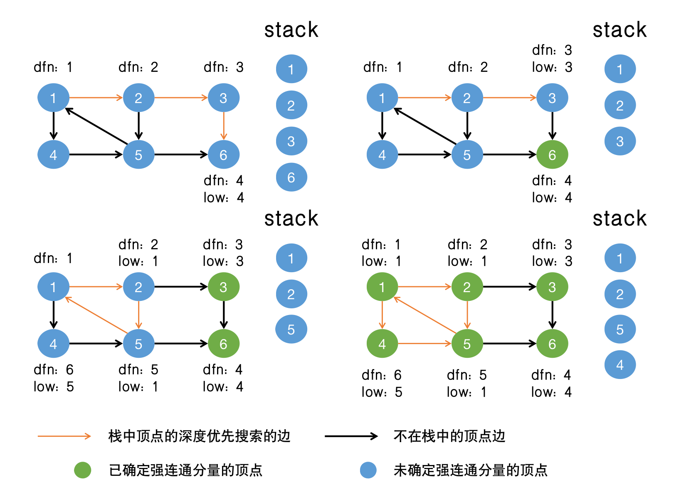
	<br>
	<div display: inline-block; padding : 2px>
		图 4-10 tarjan算法 示例
	</div>
</center>

以下为计算步骤：

- 从顶点1出发，入栈并标记$dfn[1]=1$，按照搜索顺序，先搜索到顶点2，入栈并标记$dfn[2]=2$，以此类推，搜索到顶点5，此时栈内的元素为$[1, 2, 3, 6]$。
- 顶点6有$dfn[6]=low[6]=4$，因此$\{6\}$为一个强连通分量，顶点6退栈。
- 回溯到顶点3，顶点3有$dfn[3]=low[3]=3$，因此$\{3\}$为一个强连通分量，顶点3退栈。
- 回溯到顶点2，搜索到顶点5，入栈并标记$dfn[5]=5$，顶点1还在栈中，因此顶点5到顶点1形成了一条反向边，$low[5]=min\{low[5], dfn[1]\}=min\{5, 1\}=1$。由于顶点6已经出栈，顶点5无需搜索。
- 回溯到顶点2，顶点2到顶点5形成了一条树枝边，且顶点5还在栈中，因此$low[2]=min\{low[2],low[5]\}=min\{2,1\}=1$。
- 回溯到顶点1，搜索到顶点4，入栈并标记$dfn[4]=6$，顶点5还在栈中，因此顶点4到顶点5形成了一条反向边，$low[4]=min\{low[4], dfn[5]\}=min\{6,5\}=5$。
- 回溯到顶点1，有$dfn[1]=low[1]=1$，搜索结束。以顶点1为根的搜索子树上所有还在栈中的顶点为顶点1、2、4、5，因此$\{1, 2, 4, 5\}$为一个强连通分量。

**2. 并查集算法**

​	在无向图中，**连通分量**也称弱连通分量，是由相互连接的一组顶点所构成的子图。在连通分量中，任意两个顶点能够互相到达，并且不与其他连通分量中的顶点连接。如图 4-11 所示，绿色点组成了一个连通分量，蓝色点组成了一个连通分量。

<center>
	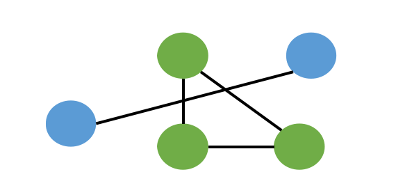
	<br>
	<div display: inline-block; padding : 2px>
		图 4-11 弱连通图 示例
	</div>
</center>

​	与强连通分量不同的是，强连通分量是有向图中的概念，而连通分量是无向图中的概念。有很多算法可以求解无向图的连通分量，我们在4.3.1节中介绍的深度优先搜索算法和广度优先搜索算法就能很好地解决问题。我们在这一小节介绍一种新的算法——**并查集（Union-Find）算法**。

​	**并查集**是一种树型的数据结构，用于处理一些不相交集合的合并及查询问题。其思想是用一个数组parent表示整片顶点森林，树的根顶点唯一标识一个集合，只要找到某个顶点的树根，就能确定它在哪个集合里。并查集有两个关键函数：find函数和union函数。其中，find函数用于查找某元素所在集合的根顶点，union 函数用于合并两个顶点（相当于合并这两个顶点所在的集合）。

​	并查集算法最初由美国计算机科学家 John Hopcroft 和 Robert Tarjan 于1973年发明，旨在处理动态连通性问题，即维护元素的分组情况。并查集因其高效的时间复杂度和强大的功能而被广泛应用，如图像处理、路径压缩等领域，并查集也主要应用于网络连接性问题中，例如检测网络中是否存在路径将两个节点连通，或者计算网络中的连通分量。

**具体流程**

​	我们沿用图 4-11 的例子来说明并查集算法的计算步骤，具体流程如图 4-12 所示。

<center>
	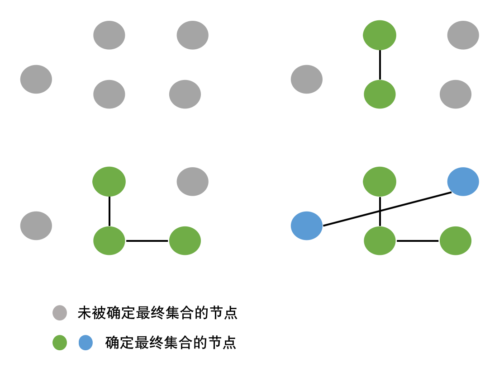
	<br>
	<div display: inline-block; padding : 2px>
		图 4-12 并查图算法 示例
	</div>
</center>

以下为计算步骤：

- 在初始化时，为每个顶点创建一个单独的集合。
- 遍历图中的每条边，将每条边连接的两个顶点所在的集合合并。
- 遍历所有顶点，找到每个顶点所属集合的根节点。
- 所有属于同一集合的顶点都是弱连通的，它们之间存在一条或多条路径可以相互到达。

**3. 标签传播**

​	**标签传播算法（Label Propagation Algorism, LPA）**是一种基于图的半监督学习方法，适用于发现网络中的社区结构。其核心思想是利用已标记顶点的标签信息来预测未标记顶点的标签信息，通过标签的迭代传播，使得相邻节点逐步达成共识，形成若干个连通且标签不同的社区。

​	标签传播算法会进行多轮迭代，以达到一个较好的社区划分。在初始化时，每个顶点会被赋予一个唯一的标签，这个标签可以是每个顶点的ID或是其它的指定标识符。在每一轮迭代传播的过程中，每个顶点会根据其邻居顶点的标签更新自己的标签，具体来说，顶点会选择其邻居顶点中出现频率最高的标签，如果存在多个标签具有相同的出现频率，则随机选择一个，直到每个顶点的标签都传播完毕。然后进行下一轮迭代，重复上述的传播方式。标签传播的收敛条件一般是所有节点的标签在迭代中不再发生变化，或者达到预设的最大迭代次数。标签传播计算的过程示例如图 4-13 所示。

<center>
	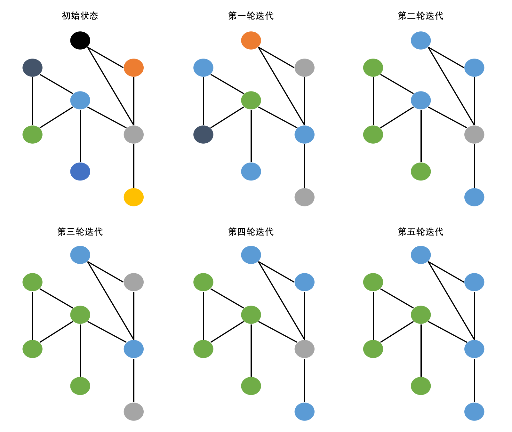
	<br>
	<div display: inline-block; padding : 2px>
		图 4-13 标签传播 示例
	</div>
</center>
**使用场景**

​	标签传播算法最早由Usha Nandini Raghavan、Réka Albert和Soundar Kumara于2007年提出。该算法具有简单、高效的特点，旨在高效地检测大规模网络中的社区结构，并能在实际应用中展示出色的性能，如社交网络分析、文本分类、图像处理等领域。

​	在社交网络分析领域，标签传播算法可以用于推断用户的属性，如兴趣、职业等。通过将已知属性的用户作为标记顶点，并利用社交网络的结构将标签传播到未标记的用户。

​	在文本分类领域，可以将文本作为顶点，根据文本之间的相似度构建边，通过标签传播算法利用少量标记的文档将类别标签传播到大量未标记的文档，以实现文本分类的目的。

**4. 基于模块度的鲁汶算法**

​	前面已经提到过，**模块度（modularity）**是目前常用的一种衡量网络社区结构强度的指标，模块度值的大小主要取决于网络社区的划分情况，可以用来衡量网络社区划分的质量，其值越大表示网络社区划分越合理。

​	模块度Q的计算公式如下：
$$
Q=\frac{1}{2m}\sum_{i,j}{(A_{i,j}-\frac{k_ik_j}{2m})}\sigma(C_j,C_j)
$$
​	式中，$i$ 和 $j$ 表示顶点；$m$ 表示图中边的总数量；$A_{i,j}$ 表示顶点 $i$ 与顶点 $j$ 之间边的权重；$k_i(k_j)$ 表示所有与顶点 $i(j)$ 相连的边的权重之和；$C_i(C_j)$ 表示顶点 $i(j)$ 的社区号；$\sigma(C_i,C_j)$ 代表顶点 $i$ 、$j$ 是否在同一社区。

​	**鲁汶算法（Louvain Algorithm）**是一种基于模块度优化的社区检测算法。该算法通过两阶段的迭代过程逐步优化模块度，分别是局部移动阶段和社区聚合阶段。在局部移动阶段，初始化每个顶点为一个单独的社区，遍历每个顶点，将其移动到相邻社区中，使得模块度增益最高，接着重复前面的步骤，直到没有顶点移动能够进一步提高模块度。在社区聚合阶段，将每个社区视为一个单独的顶点，构建新的简化图，在该简化图上重复局部移动阶段的操作，接着重复该过程直到整个图的模块度不再变化或达到最大迭代次数。鲁汶算法第一轮迭代计算的过程示例如图 4-14 所示。

<center>
	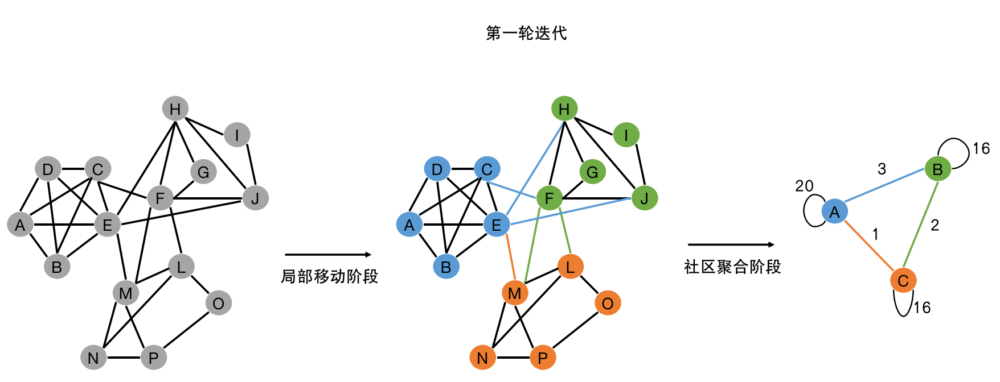
	<br>
	<div display: inline-block; padding : 2px>
		图 4-14 鲁汶算法 示例
	</div>
</center>
**使用场景**	

​	鲁汶算法以比利时鲁汶大学命名，由Vincent D. Blondel, Jean-Loup Guillaume, Renaud Lambiotte和Etienne Lefebvre于2008年提出。该算法通过最大化模块度来识别网络中的社区结构，是一种贪心算法。由于其高效性和通用性，鲁汶算法可以应用于任何具有网络结构且可能存在内部社区结构的场景。

​	在社交网络分析领域，鲁汶算法能够识别其中的社区或群体，分析用户的行为和关系模式。在生物信息学中，鲁汶算法可以应用于基因或蛋白质相互作用网络中，检测功能模块或基因群体。在市场营销领域，鲁汶算法可以根据客户关系来识别客户群体，便于企业制定精准营销策略。在通信网络中，鲁汶算法能够优化网络结构，识别连通的设备群体和故障区域。在推荐系统中，鲁汶算法可基于用户或商品的特征进行聚类，发现相关用户群体或商品集合，从而实现群体级别的推荐，并优化推荐效果。

### 3.3 相似度算法

​	相似度算法主要基于向量来计算顶点之间的相似度。通俗来说，相似度用于计算顶点向量之间的距离，距离越近则相似程度越高。有许多不同的方法来衡量顶点之间的相似程度，如余弦相似度、欧式相似度等。通过应用不同的相似度计算，可以确定在某个场景下相似的顶点，从而进行相关的分析或处理。

<center>
	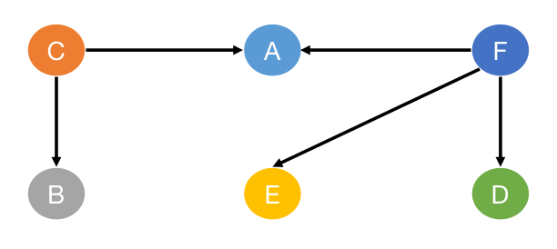
	<br>
	<div display: inline-block; padding : 2px>
		图 4-15 相似度 示例
	</div>
</center>

​	在这一小节中，为了展示不同的相似度的计算区别，我们对每种相似度计算都使用共同的例子来说明。如图 4-15 所示，可以观察到顶点$C$的邻居为$\{B, A\}$，顶点F的邻居为$\{A, E, D\}$，顶点$C,F$的向量表示可以选择将其邻居信息进行**独热编码（One-hot Encoding）**，独热编码可以将离散特征值转换成一组二进制向量表示，其创建流程为：创建一个长度为 $N$ 的二进制向量，其中 $N$ 是离散特征取值的总数。在图 4-15 中，顶点$C$的邻居为$\{B, A\}$，顶点$F$的邻居为$\{A, E, D\}$，因此 $N$ 为4，即$\{A, B, D, E\}$。将二进制向量中对应离散特征取值的位置设置为1，其余位置设置为0，则顶点C的向量表示为$[1, 1, 0, 0]$，顶点F的向量表示为$[1, 0, 1, 1]$。

**1. 余弦相似度**

​	**余弦相似度（Cosine Similarity）**是用于衡量两个非零向量之间相似度的度量指标，它可以通过用两个向量的点积除以它们的长度或大小的乘积来计算得出。余弦相似度通过在N维空间中计算两个N维向量之间夹角的余弦值来衡量其相似度，其值介于-1和1之间，值越大表示两个向量的相似度越高。

​	给定两个向量 $A$ 和 $B$ ，其余弦相似度公式：
$$
Cosine\, Similarity(A,B)=\frac{A·B}{||A||\times||B||}=\frac{\sum_{i=1}^{N}A_i\times B_i}{\sqrt{\sum_{i=1}^{N}A_i^2}\times\sqrt{\sum_{i=1}^{N}B_i^2}}
$$
​	式中，$A⋅B$ 是向量 $A$ 和 $B$ 的点积；$∥A∥$ 和 $∥B∥$ 分别是向量 $A$ 和 $B$ 的欧几里得范数，即向量的长度；$A_i$ 和 $B_i$ 是向量 $A$ 和 $B$  的第 $i$ 个分量。

​	在顶点C和顶点F的例子中，根据余弦相似度计算公式，有 $Cosine\, Similarity(C,F)=\frac{C·F}{||C||\times||F||}=\frac{1}{\sqrt{6}}$ ，即顶点C和顶点F的余弦相似度为$\frac{1}{\sqrt{6}}$ 。

**使用场景**

​	余弦相似度最重要的特点在于尺度无关性，即其只考虑向量的方向，不考虑向量的长度，因此它对于不同尺度的数据具有较好的鲁棒性。同时，余弦相似度适用性广，可以广泛应用于文本分析、推荐系统等领域。在文本分析领域，通过计算余弦相似度来得到文档相似度和句子相似度，可以很好地应用于文档聚类、分类和自然语言处理任务。在网购推荐系统中，如果用户A和用户B在购物清单上具有高度的相似性，可以使用余弦相似度算法来计算用户之间的相似度，再将用户B购买的商品作为推荐给用户A的商品列表，以提升个性化推荐的效果。

**2. 欧式相似度**

​	**欧式相似度（Euclidean Similarity）**也称为欧几里得相似度，是所有相似度计算中最简单、最易理解的方法。在了解欧式相似度之前，我们需要先理解欧式距离。**欧式距离（Euclidean Distance）**是指两个点在N维欧几里得空间中的直线距离。给定两个向量 $A$ 和 $B$ ，其欧式距离公式为：
$$
Euclidean\,Distance(A,B)=\sqrt{\sum_{i=1}^N(A_i-B_i)^2}
$$
​	式中，$A_i$ 和 $B_i$ 是向量 $A$ 和 $B$  的第 $i$ 个分量。

​	从上式可以观察到，计算得到的欧式距离是一个大于0的数，为了使其更能体现用户之间的相似度，我们可以把它规约到 $(0, 1]$ 之间得到欧式相似度。给定两个向量 $A$ 和 $B$ ，其欧式相似度公式为：
$$
Euclidean\,Similarity(A,B)=\frac{1}{1+Euclidean\,Distance(A,B)}=\frac{1}{1+\sqrt{\sum_{i=1}^N(A_i-B_i)^2}}
$$
​	在顶点C和顶点F的例子中，根据欧式相似度计算公式，有 $Euclidean\,Similarity(C,F)=\frac{1}{1+\sqrt{3}}$ ，即顶点C和顶点F的欧式相似度为$\frac{1}{1+\sqrt{3}}$。

**使用场景**

​	欧式相似度的计算非常简单直观，且其使用的距离度量较为适合几何空间。和余弦相似度类似，欧式相似度也适用于推荐系统，如电影推荐、商品广告等。在图像处理和计算机领域，欧式相似度也可以衡量像素之间的差异，应用于图像分割、特征匹配和物体识别等任务中。

**3. 杰卡德相似度**

​	**杰卡德相似度（Jaccard Similarity）**也称为杰卡德指数（Jaccard Index）或交并比（Intersection over Union, IoU），是一种用于衡量两个集合相似度的指标。它定义为两个集合的交集大小与并集大小的比值，其值介于0和1之间，杰卡德相似度越大，则两个集合的相似度越高。给定两个向量 $A$ 和 $B$ ，其杰卡德相似度公式为：
$$
Jaccard\,Similarity(A,B)=\frac{|A\cap B|}{|A\cup B|}=\frac{|A\cap B|}{|A|+|B|-|A\cap B|}
$$
​	式中，$∣A\cap B∣$ 是集合 $A$ 和 $B$ 的交集大小，即同时属于集合 $A$ 和 $B$ 的元素个数；$|A\cup B|$ 是集合 $A$ 和 $|B|$ 的并集大小，即属于集合 $A$ 或 $B$ 的元素个数。

​	在顶点C和顶点F的例子中，根据杰卡德相似度计算公式，有 $Jaccard\,Similarity(C,F)=\frac{|C\cap F|}{|C|+|F|-|C\cap F|}=\frac{1}{4}$ ，即顶点C和顶点F的杰卡德相似度为 $\frac{1}{4}$ 。

**使用场景**

​	瑞士植物学家Paul Jaccard于1910年提出了杰卡德相似度，主要用于衡量生物学和生态学中物种群体之间的相似性。由于杰卡德相似度的简单直观性，其广泛应用于多个领域，如在文本分析中基于词集模型计算文档或句子之间的相似度或用于论文查重等；在图像处理领域用于评估图像分割结果的相似度等。

**4. 重叠相似度**

​	**重叠相似度（Overlap Similarity）**又称为重叠系数（Overlap Coefficient），是衡量两个集合之间相似度的一种度量方法。它定义为两个集合交集的大小和较小集合的大小之间的比值，其值介于0和1之间，重叠相似度越大，则两个集合的相似度越高。给定两个向量 $A$ 和 $B$ ，其重叠相似度公式为：
$$
Overlap\,Similarity(A,B)=\frac{|A\cap B|}{min（|A|,|B|）}
$$
​	式中，$|A\cap B|$ 是集合 $A$ 和 $B$ 的交集大小；$min⁡(∣A∣,∣B∣)$ 是集合 $A$ 和 $B$ 中元素数量较少的集合的大小。

​	在顶点C和顶点F的例子中，根据重叠相似度计算公式，有 $Jaccard\,Similarity(C,F)=\frac{|C\cap F|}{min(|C|,|F|)}=\frac{1}{2}$ ，即顶点C和顶点F的杰卡德相似度为 $\frac{1}{2}$ 。

**使用场景**

​	重叠相似度早在20世纪中期就被用于生物统计学和生态学等领域，用来衡量物种之间的相似性。其在使用场景上与前面介绍的几个相似度算法类似。同时，重叠相似度算法还可以用于分类任务。通过计算事务之间的重叠相似度，可以判断一个事物是否另一个事物的子集，并将这些子集作为特征来构建分类器。例如，在文本分类任务中，通过重叠相似度识别哪些单词是其它单词的子集的方式，可以提高分类器的准确性和泛化能力。

### 3.4 子图匹配算法

​	子图匹配（Subgraph Matching）算法是图模式匹配算法的一种，主要用于解决**子图同构问题（Subgraph Isomorohism Problem，SIP）**，即在一个给定的大图里面找到与给定小图同构的子图，其中同构的概念，通俗来说就是在顶点可以任意挪动位置且边完全弹性的情况下，一个图可以完全变形为另一个图，如图 4-16 所示。在处理子图同构问题时，方法和技术的选择主要取决于匹配图的类型（有向或无向，带权中或不带权中等）。由于子图同构问题在图论、化学信息学、社交网络分析和模式识别等领域都有广泛的应用，解决这一问题的方法一直是图算法研究中的重要课题。然而，子图同构问题是一个NP完全问题，即目前没有已知的多项式时间算法可以解决所有子图同构问题。


<center>
	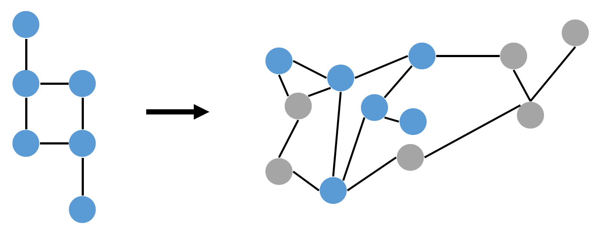
	<br>
	<div display: inline-block; padding : 2px>
		图 4-16 子图匹配 示例
	</div>
</center>

​	子图匹配算法主要分为基于深度优先搜索和基于广度优先搜索的子图同构算法。前者利用递归相对易于实现，且可以配合剪枝以减少不必要的计算；后者通过逐层扩展，在某些情况下可能更快确定同构子图。本节中的主要介绍对象Ullmann算法是基于深度优先搜索实现的，该算法主要利用深度优先搜索结合剪枝技术来提高效率。

子图匹配算法在许多领域都有广泛的应用，包括生物和化学信息学、社交网络分析、知识图谱等。

- 在化学信息学中，子图匹配可以用于药物发现和化学反应预测。在药物发现过程中，研究人员需要找到包含特定活性基团的分子，这些活性基团对分子的生物活性和药效有至关重要的作用。通过子图匹配，研究人员就可以快速筛选出包含特定基团的候选分子，缩小实验范围以提高效率。在化学反应预测中，子图匹配可以帮助识别反应物和产物中的关键反应位点，进而预测反应路径和产物。
- 在生物信息学中，复杂的生物网络（如蛋白质相互作用网络、基因调控网络、代谢网络等）都可以通过图结构来表示。研究人员可以使用子图匹配来识别蛋白质相互作用网络中的功能模块，如信号传导通路或代谢通路，或是发现特定条件下共同表达的基因群，以帮助理解基因调控机制以及基因之间的相互作用。
- 在社交网络中，子图匹配可以检测其中的社团、群组等。例如，找出社交网络中所有的三角形结构（即三个人互相认识的情况），通过识别和分析这些表示强关系和高信任度的结构，可以帮助理解社交网络的稳定性和紧密度。子图匹配还能够检测社交网络中的谣言传播路径、影响力节点以及关键社团等，十分有利于社交网络的安全管理、营销策略的制定以及用户行为的分析。
- 在知识图谱中，子图匹配可以辅助用户查找符合特定模式的实体关系，并支持复杂的查询和推理操作。在构建和维护知识图谱时，子图匹配可以用于发现和修复图中的不一致性、冗余和错误，从而提高知识图谱的质量和可靠性。此外，知识图谱可以通过子图匹配技术更好地支持语义搜索、智能问答和数据挖掘等应用。

​	针对子图同构问题的算法有很多种，如暴力搜索、Ullmann算法、VF2算法、VF3算法、QuickSI算法，在本小节中，我们着重介绍暴力搜索算法和Ullmann算法，其它的子图同构算法读者可以自行查阅资料了解。

**1. 暴力搜索算法**

​	子图匹配的暴力搜索算法顾名思义，就是简单而直接地通过枚举所有可能的匹配来解决子图同构问题。这种方法在概念上非常直观，但是由于其时间复杂度非常高，因此暴力搜索算法在大多数情况下计算效率较低，尤其是当图的规模较大时。

​	给定一个有 $n$ 个顶点的宿主图 $G$ 和有 $k$ 个顶点的目标同构模式图 $H$ ，其暴力搜索算法的匹配步骤如下：

1. **枚举顶点子集**：枚举图 $G$ 中所有节点数与图 $H$ 的顶点数相同的顶点子集，子集数量为 $ \binom{n}{k}$ 。
2. **遍历顶点子集**：
   - **验证顶点同构**：遍历每个顶点子集，检查其是否能够与图 $H$ 的顶点一一映射，主要比较每个顶点的标签。
   - **验证边同构**：在遍历的过程中，如果子集的顶点同构成立，进一步检查顶点之间的边连接是否与图 $H$ 完全匹配。
   - **记录匹配结果**：如果顶点和边都匹配，则记录该子集为一个有效的子图同构匹配。

​	暴力搜索算法时间复杂度高的原因在于，其每一个步骤都有可能耗时很久。枚举顶点子集的时间同城呈指数级，其原因在于子集数量 $ \binom{n}{k}$ 会随着 $n$ 和 $k$ 的增大而急剧增加，时间复杂度为 $O(n^k)$。在验证顶点同构中，系统需要比较子集中每个顶点的标签（如果顶点存在标签），确保标签匹配。在验证边同构中，系统需要逐个检查每条连接边，确保子图中的边与 $H$ 中的边完全一致，因此这一步在计算上尤其繁重，时间复杂度为 $O(k^2)$。因此，暴力搜索算法的时间复杂度为 $O(n_k·k^2)$。

​	由于暴力搜索算法的高时间复杂度，在实际应用中通常不会采用该算法。从理论上来说，我们可以使用**剪枝**和**启发式搜索**等方法来优化暴力搜索算法。剪枝是指预处理数据，提前排除不可能的匹配来减少搜索空间；启发式搜索是指利用启发式信息来指导搜索过程以提高效率。

**2. Ullmann算法**

​	**Ullmann算法**是一种用于解决子图同构问题的经典算法，由美国计算机科学家 Jeffrey R. Ullmann 于 1976 年提出，该算法是最早期提出且在实践中具有广泛影响的算法之一。Ullmann算法的核心思想是基于深度优先搜索，通过回溯和搜索来枚举所有可能的顶点匹配，并通过矩阵操作和剪枝策略来减少搜索空间。给定一个有 $n$ 个顶点的宿主图 $G$ 和有 $k$ 个顶点的目标同构模式图 $H$ ，Ullmann算法的具体流程如下：

1. **初始化**：创建一个 $k$ 行 $n$ 列的候选矩阵 $M$ ，其中 $M[i][j]=1$ 表示图 $H$ 中顶点 $i$ 的标签可以匹配图 $G$ 中顶点 $j$ 的标签，反之 $M[i][j]=0$。
2. **初步剪枝**：使用一些简单的规则来对候选矩阵进行初步剪枝。如度数过滤：如果图 $H$ 顶点 $i$ 的度数大于图 $G$ 顶点 $j$ 的度数，则 $M[i][j]=0$ 。
3. **递归搜索**：对候选矩阵 $M$ 进行递归搜索，每次选择一个未匹配的图 $H$ 顶点，尝试将其与图 $G$ 中的某个候选顶点进行匹配。
4. **更新矩阵**：对于当前图 $H$ 顶点的其它匹配，更新候选矩阵 $M$ 中的对应元素为 $0$ 。
5. **检查匹配**：每次完成一个图 $H$ 顶点的匹配后，检查目前的部分匹配是否满足图 $H$ 的结构约束（即边的匹配关系）。如果满足，则回到步骤3，继续递归搜索下一个图 $H$ 顶点的匹配；否则回溯。
6. **回溯**：
   - 如果在某一步无法找到合适的匹配，则回溯到上一步，尝试其他可能的匹配。
   - 如果所有匹配都尝试完毕，则结束搜索。

​	相对于更早期的暴力搜索算法，Ullmann算法的实际运行时间通常更短。在初始化阶段，初始化候选矩阵 $M$ 的时间复杂度为 $O(kn)$。在进行递归和回溯时，最糟糕的情况就是每个模式图顶点都需要尝试匹配宿主图的每个节点，其时间复杂度为 $O(n^m)$ 。因此Ullmann算法的时间复杂度虽然较小，但也有 $O(n^m)$ 。在实际运行时，Ullmann算法的剪枝策略可以显著地减少搜索空间，因此在许多实际应用中表现优于暴力搜索算法。

​	下面我们用一个简单的例子来图解Ullmann算法的过程，图 $H$ 为模式图，图 $G$ 为宿主图，颜色相同的顶点表示标签相同，如图 4-17 所示。

<center>
	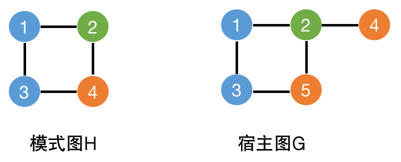
	<br>
	<div display: inline-block; padding : 2px>
		图 4-17 Ullmann算法 示例
	</div>
</center>

1. 创建候选矩阵 $M$ ，模式图 $H$ 顶点有4个，宿主图 $G$ 顶点有5个，因此矩阵 $M$ 为4行5列。先按照顶点标签的匹配生成候选矩阵，则矩阵 $M=\left[
    \begin{matrix}
      1 & 0 & 1 & 0 & 0 \\
      0 & 1 & 0 & 0 & 0 \\
      1 & 0 & 1 & 0 & 0 \\
      0 & 0 & 0 & 1 & 1  \end{matrix}
     \right]$ 。

2. 我们使用度数过滤来进行初始剪枝。模式图 $H$ 和宿主图 $G$ 的各顶点度数统计：$模式图顶点1度数=2\\模式图顶点2度数=2\\模式图顶点3度数=2\\模式图顶点4度数=2\\宿主图顶点1度数=2\\宿主图顶点2度数=3\\宿主图顶点3度数=2\\宿主图顶点4度数=1\\宿主图顶点5度数=2$

   根据度数过滤规则，更新 $M[4][4]$ 为0，得到候选矩阵 $M=\left[
    \begin{matrix}
      1 & 0 & 1 & 0 & 0 \\
      0 & 1 & 0 & 0 & 0 \\
      1 & 0 & 1 & 0 & 0 \\
      0 & 0 & 0 & 0 & 1  \end{matrix}
     \right]$  。

3. 开始递归搜索和匹配验证。从图 $H$ 顶点1开始，尝试与图 $G$ 顶点1匹配，取消其它候选顶点，更新候选矩阵 $M=\left[
    \begin{matrix}
      1 & 0 & 0 & 0 & 0 \\
      0 & 1 & 0 & 0 & 0 \\
      1 & 0 & 1 & 0 & 0 \\
      0 & 0 & 0 & 0 & 1  \end{matrix}
     \right]$  ，因为目前只尝试匹配了一个顶点，因此连接边匹配一定满足要求。

4. 搜索图 $H$ 顶点2，尝试与图 $G$ 顶点2匹配，检查图 $H$ 中的边 $(1,2)$ 是否对应图 $G$ 中的边 $(1,2)$ ，匹配成功。

5. 搜索图 $H$ 顶点3，尝试与图 $G$ 顶点3匹配，更新候选矩阵 $M=\left[
    \begin{matrix}
      1 & 0 & 0 & 0 & 0 \\
      0 & 1 & 0 & 0 & 0 \\
      0 & 0 & 1 & 0 & 0 \\
      0 & 0 & 0 & 0 & 1  \end{matrix}
     \right]$  ，检查图 $H$ 中的边 $(1,3)$ 是否对应图 $G$ 中的边 $(1,3)$ ，匹配成功。

6. 搜索图 $H$ 顶点4，尝试与图 $G$ 顶点5匹配，检查图 $H$ 中的边 $(2,4)$ 和边 $(3,4)$ 是否对应图 $G$ 中的边 $(2,5)$ 和边 $(3,5)$ ，匹配成功。

​	Ullmann算法是解决子图同构问题的一个重要里程碑，尽管其时间复杂度在最坏情况下仍然是指数级的，但实际应用中表现会优于早期简单的暴力搜索方法。如今常用的子图同构算法大多都在Ullmann算法的基础上进行了改进。例如，VF2算法使用路径扩展来优先匹配图中度数较大的顶点，以更快地排除不匹配的情况，并使用状态空间表示当前的匹配状态，减少不必要的重复计算；VF3算法改进了VF2算法的状态空间表示，使算法能够更适应大规模的图处理，并进一步改进候选矩阵的生成策略，减少候选顶点的数量；TurboISO算法通过增量式方法构建匹配方案，在每一步中逐步扩展匹配结果，而非一次性进行全图匹配等。读者感兴趣可以自行查阅了解。

**2. 其它匹配**

​	**环路匹配（Cycle Pattern）**和 **路径匹配（Path Pattern）**是另外两种相对模糊的图模式匹配，我们在此对这两种匹配作简单的介绍，本书中不再详细展开。

​	环路匹配是指环路上依次经过的顶点（边）类型与目标环路的顶点（边）类型一一对应，且环路长度相同。其中环路是指起点和终点是同一个顶点的一条路径。例如，在班级教师网络中，同一个班级的语数英老师存在合作关系。图 4-18 是四个班级的教师网络，其中顶点$A、E$是语文老师，顶点$B、F$是英语老师，顶点$C、D是$数学老师，其中部分教师同时教授多个班级，教师列表存在重叠，从下图可以找到如 $A-C-F-E-D-B-A$ 这样的环路，因此教师顶点$A、B、C、D、E、F$同属于一个教室圈。同时，将这四个班级拆分开，还有类似 $A-C-B-A、B-D-E-B$ 这样的小环路。

<center>
	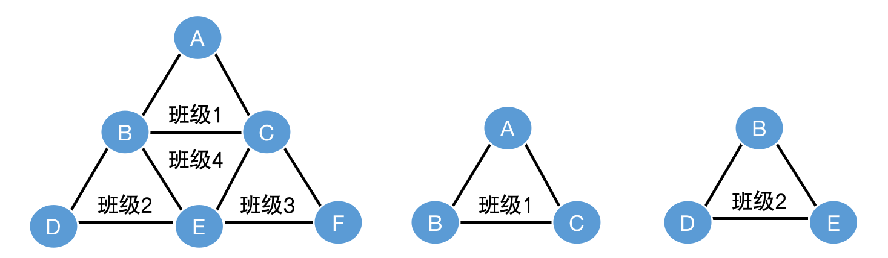
	<br>
	<div display: inline-block; padding : 2px>
		图 4-18 环路匹配 示例
	</div>
</center>

​	路径匹配是指根据给定的路径模式找出相应路径的过程。其中路径模式是指图中一系列通过边相连的顶点的特定组合，不同路径模式的区别在于顶点（边）类型、属性以及路径长度的不同。通常情况下，路径匹配算法包括深度优先搜索、广度优先搜索和图遍历等算法，为了求解特定规则下的最短路径问题，也可以使用其他寻路算法。图 4-19 展示了一个属性值递增且长度为4的路径匹配。

<center>
	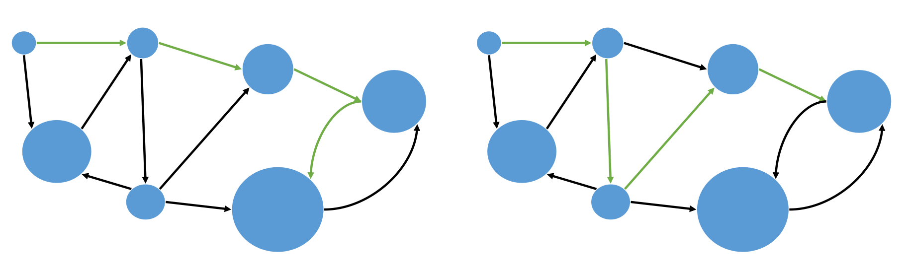
	<br>
	<div display: inline-block; padding : 2px>
		图 4-19 路径匹配 示例
	</div>
</center>

### 4.3.5 中心性算法

​	中心性的概念最初是在社会网络分析(SNA)中发展起来的。在图论中，中心性指标是指将数字或排名分配给图中相应网络位置的顶点，主要应用包括识别社交网络中最有影响力的人、互联网或城市网络中的关键基础设施节点、疾病的超级传播者和大脑网络等。而在在复杂网络分析领域，图的中心性算法主要用于衡量图中节点的重要性或者影响力，是网络分析中的重要工具之一。通俗来说，中心性算法就是用于确定网络中不同节点的重要性。

**1. 度中心性算法**

​	**度中心性（Degree Centrality）算法**是最简单的中心性算法之一，用于衡量图中顶点的重要性。在介绍度中心性之前，我们需要先明确度的含义。在无向图中，每个顶点的度是指与该顶点相连接的边的数量。在有向图中，度还分为入度和出度。顶点的入度是指通往该顶点的边的条数；出度是指从该顶点出发的边的条数。因此度中心性在有向图中还分为入度中心性和出度中心性。**入度中心性（In-Degree Centrality）**表示一个顶点被其他顶点影响的程度，如在社交网络中的受欢迎程度；**出度中心性（Out-Degree Centrality）**表示一个顶点对外部的影响力，如在网络传播中的发起者角色。在这一小节中，对于有向图，我们主要讨论和计算顶点的出度中心性。

​	度中心性算法通常用于寻找图中最受欢迎或关注度最高的顶点。在非带权图中，其定义为顶点的度。给定顶点u，其度中心性计算公式如下：
$$
Degree\,Centrality(u)=degree(u)
$$
​	在带权图中，度中心性定义为每条与顶点相连接的边的权重之和（无向图）或从顶点出发到其邻居的边的权重之和（有向图）。给定顶点u，其度中心性计算公式如下：
$$
Degree\,Centrality(u)=\sum_{i\in N(u)}w_{ui}
$$
​	式中，$N(u)$ 表示顶点 $u$ 的邻居集；$w_{ui}$ 表示顶点 $u$ 到顶点 $i$ 的边权重。

<center>
	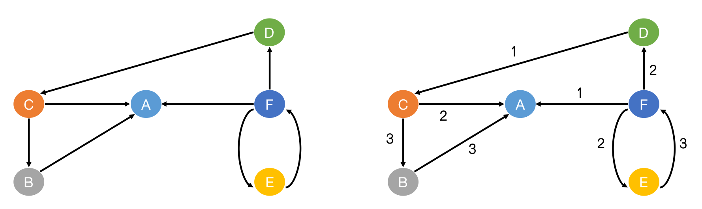
	<br>
	<div display: inline-block; padding : 2px>
		图 4-20 度中心性算法 示例
	</div>
</center>

​	图 4-20 是一个较为简单的图结构，左图为非带权图，右图为带权图。我们来尝试计算每个顶点的出度中心性，计算结果如下：

- 非带权图：$Degree\,Centrality(A)=0$ ；带权图：$Degree\,Centrality(A)=0$ 。
- 非带权图：$Degree\,Centrality(B)=1$ ；带权图：$Degree\,Centrality(B)=3$ 。
- 非带权图：$Degree\,Centrality(C)=2$ ；带权图：$Degree\,Centrality(C)=5$ 。
- 非带权图：$Degree\,Centrality(D)=1$ ；带权图：$Degree\,Centrality(D)=1$ 。
- 非带权图：$Degree\,Centrality(E)=1$ ；带权图：$Degree\,Centrality(E)=3$ 。
- 非带权图：$Degree\,Centrality(F)=2$ ；带权图：$Degree\,Centrality(F)=3$ 。

**使用场景**

​	度中心性算法常用在社交网络分析和流行病学等领域。在社交网络分析中，度中心性可以衡量个人在社交网络中的影响力，入度中心性高的用户通常比较受欢迎的，他们收到的连接（如关注、好友请求）较多，而出度中心性高的用户则较为活跃的，他们发起的连接较多。同时，高出度中心性的顶点通常在信息传播中扮演重要角色，因为他们可以将信息传播给更多的节点。在流行病学中，度中心性分析可以识别可能成为传播热点的个体或区域。

**2. 接近中心性算法**

​	在图论和网络分析中，**接近中心性（Closeness Centrality）**是用来衡量一个顶点在网络中总体上与其他顶点的接近程度的指标。接近度中心性考虑了一个节点到达所有其他节点的最短路径的总长度，可以有效地反映节点在网络中的位置和传播效率。在图中，接近中心性得分最高的顶点总体上到其它顶点的传播代价最小。

​	某个顶点的接近中心性定义为该顶点到其它顶点的最短路径距离之和的倒数，接近度中心性越高，表明该顶点到其他顶点的平均距离越短，位置越中心。给定顶点u，其接近中心性计算公式如下：
$$
Closeness\,Centrality(u)=\frac{1}{\sum_{i=1}^{n-1}d(u,i)}
$$
​	式中，$n$ 是顶点 $u$ 所在的连通子图的顶点数；$d(u,i)$ 是顶点 $u$、$i$ 之间的最短路径长度。

<center>
	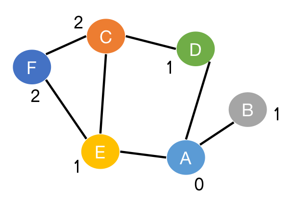
	<br>
	<div display: inline-block; padding : 2px>
		图 4-21 接近中心性算法 示例
	</div>
</center>

​	我们以图 4-21 的无向图为例，计算每个顶点的接近中心性，并确定最适合作为传播中心的顶点。图中顶点旁的数字表示以顶点A为例，顶点A到其它顶点的最短路径的长度。计算结果如下：

- $Closeness\,Centrality(A)=\frac{1}{7}$ 。
- $Closeness\,Centrality(B)=\frac{1}{11}$ 。
- $Closeness\,Centrality(C)=\frac{1}{8}$ 。
- $Closeness\,Centrality(D)=\frac{1}{8}$ 。
- $Closeness\,Centrality(E)=\frac{1}{7}$ 。
- $Closeness\,Centrality(F)=\frac{1}{9}$ 。

​	从计算结果可以得出，顶点$A$和顶点$E$都可以作为传播中心，二者的接近中心性都大于其它顶点，为 $\frac{1}{7}$ ，则从顶点$A$和顶点$E$到其它顶点的传播代价最小。

**使用场景**

​	在社交网络中，高接近中心性的用户能够更快速地传播信息，这对于病毒式营销和社交媒体策略非常重要。例如，企业可以识别高接近中心性的用户作为关键影响者来推广新产品或服务。在物流和供应链网络中，接近中心性高的节点（如配送中心或仓库）能够更高效地分配和运输物资，以优化整体供应链的管理并节约运输成本。在公共服务选址中，政府可以利用接近中心性来优化公共服务设施的布局，例如将医院、学校和警察局设置在接近中心性高的区域，以确保更高效的服务覆盖。

**3. 中介中心性算法**

​	在图论和网络分析中，**中介中心性（Betweenness Centrality）**顾名思义，是用来衡量一个顶点在网络中充当“中介”、“桥梁”作用的能力的指标。中介中心性定义为一个顶点在所有顶点对（除了该顶点所在的顶点对）的最短路径中出现的频率，其值越高，该顶点充当“中介”的能力越强。中介中心性的指标意义在于，以社交网络为例，在某些情况下最重要的人并不一定是能力最强或关注度最高的人，而是那些在群体之间扮演者中介角色的人，如经纪人、中间商等，这些人是信息流通和资源流通的关键。

​	给定顶点u，其中介中心性计算公式如下：
$$
Betweenness\,Centrality(u)=\sum_{s\neq u\neq t}\frac{\sigma_{st}(u)}{\sigma_{st}}
$$
​	式中，$\sigma_{st}$ 表示从顶点 $s$ 到顶点 $t$ 的最短路径数量； $\sigma_{st}(u)$ 表示从顶点 $s$ 到顶点 $t$ 且经过顶点 $u$ 的最短路径数量。

<center>
	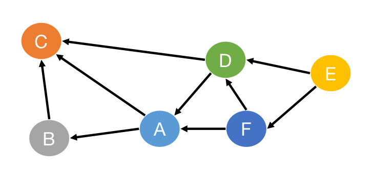
	<br>
	<div display: inline-block; padding : 2px>
		图 4-22 中介中心性算法 示例
	</div>
</center>


​	图 4-22 是一个简单的有向图，我们以顶点A为例计算其中介中心性，计算过程如下：

- 从顶点$E$开始，顶点$E$到顶点$B$的最短路径有两条，其中一条经过顶点A，得分 $\frac{1}{2}$ 。
- 从顶点$D$开始，顶点$D$到顶点$B$的最短路径有一条，经过顶点A，得分 $1$ 。
- 从顶点$F$开始，顶点$F$到顶点$C$的最短路径有两条，其中一条经过顶点$A$，得分 $\frac{1}{2}$ ；顶点$F$到顶点$B$的最短路径有一条，经过顶点$A$，得分 $1$ 。

​	最后我们得到，顶点$A$到其它所有顶点的中介中心性为$3$ 。

**使用场景**

​	中介中心性衡量的是网络中的顶点在其它顶点之间最短路径上的频率，因此在社交信息流通、交通网络和传染病网络分析方面都具有重要的应用价值。在社交网络分析中，中介中心性高的用户通常是信息流通的重要桥梁，企业通常会利用这一点来识别并利用这些关键人物进行营销活动，确保信息能够快速广泛地传播。在交通网络中，中介中心性高的顶点（如主要交叉路口或交通枢纽）对交通流量的调节和管理至关重要，优化这些区域可以提高整个交通系统的效率和可靠性。在传染病传播网络中，中介中心性高的节点（如高流动性人群或交通枢纽）是疾病传播的关键环节，政府可以在这些地方加强防控措施来有效控制疾病的传播。

**4. PageRank算法**

​	传统的搜索引擎需要根据用户输入的关键字来找到与之关联的网页并返回给用户，但是与给定关键词相关联的网页可能存在很多，如何将大量的检索结果排序并返回给用户是一个问题。**PageRank算法**可以通过计算网页的“重要程度”来实现对网页的排序。在介绍PageRank算法前，我们需要先明确该算法的两个假设：

1. 数量假设：在网页图模型中，一个网页顶点接收到其他网页的入链数量越多，这个网页越重要，所对应的PageRank值越大。其中入链是指进入该网页的链接，即指向网页顶点的边，同样，出链是指跳转出该网页的链接，即网页顶点指向其它顶点的边。
2. 质量假设：指向网页的入链质量不同，质量高的网页会通过链接向其他页面传递更多的权重。因此若一个重要的网页指向某网页，则该网页越重要，所对应的PageRank值越大。

​	PageRank算法的基本思想是通过模拟浏览者访问页面的行为来更新每个页面的权重，即其PageRank值，直到每个页面的PageRank值趋于稳定，则该结果表示每个页面的重要程度。此外，为了允许用户浏览某个网页后可以直接随机选择访问其它网页，而不再严格限定只能通过当前网页的链接进行跳转，PageRank引入了用户随机跳转网页的概率 $\beta$（阻尼系数），通常取值为0.85。

​	给定网页顶点u，其PageRank值的计算公式如下：
$$
PageRank_i(u)=(1-\beta)+\beta(\sum_{v\in N_{in}(u)}\frac{PageRank_{i-1}(v)}{OutDegree(v)})
$$
​	式中，$PageRank_i(u)$ 表示第 $i$ 轮迭代时顶点 $u$ 的PageRank值；$\beta$ 为阻尼系数，取值范围为 $[0,1]$ ，通常设置为 $0.85$ ；$N_{in}(u)$ 表示顶点 $u$ 的入链网页邻居集合；$OutDegree(v)$ 表示顶点 $v$ 的出链数量。

​	PageRank算法的计算流程如下：

- 初始化阶段：为每个顶点分配一个初始的PageRank值，通常是相等的初始值，即 $\frac{1}{N}$ ，其中 $N$ 是所有网页顶点的数量。初始的PageRank值也可以根据其它特定的规则来分配。
- 迭代计算阶段：使用PageRank公式计算每轮迭代时每个网页顶点的PageRank值。
- 当网页顶点PageRank值收敛（变化很小）或达到预设的迭代次数时，算法结束。

<center>
	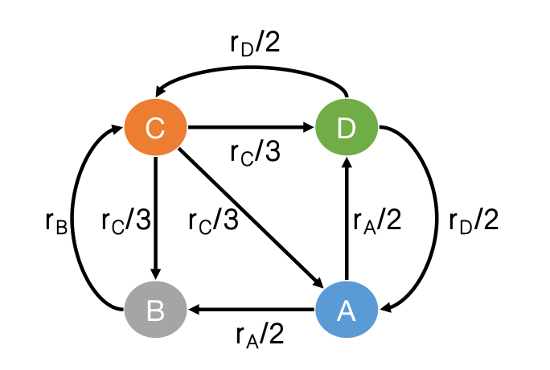
	<br>
	<div display: inline-block; padding : 2px>
		图 4-23 pagerank算法 示例
	</div>
</center>

​	我们可以把网页之间的相互链接看作有向图，以 图 4-23 为例，顶点 $A ,B,C,D$ 代表网页，顶点之间的有向边代表一个网页到另一个网页的链接，$r_A$ 表示顶点A上一轮迭代得到的PageRank值。则经过此轮迭代，各顶点的PageRank值如下（阻尼系数设置为0.85）：

- $PageRank(A)=0.15+0.85(\frac{r_D}{2})$ 。
- $PageRank(B)=0.15+0.85(\frac{r_A}{2}+\frac{r_C}{3})$ 。
- $PageRank(C)=0.15+0.85(\frac{r_D}{2}+r_B)$ 。
- $PageRank(D)=0.15+0.85(\frac{r_A}{2}+\frac{r_C}{3})$ 。

**使用场景**

​	PageRank算法是由Google的两位创始人，当时尚为斯坦福大学研究生的Larry Page和Sergey Brin于1998年发明的搜索引擎核心算法，主要用于优化其搜索引擎的结果排序。在搜索引擎优化中，除了对检索结果的排序，PageRank算法还能反垃圾处理，即识别并降低垃圾网页的排名，其原因在于这些垃圾网页通常会通过大量低质量链接来试图操纵搜索结果。同样，在学术文献分析中，系统可以根据引用关系来计算论文的PageRank值，并将论文被引用的次数以及每次引用的实际影响力纳入考虑范围，相对公平地评估某学术研究的领域影响力，并识别和推荐高影响力的研究成果。

## 4 图数据库的查询优化

​	在本章第一节中我们已经了解到，关系数据库将所有数据都存储在关系表中，并通过主外键的连接操作来隐式地表达实体之间的关系。而图数据库则将实体以及实体之间的连接关系分别看作顶点和边，使用连接边的形式来显式地表达顶点之间的关系。下面我们以知识图谱为例向读者展示图数据库的存储和查询优化，并将其与关系数据库的存储和查询优化进行对比呈现。

**存储形式**

​	图 4-24 是知识图谱的部分主谓宾数据。

<center>
	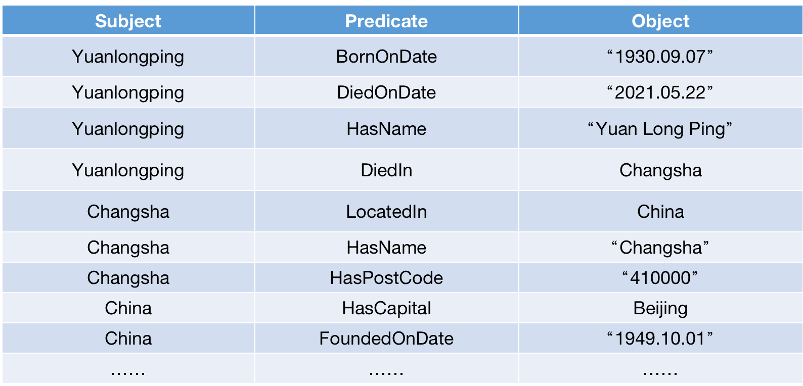
	<br>
	<div display: inline-block; padding : 2px>
		图 4-24 知识图谱数据 示例
	</div>
</center>

​	在图数据库领域，RDF是存储和表达知识图谱的事实标准。图数据库使用邻接表或邻接矩阵将RDF数据集存储为图的形式，其中Subject和Object是图的顶点，Predicate是连接Subject和Object，表示它们之间关系的边，如图 4-25 所示。

<center>
	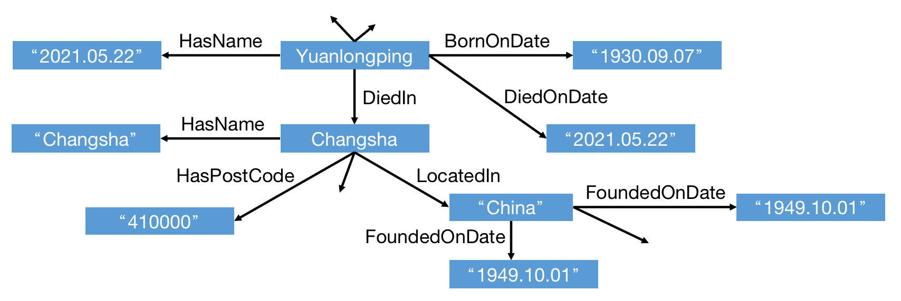
	<br>
	<div display: inline-block; padding : 2px>
		图 4-25 图模型-知识图谱数据 示例
	</div>
</center>

​	在关系数据库中，系统将RDF数据集存储为关系表（仅三列）的形式，即如图 4-24所示。当数据量变大时，该关系表内存放上亿个三元组，表体会变得极其庞大。我们可以观察到，相同Subject的数据被放进了不同的三元组中，这意味着这些三元组之间并无任何系统上的关联，在后续的查询过程中，只能通过自表连接将它们联系在一起。

**简单查询**

​	在图数据库中，SPARQL是专门为查询RDF数据而设计的语言。我们以查询 "出生于邮编为'410000' "，有名字且生于1930年的人”为例，编写SPARQL语句如下：

```SPARQL
SELECT ?name
WHERE {
  ?m <BornIn> ?city .
  ?m <HasName> ?name .
  ?m <BornOnDate> ?bd .
  ?city <HasPostCode> "410000" .
  FILTER(regex(STR(?bd), "1930"))
}
```

​	而在关系数据库中，我们就需要将SPARQL语言转化成SQL。从下面的SQL语句中可以观察到，对关系数据库进行表查询，尤其涉及同一Subject的不同内容时，系统会产生大量的自表连接的操作，这在用户查询时是异常耗时的操作，且SQL语句的内容也远不如SPARQL直观和简单。在实际存储时，我们可能会考虑将该表的三元组按照 'Subject' 或 'Predicate' 的字母表顺序排列，并分割成多个小关系表，但是这里涉及到更多技术层面的设计和优化，我们不做讨论。

```SQL
SELECT T2.object
FROM T as T1, T as T2, T as T3, T as T4
WHERE T1.predicate = "BornIn" 
  AND T2.predicate = "HasName"
  AND T3.predicate = "BornOnDate" 
  AND T1.subject = T2.subject
  AND T2.subject = T3.subject 
  AND T1.object = T4.subject
  AND T4.predicate = "HasPostCode" 
  AND T4.object = "410000"
  AND T3.object LIKE '%1930%'
```

**查询优化**

​	我们在4.1节中曾经提到，查询优化的目的是优化系统初步生成的执行计划以提高查询的性能。关系数据库的查询优化主要涉及使用索引、连接优化、查询分解、数据分区和视图物化等，下面我们将依次介绍针对当前知识图谱数据的查询优化内容：

- 在优化的初始阶段，查询优化器会对用户输入的查询语句进行基本的语法重写，如合并同类型条件、移除冗余条件、谓词推导等。例如，当前的查询语句已经足够简洁，系统只需要进行谓词推导，即在起初定义表时就将 $WHERE$ 子句中的条件提前应用到表 $T1,T2,T3,T4$ 上。
- 使用索引：在创建所有的三元组数据后，我们需要先根据实际情况对数据进行索引创建，查询优化器会评估当前的查询条件和表的结构优先考虑高选择性的索引，使用索引扫描代替全表扫描以减少扫描数据的行数。例如，在 ‘Subject’、‘Predicate’、‘Object’ 列上分别创建索引，系统会根据 'Predicate' 和 'Object' 列上的索引先扫描出满足条件的三元组。
- 连接优化：关系数据库中常见的连接算法包括嵌套循环连接、哈希连接和归并连接等。查询优化器会根据表的大小、数据分布和索引情况选择最优的连接算法。例如，对于知识图谱数据这类规模较大的数据，使用哈希连接会更加高效。
- 查询分解：查询优化器会将一个复杂查询拆解为多个子查询，独立执行这些子查询后再合并结果，这种方式可以大量减少中间结果集的大小，提高查询效率。例如，系统可能将 'Predicate' 中 `BornIn`、`BornOnDate` 和 `HasPostCode` 条件的查询分离成子查询，减少每次连接时需要处理的数据量。
- 数据分区：我们在前面的内容中提到过，可以将当前的大关系表分割成多个小关系表，这样能够使得数据更易于查询和管理。用户可以预先设置不同的数据分区，在查询执行的过程中查询优化器会自动选择相关分区进行操作和查询。例如，用户预先将该表的三元组按照 'Subject' 的首字母进行分区，由于查询条件大部分是根据谓词和宾语内容寻找主语，大量不满足条件的小关系表的查询结果直接为空，无需后续的连接等步骤。
- 视图物化：对于一些常用的复杂查询结果，查询优化器可以自动选择用户预先定义的视图，并将对原始表的查询重写成对视图的访问。例如，假设该例中，查询出生在邮编为 `"410000"` 的城市的人是一个常用的复杂查询，则用户可以预先将该查询定义为视图，查询优化器在查询语句中检测到该查询逻辑后，会优先访问该视图以加速查询速度。

​	当在图数据库中执行上述查询时优化过程与关系数据库有所不同，图数据库的查询优化主要集中在图数据的索引、连接顺序和图遍历上，下面我们将依次介绍针对当前知识图谱数据的查询优化内容：

- 使用索引：大多数主流图数据库支持用户手动创建索引，其中Neo4j也提供自动索引的功能。图数据的索引分为顶点索引和边索引，在顶点和边上创建索引能够加快顶点和关系的查找。此外，对于RDF数据集来说，常见的索引创建方式有SPO索引（Subject-Predicate-Object）、POS索引（Predicate-Object-Subject）和OSP索引（Object-Subject-Predicate）。例如，系统可以利用索引将查询分为：1. 查找谓词为 `<BornIn>` 的三元组；2. 查找谓词为 `<HasName>` 的三元组；3. 查找谓词为 `<BornOnDate>` 的三元组；4. 查找谓词为 `<HasPostCode>` 且对象为 `"410000"` 的三元组。
- 连接顺序：查询优化器会通过选择最优的连接顺序来减少中间结果集的大小，通常优先执行选择性较高的连接（即返回结果集较小的连接）。例如，系统可能会优先执行 '谓词为 `<HasPostCode>` 且对象为 `"410000"` 的三元组' 的查找。
- 图遍历：查询优化器会根据查询的逻辑和预设的索引信息来选择适当的图遍历算法，常见的图遍历算法在上一节中我们已经介绍过，有深度优先搜索、广度优先搜索、迪杰斯特拉算法等。例如，从条件 `?city <HasPostCode> "410000"` 开始先得到初筛结果，然后通过图遍历算法找到相关的 `?m` 顶点，再遍历得到其 `?name` 和 `?bd` 。在进行图遍历的过程中，优化器可能会提前应用后续的过滤条件，以减少中间结果集的大小。

​	图数据库在处理知识图谱数据和图分析任务方面都具有明显的优势，其查询优化和关系数据库的主要区别在于：关系数据库的查询优化重点在使用索引、表连接和查询结果存储上，而图数据库的查询优化主要集中于顶点、关系的高效访问和图遍历算法。虽然关系数据库在RDF数据集查询上能够通过优化尽可能减少查询开销，但由于图直观的显式化表达关系的特性，更适用于知识图谱、网络分析、实时推荐、生物医疗等领域。因此我们在选用不同数据库查询和分析数据时，需要充分考虑到数据类型和他们之间关系的不同。


