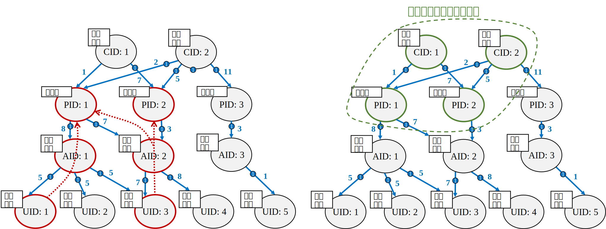

##图数据库设计
在之前的章节，我们介绍了图数据库的基本概念、存储技术、事务处理和查询处理过程及其核心图计算算法，读者们应该对图数据库的技术理论有了初步的理解。本章的视角将转向实际应用的层面，我们将会结合前几章的理论知识，介绍如何以合理的方式去构建一个基于图数据库的应用，设计能够满足实际需求的图数据库。

首先，本章节会将图数据库同关系数据库进行比较，再次简单介绍图数据模型；其次，将会介绍图数据库建模的原则以及物理设计方法；最后，在本章的尾声，将为读者们展示neo4j、gStore和TuGraph这几种性能表现很优秀的图数据库，并且介绍几种基于图数据库的具体应用场景。

##1 图数据模型应用简介

之前的章节中提到，图数据库的图模型以“图”这种数据结构存储和查询数据，这种方式是特别擅长处理大量的、复杂的、互联的、多变的网状数据。在许多特定场景下，正因为在处理大规模数据和复杂关系网络时具有显著优势，其工作效率高于传统的关系型数据库。适合使用图数据库的场景往往具有如下特征：

**实体具有复杂关系网络**
在许多实际应用中，数据之间的关系并非简单的线性或层次结构，而是形成了一个复杂的网络。这些网络中的节点可能代表实体（如人、组织、设备等），而边则代表这些实体之间的关系（如朋社交关系、所有权、交易信息等）。

图数据库以其图模型结构为基础，能够支持复杂关系网络的存储和查询。通过节点和边的形式，图数据库能够清晰地表示这些关系，提供直观、高效的查询和分析能力。

**实时性和动态性**
在当今大数据时代的场景中，数据是实时产生的，并且其关系会随着时间的推移而发生变化。例如，在社交网络中，新的朋友关系可能随时建立，旧的关系可能断裂。因此，需要支持实时更新和查询操作，能够快速地响应这些变化。这意味着当数据发生变化时，图数据库能够立即更新其图结构，并允许用户实时查询最新的数据状态。

**高性能需求**
现如今处理大规模数据集的场景下，系统的响应性能是一个关键因素，例如，在使用大语言模型进行询问时，用户总是希望能够尽可能快地获得回答，而当大语言模型的基础数据库设施中的数据量达到数十亿级别时，则传统关系型数据库可能会面临性能瓶颈，出现慢响应等问题。

若能设计和优化好图数据库，支持高效的存储和查询操作，则能够在特定场景下加快查询速度并减少资源消耗。在实际生产场景中，我们往往可以发现图数据库在处理大规模数据时有着出色的表现，能够满足高性能需求。

**要求灵活性和可扩展性**
在更新较为频繁的应用场景中，例如社交网络、交通规划等，随着新的实体和关系事件的持续加入，数据模型的节点和联系会随之发生变化。从长期看来，整体的数据模型会有大幅度的变化。图数据模型能够允许用户根据需要定义节点及其联系。此外，图数据库通常具有可扩展性，能够支持分布式部署和水平扩展，以满足不断增长的数据需求。

**非结构化数据**
不同于仅仅处理结构化数据的传统关系型数据库，图数据库还能够支持非结构化数据的查询和分析处理。而在很多实际应用中，数据总是以非结构化的形式存在，例如，社交网络中的用户社交联系、用户个人信息中所包含的文本、图片、视频、语言等类型的数据，都是为非结构化的数据。图数据库能够存储和查询上述非结构化的数据，为复杂数据结构类型的应用下的用户提供更丰富的数据分析和挖掘能力。

**可视化分析需求**
为了能够直观地理解和分析数据之间的关系，设计的系统需要将数据以图形化的方式展示。图数据库因其特殊的图模型而能够方便地进行数据可视化展示，节点和边能以图形化的形式直观地被呈现。配合前几章节所介绍的各种图算法，如路径查找、图遍历、社区检测等，图数据库能够帮助用户进行更有效、深入的数据分析。

实际上，传统关系型数据库中用以概念设计的E-R图也是典型的图模型，其中的每个实体（E-R图中用方形表示）可以作为图数据模型中的节点，每个联系（E-R图中用菱形表示）可以作为图数据模型中的边。

然而，需要注意的是，尽管基于E-R图的关系数据库建模和图数据库的建模都是基于图来完成的，但E-R图只允许两个或多个不同的实体之间存在一种联系，而图数据库则允许实体的不同实例能够存在着多个关系。以一个图书馆管理系统为例：E-R图中的每个实体代表了“某一类”对象，例如含有一些特定属性的书籍类，它和其它诸如出版社类之间只能产生一种关于出版的关系；而图模型中的每个节点可以是一类对象的一个“具体实例”，例如一本数据库系统概念的书被读者A所借阅，还有一本操作系统概念的书被读者B所归还。

上述案例的E-R图和一个具体的图数据模型如图5-1所示。其中的实体有书籍、读者记录和出版社，还有表示借阅和表示管理的关系。

	
		

		图 5.1 关系模型的E-R图建模（左）对比图模型的建模

##2 图数据库的建模方法##

图数据库建模的核心在于将现实世界中的实体和关系映射到图结构中。这不仅仅是简单的数据映射，更是一种对业务逻辑和数据关系的深入理解。通过自然映射，我们可以更直观地表示数据之间的联系，从而更好地理解数据，提高数据操作的效率和准确性。

当我们针对一个应用需求进行图模型的建模时，需要遵循一些基本的建模原则，常常会考虑一些基本的问题，比如何种对象要被建模成节点、何种对象要被建模成边、特殊的数据类型应当如何建模等。

### 2.1节点和边建模的基本原则 ###

在图数据库中，图模型上的节点和边的建模需要依据数据的特性和应用的业务逻辑，其基本原则是：图上的节点主要用于表示具有唯一标识和属性的实体；图上的边主要用于表示实体之间的关系。

对于具有唯一标识和属性的实体，也就是生活中具有实际意义的事物或人物，我们应当把他们建模成节点。例如，开源社区中的项目开发者和项目管理者有着各自的唯一标识和诸如年龄、性别、技术能力等属性，并且他们为开源社区的建设做出贡献，具有很实际的意义，因此都可被建模成图上的节点。

对于实体之间的关联，我们应当把他们建模成单向或双向的边。例如，开发者和管理者间具有管理关系，开发者之间可能又具有合作关系。图数据库中的同一类实体的不同实例（例如几个不同的开发者）将被视为两个独立的节点，他们会存在一定联系，这一点和关系型数据库是有明显区别的。

	
	
图 5.2 节点和边建模原则的例子

对于诸如时间戳、版本等元数据值，则要根据应用场景来确定它们应当作为节点还是边。元数据可以表示实体的属性，即包含在节点内；也可以表示实体的联系的权重或强度，即表示成边。

##2 事实的建模##

在图数据库的应用中，常会出现多个实体在一段时间内的交互过程，我们把这一过程称为事实（fact）。事实的建模遵循以下规则：首先，建立一个单独的节点来表示这个事实；其次，将产生该事实的实体与之相联系，建立起边。以下将举几个简单的例子来说明。图5.3是社交用户给一篇博客点赞并且撰写了一条评论的示例。

	

图 5.3 社交网络事实的示例

图5.4是数据库用户在某个时间点登陆了TuGraph图数据库，创建了一个新的数据库。

	

图 5.4登录图数据库事实的例子

图 5.4是车主购买了一家车企的新能源车，并且购买了A类别的保险。

	

图 5.4购买新能源车的例子

我们不难发现，对事实建模后的图往往呈现出这样的特征：代表事实的中间节点作为“中介”，其它节点经过该中间节点并发生一定的相互关系，中间节点的时间戳则代表了事实发生的时间。事实建模后的图结构是相对固定的，利用第四章所讨论的图算法（如子图匹配算法），我们便能从大的图中匹配出具有类似上述结构的子图，从而能够挖掘出一些事实。

##2.3 特殊数据类型的建模##

将一些特殊的数据类型在图中进行表示的时候，需要使用特定的规则和设计技巧。本节我们将讨论多值属性以及时间属性的建模。

多值属性指的是具有多个字段或属性的值类型，例如电话号码（一个实体可能有多个电话号码，如移动电话、座机电话等）、地址（一个地址可能会包含城市、区县、街道等多个字段）。若直接将其归属成某个实体的属性值，对于使用该图的用户来说，这一属性所传达的信息并不是很直观。因此，多值属性往往会被单独建模成一个节点。两种不同的建模方式如图5.6所示。

	

图 5.6 多值属性建模成一个单独节点的例子

时间属性可以用时间轴树和双向链表这两种方式来建模。时间轴树从根节点出发，每个节点具有一系列存放次级时间的子节点，如此展开直至到达最小时间单位的叶子节点。各个叶子节点与相应实体产生联系，从而表达了这些实体的时间属性。
	
以一个开源软件的版本更迭为例，根节点用以指示从该节点出发是一个时间轴树，其具有一组自己的表示年份的节点；每个表示年份的节点都有一组自己的表示月份的节点，以此类推。表示开源软件每个版本的更新内容的实体节点与最小时间单位的日节点相联系，例如，该软件在2024年3月15日更新了IVFPQ的相似搜索查询功能，在查询阶段，可以通过图遍历来得到相应时间的软件更新的信息。

	

图 5.4 用时间轴树建模时间属性的例子

双向链表的建模方式则用以表达各实体之间的先后关系，先或后的关系则由实体之间的边上的NEXT或PREVIOUS来指示。上述开源软件的例子可由双向链表建模成图5-8所示。

	

图 5.8 用双向链表建模时间属性的例子

从上述介绍中可以看出，用一定的建模技巧在图中表示特殊的数据类型有助于更清晰地表达其蕴含的信息，能够将复杂的属性独立成新的实体或者拆解成多个实体，从而增强图上数据的可读性。

##3 图数据库的物理架构设计##

之前的章节中，我们重点介绍了图存储引擎、图计算以及图查询，将这三大部件有机地结合从而提供强大的图数据库服务便是图数据库的物理架构设计所要完成的。本节将从内外存的使用、图数据的组织以及索引设计出发，介绍图数据系统物理架构设计的技术要点。

###3.1 内外存的使用###

内存的特征是读写快而易失的，外存是持久的而读写慢的，因此，图数据库需要针对两种存储各自不同的特点来设计内外存的使用分配方案。图数据库的数据呈现出网络拓扑结构，对于图计算的关键数据需要由内存来存放以加快图查询的执行过程，例如元数据、算法的中间结果、索引等；其余不需要被实时计算的大量数据则会由外存来存放。因此，在软件层面设计图数据库时，会设计存储管理器来根据当前图数据的实际情况来动态地调整内存和外存的使用比例，从而合理地挖掘内外存各自的能力，实现存储加速。

此外，图数据库的存储引擎需要用到大量的缓存来减少系统的I/O操作以提高吞吐量，这正是因为在进行图计算时需要大量的元数据索引、图节点搜索、图路径搜索、全文搜索索引，从而产生大量的中间操作结果，因此，要分配一定的内存作为这些中间结果的缓存，帮助图数据库在图计算过程中能够更快速地进行地址定位、读取和写回磁盘。

	

图 5.9 图计算中使用缓存技术

###3.2 图数据的组织###

图数据库中的数据较为密集且结构较为复杂，其组织方式会影响缓存的设计逻辑，从而对系统的存取性能造成一定的影响。所以，我们应当将数据的组织形式纳入设计的考虑。

数据是否排序在很大程度上影响系统的运行性能。有的图数据系统把图数据按标识号排序后连续存放，从而实现对数据快速的随机访问，也有效地利用了缓存技术，但是数据删除和插入操作的开销很高；也有图数据系统以非连续的方式存放数据，但是连续读取多条数据的开销比较高。

一些键值存储的图数据系统使用WiscKey方案，它将key和value分离，只有key是被排序的，value则被存储在日志中。如果使用固态硬盘存储，这种设计能够加快key的查找，并且利用好固态硬盘较强的随机访问能力以快速查找value。

	

图 5.10 键值存储的WiscKey方案

在数据更新时，使用就地更新还是外部更新策略也会影响图数据系统的运行性能。由于图计算的复杂性，大量的就地更新可能会影响系统的并发性和响应度，因此，许多系统使用了Copy-on-Write策略进行数据更新：在更新阶段，拷贝一份原始数据并对其在外部进行更新，原始数据本身不被修改，最后将原始数据的指针指向更新后的数据。

	

图 5.11 Copy-on-Write数据更新策略

###3.3 索引的设计###

不同于传统关系型数据库，许多原生的图数据库会专门为图数据结构设计索引以适配图计算算法的特点。

邻居索引是对每个图节点及其邻域建立起索引结构，从而加速了对各个节点的邻接节点的访问，其访问通常以直接指针的形式来进行。JanusGraph将这种邻居索引设计称为以顶点为中心的索引，在图算法中遍历邻接点以匹配条件时，索引可以有效地过滤代表事件的边，每个索引都能够针对不同的条件进行优化，而后由查询优化器选择更好的查询计划。

	

图 5.12 JanusGraph中以顶点为中心的邻居索引略

邻居索引的另一个例子是Sparksee，该系统中的边和顶点都有唯一的标识号。每个边或顶点的标识号通过B+树索引指向相应的具体值；边或顶点所对应的值或标签又可以通过位图指针指向相应的位图，位图的1指示了这些位置的边或顶点的标识号是有相应的具体值，从而实现了从具体值到标识号的映射。

	

图 5.13 Sparksee中边或顶点所建立的索引

类似地，Sparksee通过上述索引方式来关联各个边与其相连顶点的联系，实现了这一映射关系。

	

图 5.14 Sparksee中边与顶点之间的联系所建立的索引

数据索引则会涉及超出邻域信息的数据，这些数据可用于加速查询的执行。一种做法是，索引所有具有特定属性值的顶点。许多三元组存储库如gStore提供了主语（S）、谓词（P）和宾语（O）的排列并且通过VS*-tree索引来实现子图匹配查询。关于gStore的具体设计，将会在5.4节具体阐述。

##4 图数据库系统举例##

在本节中，我们将详细介绍几种具有代表性的图数据库系统。首先，我们将从Neo4j这一图数据库领域的领军者开始，探讨其强大的性能优化和丰富的生态系统。随后，我们将会介绍gStore和TuGraph系统，分析它们各自的设计特点、优势以及适用场景。

通过对这些图数据库系统的介绍，我们将让您了解到它们是如何在实际应用中发挥作用的。无论是处理社交网络的复杂关系、构建高效的推荐系统，还是分析生物信息学的网络数据，这些图数据库系统都提供了强大的数据管理和计算支持。

###4.1 Neo4j###

Neo4j是一个高性能的NoSQL的图数据库，它具有原生的图处理和图存储的功能，并且具有同传统关系数据库一样特性，支持事务、故障恢复、可扩展等，并且提供了简单、表现力丰富、效率高的图查询语言Cypher，从而让用户能够在灵活的图结构下处理相关业务。

	

图 5.15 Neo4j的体系架构

Neo4j把表示图的节点、联系、标签以及属性数据分别以文件形式分开存储在磁盘中，它们都是固定大小的记录，如此设计的优势是：在进行图遍历时，通过记录ID和固定的记录大小，可以以O(1)的时间开销找到相应记录，而后再获取记录相应的属性数据，避免了开销较大的线性搜索。

节点记录的第1字节是表示该记录是否在使用的标志位，随后4字节存储了与该节点的第一个联系，最后4字节存储了该节点的第一个属性的ID；联系记录的第1字节也是标志位，剩下的字节分别存储了起始节点ID、结束节点ID、起始和结束节点各自的前驱联系和后继联系等。

	

图 5.16 Neo4j节点和联系的物理存储

属性记录文件以键值对的方式存储了各节点的属性数据，包含四个属性块和下一个属性ID的固定大小的记录，每个属性块包含了一个属性类型以及指向相应存储记录的指针。若一个属性所需存储空间较大，它会占据多个属性记录。

	

图 5.17 Neo4j属性的物理存储 

图5.18展示了Neo4j中各种存储文件的交互关系。各个节点都有指向其第一个联系的指针、指向其标签的指针和指向其第一个属性的指针，节点的多个属性之间以链表的形式相连，节点涉及的其它联系以双链表的形式相连。

	

图 5.18 Neo4j中各种存储文件的交互关系 

相较于传统关系数据库中使用的全局索引，原生图数据库Neo4j则提供的是免索引邻接的数据库引擎，每个节点维护了其邻接节点的引用，避免了全局索引查找所带来的巨大开销。免索引邻接为各个具有联系的节点间预先建立了双向连接并且存储在数据库中，因此，在查找某个实体的所有联系时，只需取得所有与之具有连接的节点即可，时间开销是O(1)。

	

图 5.19 Neo4j使用免索引邻接以实现快速遍历 

在事务处理方面，Neo4j同传统关系数据库事务是类似的，每个事务被分配一定的内存，由锁管理器来保证事务中的节点与联系的一致性。当事务回滚时，释放相关的资源；当事务提交时，则被持久化至磁盘中。Neo4j提供了日志功能，提交数据的策略是预写日志，从而保证了系统的可恢复性。

###4.2 gStore###

gStore是一个针对于于RDF图的三重存储系统，由北京大学王选计算机研究所数据管理实验室研发。该系统的设计目标是对RDF数据的高效存储与管理，并且动态地在图数据库上处理不同类型的 SPARQL 查询，包括精确查询、聚合查询等。 

gStore所存储的数据结构是资源描述框架（Resource Description Framework，以下简称为RDF）。每个RDF数据由主语、谓语和宾语组成三元组，通常表示为<s,p,o>，表5-1展示了部分gStore中的RDF数据示例。

| 主语     | 谓语     | 宾语     |
| -------- | -------- | -------- |
| y: Jack |	名字是	| “Jack” |
| y: Jack	| 年龄是	| “23”| 
| y: 沪ADXXXXX	| 车身颜色是	| “绿色”| 
| y:《数据库系统概念》| 	作者是| 	“Abraham Silberschatz”| 

RDF数据以如下方式组织成一张RDF图：主语和宾语被建模成节点，谓语被建模成边，各个节点通过相互之间的主、谓、宾关系建立起联系。RDF图的例子如图5.20所示。

	

图 5.20 RDF图的示例 

在磁盘中，RDF图以（顶点号，实体标签，连边信息）的方式存储，其中，连边信息包含了谓词以及相连的邻居。图5-20的RDF图在磁盘中的存储如表5-2所示。

| 主语     | 谓语     | 宾语     |
| -------- | -------- | -------- |
| 001	| y: Jack	| (“名字是”, “Jack”) (“年龄是”, “23”)(“借阅”, y: 数据库系统概念)|
| 002	| y: 耶鲁大学	| (“名字是”, “耶鲁大学”) (“创办于”, “1701”)(“位于”, “康涅狄洛州”)| 
| 003	| y: Abraham Silberschatz| 	(“名字是”, “Abraham Silberschatz”)(“就职于”, y: 耶鲁大学)| 
| 004	| y: 数据库系统概念| 	(“作者是”, y: Abraham Silberschatz)(“ISBN”, “9787111375296”)| 

系统中的SPARQL查询由where关键字组织起多个“主、谓、宾”形式的条件，查询会匹配满足这些条件的子图，然后返回出select关键词后面所涉及的字段。其中，前缀带有符号“?”的字段表示的是变量，不带“?”的是常量，带有“<>”的是谓词。以查询Q:

    select ?name where {	?m <hasName> ?name. 
                  ?m <age> 24. 
               	?m <birthday> “2001-02-02”. }

为例，它会查找那些年龄是24岁并且生日是在2001年2月2日的所有实体的名字，因为名字是需要查询的字段，应当是未知的，所以设置成变量。

在查询阶段，系统需将所有实体和谓词编码成二进制位串，同时，对于每个实体的多个谓词的位串做“或”运算以得到一个位串，对于每个实体的多个邻居也作同样的处理。最终得到一个实体位串、一个谓词位串和一个邻居位串的形式。图5.21展示了编码的过程。

	

图 5.21 RDF数据在查询阶段的编码示例 

将RDF图记为G，SPARQL查询所对应的RDF图记为Q，编码成二进制位串的G和Q被称作签名图（signature graph），分别记作G^*和Q^*。查询过程即为Q^*在G^*中进行子图匹配，匹配出符合条件的子图，最后根据查询语句的要求提取出需要返回的字段。其中，若Q^*的二进位串和G^*中某一子图的二进位串的“与”运算仍然等于Q^*的位串，则匹配成功。上述查询Q的查询过程如图5.22所示。

	

图 5.22 查询Q的查询过程 

作为一种原生的图数据系统，gStore为专门的图计算应用场景提供了很好的技术方案，并且在存储层、索引设计、图计算算法、编码技术上都为了图数据结构进行了专门的设计，从而能够高性能地处理以图作为载体的业务。

###4.3 TuGraph###
TuGraph 是由蚂蚁集团开发的原生图数据库产品，构建了包含图的存储、计算、学习和研发平台的技术体系，能够对海量数据进行全图迭代计算，高效地完成超大计算量的业务需求，尤其是在金融风险控制领域，TuGraph表现出优秀的实时识别能力和审理分析效率。

	

图 5.23 TuGraph体系架构 

开发TuGraph期间，研发人员总结出关于图的操作具有以下几个特点：

- 同一个顶点的边通常会被同时访问；
- 访问顶点或边时，通常会访问其相应的属性；
- 在时序场景下，对点或边的过滤通常是一个时间范围
- 读操作往往比写操作更多，并且写操作很可能伴随大量读操作。

针对上述特点，TuGraph采用基于树状有序键值对的图存储设计。首先，图存储层对键值进行编码；在键值存储层，key被存放在B+树中，使用外部更新策略，而value与之分开存储，并且使用存储优化技术，保证大量读操作的并发性。此外，各条数据按照类型（LabelId）或时间（TemporalId）进行排序，正因为访问的类型相似性以及时间局部性，这一排序方式加速了访问速度。

	

图 5.24 TuGraph图存储引擎架构 

随着TuGraph的图查询引擎不断开发迭代，新一代查询引擎逐渐支持了更多图查询语言。GeaX是查询引擎的核心部件，为TuGraph提供了图表示（GST）和查询优化的能力，包含了查询的解析、校验和优化，从而形成逻辑执行计划；图数据处理系统则接收由GeaX传来的逻辑执行计划并形成多个物理执行计划，最终基于代价模型来决定最终执行哪个物理执行计划。整个查询引擎的运作过程类似于关系型数据库。

	

图 5.25 TuGraph图查询引擎架构 

GeaCompute是TuGraph的图分析引擎。它为用户提供了多种图分析算法以解决多个领域的问题，如社区发现、路径查询、相关性分析等，同时提供了便捷使用的编程接口，方便用户使用分析工具。其中，块式划分和双模式引擎技术是GeaCompute的关键技术，它们的设计是为了解决分布式场景下大型图通信量大并且复杂的情况。

	

图 5.26 GeaCompute图分析引擎架构 

块式划分技术以顶点为中心进行数据划分，它将顶点按照连续的物理块分配到各个计算节点，能以相邻方式存放在同一计算节点的顶点是具有相邻边的。这种方式利用了图原本拥有的空间局部性，能够提高图数据的访问效率。

	

图 5.27 块式划分技术构 

在双模式引擎中，顶点沿着出边传递消息称为推送模式，顶点沿着入边传递消息称为拉取模式。在图较为密集的状态下应选取拉取模式，而在图较为稀疏的状态下应选取推送模式，能够提高邻接节点的访问效率。

在分布式场景下，图顶点被块式划分开，存储于不同的计算节点上，实际以物理方式存储于当前计算节点的顶点被称作Master顶点，剩下的则为Mirror顶点，Master顶点能够和相应的Mirror顶点进行通信。

在分布式推送时，Master顶点先给自己所处计算节点的邻居推送更新，而后发送消息到Mirror顶点，由Mirror顶点给其所处计算节点的邻居推送更新。

	

图 5.28 分布式推送模式 

在分布式拉取时，Mirror顶点先从自己所处计算节点的邻居拉取更新，而后发送消息到Master顶点，通知其拉取更新。

	

图 5.29 分布式推送模式 

随着TuGraph的不断开发，强大的引擎展现了TuGraph在图计算方面的能力。未来，TuGraph开源社区致力于支持更多的查询语言并且面向更多的应用场景，建设更易于用户使用、功能强大、关注生态的图数据库。

##5 应用案例##
本节我们将向读者介绍图数据库在现实生活中的应用案例，展示图数据库如何在这些场景下发挥其巨大的优势。

###5.1 案例1：社交网络推荐###

社交网络中的各个用户、用户发表的内容、用户的交互动态等都可以称为图模型中的节点或边。利用好图中的社交关系和信息，机构或企业能够预测用户的行为，从而提供更有针对性的服务。

图数据系统的分析技术可以帮助我们推测社交关系：通过索引的查找，可以定位到特定的节点，对该节点周围的边进行搜索，便能找到其它的节点，也就分析出了对某个事物有共同兴趣的人。如下图的例子所示，通过索引查找到体育话题的节点，用户节点Jack和Leo与之产生“感兴趣”的联系，我们便能知道Jack和Leo都喜欢体育话题，社交网络更倾向于将他们互相推荐为朋友。

	

图 5.29 推测社交关系的例子 

当进行的项目中缺乏特定实体时，可以通过图查询去寻找具有特定技能的实体，将其推荐给当前项目以满足开发需求。以图5.31为例，外卖App项目缺乏一位掌握Java的开发者，为了填补相应的开发者，可以先对该项目的开发者James所认识的开发者进行查询，找到Mark和Brown，这样是便于开发者间进行交流的；再以“掌握C++”作为条件，在这些开发者中进行查询，从而找到Mark作为合适的开发者来加入该项目。

	

图 5.31 寻找具有特定技术的开发者的例子 

###5.2 案例2：物流管理###

网上购物、买药、买菜等电子商务形式早已成为当今生活中消费的主流，随之而来的则是物流行业的蓬勃发展，数以万计的物流包裹形成了庞大的物流网络，对物流网络的分析与管理也是图数据模型的重要应用。

一个物流网络中包含几个集散中心，这些集散中心又会将包裹分发到各自对应的若干派送点；在一个派送点下，又具有多个派送区域；每个派送区域又具有若干个派送单元。物流包裹由一个派送单元发往另一个派送单元，其物流的运送过程是：包裹从源派送单元出发，经由派送区域、派送点后到达集散中心，包裹再由集散中心发出，经由派送点、派送区域后到达目标派送单元。

集散中心、派送点、派送区域和派送单元之间形成了一定的上下层关系，上一层和下一层之间形成的是单向的树形结构，不存在跨层级之间的连接。物流系统在不同的时间段有不同的上下层的连接关系，称作是不同的路由。下图展示了一张具有密集联系的物流网络图，其中包含了各个物流要素的实体以及不同时段的路由安排。

	

图 5.32 物流网络图不同时段的路由（三种颜色的1、2、3表示不同的时段） 

路由计算是物流规划管理中的核心问题，主要是求解出发送单元和接收单元之间具有最小开销的路由，从而规划出最低成本的物流方案。各个实体节点间的连边上具有代表路径开销的属性，如时间成本或经济成本，这些属性作为路由计算的指标。

从出发单元和接收单元向上层搜索，分别搜寻到达各自的第一个派送点的最小开销路径；进而，搜寻这两个派送点之间的最小开销路径，上述这两段最短路径相加即为该路由问题的最小开销的路径。上述过程可以使用Dijkstra算法来求解最短路径。图5.33简单展示了最小开销路由的计算过程。

	

图 5.33 最小开销路由的计算过程 

在实际的图数据库应用中，Neo4j等图数据系统为用户提供了Dijkstra等最短路径算法，用户只需要提供出发点和接收点相关的参数即可得到结果，不用编写复杂的图分析算法和了解算法细节。

尽管仅仅利用关系型数据库也能够完成关系推测、最短路搜索、路径规划等复杂的计算过程，但是正由于关系型数据的复杂性，上述算法过程的计算复杂度和代价非常大，尤其是对于海量数据集的处理。图数据库的图原生设计为图计算过程提供了合适的存储场所、索引设计以及封装好的算法，为各种需要图数据结构的应用场景提供有力的支持。

