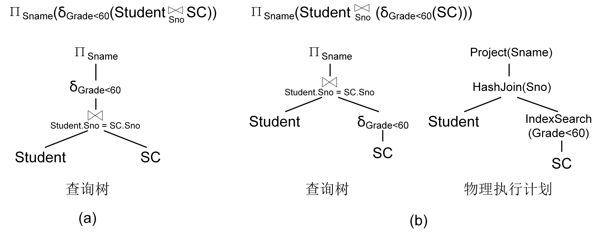

# 关系数据库查询处理概述

关系数据库的查询处理是处理SQL查询语言的过程，由计算引擎负责，其任务是将用户提交的SQL查询语句转换为查询执行计划。本章主要介绍关系数据库查询处理的流程。


## 查询处理步骤
关系数据库管理系统的查询处理分为3个步骤：SQL解析（SQL Interpretation）、查询优化（Query Optimization）和查询执行（Query Execution，如图R3.1所示。

<center>
	
	<br>
	<div display: inline-block; padding : 2px>
		图 R3.1 查询处理步骤
	</div>
</center>


* SQL解析：将SQL查询语句转换成关系代数表达式。首先，对查询语句进行词法分析，识别出SQL关键词、属性名和关系名等；然后进行语法检查和语法分析，判断查询语句是否符合SQL语法规则；之后对合法的查询语句进行语义分析，根据数据字典的模式定义检查查询语句中的关系名、属性名是否存在且有效；最后将语义检查通过的SQL语句转换成等价的关系代数表达式。关系数据库管理系统通常使用查询树（Query Tree）来表示扩展的关系代数表达式。查询树也称为语法分析树。
* 查询优化：为SQL查询语句选择一个高效的查询执行方案。查询优化包括代数优化和物理优化。代数优化是指关系代数表达式的优化，即对SQL语句的关系代数表达式进行等价变换，改变代数表达式中操作次序，从而使得查询执行更加高效。物理优化是指选择合适的存取路径和关系运算的实现算法。
* 查询执行：执行查询方案并得到查询结果。首先，将高效的查询执行方案生成查询执行计划，然后由代码生成器生成执行这个查询计划的代码，最后执行代码得到结果。

查询优化是查询处理最关键的步骤，它决定了关系数据库管理系统的查询性能。一个查询SQL语句可以转换成多个关系代数表达式，关系代数表达式中的各个关系算子也可以有多种实现算法，因此，一个查询语句就有多种查询执行计划。如何确定哪个查询执行计划是最优的呢？关系数据库管理系统无法准确地计算出哪个查询执行计划最优，而只能预测。传统的查询优化可以基于启发式规则，基于代价估计等进行预测。随着人工智能技术的发展，现在的查询优化通过搜集到的统计数据来训练预测模型，使用模型来预测最优的查询执行计划。

## 示例
我们以一个简单的例子来介绍关系数据库管理系统的查询处理。
```SQL
[例R3.1] 查询课程成绩不及格的学生名称。
SELECT Sname
FROM Student, SC
WHERE Student.Sno = SC.Sno AND SC.Grade < 60; 
```

* 第一步，SQL解析。利用词法语法解析器判断上述查询SQL是否合规，然后进行语义检查，最后将上述SQL转换为关系代数表达式，并用查询树进行表示，如图R3.2(a)。
* 第二步，查询优化。首先进行代数优化，将第一步中的关系代数表达式等价转换成查询性能更高的关系代数表达式并用查询树进行表示；然后进行物理优化，为查询树中的各个关系代数算子选择最为高效的实现算法，形成最终的物理执行计划。在图R3.2(b)的物理执行计划中，连接运算使用哈希连接算法（Hash Join），选择运算使用基于索引的扫描算法（Index Scan）。
* 第三步，查询执行。将第二步中的物理执行计划生成查询代码，执行并得到查询结果。

<center>
	
	<br>
	<div display: inline-block; padding : 2px>
		图 R3.2 查询处理示例
	</div>
</center>


