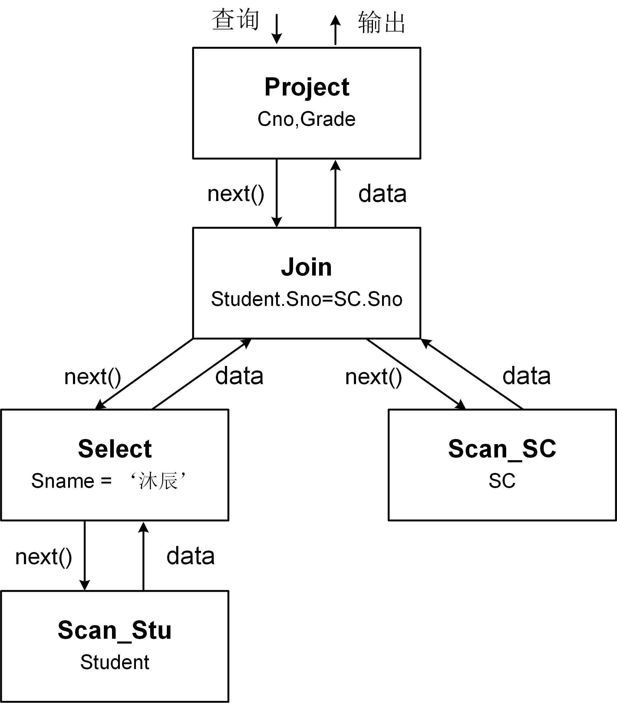

# 关系数据库查询处理

关系数据库的查询处理是处理SQL查询语言的过程，由计算引擎负责，其任务是将用户提交的SQL查询语句转换为查询执行计划，然后使用计算模型处理执行计划得到查询结果。


## 查询处理步骤
关系数据库管理系统的查询处理分为3个步骤：查询解析（Query Interpretation）、查询优化（Query Optimization）和查询执行（Query Execution），如图R3.1所示。

<center>
	
	<br>
	<div display: inline-block; padding : 2px>
		图 R3.1 查询处理步骤
	</div>
</enter>


* 查询解析：将SQL查询语句转换成容易被数据库执行的查询。首先，对查询语句进行词法分析，提取SQL语句中的关键词、属性名、关系名、运算符等成分；然后将词法分析提取的成分构建为一颗语法分析树；最后根据数据字典的关系定义检查语法分析树的语义正确性，并将其转化为基于关系代数表达式的查询树。
* 查询优化：为SQL查询语句的查询树生成一个高效的查询执行计划。查询优化包括代数优化和物理优化。代数优化也称为逻辑优化，基于逻辑等价变换规则对关系代数表达式进行优化，通过改变代数表达式中关系算子的次序变换成具有更高执行效率的形式。物理优化是基于启发式规则或者代价估计来估计各执行计划的代价，从中选取资源消耗最小的执行计划，执行计划中包括选择各关系算子的实现算法。
* 查询执行：执行查询计划并得到查询结果。查询执行是基于查询执行模型将物理执行计划编译为可执行代码，然后执行得到查询结果。

接下来，我们以一个简单的例子来介绍查询处理过程中生成的查询树和物理执行计划。
```SQL
[例R3.1] 查询系为计算机的学生姓名。
SELECT Sname
FROM Student
WHERE Dept = '计算机'; 
```
<center>
	
	<br>
	<div display: inline-block; padding : 2px>
		图 R3.2 查询树和物理执行计划
	</div>
</center>
图R3.2分别给出了例R3.1中SQL查询语句的查询树和物理执行计划。关系数据库系统首先将SQL查询语句解析生成查询树，然后进行查询优化，对生成的查询树进行代数优化和物理优化。由于例R3.1的SQL查询语句比较简单，生成的查询树不需要进行代数优化。而物理优化则是确定查询树中每个关系算子的执行方式，如选择算子是应该全表扫描还是索引扫描，选择最优的实现算法实现资源消耗最小。确定每个关系算子的执行方式之后，关系数据库系统将物理执行计划编译为可执行代码进行执行。

## 查询执行模型
关系数据库系统最经典的查询执行模型是火山模型。火山模型又称为迭代模型或流水线模型，它将物理执行计划中的每个关系算子看成一个操作（operator），然后将各操作串联成流水线进行处理。

在火山模型中，每个操作抽象成一个迭代器，对外提供了以下三个接口：

* open()：关系算子初始化，分配资源；
* next()：算子的具体实现。首先获取下一条记录，然后验证获取记录是否满足条件，若满足则返回；
* close()：回收和关闭分配的资源。

火山模型采用自上而下的拉取方式执行查询计划。查询从执行计划的根节点出发，自上而下地递归调用每个关系算子的next()函数读取数据，数据则自底向上进行传递。

图R3.3给出了例R3.1基于火山模型的执行过程：

<center>
	
	<br>
	<div display: inline-block; padding : 2px>
		图 R3.2 火山模型执行过程
	</div>
</center>

其中，每个算子next()函数的伪代码如下所示：

```c
// 投影算子Project的next()函数
func (p Project) next()
{
    row ：= p.children.next(); //从子节点中获取下一条记录
    return row.name; 
}
// 选择算子Select的next()函数
func (s Select) next()
{
    row ：= s.children.next();
    if (row != null && row.Dept == '计算机'){
        return row;
    }
    return null; 
}
// 扫描算子Scan的next()函数
func (sc Scan) next()
{
    return Student.readRow();
}
```

例R3.1SQL查询语句的执行过程为：调用物理执行计划的根节点算子Project的next()函数获取数据中的name属性值，Project算子的next()函数首先调用其子节点选择算子Select的next()函数获取一条记录，然后取出该记录的name值进行输出。Select算子的next()函数首先调用其子节点扫描算子Scan的next()函数获取一条记录，然后判断该记录是否满足筛选条件，如果满足则返回该记录给父节点Project。Scan算子的next()函数从学生表Student中读取数据并返回给其父节点Select。因为Scan算子一般为物理执行计划的叶子节点，其没有子节点，因此不需要再调用子节点的next()函数。

当查询的物理执行计划中包含连接算子Join时，火山模型会构建两条流水线进行处理。详细地处理方法，请读者阅读相关材料。


