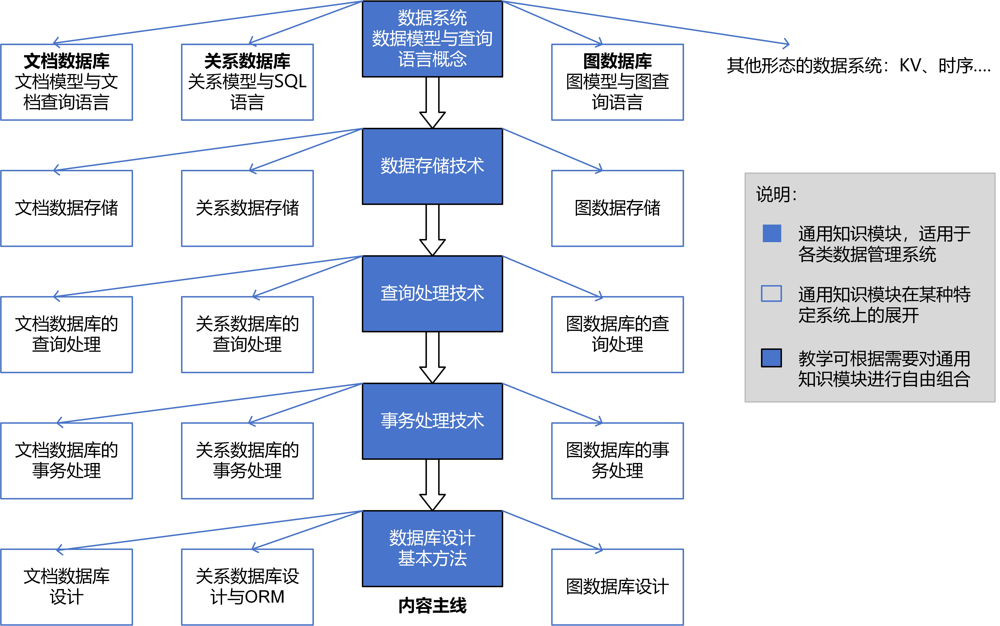
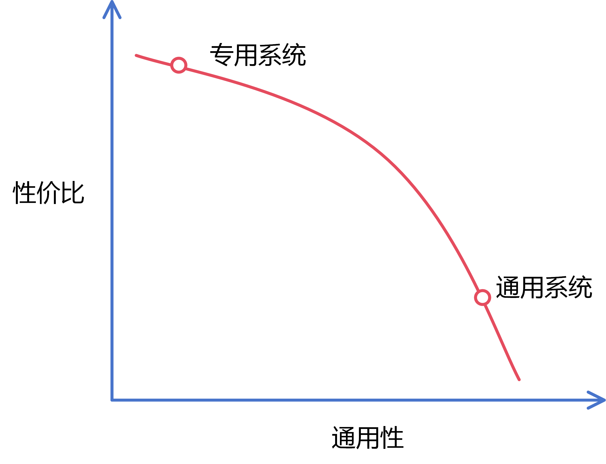

# 前言

我们为什么还需要一本“数据管理系统”教材？

斗转星移。数据管理系统的种类、形态和使用方法一直在变化。上世纪70年代建立起的关系数据库理论看上去依然美妙。基于它的SQL数据库系统依然是软件开发者的首选。然而，竞争者在不断涌现。NoSQL数据库在21世纪初掀起了一股潮流。以谷歌和亚马逊为首的互联网公司率先向关系数据库发难。它们针对各自的业务场景构建了更易于使用、并且扩展能力更强的非关系型数据管理系统，比如Big Table和Dynamo。这些系统被公布后，被开源社区吸收、再创造，进化成了各式各样的NoSQL数据库。如今，像MongoDB和Cassandra这样的面向通用场景的NoSQL数据库已经在互联网行业中被广泛使用。像“时序数据库”和“图数据库”这样为特殊领域定制的数据管理系统也在不少应用中站稳了脚跟。面对众多可选的数据管理系统，软件开发者应该何去何从？选择合适的系统工具对软件开发而言至关重要。而传统数据管理教材不曾教导我们如何选择。

近年来，我们也看到：软件的开发方式在改变，从而引发了数据管理系统使用方式的改变。从前，我们习惯于将数据库和应用逻辑分开设计。如果你熟悉关于关系数据库的早年文献，你会认同这种分离原则 - 数据最好只有一套，用于反应现实世界的状态，例如某银行的用户存款记录；而应用软件可以有多套（比如理财产品服务软件和定额存款服务软件），他们共享同一个数据库，从而可以看到一个一致的现实世界（a single source of truth）。在这一理念下，数据库理应成为独立的个体，它的设计应由DBA独立完成，而不应依赖于上层软件的设计。然而，这样的软件设计理念如今似乎不再流行了。互联网应用的开发实践倡导软件设计以用户为中心，倡导快速迭代。随之，以“敏捷开发”为代表的模式成为了主流，“微服务”架构成为了最常用的软件架构。这意味着软件开发需要遵从“先功能后数据”的开发次序，即数据库的设计依赖于上层软件的设计。在“微服务”架构下，应用逻辑和数据库之间的分离不再被重视，而“服务”之间的分离显得更加重要。以上面的银行应用为例：在“微服务”架构下，“理财产品服务”和“定额存款服务”通常不会直接构建在共享数据库之上；相反，它们会各自维护一套数据库，并通过“事件驱动”的方式实现服务之间的数据同步。我们无法断言新的软件开发模式一定比传统开发模式更先进。但显然我们不能再单纯地认为数据库设计是一个独立的过程。这与传统数据管理教材的观点产生了分歧。

互联网对数据管理系统的扩展能力也提出了越来越高的要求。不少互联网应用都经历过快速的业务增长。如果系统的数据处理能力无法扩展，或者跟不上业务的增长，应用就会濒临崩溃。学界对分布式数据管理系统的研究已经有多年历史，成果虽然丰富，但能付诸实践的很少。人们在实践中发现，传统SQL数据库在扩展能力上有明显的局限性。要真正做到业务处理能力的扩展，需要应用逻辑和数据库的协同设计。而SQL数据库习惯大包大揽，并不能很好的支持这种协同。相比之下，诞生于互联网时代的NoSQL数据库将更多的数据处理和事务处理任务交给了上层应用来完成，为扩展能力的提升提供了更多便利。（然而，这也并非没有代价。由于NoSQL系统削减了传统数据库的能力，从某种意义上也增加了应用开发者的负担。）当代的开发人员仍然在SQL和NoSQL系统之间徘徊，但在应用扩展的实践中积累了不少经验。只是这些经验尚未得到很好的凝练。传统的数据管理教材虽然部分谈及了数据库自身的扩展理论，却没有吸收互联网时代的实践经验，没有考虑应用逻辑和数据库的协同扩展，因而缺乏指导意义。

为了顺应时代发展，本书不再将数据管理的知识局限于某一种特定的数据管理系统（比如SQL数据库），而会从更宏观的视角来解读数据管理问题。作者不崇拜任何一类系统或软件开发方式。相反，本书将阐述不同数据管理系统（包括SQL和NoSQL数据库）的设计初衷，并对它们进行横向比较，从而帮助开发者在软件设计过程中做出更合理的选择。同时，本书也试图从众多的数据管理系统中抽象出一些通用的数据管理原理和方法，作为学习者需要掌握的核心知识。本书还将介绍数据管理系统乃至整个应用软件的扩展方法，从而帮助应用开发者应对业务增长问题。这包括传统SQL数据库的并行化方法与工具，也包括使用NoSQL数据库对应用进行扩展的方案。本书会着重讨论如何调整应用层的业务逻辑，以配合数据库的扩展。

	
	 
	

	

图1：本书的内容安排

本书的内容安排如图1所示。内容的主线是一系列数据管理系统的通用知识，包括数据系统的概念、数据模型和查询语言的概念、数据存储技术、查询处理技术、事务处理技术、数据库设计的基本方法等。将这些通用知识在特定的数据管理系统上进行展开，就得到具体系统的使用方法和实现原理。通过这种方式，本书将传统SQL数据库、文档数据库、图数据库等数据管理系统的知识都囊括进来。本书采用数字教材的形式，同时也是一本开放的教材，可以随时调整和增加内容。作者欢迎有志于提炼和传播知识的老师或工程师加入，以共同作者的身份一起建设教材，将常用数据管理系统逐一纳入。

	
	 
	

	

图2：灵活的内容组合

本书是一本灵活的教材。作为数据管理系统的授课老师和学习者，没有必要通读本书的全部内容，而可以根据需要选择性的讲授和学习本书的部分内容。如图2所示，作为一门高强度的专业课程，可以选择本书的2个数据管理系统进行全面讲解，帮助学生全方位掌握数据管理系统的知识。这是作者在自己的课程中采用的方式。作为一门入门级课程，则可以只聚焦1个系统，并选择离应用最近的知识模块进行讲解。本书的所有知识模块都尽量做到自包含，以确保不同组合的知识连贯性。作为一本数字教材，读者可以方便地对本书的内容进行灵活组合。

部分业界人士认为数据管理系统的发展遵从”分久必合，合久必分“的规律。他们觉得虽然现阶段的系统呈多样化的发展趋势，但未来还是会收敛成某种”大一统“类型的系统。作者认为这些看法都有一定的道理。但作者更加确定的是，数据管理系统的多样性是现实的客观因素导致的结果。数据库领域的先驱人物Mike Stonebraker曾经在2005年的文章《"One Size Fits All": An Idea Whose Time Has Come and Gone》中讨论过”大一统“系统的可行性。相关议题在业界也有过相当广泛的讨论。根据大量的事实和经验，可以得出如下结论：专用系统相比通用系统存在着巨大的性价比优势，促使用户倾向于选择专用系统。这一现象可以用下图中的曲线描绘。

	
	 
	

	

图3：通用性和性价比的关系

简单而言，专用的数据管理系统是为某个特定领域或场景服务的，不用考虑其他场景的需要，因此可以用更简洁的方式实现其功能，并选择更有利于相应场景的实现方案。专用系统在性价比上的优势就是理所当然的结果。实际的系统测试发现，这种优势通常在1到2个数量级以上，并且很难降低。当实际业务面对较大的性能或成本压力时，专用系统就成为了很有吸引力的选项。在现实的信息世界中，数据量一直在快速增长，导致数据管理系统的压力长期存在，这进一步放大了对专用系统的需求。因此，作者认为数据管理系统的多样化趋势还将持续很长时间。

虽然倡导系统的多样性，本书也会全方位介绍传统SQL数据库的实现原理和使用方法。对于SQL数据库，我们已经拥有若干经典教材，比如由Abraham Silberschatz，Henry F. Korth和S. Sudarshan合著的《Database System Concepts》，由Héctor García-Molina，Jeffrey Ullman和Jennifer Widom合著的《Database System: The Complete Book》，在国内有王珊教授和沙师煊教授合著的《数据库系统概论》。作者早年也是通过这些教材学习数据管理系统的知识的。因此，本书对知识体系的呈现方式也可以说是参考了这些经典教材。这里向以上作者致敬！

本书的对象主要是数据管理系统的使用者。这包括在校的相关专业学生和密切接触数据管理技术的软件从业者。对于只想了解数据管理系统而并不急于去使用它的读者，本书可能难度过高。对于参与数据管理系统开发的技术人员，本书只是一本入门级教材，其中缺少对系统实现细节的描述。本书更多聚焦在如何合理使用数据管理系统去构建应用软件。

本书是一本开放的数字教材，能够随时被修改和补充，并且能随时接受读者的批评。作者作为科研工作者，对应用开发实践的了解不可能全面，因此不可避免会产生偏见和错误。希望通过开放评论，及时发现这些偏见和错误，并及时完善。作者特别欢迎富有软件开发经验的人士对本书提出建设性意见。对于有帮助的建议，作者会在书中点名致谢。互联网应用带给我们的启示是大部分开创性工作都不可能一触而就，而需要反复迭代。作者希望通过读者反馈进行对内容进行快速迭代，不断优化本书的质量。

本书作者：周烜、周欢、钱卫宁、周傲英  
